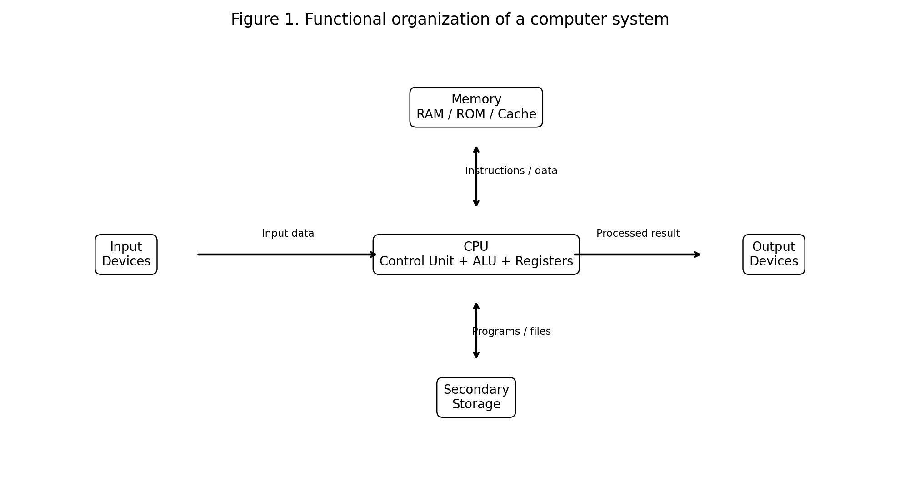
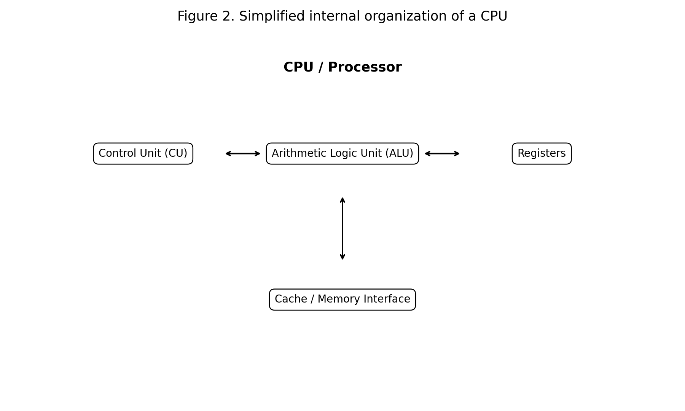
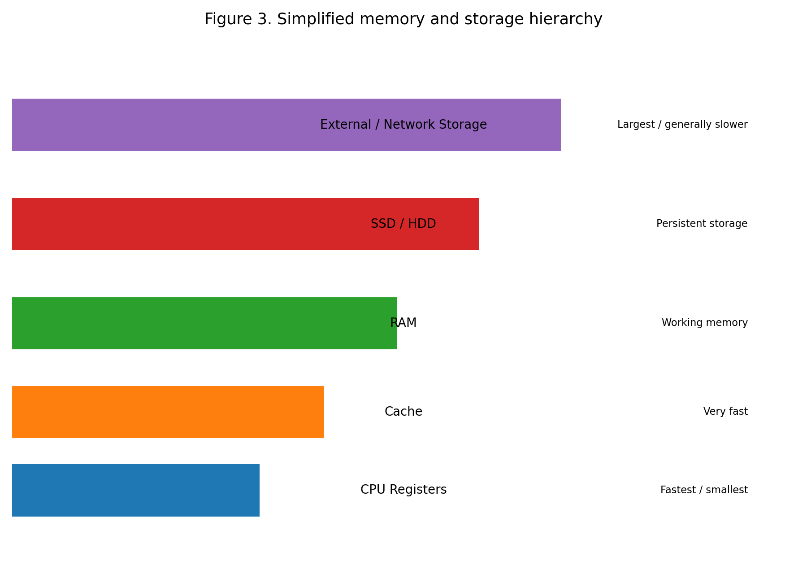
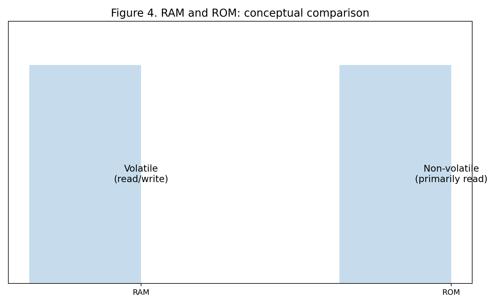
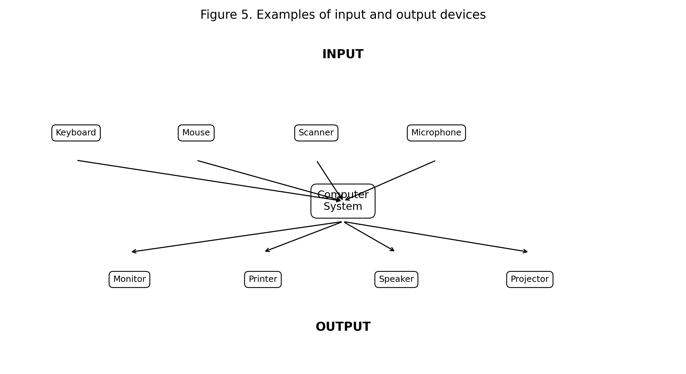
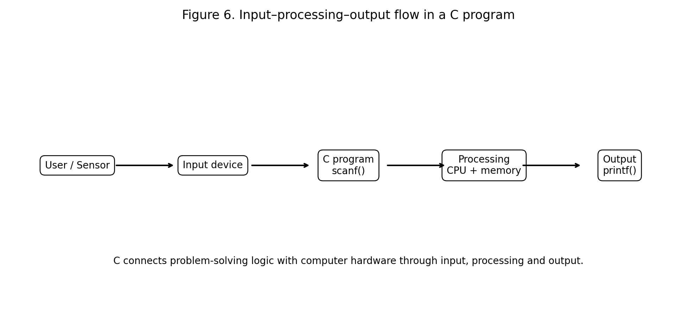

# :classical_building: Problem Solving Using Programming - B.Tech-IT, IIIT Allahabad
## Unit 1: Introduction to Computers and Hardware
* ### Current Topic: Computer Hardware, Memory, CPU and Input/Output Devices
* **Purpose:** Understanding the hardware environment in which C programs execute.
---

---
## 👥 Instructor Information
* **Edited by Instructor:** [Dr. Mohammed Javed](https://sites.google.com/site/mohammedjaved2016/)
* **Email:** javed@iiita.ac.in
* **Senior Teaching Assistants:** Mr. Subrata Pramanik (pmm2024003@iiita.ac.in)
---
## 🎯 Learning Objectives

After studying this material, students should be able to:

1. Define computer hardware and distinguish it from software.
2. Explain the major functional components of a computer.
3. Describe the role of the CPU, including the Control Unit, ALU and registers.
4. Explain the purpose of memory and distinguish RAM, ROM and cache.
5. Differentiate primary memory from secondary storage.
6. Explain common input and output devices.
7. Describe how data moves between input devices, memory, CPU and output devices.
8. Relate C programming concepts such as `scanf()` and `printf()` to computer I/O.
9. Understand why data types, variables and memory addresses matter in C.
10. Apply hardware knowledge while designing and debugging engineering programs.

---

# 1. Introduction to Computer Hardware

**Computer hardware** means the physical components of a computer system.

Examples include:

- CPU / processor
- motherboard
- RAM
- ROM and firmware storage
- cache
- SSD or HDD
- keyboard
- mouse
- display
- printer
- network interface
- USB interfaces
- sensors and embedded peripherals

A computer system can be understood functionally through four major activities:

> **Input → Processing → Storage → Output**

A typical computer contains a CPU, memory, input/output devices and storage devices that work together. citeturn0search0turn0search13



**Figure 1. Functional organization of a computer system.**

---

# 2. Hardware and Software

## 2.1 Hardware

Hardware is the physical part of the computer.

Examples:

```text
CPU
RAM
Keyboard
Monitor
SSD
Motherboard
Printer
Network adapter
```

## 2.2 Software

Software consists of programs and instructions that tell hardware what to do.

Examples:

- Operating systems
- Compilers
- C programs
- Web browsers
- Engineering simulation software
- Device drivers

### Hardware–software relationship

Hardware cannot perform a useful general-purpose task without appropriate instructions, while software requires hardware on which to execute.

A C program is ultimately translated into machine-level instructions that the processor can execute.

---

# 3. Major Functional Components of a Computer

A useful model for engineering students is:

1. **Input devices**
2. **CPU**
3. **Memory**
4. **Output devices**
5. **Secondary storage**

Input and output devices provide communication between the computer and the outside world. citeturn0search8turn0search14

---

# 4. Central Processing Unit (CPU)

The **Central Processing Unit (CPU)** is the processor responsible for executing program instructions.

The CPU performs operations such as:

- arithmetic calculations,
- logical comparisons,
- data movement,
- control of instruction execution,
- and coordination of processing activities.

The CPU commonly includes:

- **Control Unit (CU)**
- **Arithmetic Logic Unit (ALU)**
- **Registers**
- interfaces to cache and memory

citeturn0search0turn0search1



**Figure 2. Simplified internal organization of a CPU.**

---

## 4.1 Control Unit (CU)

The Control Unit coordinates the execution of instructions.

Its conceptual responsibilities include:

1. Fetching instructions.
2. Decoding instructions.
3. Controlling the sequence of operations.
4. Coordinating data movement.
5. Sending control signals to other parts of the processor and system.

---

## 4.2 Arithmetic Logic Unit (ALU)

The **ALU** performs arithmetic and logical operations.

### Arithmetic operations

```text
Addition
Subtraction
Multiplication
Division
```

### Logical / comparison operations

```text
AND
OR
NOT
Equality
Greater than
Less than
```

For example, the C statement:

```c
result = a + b;
```

requires the computer to:

1. obtain the values of `a` and `b`,
2. perform an addition operation,
3. store the result,
4. make the result available to the program.

---

## 4.3 Registers

Registers are very small, very fast storage locations within the CPU.

They can hold:

- operands,
- intermediate values,
- instructions,
- addresses,
- and control information.

Registers are much more limited in capacity than main memory.

---

# 5. Instruction Execution: Fetch–Decode–Execute

A simplified CPU instruction cycle is:

```text
        ┌─────────────┐
        │    FETCH    │
        └──────┬──────┘
               ↓
        ┌─────────────┐
        │    DECODE   │
        └──────┬──────┘
               ↓
        ┌─────────────┐
        │   EXECUTE   │
        └──────┬──────┘
               ↓
        ┌─────────────┐
        │    STORE    │
        └──────┬──────┘
               │
               └──────→ Next instruction
```

### Fetch

The CPU obtains the next instruction.

### Decode

The CPU determines what the instruction means.

### Execute

The required operation is performed.

### Store

The result is written to a register, memory, or another destination.

This cycle repeats extremely rapidly.

---

# 6. Computer Memory

**Memory** is used to hold data and instructions required during computer operation.

It is useful to distinguish:

- CPU registers
- cache
- RAM
- ROM / firmware storage
- secondary storage

Memory hierarchy exists because no single memory technology simultaneously provides maximum speed, maximum capacity, minimum cost, and permanent storage.



**Figure 3. Simplified memory and storage hierarchy.**

---

# 7. Bits, Bytes and Memory Capacity

The smallest commonly used unit of digital information is a **bit**.

A bit can represent:

```text
0
or
1
```

A group of 8 bits is a **byte**.

```text
1 byte = 8 bits
```

Common decimal capacity terminology includes:

```text
1 KB ≈ 1,000 bytes
1 MB ≈ 1,000,000 bytes
1 GB ≈ 1,000,000,000 bytes
1 TB ≈ 1,000,000,000,000 bytes
```

In some programming and operating-system contexts, powers of 2 are used, leading to units such as KiB, MiB and GiB.

---

# 8. RAM — Random Access Memory

**RAM** is the main working memory used by a computer while programs are running.

RAM commonly holds:

- currently executing programs,
- variables,
- temporary data,
- operating-system data,
- buffers,
- and intermediate results.

RAM is generally **volatile**: its contents are lost when power is removed.

## Example

Consider:

```c
int marks = 85;
```

During execution, the value `85` and the variable's associated storage are held in memory.

The exact representation depends on the implementation and data type, but conceptually the program needs memory to store the variable.

---

# 9. ROM and Firmware

**ROM** traditionally refers to non-volatile memory containing information that remains available when power is removed.

Modern systems often use writable non-volatile technologies for firmware rather than literal one-time ROM.

Firmware can contain low-level instructions used to initialize and control hardware.



**Figure 4. RAM and ROM: conceptual comparison.**

### RAM vs ROM

| Feature | RAM | ROM / firmware memory |
|---|---|---|
| Main role | Working data and programs | Persistent low-level instructions |
| Volatile? | Usually yes | No |
| Typical use | Running applications | Boot / firmware functions |
| Read/write | Read and write | Primarily read; technology-dependent writing |

---

# 10. Cache Memory

A **cache** is a small, fast memory used to reduce the effective time required for the CPU to access frequently needed data and instructions.

Modern processors may have multiple cache levels:

```text
L1 Cache
   ↓
L2 Cache
   ↓
L3 Cache
   ↓
RAM
```

Generally:

- higher-level cache is smaller and faster,
- lower-level cache is larger but relatively slower,
- RAM is much larger but slower than CPU-local storage.

### Why cache matters to programming

Consider:

```c
for (int i = 0; i < 1000000; i++) {
    sum += a[i];
}
```

If the elements of `a` are accessed sequentially, the memory-access pattern can be favorable to cache behavior.

This is one reason that understanding memory matters even when writing simple C programs.

---

# 11. Secondary Storage

Secondary storage is used for persistent data.

Examples:

- SSD
- HDD
- USB flash drive
- memory card
- optical storage
- network storage

Unlike RAM, secondary storage retains information after the computer is switched off.

### RAM vs storage

```text
RAM
↓
Fast working area
↓
Temporary program/data state

SSD / HDD
↓
Persistent storage
↓
Files and applications
```

---

# 12. Memory Addresses and C

C is especially useful for understanding the connection between software and memory.

Consider:

```c
#include <stdio.h>

int main(void) {
    int x = 25;

    printf("Value = %d\n", x);
    printf("Address = %p\n", (void *)&x);

    return 0;
}
```

Here:

- `x` stores a value,
- `&x` obtains the address of `x`,
- `%p` displays a pointer value.

A possible output might look like:

```text
Value = 25
Address = 0x7ffd12345678
```

The exact address will normally differ between executions and systems.

### Important idea

A C variable can be understood as:

```text
Variable name
     ↓
Memory location
     ↓
Stored representation
```

This concept becomes fundamental when studying:

- pointers,
- arrays,
- structures,
- dynamic memory,
- functions,
- and data structures.

---

# 13. Input Devices

Input devices allow information to enter a computer system.

Common examples include:

- keyboard,
- mouse,
- scanner,
- microphone,
- camera,
- touch screen,
- joystick,
- barcode reader,
- biometric sensor,
- industrial sensor.

Input devices convert information from the user or physical environment into signals/data that can be processed by the computer. citeturn0search0turn0search14



**Figure 5. Examples of input and output devices.**

---

## 13.1 Keyboard

A keyboard is a common text and command input device.

In a C program, keyboard input can be read using functions such as:

```c
scanf()
```

Example:

```c
int age;

printf("Enter your age: ");
scanf("%d", &age);
```

The `&age` expression provides the address where `scanf()` can store the input value.

---

## 13.2 Mouse

A mouse provides pointing and selection input.

It is particularly useful in graphical user interfaces.

---

## 13.3 Scanner

A scanner converts physical documents/images into digital representations.

Applications include:

- document digitization,
- optical character recognition,
- engineering drawing capture,
- archiving.

---

## 13.4 Microphone

A microphone converts sound into an electrical/digital signal.

Applications include:

- speech recognition,
- voice control,
- communication,
- audio processing.

---

## 13.5 Camera

A camera provides image or video input.

Engineering applications include:

- computer vision,
- machine inspection,
- robotics,
- autonomous systems,
- surveillance,
- medical imaging.

---

## 13.6 Sensors

Sensors are especially important in engineering systems.

Examples:

- temperature sensor,
- pressure sensor,
- light sensor,
- accelerometer,
- gyroscope,
- proximity sensor,
- humidity sensor.

A sensor-based system can be represented as:

```text
Physical quantity
       ↓
     Sensor
       ↓
Digital signal / measurement
       ↓
Computer / Microcontroller
       ↓
Processing algorithm
       ↓
Decision / Action
```

---

# 14. Output Devices

Output devices communicate processed information to users or other systems.

Examples include:

- monitor,
- printer,
- speaker,
- projector,
- actuator,
- motor controller.

Output devices convert processed information into a form that can be interpreted or used externally. citeturn0search13turn0search14

---

## 14.1 Monitor

A monitor displays:

- text,
- graphics,
- images,
- video,
- engineering plots,
- simulation results.

---

## 14.2 Printer

A printer produces physical output.

Types include:

- inkjet,
- laser,
- thermal,
- 3D printers.

3D printing is particularly relevant to engineering because it can be used for prototyping and manufacturing.

---

## 14.3 Speakers

Speakers convert digital/audio signals into sound.

Applications include:

- alarms,
- notifications,
- multimedia,
- voice systems.

---

## 14.4 Actuators

In engineering systems, the output may not be a display.

It could be an actuator:

```text
Sensor → Computer → Control algorithm → Actuator
```

Examples:

- motor,
- valve,
- relay,
- robotic arm,
- heater.

This makes computer hardware directly connected to physical engineering systems.

---

# 15. Input–Processing–Output and C Programming

The basic idea of a C program can be related to the computer's hardware architecture.



**Figure 6. Input–processing–output flow in a C program.**

Consider:

```c
#include <stdio.h>

int main(void) {
    double length, width, area;

    printf("Enter length: ");
    scanf("%lf", &length);

    printf("Enter width: ");
    scanf("%lf", &width);

    area = length * width;

    printf("Area = %.2f\n", area);

    return 0;
}
```

The conceptual flow is:

```text
Keyboard
   ↓
scanf()
   ↓
Memory variables
   ↓
CPU executes multiplication
   ↓
area variable
   ↓
printf()
   ↓
Monitor
```

This simple example demonstrates how software interacts with hardware.

---

# 16. `scanf()` and Input

The `scanf()` function reads formatted input.

Example:

```c
int n;

scanf("%d", &n);
```

Common format specifiers include:

| Data type | Common format |
|---|---|
| `int` | `%d` |
| `float` | `%f` |
| `double` | `%lf` |
| `char` | `%c` |
| string | `%s` |

### Why is `&` used?

For:

```c
int n;
scanf("%d", &n);
```

`&n` gives the address of `n`, allowing `scanf()` to store the input value in that memory location.

---

# 17. `printf()` and Output

`printf()` displays formatted output.

Example:

```c
int a = 10;
float b = 12.5f;

printf("a = %d\n", a);
printf("b = %.2f\n", b);
```

Possible output:

```text
a = 10
b = 12.50
```

The output is ultimately presented through an output device such as a terminal window and display.

---

# 18. Example: Engineering Temperature Monitor

Suppose an engineering system reads a temperature and reports whether it is safe.

```c
#include <stdio.h>

int main(void) {
    float temperature;

    printf("Enter temperature in Celsius: ");
    scanf("%f", &temperature);

    if (temperature <= 40.0f) {
        printf("Status: NORMAL\n");
    } else if (temperature <= 60.0f) {
        printf("Status: WARNING\n");
    } else {
        printf("Status: CRITICAL\n");
    }

    return 0;
}
```

### Hardware interpretation

```text
Temperature Sensor
       ↓
Input interface
       ↓
Memory
       ↓
CPU
       ↓
Comparison instructions
       ↓
Decision
       ↓
Display / Alarm
```

This is a simplified example of how programming concepts can be applied to embedded engineering.

---

# 19. Buses and Communication Between Components

Computer components need mechanisms for transferring:

- data,
- addresses,
- and control signals.

A simplified traditional model uses:

### Data bus

Carries data.

### Address bus

Identifies the memory or I/O location involved in an operation.

### Control bus

Carries control and timing-related signals.

These are often collectively discussed as a **system bus** in introductory computer architecture. citeturn0search0

---

# 20. Ports and Interfaces

External devices connect through interfaces such as:

- USB,
- HDMI,
- Ethernet,
- audio interfaces,
- display interfaces,
- wireless interfaces.

The exact interfaces available depend on the computer system.

For engineering students, it is useful to understand that I/O is not merely "keyboard and monitor." Modern systems interact with:

- sensors,
- instruments,
- networks,
- actuators,
- cameras,
- storage devices,
- and other computers.

---

# 21. Computer Hardware in Embedded Systems

Engineering students frequently encounter **microcontrollers**.

A microcontroller integrates several functions into a compact device, commonly including:

```text
CPU
+
RAM
+
Program memory
+
Timers
+
I/O peripherals
+
Communication interfaces
```

Examples of applications:

- washing machines,
- automobiles,
- industrial controllers,
- medical instruments,
- drones,
- robots,
- smart appliances.

This is one reason C is important in engineering education.

---

# 22. Hardware and Problem Solving

Understanding hardware can improve programming decisions.

For example:

### Problem

Process one million sensor values.

A naïve program might repeatedly perform expensive operations.

A better engineer asks:

- How much memory is needed?
- Can the data fit in RAM?
- Is sequential access possible?
- Can the data be processed in blocks?
- Is floating-point arithmetic necessary?
- Is the processor fast enough?
- Can computation be reduced?

Thus:

> **Programming is not isolated from hardware. Hardware characteristics influence how efficiently an algorithm runs.**

---

# 23. Example: Array Memory

Consider:

```c
int temperature[5] = {25, 27, 30, 28, 26};
```

Conceptually:

```text
temperature
     ↓
┌────┬────┬────┬────┬────┐
│ 25 │ 27 │ 30 │ 28 │ 26 │
└────┴────┴────┴────┴────┘
   0    1    2    3    4
```

An array stores elements of the same type in a contiguous sequence of elements in the C abstract machine.

This makes arrays very useful for:

- sensor measurements,
- matrices,
- engineering data,
- signal samples,
- numerical computation.

---

# 24. Example: Memory and Pointers

```c
#include <stdio.h>

int main(void) {
    int value = 100;
    int *ptr = &value;

    printf("Value = %d\n", value);
    printf("Value using pointer = %d\n", *ptr);

    return 0;
}
```

Conceptually:

```text
value
  │
  │ contains 100
  ↓
┌─────────────┐
│     100     │
└─────────────┘
      ↑
      │
     ptr
```

Here:

- `&value` means address of `value`,
- `ptr` stores that address,
- `*ptr` accesses the value at that address.

Pointers are fundamental for understanding how C works with memory.

---

# 25. Hardware-Aware Problem-Solving Checklist

When solving an engineering problem using C, ask:

### Problem

- What is the physical problem?
- What information is available?

### Input

- What are the inputs?
- Are they coming from a user, sensor, file or network?

### Processing

- What mathematical model is required?
- What algorithm is appropriate?

### Memory

- What data must be stored?
- Which data types are appropriate?
- How much memory is needed?

### CPU

- What calculations are required?
- Is the algorithm computationally efficient?

### Output

- What result is required?
- Should it be displayed, printed, stored or sent to another device?

### Validation

- What can go wrong?
- What invalid input should be rejected?
- What happens when a sensor fails?

---

# 26. Mini Engineering Case Study — Water Tank Monitoring

## Problem

A tank has a level sensor. If the water level falls below 20%, the system should display a warning.

### C program

```c
#include <stdio.h>

int main(void) {
    float level;

    printf("Enter tank level (0-100%%): ");
    scanf("%f", &level);

    if (level < 0.0f || level > 100.0f) {
        printf("Invalid sensor value.\n");
    } else if (level < 20.0f) {
        printf("WARNING: Low water level.\n");
    } else {
        printf("Water level is normal.\n");
    }

    return 0;
}
```

### Hardware interpretation

```text
Water level
     ↓
Level sensor
     ↓
Input interface
     ↓
Microcontroller / CPU
     ↓
C program
     ↓
Decision
     ↓
Display / Alarm / Pump control
```

The example demonstrates how a simple C decision statement can represent a control rule in an engineering system.

---

# 27. Common Mistakes by Beginning C Programmers

## Mistake 1: Forgetting `&` in `scanf()`

Incorrect:

```c
scanf("%d", n);
```

Usually correct for a normal integer variable:

```c
scanf("%d", &n);
```

---

## Mistake 2: Wrong format specifier

For example:

```c
double x;
scanf("%lf", &x);
```

The format specifier must match the expected type and library function requirements.

---

## Mistake 3: Ignoring invalid input

Engineering programs should not assume that every input is valid.

Example:

```c
if (flow_rate <= 0) {
    printf("Invalid flow rate.\n");
}
```

---

## Mistake 4: Confusing memory capacity with storage capacity

RAM and SSD both store information, but they serve different purposes.

---

## Mistake 5: Thinking CPU speed is the only factor in performance

Performance can depend on:

- algorithm,
- memory access,
- cache behavior,
- I/O,
- compiler,
- architecture,
- parallelism,
- and workload.

---

# 28. Summary Table

| Component | Main purpose | Examples |
|---|---|---|
| CPU | Executes instructions | Processor |
| ALU | Arithmetic and logic | Addition, comparison |
| Control Unit | Coordinates instruction execution | Instruction control |
| Registers | Very fast CPU-local storage | General-purpose registers |
| Cache | Fast storage near CPU | L1, L2, L3 |
| RAM | Working memory | DDR memory |
| ROM / firmware memory | Persistent low-level instructions | Firmware storage |
| SSD / HDD | Persistent storage | Files, applications |
| Input devices | Send data to computer | Keyboard, mouse, sensor |
| Output devices | Communicate results | Monitor, printer, speaker |
| I/O interface | Connect devices | USB, Ethernet, display interfaces |

---

# 29. Review Questions

## Short-answer Questions

1. What is computer hardware?
2. Differentiate hardware and software.
3. What is the function of a CPU?
4. What are the major components of a CPU?
5. What is the role of the ALU?
6. What is the role of the Control Unit?
7. What are CPU registers?
8. What is RAM?
9. What is ROM?
10. What is cache memory?
11. Differentiate RAM and secondary storage.
12. What is an input device?
13. What is an output device?
14. Give five examples of input devices.
15. Give five examples of output devices.
16. What is a sensor?
17. What is an actuator?
18. What is a memory address?
19. Why is `&` used with many variables in `scanf()`?
20. Explain the relationship between CPU and memory.

---

# 30. Descriptive Questions

1. Explain the functional organization of a computer with a neat diagram.
2. Explain the internal organization of a CPU.
3. Describe the fetch–decode–execute cycle.
4. Explain the memory hierarchy.
5. Compare RAM, ROM, cache and secondary storage.
6. Explain the role of input and output devices in a computer system.
7. Explain how a C program interacts with input and output devices.
8. Explain the relationship between variables, memory locations and pointers in C.
9. Discuss the importance of computer hardware knowledge for engineering students.
10. Explain the role of sensors and actuators in embedded engineering systems.

---

# 31. C Programming Exercises

## Exercise 1 — Simple Calculator

Write a C program that accepts two numbers and performs:

- addition,
- subtraction,
- multiplication,
- division.

---

## Exercise 2 — Engineering Unit Converter

Create a menu-driven C program for:

- meters to kilometers,
- Celsius to Fahrenheit,
- watts to kilowatts,
- seconds to minutes.

---

## Exercise 3 — Sensor Monitor

Accept ten sensor readings and calculate:

- minimum,
- maximum,
- average.

---

## Exercise 4 — Memory Demonstration

Write a C program that prints:

- value of an integer,
- address of the integer,
- value accessed through a pointer.

---

## Exercise 5 — Array Processing

Store 10 temperature readings in an array and calculate:

- average temperature,
- highest temperature,
- lowest temperature,
- number of readings above 50°C.

---

## Exercise 6 — Engineering Control System

Design a C program that accepts a temperature and produces:

```text
NORMAL
WARNING
CRITICAL
```

based on configurable thresholds.

---

# 32. Mini Project

## Smart Temperature Monitoring System

Develop a C program representing a simplified temperature monitoring system.

### Requirements

The program should:

1. Read temperature values.
2. Validate input.
3. Store readings in an array.
4. Calculate average temperature.
5. Find maximum and minimum values.
6. Display the system status.
7. Generate a warning when a threshold is exceeded.

### Recommended development process

```text
Problem Definition
       ↓
Inputs / Outputs
       ↓
Algorithm
       ↓
Flowchart
       ↓
C Program
       ↓
Testing
       ↓
Debugging
       ↓
Documentation
```

---

# 33. Key Takeaways

- Hardware is the physical foundation on which software executes.
- A computer system can be understood through input, processing, memory/storage and output.
- The CPU executes instructions and coordinates computation.
- The ALU performs arithmetic and logical operations.
- The Control Unit coordinates instruction execution.
- Registers provide very fast CPU-local storage.
- Cache reduces the effective cost of accessing frequently needed information.
- RAM provides working memory and is generally volatile.
- Persistent storage retains information after power is removed.
- Input devices provide information to a computer.
- Output devices communicate results.
- Sensors and actuators allow computers to interact with physical engineering systems.
- C provides a useful bridge between algorithmic problem solving and the underlying machine.
- Pointers and arrays help engineering students understand memory and data representation.
- Efficient engineering programs require attention to algorithms, memory, CPU work and I/O.

---

# 34. Final Perspective

For a Bachelor of Engineering student, learning C is more meaningful when the language is connected to the machine.

When a student writes:

```c
scanf("%f", &temperature);
```

the statement is not merely a programming-language command. It represents a larger process:

```text
Physical / human input
        ↓
Input device or interface
        ↓
Operating system / runtime / device layer
        ↓
Memory
        ↓
CPU executes instructions
        ↓
Program processes the data
        ↓
Output device or control action
```

Understanding this relationship helps students move from simply **writing programs** to **thinking like engineers**.

The ultimate objective is not to memorize hardware terminology or C syntax. It is to understand how:

\[
\boxed{
\text{Problem}
\rightarrow
\text{Data}
\rightarrow
\text{Algorithm}
\rightarrow
\text{Program}
\rightarrow
\text{Hardware Execution}
\rightarrow
\text{Result}
}
\]

This connection is fundamental to engineering problem solving.

---

# 35. References and Further Reading

1. SATHEE / IIT Kanpur, **Computer System** — introductory material covering CPU, memory, input/output and system buses. citeturn0search0
2. University of Rhode Island, **How Computers Work: The CPU and Memory** — introductory discussion of CPU, memory, buses and I/O. citeturn0search1
3. NIOS, **Computer Fundamentals** — introductory treatment of computer components, input, processing, storage and output. citeturn0search13
4. Engineering LibreTexts, **Input and Output** — discussion of I/O as communication between an information-processing system and the outside world. citeturn0search8
5. Standard C programming and computer organization textbooks for further study of pointers, memory, CPU organization, I/O and system architecture.

---

## Instructor Note

A useful teaching sequence for this topic is:

**Hardware overview → CPU → Memory → I/O → C variables → `scanf()` → `printf()` → pointers → arrays → hardware-oriented mini project**

Students should be encouraged to ask not only **“What does this C statement do?”** but also:

> **“What happens inside the computer when this statement executes?”**

That question helps connect introductory programming with computer architecture and engineering problem solving.
