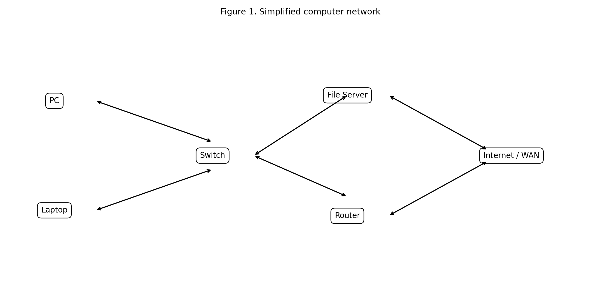
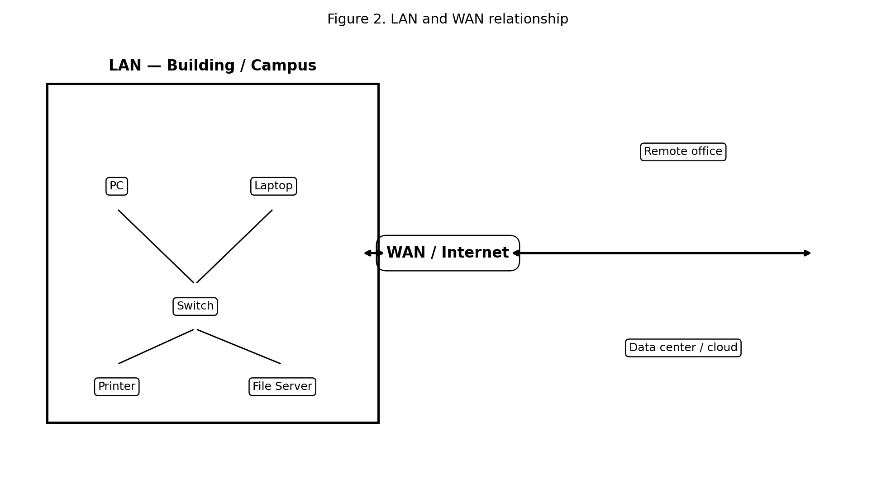
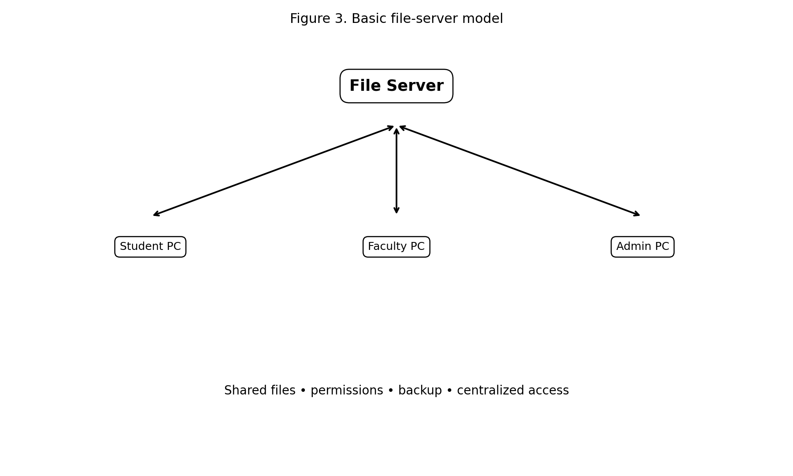
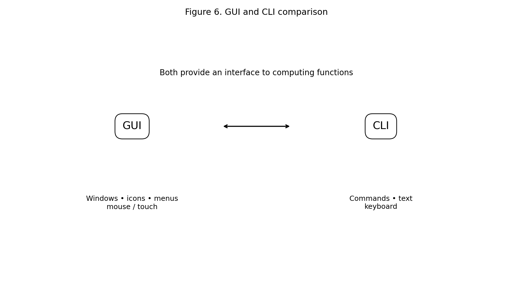
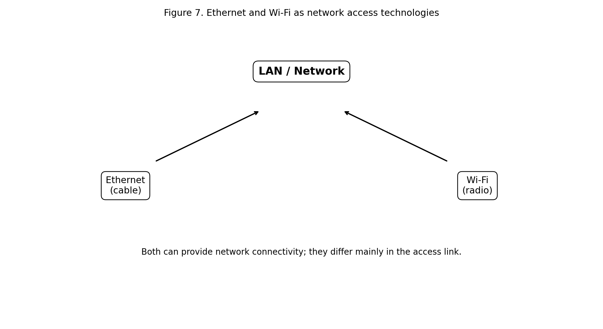
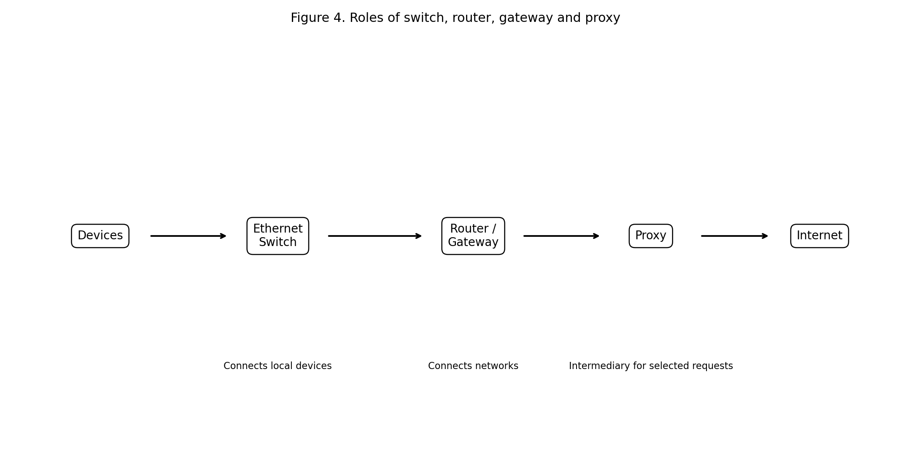
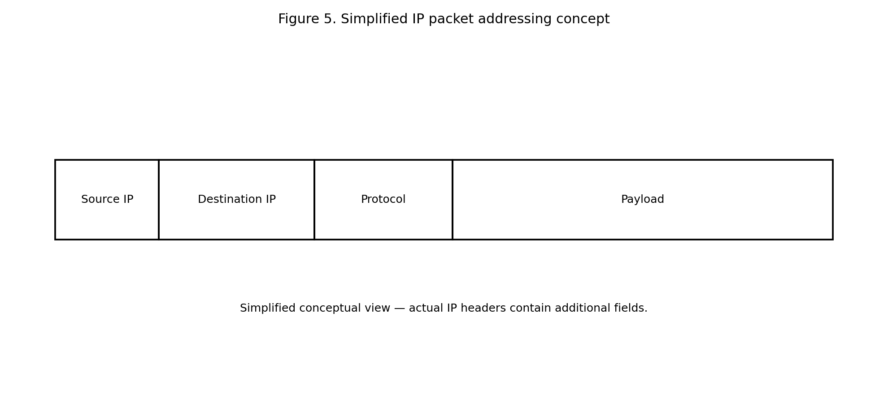
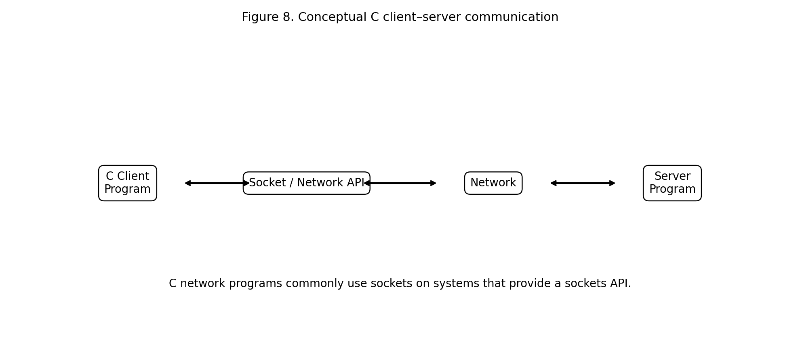

# :classical_building: Problem Solving Using Programming - B.Tech-IT, IIIT Allahabad
## Unit 1: Introduction to Computers and Hardware
* ### Current Topic: Computer Networks, LAN, File Server, WAN, WWW, GUI/CLI, Ethernet, Wi-Fi, Modem, Switches, Routers, IP Address, Proxy, Gateway
* **Purpose:** Introduce the fundamentals of computer networking and connect networking concepts with engineering problem solving and C programming.
---

---
## 👥 Instructor Information
* **Edited by Instructor:** [Dr. Mohammed Javed](https://sites.google.com/site/mohammedjaved2016/)
* **Email:** javed@iiita.ac.in
* **Senior Teaching Assistants:** Mr. Subrata Pramanik (pmm2024003@iiita.ac.in)
---
## 🎯 Learning Objectives

After studying this material, students should be able to:

1. Explain the purpose and basic components of a computer network.
2. Differentiate LAN and WAN.
3. Explain the role of a file server.
4. Describe the World Wide Web (WWW).
5. Distinguish GUI and CLI.
6. Explain Ethernet and Wi-Fi.
7. Describe the purpose of a modem.
8. Explain the functions of switches and routers.
9. Explain IP addresses and the idea of network and host identification.
10. Describe proxy servers and gateways.
11. Understand the relationship between networking and C programming.
12. Explain the basic idea of client-server communication.
13. Recognize sockets as an important programming interface for network applications on systems such as Linux/UNIX.

---

# 1. Introduction to Computer Networks

A **computer network** is a collection of connected computing devices that communicate and share resources.

A network may connect:

- desktop computers,
- laptops,
- smartphones,
- printers,
- file servers,
- databases,
- sensors,
- cameras,
- industrial controllers,
- cloud services,
- and other network-enabled devices.

Modern networks use devices such as switches, routers and wireless access points to connect systems and move information between networks. citeturn0search0turn0search2



**Figure 1. Simplified computer network.**

## Why are networks important?

Networks allow users and systems to:

- share files,
- access applications,
- communicate,
- share printers,
- access the Internet,
- use centralized servers,
- exchange sensor data,
- control remote equipment,
- and collaborate across locations.

For engineers, networking is important in:

- IoT,
- robotics,
- embedded systems,
- industrial automation,
- cloud computing,
- data analytics,
- distributed systems,
- and cybersecurity.

---

# 2. Basic Networking Concepts

Before studying individual devices, it is useful to understand four concepts.

### Node

A **node** is a device or endpoint connected to a network.

Examples:

```text
Computer
Printer
Server
Router
Sensor
Camera
```

### Link

A **link** is a communication connection between networked devices.

It may be:

- wired,
- wireless,
- optical,
- or another supported transmission medium.

### Protocol

A **protocol** is a set of rules that specifies how systems communicate.

Examples include:

- Ethernet,
- IP,
- TCP,
- UDP,
- HTTP,
- DNS.

### Packet

Network information is commonly divided into units for transmission. At the IP layer, these units are generally called **packets**.

---

# 3. LAN — Local Area Network

A **Local Area Network (LAN)** connects devices within a limited geographic area such as:

- a room,
- home,
- office,
- laboratory,
- building,
- school,
- or campus.

A LAN can contain both wired and wireless devices. citeturn0search4turn0search2

Examples:

```text
Engineering college LAN
Office LAN
Computer laboratory LAN
Home Wi-Fi network
```

## Typical LAN components

A LAN may contain:

- computers,
- printers,
- file servers,
- Ethernet switches,
- wireless access points,
- routers,
- cables,
- and network interfaces.

### Advantages of LAN

- high-speed local communication,
- resource sharing,
- centralized management,
- file sharing,
- printer sharing,
- local application access.

---

# 4. WAN — Wide Area Network

A **Wide Area Network (WAN)** connects networks over larger geographical areas.

A WAN can connect:

```text
Building A
     ↓
City / Regional Network
     ↓
Building B
     ↓
Data Center
```

Organizations may use WANs to connect offices, remote users, suppliers and data centers. WAN connectivity can use technologies such as leased lines, cellular connections and satellite links. citeturn0search2



**Figure 2. Relationship between LAN and WAN.**

## LAN vs WAN

| Feature | LAN | WAN |
|---|---|---|
| Geographic scope | Limited | Large |
| Typical use | Building / campus | Cities, countries, global sites |
| Ownership | Often one organization | May involve service providers |
| Typical technologies | Ethernet, Wi-Fi | Fiber, leased links, cellular, satellite, etc. |
| Main purpose | Local connectivity | Interconnect networks |

---

# 5. File Server

A **file server** is a computer or service that provides centralized file storage and access to clients over a network.



**Figure 3. Basic file-server model.**

For example, an engineering college might have:

```text
Student PCs ──┐
Faculty PCs ──┼── File Server
Admin PCs ────┘
```

The file server may provide:

- shared documents,
- project files,
- laboratory resources,
- backups,
- access permissions,
- centralized storage.

## Client-server model

The computers requesting resources are **clients**.

The computer providing resources is the **server**.

```text
Client → Request → Server
Client ← Response ← Server
```

This model is fundamental to networked applications.

---

# 6. World Wide Web (WWW)

The **World Wide Web** is a system of interconnected resources accessed over the Internet using web technologies.

Important concepts include:

- web browser,
- web server,
- URL,
- HTTP/HTTPS,
- HTML,
- CSS,
- JavaScript.

The Internet and the Web are not identical.

### Internet

A global collection of interconnected networks.

### World Wide Web

A major application/service built on top of Internet connectivity.

For example:

```text
Browser
   ↓
HTTP/HTTPS request
   ↓
Network
   ↓
Web server
   ↓
HTTP/HTTPS response
   ↓
Browser displays webpage
```

---

# 7. GUI — Graphical User Interface

A **Graphical User Interface (GUI)** allows users to interact with computers through graphical elements.

Common GUI elements include:

- windows,
- icons,
- menus,
- buttons,
- dialog boxes,
- pointer/touch controls.

Examples:

- desktop operating systems,
- graphical IDEs,
- engineering simulation software,
- web browsers.

---

# 8. CLI — Command Line Interface

A **Command Line Interface (CLI)** allows users to interact with a system by entering commands as text.

Examples include:

```text
Windows Command Prompt
PowerShell
Linux terminal
macOS Terminal
```

For example:

```bash
ping 192.168.1.1
```

or:

```bash
ipconfig
```

or on many Linux systems:

```bash
ip addr
```



**Figure 6. GUI and CLI comparison.**

## GUI vs CLI

| GUI | CLI |
|---|---|
| Graphical | Text-based |
| Often easier for beginners | Requires command knowledge |
| Uses mouse/touch/keyboard | Primarily keyboard |
| Visual menus and controls | Commands and arguments |
| Useful for interactive applications | Excellent for automation and administration |

### Engineering relevance

Engineers often use both.

A C programmer may use:

```text
GUI → IDE / editor
CLI → compiler / debugger / build tools
```

---

# 9. Ethernet

**Ethernet** is a widely used networking technology, especially for wired LANs.

Ethernet is standardized by **IEEE 802.3**. It defines technologies for communication over media such as twisted-pair copper and fiber. citeturn0search7turn0search12

Typical Ethernet connection:

```text
Computer
   │
Ethernet cable
   │
Switch
   │
Network
```

Ethernet uses frames at the data-link layer and MAC addressing for local network delivery.



**Figure 7. Ethernet and Wi-Fi as network access technologies.**

---

# 10. Wi-Fi

**Wi-Fi** provides wireless network connectivity using IEEE 802.11 technologies.

A typical arrangement is:

```text
Laptop
  ))))
Wireless Access Point
       │
    Ethernet
       │
     Switch
       │
     Router
       │
    Internet
```

Wi-Fi provides mobility and avoids a physical cable between the end device and access point. citeturn0search7turn0search6

## Ethernet vs Wi-Fi

| Ethernet | Wi-Fi |
|---|---|
| Wired access | Wireless access |
| Uses physical cable | Uses radio |
| Often predictable physical link | Shared wireless medium |
| Useful for desktops/servers | Useful for mobile devices |
| IEEE 802.3 | IEEE 802.11 |

---

# 11. Modem

The term **modem** comes from **modulator-demodulator**.

Historically, modems converted digital information to signals suitable for transmission over particular communication media and converted received signals back.

Modern broadband equipment can combine several functions, and the exact role of a modem depends on the access technology.

Conceptually:

```text
Computer / Router
       ↓
     Modem
       ↓
Service-provider network
       ↓
Internet
```

### Important distinction

A modem and a router are not the same thing.

- A **modem** provides a connection to a particular access network.
- A **router** forwards packets between networks.

Consumer equipment often combines modem, router, switch and Wi-Fi access-point functions into one physical device.

---

# 12. Network Switch

A **switch** connects devices within a network, especially within a LAN.

For example:

```text
PC 1 ─┐
PC 2 ─┼── Switch ── Server
PC 3 ─┘
```

Switches commonly use **MAC addresses** for Layer 2 forwarding. citeturn0search2turn0search17



**Figure 4. Roles of switch, router, gateway and proxy.**

## Main functions

A switch can:

- connect multiple Ethernet devices,
- learn MAC addresses,
- forward frames toward appropriate ports,
- reduce unnecessary traffic between local devices,
- support VLANs in managed environments.

---

# 13. Router

A **router** connects different networks and forwards packets between them.

For example:

```text
LAN 1
  │
Router
  │
WAN / Internet
  │
LAN 2
```

Routers use network-layer information such as destination IP addresses and routing information to determine where packets should go. citeturn0search2turn0search17

### Simple analogy

Think of:

- **Switch** → traffic controller inside a building.
- **Router** → dispatcher deciding which network path traffic should take.

---

# 14. IP Address

An **IP address** identifies a network interface/addressing endpoint in an IP network.

IPv4 addresses are commonly written in dotted-decimal form:

```text
192.168.1.25
```

An IPv4 address contains 32 bits.

Example:

```text
192 . 168 . 1 . 25
```

Each decimal section represents 8 bits.

---

# 15. IPv4 and IPv6

## IPv4

IPv4 uses 32-bit addresses.

Example:

```text
192.168.1.25
```

## IPv6

IPv6 uses 128-bit addresses.

Example:

```text
2001:db8::25
```

IPv6 provides a vastly larger address space than IPv4.

---

# 16. Network and Host Concepts

An IP address can be understood conceptually as containing information identifying:

```text
Network portion + Host/interface portion
```

The exact division is determined using mechanisms such as the subnet mask or prefix length.

For example:

```text
192.168.1.25/24
```

The `/24` indicates that the first 24 bits form the network prefix.

A simplified view:

```text
192.168.1 | 25
----------|---
 Network  | Host
```

The exact interpretation depends on the addressing and subnetting configuration.



**Figure 5. Simplified IP addressing concept.**

---

# 17. Private IP Addresses

Private IPv4 address ranges commonly include:

```text
10.0.0.0/8
172.16.0.0/12
192.168.0.0/16
```

These are commonly used inside local networks.

For example:

```text
Laptop       192.168.1.10
Printer      192.168.1.20
Server       192.168.1.30
Router LAN   192.168.1.1
```

Private addresses are not directly equivalent to globally routable Internet addresses.

---

# 18. MAC Address vs IP Address

Students often confuse these two concepts.

### MAC address

A MAC address is associated with a network interface and is used in local network communication.

### IP address

An IP address is part of network-layer addressing and is used to identify network destinations and support routing.

A useful simplified distinction is:

```text
MAC address
→ Local link / Ethernet delivery

IP address
→ Network-to-network delivery
```

Switches commonly use MAC addresses, while routers use IP addressing to forward packets between networks. citeturn0search2turn0search17

---

# 19. Gateway

A **gateway** connects networks and, depending on its role, can translate between protocols or network environments. Modern network equipment often combines gateway functions with routing functions. citeturn0search16

In a typical home network:

```text
Laptop
   ↓
Wi-Fi Router / Gateway
   ↓
ISP
   ↓
Internet
```

The phrase **default gateway** commonly refers to the local router/interface that a host uses to reach destinations outside its local IP network.

Example:

```text
PC IP:          192.168.1.20
Subnet:         255.255.255.0
Default gateway:192.168.1.1
```

If the PC wants to communicate with an external network, it generally sends traffic to its configured gateway.

---

# 20. Proxy Server

A **proxy** acts as an intermediary between a client and another service.

Conceptually:

```text
Client
   ↓
Proxy
   ↓
Destination server
```

Depending on the type and configuration, a proxy can be used for:

- access control,
- caching,
- monitoring,
- filtering,
- policy enforcement,
- intermediary communication.

A proxy is different from a router.

### Router

Primarily forwards network packets between networks.

### Proxy

Acts at a higher application/service level as an intermediary for particular requests.

---

# 21. Switch vs Router vs Gateway vs Proxy

| Device / Function | Main role |
|---|---|
| Switch | Connects devices within a LAN |
| Router | Connects and forwards traffic between IP networks |
| Gateway | Connects different network environments and may translate protocols |
| Proxy | Acts as an intermediary for selected client/service communications |
| Modem | Provides access to a particular communication service/medium |

These functions can coexist in one physical device.

---

# 22. How a Web Request Travels

Suppose a student enters a website address into a browser.

A simplified conceptual sequence is:

```text
Student
   ↓
Browser
   ↓
GUI
   ↓
Network interface
   ↓
Wi-Fi / Ethernet
   ↓
Switch / Access Point
   ↓
Router / Gateway
   ↓
ISP / WAN
   ↓
Internet
   ↓
Web server
   ↓
Response
   ↓
Browser
```

The actual process involves additional mechanisms, including name resolution, transport protocols, routing and security protocols.

---

# 23. DNS and Domain Names

Humans prefer names such as:

```text
example.com
```

rather than numeric IP addresses.

**DNS (Domain Name System)** provides a distributed naming system that maps domain names to network information such as IP addresses.

Conceptually:

```text
www.example.com
       ↓
      DNS
       ↓
IP address
       ↓
Network connection
```

---

# 24. Networking and C Programming

C can be used to create network applications.

On Linux/UNIX systems, the **sockets API** provides a standard programming interface for network communication. Common concepts include:

- `socket()`
- `bind()`
- `listen()`
- `accept()`
- `connect()`
- `send()`
- `recv()`

Network programming courses commonly teach these APIs for Internet-domain stream and datagram communication. citeturn0search1turn0search3



**Figure 8. Conceptual C client-server communication.**

---

# 25. Client-Server Programming

A network application commonly contains:

```text
Client
   ↓
Request
   ↓
Server
   ↓
Processing
   ↓
Response
   ↓
Client
```

For example:

```text
C Client Program
      ↓
Request temperature data
      ↓
C Server Program
      ↓
Read / calculate data
      ↓
Send result
      ↓
C Client Program
```

This is a useful extension of the problem-solving concepts students learn in introductory C.

---

# 26. Conceptual C Networking Example

The following example illustrates the structure of a simple client/server program using POSIX sockets. It is intended for a Linux/UNIX environment and is not a Windows-native program.

## Server

```c
#include <stdio.h>
#include <string.h>
#include <unistd.h>
#include <arpa/inet.h>
#include <sys/socket.h>

int main(void) {
    int server_fd, client_fd;
    struct sockaddr_in address;
    char buffer[100] = "Hello from C server!";

    server_fd = socket(AF_INET, SOCK_STREAM, 0);

    address.sin_family = AF_INET;
    address.sin_addr.s_addr = INADDR_ANY;
    address.sin_port = htons(8080);

    bind(server_fd, (struct sockaddr *)&address, sizeof(address));
    listen(server_fd, 1);

    printf("Server waiting on port 8080...\n");

    client_fd = accept(server_fd, NULL, NULL);

    send(client_fd, buffer, strlen(buffer), 0);

    close(client_fd);
    close(server_fd);

    return 0;
}
```

## Client

```c
#include <stdio.h>
#include <unistd.h>
#include <arpa/inet.h>
#include <sys/socket.h>

int main(void) {
    int sock;
    struct sockaddr_in server;
    char buffer[100];

    sock = socket(AF_INET, SOCK_STREAM, 0);

    server.sin_family = AF_INET;
    server.sin_port = htons(8080);
    inet_pton(AF_INET, "127.0.0.1", &server.sin_addr);

    connect(sock, (struct sockaddr *)&server, sizeof(server));

    int n = recv(sock, buffer, sizeof(buffer) - 1, 0);

    if (n > 0) {
        buffer[n] = '\0';
        printf("Server says: %s\n", buffer);
    }

    close(sock);

    return 0;
}
```

### Important note

This is an educational example. A production network program must perform careful error checking, handle partial I/O, manage concurrent clients where required, validate inputs, and consider security.

The Linux/UNIX sockets model includes calls such as `socket()`, `bind()`, `listen()`, `accept()`, `connect()` and stream I/O operations. citeturn0search3turn0search5

---

# 27. Understanding the Server Program

The server performs roughly these steps:

```text
socket()
   ↓
bind()
   ↓
listen()
   ↓
accept()
   ↓
send()
   ↓
close()
```

### `socket()`

Creates a socket endpoint.

### `bind()`

Associates the socket with a local address/port.

### `listen()`

Places a stream socket into listening mode.

### `accept()`

Accepts an incoming connection.

### `send()`

Transmits data.

### `close()`

Releases the socket/file descriptor.

---

# 28. Understanding the Client Program

The client performs:

```text
socket()
   ↓
connect()
   ↓
recv()
   ↓
close()
```

### `connect()`

Attempts to establish communication with a server.

### `recv()`

Receives data.

---

# 29. Port Numbers

An IP address identifies a network destination, but a host may run many network services.

A **port number** helps identify the intended service/application endpoint.

Conceptually:

```text
IP address + Port
       ↓
Network endpoint
```

Example:

```text
192.168.1.20:8080
```

Here:

- `192.168.1.20` → IP address
- `8080` → port number

---

# 30. Localhost

The address:

```text
127.0.0.1
```

is commonly used for IPv4 loopback communication.

It refers back to the local host.

For example, a C client and server can run on the same computer:

```text
C Client
   ↓
127.0.0.1
   ↓
C Server
```

This is useful for testing network programs without requiring two physical computers.

---

# 31. GUI/CLI and C Development

C programmers may interact with networking tools through both GUI and CLI.

### GUI

Useful for:

- IDEs,
- graphical network monitoring,
- visual configuration.

### CLI

Useful for:

- compiling,
- running programs,
- testing connectivity,
- inspecting network configuration,
- automation.

Example:

```bash
gcc client.c -o client
gcc server.c -o server
```

Then:

```bash
./server
```

and in another terminal:

```bash
./client
```

---

# 32. Basic Network Troubleshooting

When a network application fails, use systematic problem solving.

## Step 1 — Check physical connectivity

For Ethernet:

- cable,
- port,
- link indicator.

For Wi-Fi:

- wireless enabled,
- correct network,
- signal strength.

## Step 2 — Check IP configuration

Check:

- IP address,
- subnet/prefix,
- default gateway,
- DNS configuration.

## Step 3 — Test local connectivity

For example:

```bash
ping 127.0.0.1
```

Then test the local gateway where appropriate.

## Step 4 — Check service availability

Is the server running?

Is the correct port being used?

## Step 5 — Check application logic

Review:

- `socket()`
- `bind()`
- `listen()`
- `connect()`
- `send()`
- `recv()`

## Step 6 — Check errors

A robust C program should inspect return values and report meaningful errors.

---

# 33. Error Handling in C Network Programs

Do not assume every system call succeeds.

Instead of:

```c
sock = socket(AF_INET, SOCK_STREAM, 0);
```

a robust program should check:

```c
sock = socket(AF_INET, SOCK_STREAM, 0);

if (sock == -1) {
    perror("socket");
    return 1;
}
```

Similarly, error handling should be considered for calls such as:

```text
bind()
listen()
accept()
connect()
send()
recv()
```

This is a central engineering principle:

> **A program must be designed for failure, not only for successful input and operation.**

---

# 34. Engineering Example — Networked Temperature Monitoring

Imagine a factory containing temperature sensors.

```text
Temperature Sensor
       ↓
Microcontroller
       ↓
Wi-Fi / Ethernet
       ↓
LAN Switch
       ↓
Router
       ↓
Server
       ↓
Database
       ↓
Engineering Dashboard
```

A C program could be used at the embedded-device side to:

1. read the sensor,
2. validate the value,
3. format the measurement,
4. send the data,
5. handle communication errors.

This connects:

```text
C programming
+
Computer networks
+
Embedded systems
+
Sensors
+
Engineering monitoring
```

---

# 35. Engineering Example — File Server

Consider an engineering laboratory.

Students create project files:

```text
student1/project.c
student2/project.c
student3/project.c
```

A file server can provide centralized access:

```text
Student PC
     ↓
LAN
     ↓
Switch
     ↓
File Server
```

The system can be designed with:

- user authentication,
- permissions,
- backup,
- storage quotas,
- logging.

---

# 36. Network Security Awareness

Networking introduces security concerns.

Important concepts include:

- authentication,
- authorization,
- encryption,
- firewalls,
- secure protocols,
- access control,
- software updates,
- network segmentation.

Students should avoid assuming that a network is trustworthy merely because it is a LAN.

### Engineering principle

> **Connectivity increases capability, but it also increases the attack surface.**

---

# 37. Common Beginner Confusions

### Switch vs Router

A switch primarily connects devices within a local network; a router connects/forwards traffic between networks. citeturn0search0turn0search2

### Internet vs WWW

The Internet is the underlying interconnected network infrastructure; the Web is an application/service system that uses Internet connectivity.

### IP address vs MAC address

IP addressing supports network-layer communication and routing; MAC addresses are used for local link-layer delivery.

### Modem vs Router

A modem provides access to a communication service/medium; a router forwards traffic between networks. A consumer device may combine both.

### Proxy vs Gateway

A proxy acts as an intermediary for particular services or requests; a gateway connects different network environments and may perform translation. citeturn0search16

### GUI vs CLI

Both are interfaces to computer functions, but one is primarily graphical and the other command-based.

---

# 38. Summary Table

| Term | Meaning / Main Role |
|---|---|
| Computer Network | Connected devices communicating and sharing resources |
| LAN | Network over a limited geographic area |
| WAN | Network connecting geographically separated networks |
| File Server | Centralized service for storing/accessing files |
| WWW | Interconnected web resources accessed using web technologies |
| GUI | Graphical user interface |
| CLI | Command-line interface |
| Ethernet | Widely used wired LAN technology; IEEE 802.3 |
| Wi-Fi | Wireless LAN technology family; IEEE 802.11 |
| Modem | Modulation/demodulation device for a communication service |
| Switch | Connects devices within a network |
| Router | Forwards packets between networks |
| IP Address | Network-layer address used for IP communication |
| Proxy | Intermediary for selected client/service communications |
| Gateway | Connects network environments and may translate protocols |

---

# 39. Review Questions

## Short Answer

1. What is a computer network?
2. What is a LAN?
3. What is a WAN?
4. What is a file server?
5. What is the World Wide Web?
6. Differentiate Internet and WWW.
7. What is GUI?
8. What is CLI?
9. What is Ethernet?
10. What is Wi-Fi?
11. What is a modem?
12. What is a switch?
13. What is a router?
14. What is an IP address?
15. What is a default gateway?
16. What is a proxy?
17. What is a MAC address?
18. What is a port number?
19. What is localhost?
20. What is a socket?

---

# 40. Descriptive Questions

1. Explain the basic components of a computer network with a diagram.
2. Explain LAN and WAN with suitable examples.
3. Explain the architecture and role of a file server.
4. Explain the difference between GUI and CLI.
5. Explain Ethernet and Wi-Fi.
6. Differentiate a switch and a router.
7. Explain IP addressing and subnet prefixes.
8. Explain the role of a gateway.
9. Explain the purpose of a proxy server.
10. Explain how a web request travels from a user's computer to a web server.
11. Explain the client-server model.
12. Explain how C programming can be used for network applications.
13. Explain the purpose of `socket()`, `bind()`, `listen()`, `accept()` and `connect()`.
14. Explain how network troubleshooting can be approached as an engineering problem-solving process.

---

# 41. C Programming Exercises

## Exercise 1 — IP Address Validator

Write a C program that accepts four integers and checks whether they form a syntactically valid IPv4 dotted-decimal address.

Consider values outside `0–255` invalid.

---

## Exercise 2 — Network Address Calculator

Write a C program that accepts an IPv4 address and a `/24` prefix and displays the corresponding network prefix.

---

## Exercise 3 — Port Number Checker

Write a C program that accepts a port number and determines whether it lies within the valid TCP/UDP port-number range.

---

## Exercise 4 — Client-Server Message

Write a C client and server where:

- client sends a message,
- server receives it,
- server returns a response.

---

## Exercise 5 — Temperature Client

Write a C client that sends a temperature value to a server.

The server should respond:

```text
NORMAL
WARNING
CRITICAL
```

according to thresholds.

---

## Exercise 6 — File Transfer Mini Project

Design a simple client-server application in C that transfers a small text file over a local test network.

Students should document:

1. Problem statement
2. Network topology
3. Client design
4. Server design
5. Socket calls
6. Data format
7. Error handling
8. Testing
9. Security considerations

---

# 42. Mini Project — Networked Engineering Monitoring System

## Problem

Develop a conceptual engineering monitoring system in which multiple clients send sensor values to a central server.

### Architecture

```text
Sensor Client 1 ──┐
Sensor Client 2 ──┼── LAN/Wi-Fi ── Server
Sensor Client 3 ──┘                  │
                                     ↓
                              Data processing
                                     │
                                     ↓
                              Warning / report
```

### Requirements

The system should:

- accept client connections,
- receive sensor readings,
- validate data,
- store readings,
- calculate basic statistics,
- detect abnormal values,
- return status to clients.

### Learning outcomes

Students practice:

- C structures,
- arrays,
- functions,
- pointers,
- sockets,
- client-server architecture,
- error handling,
- network troubleshooting,
- engineering problem solving.

---

# 43. Problem-Solving Approach for Network Programs

Use the following sequence:

```text
Define problem
      ↓
Identify network participants
      ↓
Identify inputs / outputs
      ↓
Choose protocol / communication model
      ↓
Design client and server
      ↓
Design data format
      ↓
Implement in C
      ↓
Test locally
      ↓
Test across network
      ↓
Handle failures
      ↓
Evaluate security
```

This is an important extension of algorithmic problem solving.

---

# 44. Key Takeaways

1. Networks allow computing systems to communicate and share resources.
2. LANs operate within limited geographic areas.
3. WANs connect networks over larger geographic areas.
4. File servers centralize file storage and access.
5. The WWW is a major application system built using Internet connectivity.
6. GUI and CLI are two different ways of interacting with computing systems.
7. Ethernet is a major wired networking technology.
8. Wi-Fi provides wireless LAN connectivity.
9. Switches primarily connect devices within local networks.
10. Routers connect and forward traffic between networks.
11. IP addresses provide network-layer addressing.
12. Gateways connect network environments and can provide translation functions.
13. Proxies act as intermediaries for selected requests/services.
14. C can be used to build network applications using socket APIs.
15. Client-server architecture is fundamental to many network applications.
16. Network programming requires careful error handling and security awareness.

---

# 45. Final Perspective

Computer networks are an excellent example of engineering problem solving.

A simple requirement such as:

> "Allow two computers to exchange data"

creates many engineering questions:

- How should the data be represented?
- How should devices be identified?
- How should data be transmitted?
- How should errors be detected?
- How should packets be routed?
- How should applications communicate?
- How should users interact with the system?
- How should unauthorized access be prevented?

Students who learn C programming can begin answering these questions through socket programming and client-server applications.

The central idea is:

\[
\boxed{
\text{Engineering Problem}
\rightarrow
\text{Network Model}
\rightarrow
\text{Algorithm}
\rightarrow
\text{C Program}
\rightarrow
\text{Communication}
\rightarrow
\text{Tested Solution}
}
\]

Learning networking therefore extends programming from a single computer to **cooperating computers and engineering systems**.

---

# 46. References and Further Reading

1. Cisco, **What is Computer Networking?** — networking fundamentals, LAN, WAN, switches, routers, IP and network architecture. citeturn0search2
2. Cisco, **What is a LAN?** — LAN definition and components. citeturn0search4
3. Cisco, **What is Ethernet?** — Ethernet, IEEE 802.3, MAC addressing and relationship with Wi-Fi. citeturn0search7turn0search12
4. Cisco, **What is a Network Gateway?** — gateway concepts and gateway/router distinction. citeturn0search16
5. Michael Kerrisk / man7.org, **Linux/UNIX Sockets Programming** — socket programming concepts including `socket()`, `bind()`, `listen()`, `accept()`, `connect()` and network I/O. citeturn0search1turn0search3

---

## Instructor Note

A recommended teaching sequence is:

**Network fundamentals → LAN/WAN → Devices → IP addressing → WWW → GUI/CLI → Ethernet/Wi-Fi → Client-server model → C sockets → Network troubleshooting → Mini project**

Students should be encouraged to ask:

> **"What happens to my C program's data after it leaves the computer?"**

That question provides a natural bridge from introductory C programming to computer networks, distributed systems, IoT and engineering applications.
