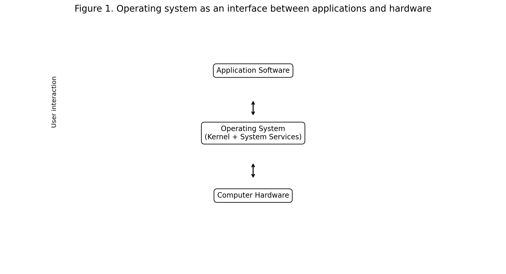
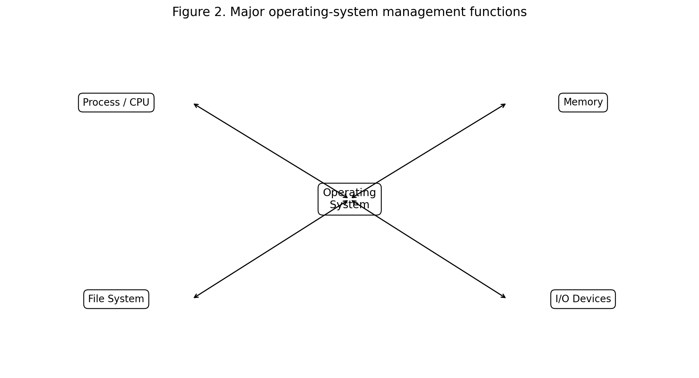
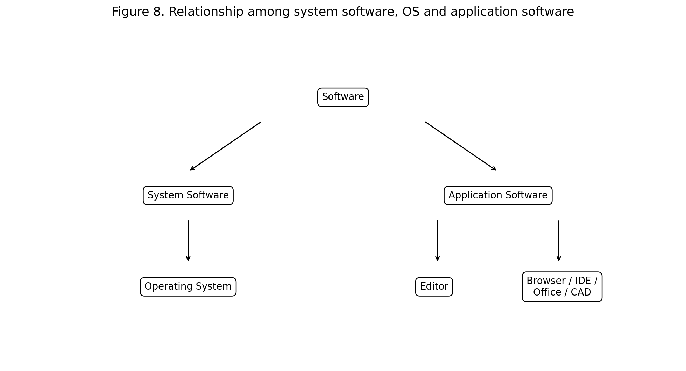
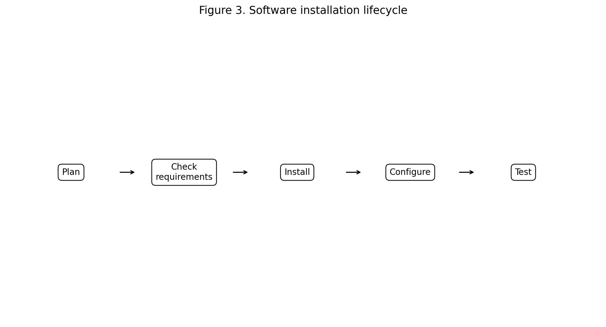
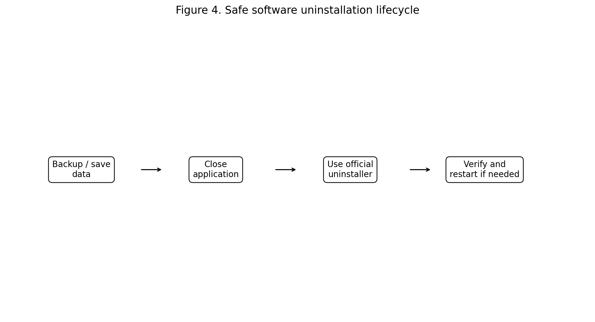
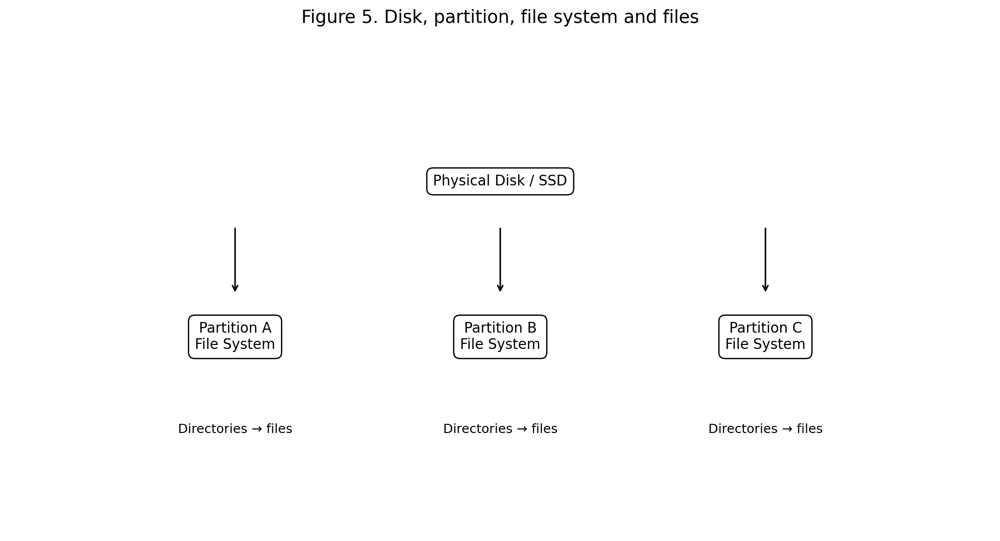
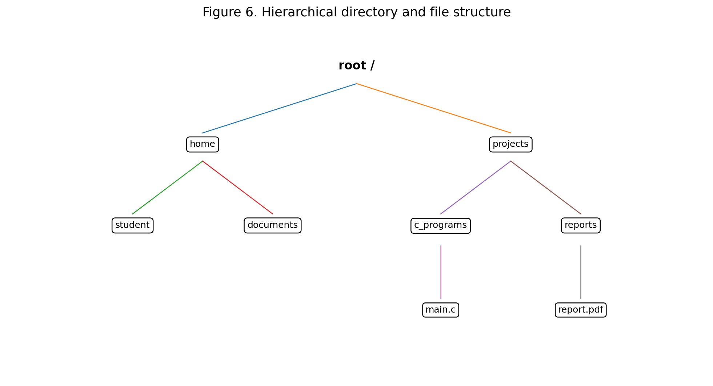
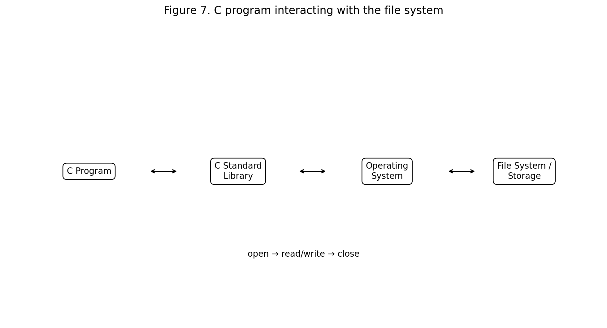

# Operating Systems, Installation/Uninstallation, Disk/Directory/File System and Application Software
## Reading Material for Bachelor of Engineering Students — Problem Solving Using C

**Course:** Problem Solving Using C  
**Level:** Bachelor of Engineering  
**Focus:** Understanding the operating environment in which C programs are developed, executed, stored and managed.

---

## Learning Objectives

After completing this unit, students should be able to:

1. Define an operating system and explain its role in a computer system.
2. Identify major operating-system functions.
3. Explain the relationship between hardware, operating systems and application software.
4. Describe the general process of installing and uninstalling software.
5. Explain disks, partitions, file systems, directories and files.
6. Distinguish absolute and relative paths.
7. Explain common file and directory operations.
8. Relate C programs to the operating system and file system.
9. Use C file I/O operations such as `fopen()`, `fprintf()`, `fscanf()`, `fgets()`, `fputs()` and `fclose()`.
10. Understand why correct software installation, file organization, permissions and backups are important in engineering work.

---

# 1. Introduction

A computer system is more than a processor and memory. Users need software that controls hardware, manages resources, stores information, runs programs and provides an interface for applications.

The **operating system (OS)** is the primary system software that coordinates hardware resources and provides services to application programs. Typical responsibilities include process management, memory management, file-system management, input/output management, networking, security and user interaction. citeturn0search0turn0search5

Examples include:

- Microsoft Windows
- GNU/Linux distributions
- macOS
- Android
- iOS

A simplified view is:



**Figure 1. Operating system as an interface between applications and hardware.**

```text
User
  ↓
Application Software
  ↓
Operating System
  ↓
Computer Hardware
```

The operating system provides an abstraction layer so that application programs do not need to directly control every hardware component.

---

# 2. What is an Operating System?

An **operating system** is system software that manages computer hardware and provides services required by application programs.

For example, when a C program reads a file, the programmer normally does not need to know which physical disk blocks contain every byte. The operating system and file system handle the details.

Similarly, when a program requests input from a keyboard, the OS manages the underlying input device and makes the information available to the program.

## Major functions

An operating system commonly manages:

- CPU/processes
- main memory
- storage
- files and directories
- input/output devices
- network resources
- security and permissions
- users
- system services
- application execution



**Figure 2. Major operating-system management functions.**

---

# 3. Operating System and Problem Solving Using C

Students learning C often think of a program as:

```text
Source Code
    ↓
Compiler
    ↓
Executable Program
    ↓
Output
```

A more complete picture is:

```text
C Source Code
     ↓
Compiler / Build Tools
     ↓
Executable Program
     ↓
Operating System
     ↓
CPU + Memory + Files + I/O Devices
```

For example, consider:

```c
#include <stdio.h>

int main(void) {
    printf("Hello, Engineering Students!\n");
    return 0;
}
```

The `printf()` function eventually requires operating-system and hardware services to display information.

Therefore, learning C is not only about syntax. It also introduces students to the interaction between:

```text
Program
  ↕
Operating System
  ↕
Hardware
```

---

# 4. Kernel and User-Level Programs

The **kernel** is the central part of an operating system responsible for core resource management and privileged operations.

A useful conceptual model is:

```text
User Applications
       ↓
Libraries / APIs
       ↓
System Calls
       ↓
Kernel
       ↓
Hardware
```

A C program normally accesses OS functionality through libraries and APIs rather than directly manipulating hardware.

For example, a C program can use file functions such as:

```c
fopen()
fread()
fwrite()
fclose()
```

The operating system ultimately manages the underlying file-system and storage operations.

---

# 5. System Software vs Application Software

Software can be broadly classified into system software and application software.



**Figure 8. Relationship among system software, operating system and application software.**

## System software

System software supports the operation of the computer.

Examples:

- operating systems,
- device drivers,
- system utilities,
- language translators,
- system libraries.

## Application software

Application software is designed to perform tasks for users or organizations.

Examples:

- web browsers,
- word processors,
- spreadsheets,
- CAD tools,
- media players,
- engineering simulation tools,
- database applications,
- IDEs.

---

# 6. Application Software

An **application program** solves a user-oriented problem.

For an engineering student, examples include:

### Programming

- GCC
- Clang
- Visual Studio
- Code editors
- IDEs

### Engineering

- CAD software
- numerical computing tools
- simulation software
- circuit-design tools

### General productivity

- document editors
- spreadsheets
- presentation software

### Communication

- email clients
- web browsers
- collaboration tools

Application software runs within the environment provided by the operating system.

---

# 7. Why Engineers Need to Understand the OS

Consider an engineering project requiring a C program to:

- read sensor data,
- store measurements,
- process results,
- create a report,
- communicate over a network.

The application may depend on:

```text
Operating System
├── Process management
├── Memory
├── File system
├── Network
├── Device drivers
└── Security
```

Thus, understanding the OS helps engineers diagnose problems that are not caused by C syntax alone.

---

# 8. Installing Software

**Software installation** is the process of making a program available for use on a computer.

Installation may involve:

1. obtaining the software,
2. checking compatibility,
3. installing required dependencies,
4. copying program files,
5. creating configuration information,
6. creating shortcuts or menu entries,
7. registering services where required,
8. configuring permissions,
9. testing the installation.



**Figure 3. General software installation lifecycle.**

---

# 9. Safe Software Installation

Before installing software, consider:

### 1. Source

Obtain software from a trustworthy source.

### 2. Compatibility

Check:

- operating system,
- processor architecture,
- available memory,
- disk space,
- required runtime libraries.

### 3. Permissions

Some installations require administrator/root privileges.

### 4. Dependencies

Some programs depend on:

- libraries,
- frameworks,
- runtimes,
- drivers,
- other applications.

### 5. Security

Avoid unknown executables and suspicious installers.

### 6. Backup

For major system changes, maintain appropriate backups or recovery options.

---

# 10. Installing C Development Tools

To program in C, students generally need:

```text
Text Editor / IDE
       +
C Compiler
       +
Build / Debugging Tools
```

For example, on a Linux system, a common development environment may include:

```text
GCC or Clang
Editor / IDE
Debugger
Build tools
```

A simple C source file might be:

```text
hello.c
```

Compilation using GCC:

```bash
gcc hello.c -o hello
```

Execution:

```bash
./hello
```

On Windows, the exact installation and compiler commands depend on the selected development environment.

---

# 11. Uninstallation

**Uninstallation** removes an application and its associated components from a system.

A safe general process is:

```text
Save required data
       ↓
Close application
       ↓
Use official uninstall mechanism
       ↓
Follow instructions
       ↓
Restart if required
       ↓
Verify removal
```



**Figure 4. Safe software uninstallation lifecycle.**

## Important precautions

Before uninstalling software:

- save important files,
- check whether other programs depend on it,
- avoid manually deleting system directories,
- use the OS package manager or official uninstaller when available,
- verify that required configuration/data has been backed up.

---

# 12. Installing vs Uninstalling

| Installation | Uninstallation |
|---|---|
| Makes software available | Removes software |
| May add files | Removes application files |
| May add configuration | Removes or resets configuration |
| May add dependencies | May remove dependencies |
| May create shortcuts | Removes shortcuts |
| May require elevated privileges | May require elevated privileges |

---

# 13. What is a Disk?

A **disk** is a storage device used to persist data.

Common storage technologies include:

- HDD — Hard Disk Drive
- SSD — Solid-State Drive
- USB flash storage
- external storage

The operating system provides a logical representation of storage so users and applications can work with files rather than physical storage blocks.

A file system maps logical files and directories to physical or logical storage resources. citeturn0search3turn0search9

---

# 14. Disk, Partition and File System

These terms are related but not identical.

### Disk

The physical or logical storage device.

### Partition

A defined region of a storage device that can be managed as a separate storage area.

### File system

A structure and set of rules used to organize and retrieve files and directories.

### File

A named collection of data.

### Directory

A structure used to organize files and other directories.



**Figure 5. Disk, partitions, file systems and files.**

---

# 15. What is a File System?

A **file system** organizes persistent data into files and directories and provides mechanisms for storing and retrieving them.

A file system manages concepts such as:

- file names,
- directories,
- file metadata,
- storage allocation,
- permissions,
- file access,
- directory hierarchy.

Different operating systems and storage environments support different file-system formats. For example, APFS is used by current Apple operating systems, while other platforms commonly use formats such as NTFS, exFAT, ext4 and others. citeturn0search3

---

# 16. File

A **file** is a named collection of data stored persistently.

Examples:

```text
main.c
program.exe
notes.txt
report.pdf
image.png
data.csv
```

Files may contain:

- source code,
- text,
- numbers,
- images,
- audio,
- video,
- executable code,
- configuration data.

---

# 17. File Extension

A file name often contains an extension indicating its type or associated application.

Examples:

| Extension | Typical content |
|---|---|
| `.c` | C source code |
| `.h` | C/C++ header |
| `.txt` | Text |
| `.csv` | Comma-separated data |
| `.pdf` | Portable document |
| `.png` | Image |
| `.jpg` | Image |
| `.exe` | Windows executable |
| `.sh` | Shell script |

The extension is useful information, but it does not by itself guarantee the contents or security of a file.

---

# 18. Directory / Folder

A **directory**, commonly called a **folder** in graphical interfaces, organizes files and other directories.

For example:

```text
Engineering/
├── C_Programs/
│   ├── main.c
│   └── array.c
├── Notes/
│   ├── os.txt
│   └── c_notes.pdf
└── Projects/
    └── project_report.pdf
```

Directories form a hierarchy or tree. citeturn0search0turn0search1

---

# 19. Directory Tree

A directory structure can be represented as a tree.



**Figure 6. Hierarchical directory and file structure.**

The topmost directory is often called the **root**.

A directory can contain:

- files,
- subdirectories,
- additional levels of organization.

This hierarchical structure allows millions of files to be managed systematically.

---

# 20. Root Directory

The root is the top of a file-system hierarchy.

On Unix/Linux:

```text
/
```

For example:

```text
/home/student/project/main.c
```

On Windows, a volume may have a root such as:

```text
C:\
```

The exact path conventions depend on the operating system. citeturn0search1turn0search10

---

# 21. Absolute Path

An **absolute path** specifies a location from the root or volume root.

Linux example:

```text
/home/student/c_programs/main.c
```

Windows example:

```text
C:\Users\Student\C_Programs\main.c
```

An absolute path gives the complete location.

---

# 22. Relative Path

A **relative path** specifies a location relative to the current working directory.

Suppose the current directory is:

```text
/home/student/c_programs
```

Then:

```text
data/input.txt
```

means:

```text
/home/student/c_programs/data/input.txt
```

Relative paths are useful because they allow programs and projects to be moved between locations more easily.

---

# 23. Current Working Directory

The **current working directory** is the directory associated with a running process and is used as the reference point for many relative paths.

For example:

```text
Current directory:
    project/

Relative path:
    data/input.txt

Resolved location:
    project/data/input.txt
```

Understanding the current working directory is especially important when C programs open files.

---

# 24. Common File Operations

Operating systems and programming interfaces provide operations such as:

- create,
- open,
- read,
- write,
- append,
- seek,
- close,
- rename,
- delete.

At the programming level, C provides standard library functions for many file operations.

---

# 25. File Permissions

Modern operating systems use access controls to restrict file operations.

Typical concepts include:

```text
Read
Write
Execute
```

Permissions may be associated with:

- owner,
- group,
- other users,

depending on the OS.

Applications should not assume that they can access every file.

For example:

```text
Program → open file
       ↓
Operating system checks permission
       ↓
Allowed / denied
```

This is one reason file operations in C can fail even when the code is syntactically correct.

---

# 26. C and File Systems

C programs commonly interact with files using the C standard I/O library.

Typical functions include:

```c
fopen()
fclose()
fprintf()
fscanf()
fgets()
fputs()
fread()
fwrite()
```



**Figure 7. C program interacting with the file system.**

A typical workflow is:

```text
Open
  ↓
Read / Write
  ↓
Close
```

---

# 27. Opening a File in C

Example:

```c
#include <stdio.h>

int main(void) {
    FILE *fp;

    fp = fopen("data.txt", "r");

    if (fp == NULL) {
        printf("Unable to open file.\n");
        return 1;
    }

    printf("File opened successfully.\n");

    fclose(fp);

    return 0;
}
```

### Important concept

Always check whether `fopen()` returned `NULL`.

A file may fail to open because:

- it does not exist,
- the path is incorrect,
- permission is denied,
- the storage device is unavailable,
- another system problem occurred.

---

# 28. Writing to a File

```c
#include <stdio.h>

int main(void) {
    FILE *fp = fopen("marks.txt", "w");

    if (fp == NULL) {
        printf("Could not create file.\n");
        return 1;
    }

    fprintf(fp, "Student: A01\n");
    fprintf(fp, "Marks: 87\n");

    fclose(fp);

    return 0;
}
```

The `"w"` mode opens a file for writing and may replace existing contents.

Students should understand file modes before using them.

---

# 29. Appending to a File

If existing contents should be preserved and new data added at the end:

```c
FILE *fp = fopen("log.txt", "a");
```

The `"a"` mode is useful for logs.

Example:

```c
fprintf(fp, "Temperature = 31.5 C\n");
```

---

# 30. Reading Text from a File

A simple line-based example:

```c
#include <stdio.h>

int main(void) {
    FILE *fp;
    char line[200];

    fp = fopen("notes.txt", "r");

    if (fp == NULL) {
        printf("File not found.\n");
        return 1;
    }

    while (fgets(line, sizeof(line), fp) != NULL) {
        printf("%s", line);
    }

    fclose(fp);

    return 0;
}
```

This program demonstrates a useful engineering pattern:

```text
Open
Check
Process repeatedly
Close
```

---

# 31. File Handling and Problem Solving

Suppose an engineering application must process 1,000 temperature readings.

Instead of placing all values manually inside the C program:

```text
temperature1
temperature2
temperature3
...
```

we can store them in a file:

```text
temperatures.txt
```

Then the program can:

```text
Read data
   ↓
Validate data
   ↓
Calculate average
   ↓
Find maximum
   ↓
Find minimum
   ↓
Generate result
```

This demonstrates how file systems support real engineering problem solving.

---

# 32. Example — Average of Values Stored in a File

Suppose `values.txt` contains:

```text
10
20
30
40
50
```

C program:

```c
#include <stdio.h>

int main(void) {
    FILE *fp;
    double value;
    double sum = 0.0;
    int count = 0;

    fp = fopen("values.txt", "r");

    if (fp == NULL) {
        printf("Unable to open values.txt\n");
        return 1;
    }

    while (fscanf(fp, "%lf", &value) == 1) {
        sum += value;
        count++;
    }

    fclose(fp);

    if (count > 0) {
        printf("Average = %.2f\n", sum / count);
    } else {
        printf("No numeric data found.\n");
    }

    return 0;
}
```

Expected output:

```text
Average = 30.00
```

---

# 33. File Handling Errors

A robust program should consider:

### File not found

```text
fopen() returns NULL
```

### Permission denied

The OS may prevent access.

### Incorrect data

`fscanf()` may fail when the file contains unexpected text.

### Storage failure

A device may be unavailable or full.

### Path error

The program may be executing in a different current working directory than expected.

### Engineering lesson

> **Never assume the environment is perfect.**

Good programs check inputs, resources and return values.

---

# 34. Application Software Installation and the C Environment

To build and run C programs, students may install:

```text
C Compiler
   +
Editor / IDE
   +
Debugger
   +
Build tools
```

Example workflow:

```text
Write main.c
    ↓
Compile
    ↓
Executable
    ↓
Run
    ↓
Read/write files
    ↓
Operating System
```

Application software such as an IDE is therefore part of the development environment, while the compiler and OS provide other layers of support.

---

# 35. Package Managers

Modern operating systems may provide package-management systems.

A package manager can help:

- install software,
- remove software,
- update software,
- resolve dependencies,
- track installed packages.

For example, Linux distributions commonly provide package managers.

A generic conceptual workflow is:

```text
Search package
     ↓
Check source/repository
     ↓
Install
     ↓
Resolve dependencies
     ↓
Configure
     ↓
Update later
```

Exact commands vary by distribution.

---

# 36. Why Package Management Matters

Suppose a C development environment needs:

```text
Compiler
Library A
Library B
Debugger
Build tools
```

Manually installing each component can be difficult.

A package manager can maintain dependency relationships and versions.

This illustrates a broader software-engineering principle:

> **Complex systems become manageable when dependencies and resources are organized systematically.**

---

# 37. Application Data vs Application Program

Students should distinguish between:

### Application program

The executable or program components.

### Application data

Data created or used by the application.

For example:

```text
Engineering Software
├── Program files
├── Configuration
├── User preferences
├── Project files
├── Cache
└── Logs
```

Uninstalling an application does not always mean that every user-created file or configuration item is automatically removed.

---

# 38. Disk Space and Software Installation

Before installing software, check available storage.

A large engineering application may require:

```text
Program files
+
Libraries
+
Temporary installation space
+
User data
+
Cache
```

Therefore:

```text
Required space ≠ only executable size
```

Students should understand that installation requirements may include additional components.

---

# 39. Backup and Recovery

Before major OS or software changes:

```text
Important files
      ↓
Backup
      ↓
Verify backup
      ↓
Install / uninstall
      ↓
Test
```

A backup is useful only if the data can actually be recovered.

For engineering projects, maintain backups of:

- `.c` source files,
- header files,
- project configuration,
- datasets,
- reports,
- documentation,
- test results.

---

# 40. Organizing a C Programming Project

A good directory structure can be:

```text
TemperatureProject/
├── src/
│   ├── main.c
│   └── sensor.c
├── include/
│   └── sensor.h
├── data/
│   └── temperatures.txt
├── output/
│   └── report.txt
├── tests/
│   └── test_sensor.c
└── README.md
```

Advantages:

- easier navigation,
- cleaner projects,
- easier backup,
- easier collaboration,
- easier debugging,
- easier maintenance.

---

# 41. Relative Paths in C Projects

Suppose:

```text
TemperatureProject/
├── src/
│   └── main.c
└── data/
    └── temperatures.txt
```

A program executed from the project root might use:

```text
data/temperatures.txt
```

But if the program is executed from `src/`, the relative path could instead be:

```text
../data/temperatures.txt
```

This explains a common beginner error:

```text
"File exists, but C says it cannot open it!"
```

The problem may be the **current working directory**, not the file itself.

---

# 42. OS Commands Useful for C Students

The exact commands vary by OS.

## Linux/macOS-style shell

```bash
pwd
ls
cd
mkdir
cp
mv
rm
```

Examples:

```bash
mkdir project
cd project
```

Create a file:

```bash
touch main.c
```

Compile:

```bash
gcc main.c -o main
```

Run:

```bash
./main
```

## Windows Command Prompt

Common commands include:

```cmd
cd
dir
mkdir
copy
move
del
```

The goal is not to memorize every command but to understand that the CLI provides direct control over files, directories and programs.

---

# 43. GUI vs CLI for File Management

### GUI

Example:

```text
File Explorer
    ↓
Open folder
    ↓
Create directory
    ↓
Copy file
    ↓
Run application
```

### CLI

Example:

```bash
mkdir project
cd project
cp ../main.c .
```

Both interfaces operate on the same underlying storage concepts.

---

# 44. System Calls and C

Operating systems expose services through interfaces often called **system calls**.

Conceptually:

```text
C Program
    ↓
Library/API
    ↓
System Call
    ↓
Kernel
    ↓
Hardware / OS resource
```

For example, a C program asking to open a file eventually requires the OS to perform protected file-system operations.

The C standard library provides portable abstractions such as `fopen()`, while operating-system-specific APIs provide lower-level capabilities.

---

# 45. Standard I/O vs OS-Specific File APIs

C's standard I/O:

```c
FILE *fp;
fp = fopen("data.txt", "r");
```

is designed to be portable across many environments.

Operating-system-specific interfaces can provide additional capabilities, such as:

- file permissions,
- directory operations,
- process control,
- device-specific functions.

For introductory problem solving, start with standard C I/O and then progress to OS-specific APIs.

---

# 46. Engineering Example — Student Result Processing

### Problem

Store student marks in a file and calculate:

- total,
- average,
- highest mark,
- lowest mark.

### Algorithm

```text
Start
 ↓
Open file
 ↓
Read marks
 ↓
Validate marks
 ↓
Update total
 ↓
Update min/max
 ↓
Repeat until end of file
 ↓
Calculate average
 ↓
Display results
 ↓
Close file
 ↓
End
```

This problem combines:

- variables,
- loops,
- conditions,
- functions,
- file handling,
- error handling.

---

# 47. Engineering Example — Sensor Data Logger

A sensor system may continuously generate:

```text
Time, Temperature
10:00, 28.5
10:01, 28.7
10:02, 29.1
```

A C program can append each measurement to:

```text
sensor_log.csv
```

Example:

```c
fprintf(fp, "%s,%.2f\n", timestamp, temperature);
```

The data can later be imported into:

- spreadsheets,
- Python,
- MATLAB,
- engineering analysis tools.

This demonstrates the relationship between:

```text
C program
+
Operating system
+
File system
+
Engineering data
```

---

# 48. Common Mistakes by Beginners

### Mistake 1 — Using an incorrect path

```c
fopen("data.txt", "r");
```

The file may not be in the current working directory.

### Mistake 2 — Not checking `fopen()`

Incorrect:

```c
FILE *fp = fopen("data.txt", "r");
fscanf(fp, "%d", &x);
```

Better:

```c
FILE *fp = fopen("data.txt", "r");

if (fp == NULL) {
    perror("data.txt");
    return 1;
}
```

### Mistake 3 — Forgetting `fclose()`

Always close files when finished.

### Mistake 4 — Overwriting important data

Opening a file with:

```c
"w"
```

can replace its existing contents.

### Mistake 5 — Confusing file extension with actual format

A filename ending in `.txt` does not guarantee that its contents are valid text.

---

# 49. OS, Files and C — Integrated View


A C application can:

```text
Create file
    ↓
Open file
    ↓
Read/write data
    ↓
Close file
```

The OS manages:

```text
File name
Directory
Permissions
Storage
Caching
Device
```

The storage hardware manages the physical persistence.

Therefore:

```text
C Program
    ↓
C Library / API
    ↓
Operating System
    ↓
File System
    ↓
Storage Device
```

---

# 50. Practical Lab Exercise 1 — Create a Project Structure

Create:

```text
C_OS_Lab/
├── programs/
├── data/
├── output/
└── documentation/
```

Write a C program in `programs/` that reads input from a file in `data/` and writes results to `output/`.

---

# 51. Practical Lab Exercise 2 — File Statistics

Create `numbers.txt` containing at least 20 integers.

Write a C program to calculate:

- count,
- sum,
- average,
- minimum,
- maximum.

Save the result in:

```text
output/result.txt
```

---

# 52. Practical Lab Exercise 3 — Log File

Create a C program that records simulated sensor readings:

```text
Temperature = 28.5
Temperature = 29.1
Temperature = 30.2
```

Append each reading to:

```text
sensor.log
```

Do not overwrite earlier readings.

---

# 53. Practical Lab Exercise 4 — Student Record File

Create a program that stores:

```text
Roll Number
Name
Marks
```

in a text or binary file.

Provide menu options:

```text
1. Add record
2. Display records
3. Search record
4. Exit
```

This project introduces students to:

- structures,
- functions,
- files,
- loops,
- menu-driven programming.

---

# 54. Practical Lab Exercise 5 — Installation and Uninstallation Study

Choose a C development tool available in your laboratory.

Document:

1. Software name
2. Version
3. Operating system
4. Hardware requirements
5. Installation procedure
6. Configuration
7. Compilation test
8. Uninstallation procedure
9. What happens to project files after uninstalling?
10. How would you back up your projects first?

**Important:** Do not uninstall laboratory software without instructor permission.

---

# 55. Mini Project — Engineering Data Management System

Develop a C program that stores engineering measurements.

Example:

```text
Measurement ID
Sensor ID
Temperature
Pressure
Time
```

### Features

1. Add measurement
2. Display measurements
3. Search by sensor ID
4. Calculate average
5. Find maximum
6. Find minimum
7. Save to file
8. Load from file
9. Generate summary report

### Suggested structure

```text
EngineeringData/
├── src/
│   ├── main.c
│   ├── file.c
│   └── analysis.c
├── include/
│   └── engineering.h
├── data/
│   └── measurements.csv
├── output/
│   └── summary.txt
└── README.md
```

This mini project combines operating-system awareness with core problem-solving skills in C.

---

# 56. Troubleshooting Checklist

When a C program cannot access a file, check:

```text
1. Does the file exist?
        ↓
2. Is the filename correct?
        ↓
3. Is the path correct?
        ↓
4. What is the current working directory?
        ↓
5. Does the user have permission?
        ↓
6. Is the storage device available?
        ↓
7. Is the file already locked/in use?
        ↓
8. Did the program check the return value?
```

This is a useful general engineering troubleshooting method.

---

# 57. Review Questions

## Short Answer

1. What is an operating system?
2. List five functions of an operating system.
3. What is a kernel?
4. What is application software?
5. Differentiate system software and application software.
6. What is software installation?
7. What is software uninstallation?
8. What is a disk?
9. What is a partition?
10. What is a file system?
11. What is a file?
12. What is a directory?
13. What is a root directory?
14. What is an absolute path?
15. What is a relative path?
16. What is the current working directory?
17. What are file permissions?
18. Why should `fopen()` be checked for `NULL`?
19. What is the difference between `"w"` and `"a"` modes in C?
20. Why is `fclose()` important?

---

# 58. Descriptive Questions

1. Explain the role of an operating system with a suitable diagram.
2. Explain the major functions of an operating system.
3. Explain the relationship between hardware, OS and application software.
4. Describe the software installation lifecycle.
5. Explain safe software uninstallation.
6. Explain disk, partition and file-system concepts.
7. Explain hierarchical directory structures.
8. Differentiate absolute and relative paths with examples.
9. Explain file permissions.
10. Explain how a C program interacts with the file system.
11. Explain standard C file functions with examples.
12. Explain how an engineering data logger can use files.
13. Discuss common file-handling errors in C.
14. Explain why backup and recovery are important before major software changes.

---

# 59. C Programming Exercises

### Exercise 1 — File Copy

Write a C program that copies the contents of one text file to another.

### Exercise 2 — Word Counter

Read a text file and count:

- characters,
- words,
- lines.

### Exercise 3 — Data Analyzer

Read numerical values from a file and calculate:

- sum,
- average,
- minimum,
- maximum.

### Exercise 4 — Log Generator

Generate 100 simulated sensor measurements and append them to a log file.

### Exercise 5 — Student Database

Use structures and files to implement:

```text
Add
Search
Display
Update
Delete
```

### Exercise 6 — Project Directory Documentation

Create a C project with separate directories for:

```text
Source
Headers
Data
Output
Documentation
```

Document the purpose of each directory.

---

# 60. Key Takeaways

1. The operating system manages computer resources and provides services to applications.
2. The OS acts as an abstraction layer between programs and hardware.
3. Application software performs user-oriented tasks.
4. Software installation should consider source, compatibility, dependencies, permissions and security.
5. Uninstallation should use the official OS/application mechanism where available.
6. A disk is storage hardware; a partition is a logical division; a file system organizes data within storage.
7. Files store data and directories organize files.
8. Directory structures are usually hierarchical.
9. Absolute paths begin from a root/volume context; relative paths are interpreted from a current directory.
10. C programs can create, read, write and modify files.
11. File operations can fail because of missing files, incorrect paths, permissions or storage problems.
12. Always check return values and close resources.
13. Good project organization improves maintainability.
14. Operating-system knowledge helps C programmers understand why programs behave differently in different environments.

---

# 61. Final Perspective

Problem solving using C does not happen in isolation.

When a C program runs, it operates inside an environment:

```text
                 USER
                   ↓
          APPLICATION / C PROGRAM
                   ↓
             C LIBRARY / API
                   ↓
            OPERATING SYSTEM
                   ↓
       ┌───────────┼───────────┐
       ↓           ↓           ↓
     CPU        MEMORY       FILE SYSTEM
                               ↓
                           STORAGE
```

A good engineer therefore asks not only:

> "Is my C algorithm correct?"

but also:

> "Does my program interact correctly with the operating system, files, storage, permissions and execution environment?"

That mindset is essential for reliable engineering software.

---

# References and Further Reading

1. **Key Concepts of Computer Studies — Basic Operations of an Operating System.** Covers OS functions, files, folders and basic file management concepts. citeturn0search0
2. **Carnegie Mellon University — Introduction to Operating Systems.** Provides foundational explanations of hierarchical file systems, root directories, paths and working directories. citeturn0search1
3. **Apple Developer Documentation — File System Basics.** Explains file systems, persistent storage, directories and application/system data. citeturn0search3
4. **INFLIBNET — File System Interface.** Covers files, directories, file systems, storage blocks and file operations. citeturn0search9
5. **Workforce LibreTexts — Operating System.** Provides introductory treatment of disk access, file systems, files and directory trees. citeturn0search11

---

## Suggested Teaching Sequence

```text
Operating System
       ↓
System vs Application Software
       ↓
Installation / Uninstallation
       ↓
Disk and Storage
       ↓
Partitions
       ↓
File Systems
       ↓
Directories and Paths
       ↓
Files and Permissions
       ↓
C File Handling
       ↓
Engineering Data Processing
       ↓
Mini Project
```

This sequence provides a natural bridge from **basic computer awareness to practical C programming and engineering problem solving**.
