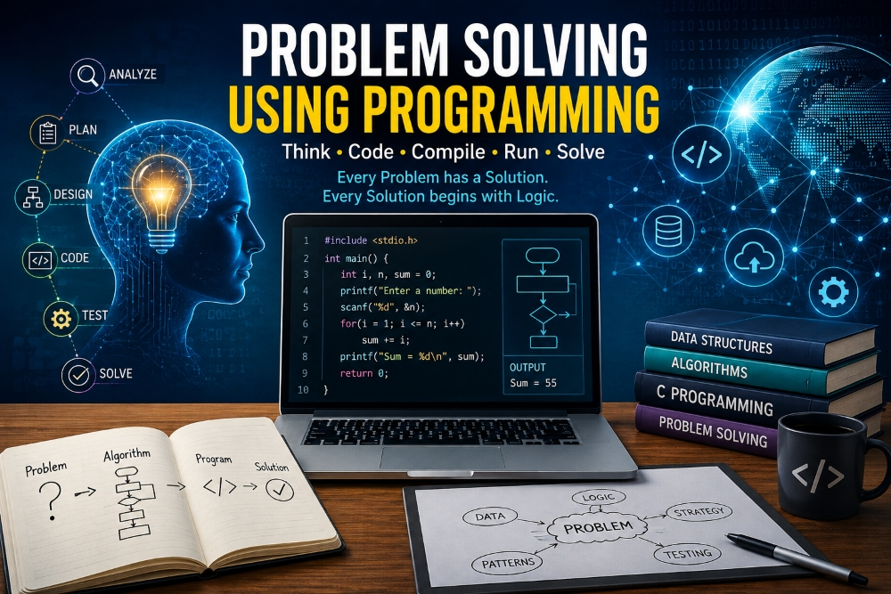
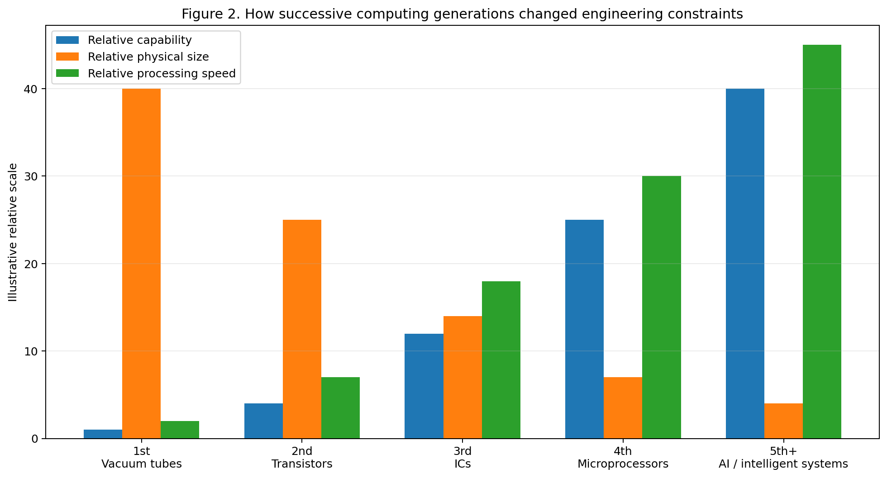
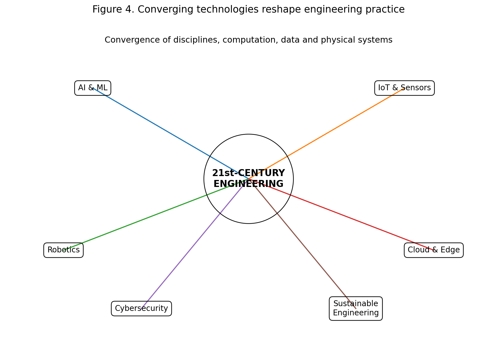
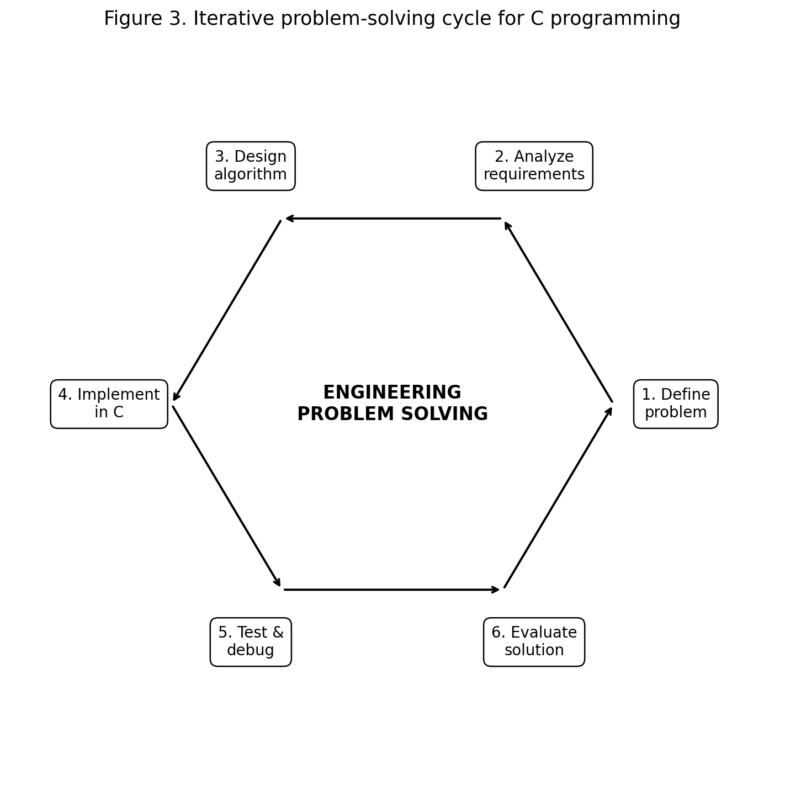
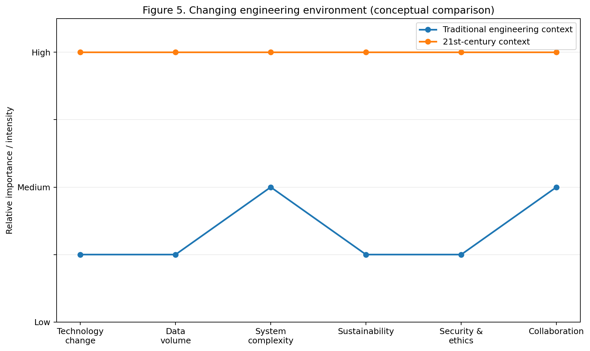
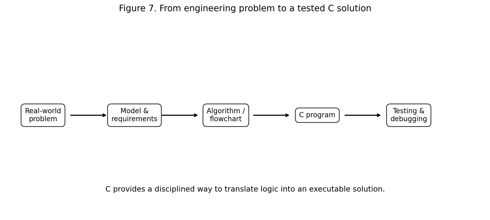

# :classical_building: Problem Solving Using Programming - B.Tech-IT, IIIT Allahabad
## Unit 1: Introduction to Computers and Hardware
* ### Current Topic: History of Computers, Engineering in the 21st Century, Recent Engineering Achievements, and the Changing Engineering Environment
* **Purpose:** Introduce students to the evolution of computing and connect that evolution with modern engineering practice, problem-solving, programming, and professional skills.
---

---
## 👥 Instructor Information
* **Edited by Instructor:** [Dr. Mohammed Javed](https://sites.google.com/site/mohammedjaved2016/)
* **Email:** javed@iiita.ac.in
* **Senior Teaching Assistants:** Mr. Subrata Pramanik (pmm2024003@iiita.ac.in)
---
## 🎯 Learning Objectives

After studying this material, students should be able to:

1. Explain the major milestones in the history of computers.
2. Describe the broad characteristics of different generations of computers.
3. Explain how computing has transformed engineering in the 21st century.
4. Identify examples of major engineering achievements and the technologies behind them.
5. Discuss how engineering work is changing because of AI, data, automation, sustainability, cybersecurity, and interdisciplinary collaboration.
6. Connect real-world engineering problems with algorithmic thinking and C programming.
7. Recognize why engineers need lifelong learning, verification, communication, and ethical judgment.

---

## 1. Introduction: Why Should an Engineering Student Study the History of Computers?

Computers are not merely machines used for programming exercises. They are engineering tools used to:

- model physical systems,
- solve mathematical equations,
- analyze experimental data,
- control machines,
- simulate designs before manufacturing,
- communicate and collaborate,
- automate repetitive work,
- optimize engineering systems,
- support scientific discovery,
- and increasingly assist engineers through artificial intelligence.

The history of computing shows a repeated engineering pattern:

> **A limitation is identified → engineers create a new technology → the technology changes what problems can be solved → new problems and opportunities appear.**

The evolution from mechanical calculators to electronic computers, microprocessors, smartphones, cloud systems, AI accelerators, and intelligent cyber-physical systems is therefore also a history of engineering problem solving.


---

# 2. Early Computing and Mechanical Calculation

## 2.1 The Need for Calculation

Long before electronic computers, people needed to count, measure, calculate, and record information. The **abacus** is one of the best-known early calculation devices.

Other important developments included:

- logarithmic methods and slide rules,
- mechanical calculators,
- punched-card systems,
- mathematical tables,
- and mechanical engines intended to automate calculations.

These inventions demonstrate an important engineering idea: **computation begins with the need to solve a problem efficiently and reliably.**

---

## 2.2 Charles Babbage and the Analytical Engine

Charles Babbage designed the **Difference Engine** and later proposed the much more general **Analytical Engine** in the nineteenth century.

The Analytical Engine contained ideas resembling modern computers:

- a processing unit,
- memory,
- input,
- output,
- and programmable operations.

Although the complete machine was not constructed during Babbage's lifetime, the design was an important conceptual step toward programmable computing.

**Ada Lovelace** is also historically important because she described an algorithm intended for Babbage's Analytical Engine and recognized that such a machine could manipulate symbols according to rules rather than merely perform arithmetic.

### Engineering lesson

Babbage's work teaches a fundamental problem-solving principle:

> A difficult problem becomes manageable when it is decomposed into well-defined operations.

That principle is directly related to writing C programs.

---

# 3. The Electronic Computer Revolution

The twentieth century introduced electronic computing.

Important milestones include:

- electronic digital computers,
- ENIAC and other early large-scale machines,
- the stored-program concept,
- the transistor,
- integrated circuits,
- microprocessors,
- personal computers,
- computer networks,
- the Internet,
- mobile computing,
- cloud computing,
- and AI-oriented computing.

The transistor was particularly important because it enabled computers to become smaller, more reliable, and more energy efficient than vacuum-tube systems.

Integrated circuits then placed many electronic components onto small semiconductor devices. The microprocessor integrated major CPU functions into a chip and helped enable the personal-computer revolution.

---

# 4. Generations of Computers

The term **generation of computers** is a simplified educational framework used to describe major technological transitions.




## 4.1 First Generation: Vacuum Tubes

Typical characteristics:

- vacuum-tube circuits,
- very large physical size,
- high power consumption,
- considerable heat generation,
- relatively low reliability,
- machine-language programming,
- punched cards and paper tape.

Examples include **ENIAC** and **UNIVAC I**.

### Problem-solving significance

Programming was difficult and hardware resources were extremely limited. Engineers had to think carefully about every operation and every unit of memory.

---

## 4.2 Second Generation: Transistors

Transistors replaced many vacuum-tube functions.

Advantages included:

- smaller size,
- greater reliability,
- lower power consumption,
- less heat,
- improved speed,
- and greater practicality.

Higher-level programming languages such as **FORTRAN** and **COBOL** became important.

### Problem-solving significance

As hardware improved, engineers could focus increasingly on algorithms and applications rather than only on hardware limitations.

---

## 4.3 Third Generation: Integrated Circuits

Integrated circuits placed multiple electronic components on semiconductor chips.

Benefits included:

- increased reliability,
- lower cost,
- greater processing capability,
- reduced physical size,
- and more sophisticated operating systems.

The growing separation between hardware and software created new engineering disciplines and methods.

---

## 4.4 Fourth Generation: Microprocessors

The microprocessor brought central processing functions onto a compact chip.

This led to:

- personal computers,
- embedded systems,
- laptops,
- digital instruments,
- industrial controllers,
- and many consumer electronic products.

The microprocessor also made computing an integral part of almost every engineering discipline.

---

## 4.5 Fifth Generation and Modern Intelligent Computing

The term **fifth generation** is used differently in different educational contexts. In this material it refers broadly to modern intelligent and highly connected computing systems involving:

- artificial intelligence,
- machine learning,
- natural-language systems,
- robotics,
- cloud and edge computing,
- specialized AI hardware,
- high-performance computing,
- and emerging quantum computing.

Students should not think of these as a simple replacement of the previous generation. Modern engineering systems usually combine technologies from several eras.

---

# 5. From Computers to Computing Everywhere

The most important change is not simply that computers became faster.

Computing became **embedded into the environment**.

Examples include:

- smartphones,
- automobiles,
- medical equipment,
- industrial robots,
- drones,
- smart grids,
- satellites,
- wearable devices,
- traffic systems,
- manufacturing systems,
- and home automation.

Modern computing therefore combines:

**Sensors → computation → communication → decision → actuation**

This creates **cyber-physical systems**, in which software and physical processes interact continuously.

---

# 6. Engineering in the 21st Century

Engineering in the 21st century is increasingly characterized by convergence.




## 6.1 Multidisciplinary Engineering

A modern product may require:

- mechanical engineering,
- electrical engineering,
- electronics,
- computer engineering,
- software engineering,
- materials science,
- data science,
- cybersecurity,
- manufacturing,
- environmental engineering,
- and management.

For example, an autonomous vehicle requires mechanical structures, sensors, embedded processors, control systems, communication, AI, cybersecurity, energy management, and safety engineering.

---

## 6.2 Computational Thinking

Computational thinking is especially important for engineering students.

It involves:

1. **Decomposition** – break a complex problem into smaller problems.
2. **Pattern recognition** – identify repeated structures.
3. **Abstraction** – ignore irrelevant details and focus on essential information.
4. **Algorithm design** – specify a sequence of operations.
5. **Evaluation** – test whether the solution is correct and efficient.

These skills are central to problem solving using C.

---

# 7. Why C Programming Still Matters to Engineering Students

C is a useful language for engineering education because it exposes students to the fundamental logic behind software.

C helps students learn:

- variables and data types,
- expressions,
- decision making,
- loops,
- functions,
- arrays,
- strings,
- pointers,
- structures,
- memory concepts,
- algorithms,
- debugging,
- and modular program design.

C is particularly relevant to:

- embedded systems,
- microcontrollers,
- firmware,
- operating-system components,
- real-time systems,
- robotics,
- instrumentation,
- and performance-sensitive software.

### Key idea

> **The goal of learning C in an engineering course is not merely to memorize syntax. The goal is to learn how to transform an engineering problem into a precise, testable computational procedure.**

---

# 8. A General Engineering Problem-Solving Process




A practical process is:

### Step 1: Define the problem

State exactly what needs to be solved.

Example:

> Calculate the electrical power consumed by a load for a given voltage and current.

### Step 2: Identify inputs and outputs

Inputs:

- voltage `V`,
- current `I`.

Output:

- power `P`.

### Step 3: Develop the mathematical model

For a simple DC case:

\[
P = VI
\]

### Step 4: Design the algorithm

1. Read voltage.
2. Read current.
3. Calculate `P = V * I`.
4. Display power.

### Step 5: Implement in C (if you already know Coding, otherwise you can skip this part)

```c
#include <stdio.h>

int main(void) {
    double V, I, P;

    printf("Enter voltage (V): ");
    scanf("%lf", &V);

    printf("Enter current (A): ");
    scanf("%lf", &I);

    P = V * I;

    printf("Power = %.2f W\n", P);

    return 0;
}
```

### Step 6: Test

Try normal, boundary, and unusual inputs.

For example:

- `V = 230`, `I = 2`
- `V = 0`, `I = 2`
- `V = 230`, `I = 0`

### Step 7: Evaluate

Ask:

- Is the result correct?
- Are units correct?
- Is the input validated?
- Can the program be reused?
- Is the algorithm efficient enough?

---

# 9. Recent Engineering Achievements and Their Problem-Solving Lessons

Engineering achievements should not be studied only as spectacular inventions. Students should ask:

> **What problem was being solved, what constraints existed, and what engineering methods made the solution possible?**

## 9.1 Artificial Intelligence and Specialized Computing

Modern AI has created demand for:

- high-performance processors,
- GPUs and specialized accelerators,
- large-scale data centers,
- efficient algorithms,
- high-speed networks,
- and energy-aware computing.

This illustrates a modern engineering feedback loop:

**Better hardware → larger models → new applications → new hardware requirements.**

For engineering students, the lesson is that hardware, software, mathematics, and data are increasingly interconnected.

---

## 9.2 Space Engineering and Advanced Observatories

Modern space missions combine:

- advanced materials,
- precision manufacturing,
- control systems,
- embedded computing,
- communications,
- optics,
- thermal engineering,
- and software.

Such systems demonstrate the value of **systems engineering**: a successful product must satisfy many interacting constraints simultaneously.

---

## 9.3 Renewable Energy and Energy Storage

Engineering progress in:

- solar power,
- wind energy,
- batteries,
- power electronics,
- smart grids,
- and energy-management systems

is helping address the challenge of supplying energy while reducing environmental impact.

The problem is not simply "generate electricity." Engineers must also solve:

- intermittency,
- storage,
- transmission,
- reliability,
- cost,
- safety,
- materials,
- and lifecycle impacts.

---

## 9.4 Robotics, Drones and Autonomous Systems

Robots and drones combine:

- sensors,
- embedded processors,
- control algorithms,
- communication,
- mechanical design,
- computer vision,
- AI,
- and safety systems.

Recent Indian engineering activity illustrates this direction. In August 2026, L&T reported expansion plans for its precision-engineering and unmanned-aerial-systems activities and showcased indigenous drone technologies. [^1]

The lesson for students is that a modern engineering problem is often **multidisciplinary and software-defined**.

---

## 9.5 AI-Assisted Physical Engineering

A particularly important recent trend is the integration of AI with physical testing and engineering simulation.

For example, a 2026 University of Cambridge initiative described a high-pressure wind tunnel intended to accelerate aerospace and other industrial development by combining rapid physical testing with AI-based data use. [^2]

This represents an important shift:

**Design → simulate → manufacture → test**

is increasingly becoming:

**Design → simulate → AI-assisted optimization → rapid test → learn from data → redesign**

---

## 9.6 Engineering Education Is Also Changing

Modern engineering education increasingly emphasizes:

- lifelong learning,
- multidisciplinary education,
- sustainability,
- resilience,
- data fluency,
- human-centered design,
- and human-machine interaction. [^3]

This means an engineering graduate cannot rely only on the technologies learned during the first year of college.

---

# 10. The Changing Engineering Environment




## 10.1 From Physical Prototypes to Digital Prototypes

Earlier engineering workflows often required physical prototypes at relatively early stages.

Modern engineers increasingly use:

- CAD,
- simulation,
- digital twins,
- numerical methods,
- virtual testing,
- optimization,
- and AI-assisted design.

Physical prototypes remain important, but computation can reduce the number of expensive physical iterations.

---

## 10.2 From Individual Expertise to Collaborative Expertise

A complex engineering project may involve teams distributed across:

- countries,
- companies,
- laboratories,
- universities,
- and disciplines.

Engineers therefore need:

- communication,
- documentation,
- version control,
- collaborative tools,
- presentation skills,
- and teamwork.

---

## 10.3 From Static Knowledge to Lifelong Learning

Technology changes rapidly.

An engineer may need to learn:

- a new programming language,
- a new framework,
- a new hardware platform,
- new simulation software,
- AI tools,
- cybersecurity methods,
- or new standards.

Therefore:

> **Learning how to learn is itself an engineering skill.**

---

## 10.4 From Data Scarcity to Data Abundance

Modern sensors and digital systems generate huge quantities of data.

Engineers must understand:

- data collection,
- data quality,
- storage,
- visualization,
- statistics,
- machine learning,
- privacy,
- and cybersecurity.

A large quantity of data does not automatically produce a correct engineering decision.

---

## 10.5 From Automation to Intelligent Automation

Traditional automation follows predefined rules.

Modern systems increasingly combine:

- rules,
- sensors,
- machine learning,
- optimization,
- feedback,
- and autonomous decision-making.

The engineer's role therefore changes from simply "writing instructions" to **designing, validating, supervising, and improving intelligent systems**.

---

# 11. Ethics, Safety and Responsibility

Technology can create benefits and risks.

Engineers must consider:

### Safety
Will the system fail safely?

### Reliability
Will it continue working under expected conditions?

### Security
Can unauthorized users manipulate it?

### Privacy
Does the system collect sensitive information?

### Bias
Could an AI-based system produce unfair outcomes?

### Sustainability
What are the energy, material, and environmental costs?

### Human factors
Can users understand and safely operate the system?

### Accountability
Who is responsible when an automated system makes a harmful decision?

A technically correct program is not necessarily a good engineering solution.

---

# 12. The Role of C in the Changing Engineering Environment

C remains particularly valuable when students need to understand the relationship between software and hardware.



Consider an embedded temperature-monitoring system.

A simplified engineering chain is:

**Temperature sensor → ADC → C program → threshold comparison → actuator/alarm**

A simple conceptual C program could be: (You can skip this if you are new to coding)

```c
#include <stdio.h>

int main(void) {
    float temperature;

    printf("Enter temperature in Celsius: ");
    scanf("%f", &temperature);

    if (temperature > 50.0f) {
        printf("WARNING: High temperature!\n");
    } else {
        printf("Temperature is within the safe range.\n");
    }

    return 0;
}
```

The same logic can later be implemented on a microcontroller and connected to a real sensor.

This is why introductory programming is connected to engineering practice.

---

# 13. Mini Case Study: Engineering Problem → Algorithm → C

## Problem

A water tank contains a known quantity of water. A pump fills the tank at a specified rate. Calculate the approximate time required to fill the tank.

### Inputs

- current volume,
- desired volume,
- pump flow rate.

### Model

$$
\text{Required volume} =
V_{\text{desired}} - V_{\text{current}}
$$

$$
t =
\frac{\text{Required volume}}{\text{Flow rate}}
$$

### C implementation  (You can skip this if you are new to coding)

```c
#include <stdio.h>

int main(void) {
    double current, desired, flow, required, time;

    printf("Current volume (L): ");
    scanf("%lf", &current);

    printf("Desired volume (L): ");
    scanf("%lf", &desired);

    printf("Pump flow rate (L/min): ");
    scanf("%lf", &flow);

    if (desired <= current) {
        printf("Tank is already full or above desired level.\n");
    } else if (flow <= 0) {
        printf("Flow rate must be positive.\n");
    } else {
        required = desired - current;
        time = required / flow;

        printf("Required water = %.2f L\n", required);
        printf("Approximate filling time = %.2f minutes\n", time);
    }

    return 0;
}
```

### Engineering thinking involved

The student has used:

- problem definition,
- variables,
- mathematical modeling,
- condition checking,
- input validation,
- arithmetic,
- output formatting,
- and interpretation.

This is the essence of problem solving using C.

---

# 14. A Useful Mental Model for 21st-Century Engineers


Think of the modern engineer as working at the intersection of:

\[
\boxed{
\text{Science}
+
\text{Mathematics}
+
\text{Programming}
+
\text{Data}
+
\text{Design}
+
\text{Ethics}
}
\]

No single component is sufficient for many modern engineering challenges.

---

# 15. Key Takeaways

1. Computers evolved because engineers continuously sought better ways to represent and process information.
2. The major transitions from vacuum tubes to transistors, integrated circuits, microprocessors, networking, mobile computing, and AI changed the engineering environment.
3. Modern engineering is increasingly multidisciplinary.
4. Computing is now embedded in physical systems, products, infrastructure, and scientific instruments.
5. AI, robotics, cloud computing, edge computing, sensors, and advanced manufacturing are reshaping engineering workflows.
6. C programming develops fundamental problem-solving and algorithmic thinking skills.
7. Engineers must learn to define problems before writing code.
8. Testing and verification are as important as implementation.
9. Modern engineering requires attention to sustainability, safety, cybersecurity, privacy, and ethics.
10. Lifelong learning is essential because engineering technology changes continuously.

---

# 16. Review Questions

## Short-answer Questions

1. What is meant by the evolution of computers?
2. Why is Charles Babbage important in computing history?
3. What was the importance of the transistor?
4. What is an integrated circuit?
5. What is a microprocessor?
6. List the major characteristics of first-generation computers.
7. Explain the role of computers in modern engineering.
8. What is computational thinking?
9. What is meant by a cyber-physical system?
10. Why is C useful for engineering students?
11. What is meant by lifelong learning in engineering?
12. Why are cybersecurity and ethics important in engineering?

## Descriptive Questions

1. Explain the major generations of computers and their engineering significance.
2. Discuss how computing has transformed engineering during the 21st century.
3. Explain the changing role of engineers in the age of AI and automation.
4. Discuss the importance of multidisciplinary engineering.
5. Explain the relationship between computational thinking and C programming.
6. Discuss how sustainability changes engineering design decisions.
7. Explain why testing and verification are essential in engineering software.
8. Describe how modern engineering differs from traditional engineering practice.

---

# 17. C Programming Exercises

### Exercise 1 — Computer Generation Calculator

Write a C program that accepts a year and prints the approximate computer generation associated with that period.

### Exercise 2 — Engineering Unit Converter

Write a menu-driven C program to convert:

- meters ↔ kilometers,
- Celsius ↔ Fahrenheit,
- watts ↔ kilowatts.

### Exercise 3 — Engineering Power Calculator

Write a C program to calculate electrical power using voltage and current. Validate the inputs.

### Exercise 4 — Sensor Threshold System

Write a C program that accepts a sensor value and produces:

- NORMAL,
- WARNING,
- CRITICAL

depending on configurable threshold values.

### Exercise 5 — Engineering Data Analysis

Store ten sensor readings in an array and calculate:

- minimum,
- maximum,
- average,
- number of readings above a threshold.

### Exercise 6 — Mini Project

Design a simple C-based **engineering monitoring system** with:

- menu,
- sensor input,
- threshold checking,
- summary statistics,
- and error handling.

Students should prepare:

1. problem statement,
2. assumptions,
3. algorithm,
4. flowchart,
5. C source code,
6. test cases,
7. sample output,
8. limitations,
9. possible future improvements.

---

# 18. Suggested Classroom Activity

Divide students into small teams.

Give each team one engineering problem:

- smart irrigation,
- traffic-light control,
- temperature monitoring,
- water-tank control,
- energy monitoring,
- or basic robotic movement.

Each team should identify:

**Problem → Inputs → Outputs → Constraints → Algorithm → C Program → Testing → Engineering Risks**

The activity helps students see that programming is not separate from engineering—it is one of the tools engineers use to implement solutions.

---

# 19. Conclusion

The history of computers is a history of increasingly powerful ways to solve problems.

Early engineers worked with mechanical devices. Later engineers created electronic computers, transistors, integrated circuits, microprocessors, networks, and increasingly intelligent computing systems.

In the 21st century, the boundaries between engineering disciplines are becoming less rigid. An engineer may need to understand physical systems, programming, data, AI, sensors, communication, cybersecurity, sustainability, and human factors.

For a Bachelor of Engineering student, learning C should therefore be viewed as more than learning a programming language.

It is training in a fundamental engineering habit:

> **Understand the problem → model it → design a solution → implement it → test it → evaluate it → improve it.**

That habit remains valuable even when the technology changes.

---

# 20. References and Further Reading

[^1]: Damaja, I. W., Shaikh, P. W., & Mouftah, H. T. *Distinctive landmarks in the history of computing and engineering: the past, the present, and the future*. International Journal for the History of Engineering & Technology, 2024.

[^2]: National Academies of Sciences, Engineering, and Medicine. *A 21st Century Cyber-Physical Systems Education*.

[^3]: IEEE Technology Navigator. Materials on computer architecture, operating systems, and computing systems.

[^4]: General historical references on the development of mechanical calculators, electronic computers, transistors, integrated circuits, and microprocessors.

[^5]: Recent engineering reporting and institutional material on AI-assisted engineering, drones, robotics, aerospace, energy, and advanced manufacturing.

---
