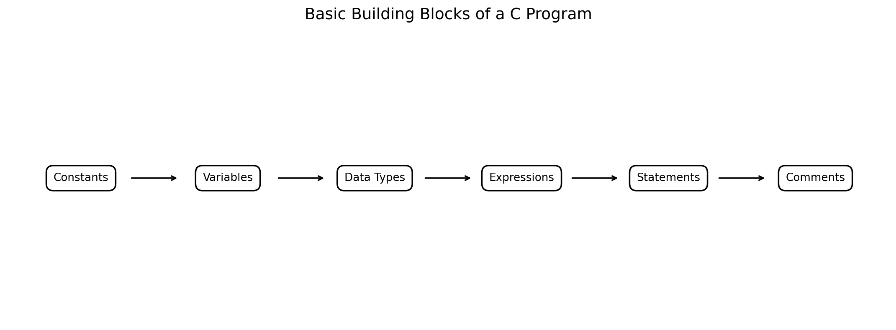
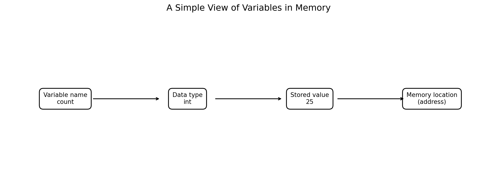
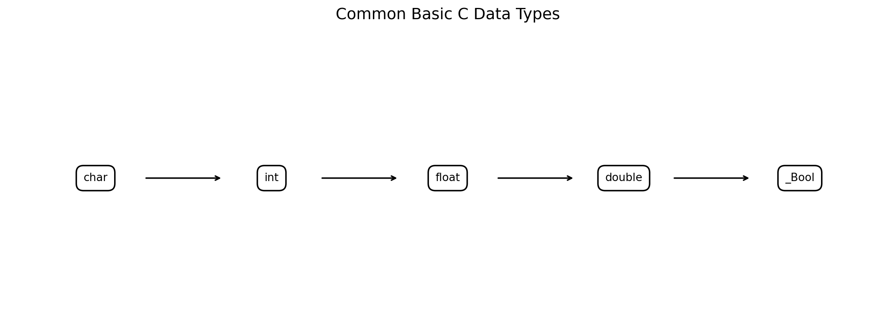
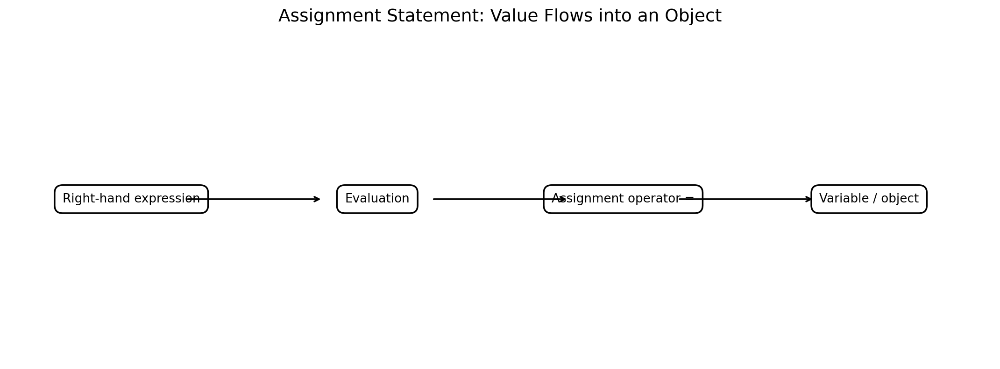
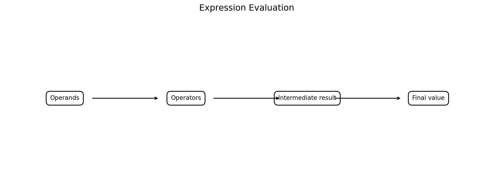
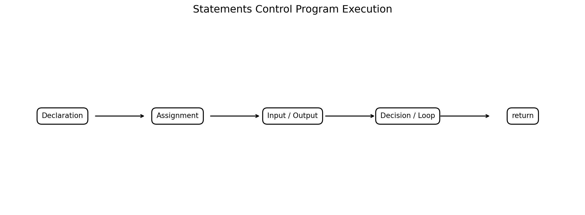
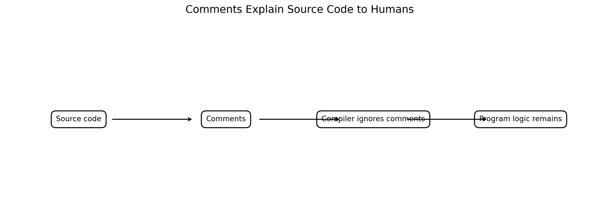
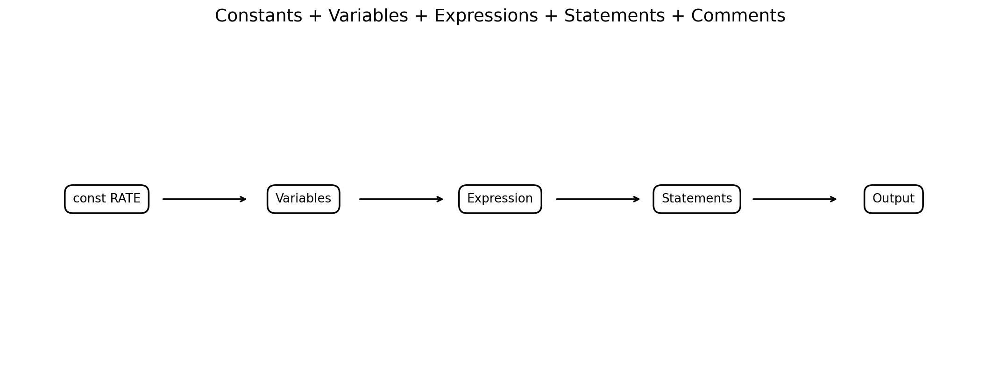

# :classical_building: Problem Solving Using Programming - B.Tech-IT, IIIT Allahabad
## Unit 1: Introduction to Computers and Hardware
* ### Current Topic: Constants and Variables, Basic Data Types, Assignment Statements, Expressions, Statements and Comments in C
* **Purpose:** introductory programming students
---

---
## 👥 Instructor Information
* **Edited by Instructor:** [Dr. Mohammed Javed](https://sites.google.com/site/mohammedjaved2016/)
* **Email:** javed@iiita.ac.in
* **Senior Teaching Assistants:** Mr. Subrata Pramanik (pmm2024003@iiita.ac.in)
---
## 🎯 Learning Objectives

After studying this chapter, students should be able to:

1. Explain constants and variables in C.
2. Distinguish between a constant value and a variable object.
3. Identify valid C identifiers.
4. Explain the purpose of basic data types.
5. Use `char`, `int`, `float`, `double`, and `_Bool`.
6. Declare and initialize variables.
7. Use assignment statements correctly.
8. Construct arithmetic and relational expressions.
9. Explain operator precedence and the role of parentheses.
10. Distinguish expressions from statements.
11. Identify common C statement categories.
12. Write useful single-line and multi-line comments.
13. Select suitable data types for simple engineering problems.
14. Compile and run small C programs and interpret their output.

---

# 1. Introduction

A C program is constructed from several fundamental elements.



**Figure 1. Basic building blocks introduced in this chapter.**

At an introductory level, it is useful to think of a program as a collection of:

```text
Constants
   +
Variables
   +
Data Types
   +
Expressions
   +
Statements
   +
Comments
```

These concepts are the foundation for later topics such as:

- arrays,
- functions,
- pointers,
- structures,
- files,
- dynamic memory,
- algorithms,
- data structures.

The C language reference organizes these ideas under concepts such as types, declarations, expressions, statements, initialization and comments. citeturn0search1turn0search4

---

# 2. Constants

A **constant** is a value that is written as a fixed value in a program or otherwise treated as not being changed through the intended program logic.

Examples of literal constants include:

```c
10
25.5
'A'
"Engineering"
```

Examples:

```c
int count = 10;
float temperature = 25.5f;
char grade = 'A';
```

Here:

```text
10      → integer constant
25.5f   → floating constant
'A'     → character constant
```

C supports integer, floating and character constants among its literal forms. citeturn0search2

---

# 3. Integer Constants

Examples:

```c
10
0
-25
1000
```

Integer constants can also be written in other integer bases.

For example:

```c
25       /* decimal */
031      /* octal representation of decimal 25 */
0x19     /* hexadecimal representation of decimal 25 */
```

For beginner programs, decimal notation is usually the easiest to read.

---

# 4. Floating-Point Constants

Examples:

```c
3.14
25.5
-0.75
```

A suffix can indicate a particular floating type:

```c
3.14f
3.14
3.14L
```

These correspond to `float`, `double`, and `long double` forms respectively.

For example:

```c
float pi1 = 3.14f;
double pi2 = 3.14;
```

---

# 5. Character Constants

A character constant is written using single quotation marks:

```c
'A'
'b'
'7'
'#'
```

Example:

```c
char grade = 'A';
```

Do not confuse:

```c
'A'
```

with:

```c
"A"
```

The first is a character constant; the second is a string literal.

---

# 6. String Literals

Strings are written using double quotation marks:

```c
"Hello"
"Computer Engineering"
"Enter your age:"
```

Example:

```c
printf("Hello, Engineering Students!\n");
```

Output:

```text
Hello, Engineering Students!
```

String literals are different from character constants.

```text
'A'       → character constant
"A"       → string literal
```

---

# 7. Named Constants Using `const`

A variable can be declared with the `const` qualifier:

```c
const double PI = 3.141592653589793;
```

The program should not modify `PI` through that object.

Example:

```c
#include <stdio.h>

int main(void)
{
    const double PI = 3.141592653589793;
    double radius = 5.0;

    double area = PI * radius * radius;

    printf("Area = %.2f\n", area);

    return 0;
}
```

Output:

```text
Area = 78.54
```

This style is often clearer than repeatedly writing a literal value.

---

# 8. Constants with `#define`

Another traditional C technique is:

```c
#define MAX_MARKS 100
```

Example:

```c
#include <stdio.h>

#define MAX_MARKS 100

int main(void)
{
    printf("Maximum marks = %d\n", MAX_MARKS);

    return 0;
}
```

Output:

```text
Maximum marks = 100
```

`#define` is a preprocessor directive. It is different from declaring a `const` object.

For introductory programming, students should understand both forms and use them deliberately.

---

# 9. `const` vs `#define`

| Feature | `const` object | `#define` macro |
|---|---|---|
| Example | `const int N = 10;` | `#define N 10` |
| Handled by | C compiler | Preprocessor |
| Has a C type | Yes | Macro replacement has no object type itself |
| Has object storage semantics | Yes, depending on declaration | No |
| Useful for | Typed constants/objects | Textual preprocessing |
| Can be inspected by debugger as an object | Generally yes | Not as a run-time object |

For many ordinary constant values in C programs, a typed `const` object is easy to understand and maintain.

---

# 10. Variables

A **variable** is an object whose stored value can normally be changed during program execution.

Example:

```c
int age = 18;
```

The variable:

```text
age
```

has:

```text
Name  → age
Type  → int
Value → 18
```

Later:

```c
age = 19;
```

The stored value changes.

---

# 11. A Simple Memory Model



**Figure 2. Conceptual relationship between variable name, type, value and memory.**

Students can think of:

```c
int count = 25;
```

as an object identified by the name `count`, with an `int` type and a stored value of `25`.

The actual memory representation and address details are handled by the implementation and operating environment.

---

# 12. Declaration and Initialization

Declaration:

```c
int count;
```

This introduces `count` as an `int` object.

Initialization:

```c
int count = 10;
```

This declares the variable and gives it an initial value.

Example:

```c
int length = 10;
int width = 5;
```

The two variables can then participate in expressions.

---

# 13. Uninitialized Local Variables

Be careful:

```c
int x;
printf("%d\n", x);
```

For an automatic local variable, reading an indeterminate value like this is not a safe way to obtain a meaningful integer value.

Instead initialize it:

```c
int x = 0;
```

Good practice:

```c
int total = 0;
int count = 0;
double average = 0.0;
```

---

# 14. Rules for C Identifiers

Identifiers are names used for program entities such as variables and functions.

Examples:

```c
age
total_marks
temperature
studentCount
```

Common rules include:

- letters, digits and underscore can be used;
- an identifier cannot begin with a digit;
- C is case-sensitive;
- keywords cannot be used as ordinary identifiers.

Valid:

```c
total
_total
marks2
student_count
```

Invalid:

```c
2marks
student-name
float
```

---

# 15. C Is Case-Sensitive

These are different identifiers:

```c
count
Count
COUNT
```

Example:

```c
int count = 10;
int Count = 20;

printf("%d %d\n", count, Count);
```

Output:

```text
10 20
```

Use a consistent naming convention in engineering projects.

---

# 16. Basic Data Types

C provides several fundamental types.



**Figure 3. Common basic data types used in introductory C programming.**

Important types include:

```text
char
int
float
double
_Bool
```

C also provides other types and type modifiers, which are studied later.

---

# 17. `char`

`char` is used for character data and occupies one byte of storage by definition, although the number of bits in a byte is implementation-defined.

Example:

```c
#include <stdio.h>

int main(void)
{
    char grade = 'A';

    printf("Grade = %c\n", grade);

    return 0;
}
```

Output:

```text
Grade = A
```

---

# 18. `int`

`int` is commonly used for integer values.

Example:

```c
#include <stdio.h>

int main(void)
{
    int students = 60;

    printf("Students = %d\n", students);

    return 0;
}
```

Output:

```text
Students = 60
```

Typical applications:

- counters,
- quantities,
- indices,
- marks,
- discrete measurements.

---

# 19. `float`

`float` is used for single-precision floating-point values.

Example:

```c
#include <stdio.h>

int main(void)
{
    float temperature = 36.5f;

    printf("Temperature = %.1f\n", temperature);

    return 0;
}
```

Output:

```text
Temperature = 36.5
```

The suffix `f` is useful when explicitly writing a `float` literal.

---

# 20. `double`

`double` provides floating-point representation with at least as much precision as `float` and commonly more.

Example:

```c
#include <stdio.h>

int main(void)
{
    double distance = 12345.6789;

    printf("Distance = %.4f\n", distance);

    return 0;
}
```

Output:

```text
Distance = 12345.6789
```

`double` is often a good default for engineering calculations when the required precision is greater than that of `float`.

---

# 21. `_Bool`

C provides `_Bool` for Boolean values.

Example:

```c
#include <stdio.h>

int main(void)
{
    _Bool passed = 1;

    printf("Passed = %d\n", passed);

    return 0;
}
```

Output:

```text
Passed = 1
```

With `<stdbool.h>` in C versions that support it, the familiar `bool`, `true` and `false` notation can be used:

```c
#include <stdio.h>
#include <stdbool.h>

int main(void)
{
    bool passed = true;

    printf("Passed = %d\n", passed);

    return 0;
}
```

Output:

```text
Passed = 1
```

---

# 22. Choosing a Data Type

Consider:

```text
Number of students → int
Temperature         → double
Grade letter        → char
Pass/fail status    → bool / _Bool
Distance            → double
```

A data type should reflect the kind of data and the required range/precision.

---

# 23. Type Size Is Implementation-Dependent

Students should not assume that every C implementation has exactly the same size for every type.

For example:

```c
printf("%zu\n", sizeof(int));
```

can be used to inspect the size of `int` on the current implementation.

Example program:

```c
#include <stdio.h>

int main(void)
{
    printf("char   = %zu byte(s)\n", sizeof(char));
    printf("int    = %zu byte(s)\n", sizeof(int));
    printf("float  = %zu byte(s)\n", sizeof(float));
    printf("double = %zu byte(s)\n", sizeof(double));

    return 0;
}
```

The exact output depends on the compiler and target platform.

---

# 24. Assignment Statements

Assignment stores a value in an object.

Basic form:

```c
variable = expression;
```

Example:

```c
x = 10;
```

The right-hand side is evaluated and its result is assigned to the left-hand side.



**Figure 4. Conceptual flow of an assignment statement.**

---

# 25. Simple Assignment

```c
int x;

x = 10;
```

After the assignment:

```text
x → 10
```

Another assignment can change it:

```c
x = 25;
```

Now:

```text
x → 25
```

Assignment is therefore different from mathematical equality.

---

# 26. Assignment Is an Expression

In C, assignment itself is an expression.

For example:

```c
x = 10;
```

has an assignment expression followed by `;`.

This makes expressions such as:

```c
a = b = 5;
```

possible.

The assignment operators are part of C's expression syntax. citeturn0search2

For beginners, however, separate assignments are usually easier to read:

```c
b = 5;
a = b;
```

---

# 27. Compound Assignment Operators

C provides operators such as:

```c
+=
-=
*=
/=
%=
```

Example:

```c
int x = 10;

x += 5;
```

Equivalent to:

```c
x = x + 5;
```

Result:

```text
x = 15
```

Another example:

```c
int balance = 100;

balance -= 30;
```

Result:

```text
balance = 70
```

---

# 28. Arithmetic Expressions

An expression combines operands and operators to produce a computation or value. citeturn0search2

Examples:

```c
a + b
a - b
a * b
a / b
a % b
```

Example:

```c
int a = 20;
int b = 6;

int sum = a + b;
int difference = a - b;
int product = a * b;
int quotient = a / b;
int remainder = a % b;
```

---

# 29. Integer Division

Consider:

```c
int result = 7 / 2;
```

Both operands are integers, so the result is integer division:

```text
result = 3
```

Example:

```c
#include <stdio.h>

int main(void)
{
    int result = 7 / 2;

    printf("Result = %d\n", result);

    return 0;
}
```

Output:

```text
Result = 3
```

---

# 30. Floating-Point Division

To obtain a fractional result:

```c
double result = 7.0 / 2.0;
```

Example:

```c
#include <stdio.h>

int main(void)
{
    double result = 7.0 / 2.0;

    printf("Result = %.2f\n", result);

    return 0;
}
```

Output:

```text
Result = 3.50
```

This distinction is extremely important in engineering calculations.

---

# 31. Type Conversion in Expressions

Consider:

```c
int total = 85;
int count = 2;

double average = (double) total / count;
```

The cast:

```c
(double) total
```

converts `total` to `double` for the expression.

Output:

```text
42.50
```

Example:

```c
#include <stdio.h>

int main(void)
{
    int total = 85;
    int count = 2;

    double average = (double) total / count;

    printf("Average = %.2f\n", average);

    return 0;
}
```

---

# 32. Operator Precedence

Consider:

```c
int result = 10 + 5 * 2;
```

Multiplication has higher precedence than addition, so:

```text
5 * 2 = 10
10 + 10 = 20
```

Output:

```text
20
```

Use parentheses when they improve clarity:

```c
int result = 10 + (5 * 2);
```

---

# 33. Parentheses Improve Clarity

Compare:

```c
area = length * width + border;
```

with:

```c
area = (length * width) + border;
```

The second version makes the intended grouping obvious.

For complex engineering formulas, parentheses reduce ambiguity and make code easier to review.

---

# 34. Expression Example — Rectangle Area

Mathematical formula:

\[
A = L \times W
\]

C implementation:

```c
double area = length * width;
```

Complete program:

```c
#include <stdio.h>

int main(void)
{
    double length = 10.0;
    double width = 5.0;

    double area = length * width;

    printf("Area = %.2f square units\n", area);

    return 0;
}
```

Output:

```text
Area = 50.00 square units
```

---

# 35. Expression Example — Engineering Formula

Suppose:

\[
V = IR
\]

where:

- `V` = voltage,
- `I` = current,
- `R` = resistance.

C program:

```c
#include <stdio.h>

int main(void)
{
    double current = 2.0;
    double resistance = 10.0;

    double voltage = current * resistance;

    printf("Voltage = %.2f V\n", voltage);

    return 0;
}
```

Output:

```text
Voltage = 20.00 V
```

This illustrates how mathematical formulas become C expressions.

---

# 36. Expressions and Operators



**Figure 5. Conceptual model of expression evaluation.**

An expression can contain:

```text
Operands
+
Operators
=
Computed value
```

Example:

```c
result = a + b * c;
```

Here:

```text
a, b, c  → operands
+, *      → operators
a + b*c   → expression
result =  → assignment
```

---

# 37. Relational Expressions

Relational operators compare values:

```c
<
>
<=
>=
==
!=
```

Example:

```c
age >= 18
```

The result can be used in decision-making.

Example:

```c
if (age >= 18)
{
    printf("Adult\n");
}
```

---

# 38. Logical Expressions

Common logical operators:

```c
&&    logical AND
||    logical OR
!     logical NOT
```

Example:

```c
if (marks >= 40 && attendance >= 75)
{
    printf("Eligible\n");
}
```

The expression combines two conditions.

---

# 39. Statements

A **statement** is an executable or control construct that forms part of a C program.

C includes categories such as:

- expression statements,
- compound statements,
- selection statements,
- iteration statements,
- jump statements. citeturn0search8



**Figure 6. Examples of statements encountered in introductory C programming.**

---

# 40. Expression Statements

An expression followed by a semicolon forms an expression statement.

Examples:

```c
x = 10;
```

```c
sum = a + b;
```

```c
printf("Hello\n");
```

```c
i++;
```

The semicolon marks the end of the statement.

---

# 41. Declaration vs Statement

A declaration introduces an identifier and its properties.

Example:

```c
int x;
```

An assignment is an expression statement:

```c
x = 10;
```

In introductory programming, students often call both "lines of code," but their language roles are different.

C's formal language rules distinguish declarations from statements. citeturn0search8turn0search10

---

# 42. Compound Statements

A block enclosed by braces is a compound statement:

```c
{
    int x = 10;
    printf("%d\n", x);
}
```

A function body is also a compound statement.

Example:

```c
int main(void)
{
    int x = 10;

    printf("%d\n", x);

    return 0;
}
```

---

# 43. Selection Statements

Selection statements choose between alternatives.

### `if`

```c
if (temperature > 30)
{
    printf("Hot\n");
}
```

### `if ... else`

```c
if (marks >= 40)
{
    printf("Pass\n");
}
else
{
    printf("Fail\n");
}
```

### `switch`

```c
switch (choice)
{
    case 1:
        printf("Add\n");
        break;

    case 2:
        printf("Subtract\n");
        break;

    default:
        printf("Invalid choice\n");
}
```

---

# 44. Iteration Statements

Iteration statements repeat operations.

### `for`

```c
for (int i = 1; i <= 5; i++)
{
    printf("%d\n", i);
}
```

Output:

```text
1
2
3
4
5
```

### `while`

```c
while (count < 5)
{
    count++;
}
```

### `do ... while`

```c
do
{
    count++;
}
while (count < 5);
```

---

# 45. Jump Statements

Common jump statements include:

```c
break;
continue;
return;
```

Example:

```c
for (int i = 1; i <= 10; i++)
{
    if (i == 5)
    {
        break;
    }

    printf("%d ", i);
}
```

Output:

```text
1 2 3 4
```

---

# 46. `return` Statement

A function can return a value.

Example:

```c
int square(int x)
{
    return x * x;
}
```

Then:

```c
int result = square(5);
```

Result:

```text
25
```

In:

```c
int main(void)
{
    return 0;
}
```

the `return 0;` indicates successful termination to the host environment in a hosted C implementation.

---

# 47. Comments

Comments are explanatory text included in source code for human readers.



**Figure 7. Comments communicate intent without forming executable program logic.**

C supports two common comment styles.

### Single-line comment

```c
// Calculate the area
```

### Multi-line comment

```c
/*
   Calculate the area
   of a rectangle.
*/
```

Comments are ignored as comments during translation; they do not become executable statements.

---

# 48. Single-Line Comments

Example:

```c
int radius = 5;  // radius in centimeters
```

Another example:

```c
area = PI * radius * radius;  // circle area
```

A good comment adds useful context.

---

# 49. Multi-Line Comments

Example:

```c
/*
 * Program: Temperature Converter
 * Purpose: Convert Celsius to Fahrenheit.
 */
```

These are useful for:

- file headers,
- function descriptions,
- algorithm explanations,
- assumptions,
- important engineering constraints.

---

# 50. Good vs Poor Comments

Poor:

```c
x = x + 1;  // add 1 to x
```

Better:

```c
x++;  // move to the next sensor sample
```

Even better when the purpose is non-obvious:

```c
x++;  // Skip the calibration record before processing measurements.
```

The goal is to explain **why**, not simply repeat **what** the code says.

---

# 51. Complete Example



**Figure 8. How the concepts combine in one small engineering program.**

```c
#include <stdio.h>

int main(void)
{
    const double PI = 3.141592653589793;
    double radius = 5.0;

    // Calculate the area of a circle.
    double area = PI * radius * radius;

    printf("Radius = %.2f\n", radius);
    printf("Area   = %.2f\n", area);

    return 0;
}
```

Output:

```text
Radius = 5.00
Area   = 78.54
```

This one program demonstrates:

```text
const       → named constant
double      → data type
radius      → variable
=           → assignment
PI * r * r  → expression
printf(...) → expression statement
// ...      → comment
return 0;   → jump/return statement
```

---

# 52. Engineering Example — Simple Electrical Calculation

Suppose:

\[
P = VI
\]

where:

- `P` = power,
- `V` = voltage,
- `I` = current.

```c
#include <stdio.h>

int main(void)
{
    double voltage = 230.0;
    double current = 2.5;

    double power = voltage * current;

    printf("Voltage = %.2f V\n", voltage);
    printf("Current = %.2f A\n", current);
    printf("Power   = %.2f W\n", power);

    return 0;
}
```

Output:

```text
Voltage = 230.00 V
Current = 2.50 A
Power   = 575.00 W
```

---

# 53. Engineering Example — Simple Temperature Conversion

Formula:

\[
F = \frac{9}{5}C + 32
\]

C program:

```c
#include <stdio.h>

int main(void)
{
    double celsius = 25.0;
    double fahrenheit = (9.0 / 5.0) * celsius + 32.0;

    printf("Celsius    = %.2f\n", celsius);
    printf("Fahrenheit = %.2f\n", fahrenheit);

    return 0;
}
```

Output:

```text
Celsius    = 25.00
Fahrenheit = 77.00
```

Notice the use of:

```c
9.0 / 5.0
```

rather than:

```c
9 / 5
```

because the latter performs integer division.

---

# 54. Engineering Example — Average of Measurements

```c
#include <stdio.h>

int main(void)
{
    double m1 = 10.5;
    double m2 = 11.2;
    double m3 = 10.8;

    double average = (m1 + m2 + m3) / 3.0;

    printf("Average = %.2f\n", average);

    return 0;
}
```

Output:

```text
Average = 10.83
```

---

# 55. Assignment and Increment

Consider:

```c
int count = 0;

count = count + 1;
```

The result is:

```text
count = 1
```

C also provides:

```c
count++;
```

Both express an increment, although they participate differently in larger expressions.

For beginners, use the form that makes the intention clearest.

---

# 56. Multiple Assignments

This is legal:

```c
int a, b, c;

a = b = c = 10;
```

After execution:

```text
a = 10
b = 10
c = 10
```

However, when teaching or writing beginner-level engineering code, separate statements may be easier to understand:

```c
c = 10;
b = c;
a = b;
```

---

# 57. Common Assignment Mistake

Students often confuse:

```c
=
```

with:

```c
==
```

### Assignment

```c
x = 10;
```

### Equality comparison

```c
x == 10
```

For example:

```c
if (x == 10)
{
    printf("x is 10\n");
}
```

Remember:

```text
=   → assign
==  → compare for equality
```

---

# 58. Common Data-Type Mistake

Incorrect:

```c
int average = 7 / 2;
```

Result:

```text
average = 3
```

If a fractional result is required:

```c
double average = 7.0 / 2.0;
```

Result:

```text
average = 3.5
```

Always consider the types of operands in an expression.

---

# 59. Common Constant Mistake

Avoid unexplained "magic numbers":

```c
if (marks >= 40)
```

If `40` represents a meaningful engineering requirement, a named constant can improve readability:

```c
const int PASS_MARK = 40;

if (marks >= PASS_MARK)
{
    printf("Pass\n");
}
```

Now the meaning is clearer.

---

# 60. Common Variable Naming Mistakes

Avoid unclear names:

```c
int x;
int y;
int z;
```

when the variables have meaningful engineering roles.

Prefer:

```c
double voltage;
double current;
double resistance;
```

Compare:

```c
p = v * i;
```

with:

```c
power = voltage * current;
```

The second version communicates the engineering concept more clearly.

---

# 61. Integrated Example — Student Result

```c
#include <stdio.h>

int main(void)
{
    const int PASS_MARK = 40;

    int marks = 75;
    int passed;

    passed = marks >= PASS_MARK;

    if (passed)
    {
        printf("Marks = %d\n", marks);
        printf("Result = Pass\n");
    }
    else
    {
        printf("Marks = %d\n", marks);
        printf("Result = Fail\n");
    }

    return 0;
}
```

Output:

```text
Marks = 75
Result = Pass
```

Concepts used:

- `const`
- `int`
- variables
- assignment
- relational expression
- `if ... else`
- comments
- output statements

---

# 62. A Complete Program Analysis

Consider:

```c
#include <stdio.h>

int main(void)
{
    const double RATE = 0.18;
    double price = 1000.0;

    // Calculate tax and final amount.
    double tax = price * RATE;
    double total = price + tax;

    printf("Price = %.2f\n", price);
    printf("Tax   = %.2f\n", tax);
    printf("Total = %.2f\n", total);

    return 0;
}
```

Output:

```text
Price = 1000.00
Tax   = 180.00
Total = 1180.00
```

### Identify the elements

| Code | Concept |
|---|---|
| `RATE` | Named constant |
| `price` | Variable |
| `double` | Data type |
| `price * RATE` | Expression |
| `tax = ...` | Assignment |
| `printf(...)` | Expression statement |
| `// ...` | Comment |
| `return 0;` | Return statement |

---

# 63. Program Design Pattern

For simple numerical engineering problems, a useful pattern is:

```text
Declare constants
       ↓
Declare variables
       ↓
Initialize / read inputs
       ↓
Construct expressions
       ↓
Store results
       ↓
Display results
       ↓
Return
```

Example:

```c
const double G = 9.81;

double mass = 10.0;
double force;

force = mass * G;

printf("Force = %.2f N\n", force);
```

Output:

```text
Force = 98.10 N
```

---

# 64. Summary Table

| Concept | Example | Purpose |
|---|---|---|
| Integer constant | `25` | Fixed integer value |
| Floating constant | `3.14` | Fixed floating value |
| Character constant | `'A'` | Character value |
| `const` object | `const int N = 10;` | Named non-modifiable object |
| Variable | `int count;` | Stores changeable data |
| `int` | `int age;` | Integer data |
| `char` | `char grade;` | Character data |
| `float` | `float temp;` | Floating-point data |
| `double` | `double distance;` | Floating-point data |
| `_Bool` / `bool` | `bool passed;` | Boolean data |
| Assignment | `x = 10;` | Stores a value |
| Expression | `a + b * c` | Computes a result |
| Statement | `x = x + 1;` | Performs an operation |
| Comment | `// explanation` | Documents source code |

---

# 65. Practical Programming Guidelines

### Guideline 1
Choose meaningful variable names.

### Guideline 2
Choose a data type that represents the data appropriately.

### Guideline 3
Initialize variables before using their values.

### Guideline 4
Use parentheses when they make an expression easier to understand.

### Guideline 5
Avoid unexplained magic numbers.

### Guideline 6
Use comments to explain important intent or assumptions.

### Guideline 7
Do not write unnecessary comments that simply repeat the code.

### Guideline 8
Be careful with integer division.

### Guideline 9
Distinguish assignment `=` from equality comparison `==`.

### Guideline 10
Compile with warnings enabled during development.

---

# 66. Laboratory Exercise 1 — Variables and Data Types

Write a C program to store:

```text
Student age
Student grade
Average marks
Pass/fail status
```

Use suitable data types.

Display all values.

Example output:

```text
Age          = 19
Grade        = A
Average      = 82.50
Passed       = 1
```

---

# 67. Laboratory Exercise 2 — Engineering Formula

Write a program to calculate:

\[
F = ma
\]

Use:

```text
mass = 25 kg
acceleration = 9.8 m/s²
```

Expected:

```text
Force = 245.00 N
```

Use `double` for the physical quantities.

---

# 68. Laboratory Exercise 3 — Expression Evaluation

Predict the output before running:

```c
#include <stdio.h>

int main(void)
{
    int a = 10;
    int b = 3;

    printf("%d\n", a + b * 2);
    printf("%d\n", (a + b) * 2);

    return 0;
}
```

Expected output:

```text
16
26
```

Explain why the two expressions differ.

---

# 69. Laboratory Exercise 4 — Temperature Conversion

Write a program to convert Celsius to Fahrenheit.

Test:

```text
0 °C
25 °C
100 °C
-40 °C
```

Verify:

```text
0 °C    → 32 °F
25 °C   → 77 °F
100 °C  → 212 °F
-40 °C  → -40 °F
```

---

# 70. Laboratory Exercise 5 — Commenting

Take a 20–30 line C program and add:

1. file-level description,
2. comments for important variables,
3. comments for non-obvious calculations,
4. comments explaining important assumptions.

Then remove unnecessary comments and discuss which version is easier to maintain.

---

# 71. Mini Project — Engineering Calculator

Create a simple engineering calculator that computes at least three quantities, such as:

```text
Area
Force
Power
Temperature conversion
```

Requirements:

- use `const` where appropriate;
- use meaningful variable names;
- use appropriate data types;
- use expressions for formulas;
- use comments for assumptions;
- display formatted output.

Suggested structure:

```text
Input
  ↓
Variables
  ↓
Expressions
  ↓
Results
  ↓
Output
```

---

# 72. Debugging Exercise

Find the problems in:

```c
#include <stdio.h>

int main(void)
{
    const int PASS = 40;
    int marks;

    marks = 40;

    if (marks = PASS)
    {
        printf("Pass\n");
    }

    return 0;
}
```

The intended comparison is:

```c
if (marks == PASS)
```

This example demonstrates why understanding assignment and comparison is essential.

---

# 73. Viva Questions

### Q1. What is a variable?

An object whose stored value can normally be changed during program execution.

### Q2. What is a constant?

A fixed value or a value treated as non-modifiable for the intended program logic.

### Q3. What is a data type?

A type that specifies the kind of value an object can represent and affects operations and representation.

### Q4. What is assignment?

The operation of evaluating a right-hand expression and storing its value in the designated object.

### Q5. What is an expression?

A sequence of operators and operands that specifies a computation or other value-producing operation. citeturn0search2

### Q6. What is a statement?

A language construct that participates in the execution/control flow of a C program. citeturn0search8

### Q7. Difference between `=` and `==`?

`=` performs assignment; `==` compares two values for equality.

### Q8. What is integer division?

Division where the operands are integer types, producing an integer result after the appropriate integer arithmetic rules.

### Q9. Why use `double` in engineering calculations?

It commonly provides more floating-point precision than `float`, which can be useful for numerical calculations.

### Q10. What is a comment?

Source text intended for human readers rather than executable program logic.

---

# 74. Review Questions

## Short Answer

1. Define a constant.
2. Define a variable.
3. What is a data type?
4. List five basic C data types.
5. What is an assignment statement?
6. What is an expression?
7. What is a statement?
8. What is a comment?
9. Differentiate `=` and `==`.
10. What is integer division?
11. What is the difference between `'A'` and `"A"`?
12. Why are meaningful variable names important?
13. What is the purpose of `const`?
14. Why are parentheses useful in expressions?
15. Why should local variables be initialized before use?

## Descriptive Questions

1. Explain constants and variables with C programs.
2. Explain the basic C data types with examples.
3. Explain assignment statements and compound assignment operators.
4. Explain arithmetic expressions with examples.
5. Explain operator precedence.
6. Explain integer and floating-point division.
7. Explain the different categories of statements in C.
8. Explain comments and good commenting practices.
9. Develop an engineering calculation program using constants, variables, expressions and statements.
10. Explain the difference between declarations, expressions and statements.

---

# 75. Key Takeaways

Remember:

```text
Constant
→ fixed value / non-modifiable object as appropriate

Variable
→ named object whose stored value can change

Data Type
→ describes the kind of data and its representation/operations

Assignment
→ stores a computed value in an object

Expression
→ combines operands/operators to specify computation

Statement
→ forms an executable/control construct

Comment
→ communicates intent to human readers
```

A simple C program often follows:

```text
Constants
   ↓
Variables
   ↓
Input / Initialization
   ↓
Expressions
   ↓
Assignments
   ↓
Statements
   ↓
Output
```

These are the fundamental building blocks from which larger C programs are constructed.

---

# References and Further Reading

1. **cppreference — C Language:** overview of C language constructs, including basic concepts, types, expressions, statements and comments.  
   https://en.cppreference.com/c/language

2. **cppreference — Expressions:** constants, literals, operators, assignment, arithmetic expressions, conversions and precedence.  
   https://en.cppreference.com/c/language/expressions

3. **cppreference — Statements:** expression statements, compound statements, selection, iteration and jump statements.  
   https://en.cppreference.com/c/language/statements

4. **cppreference — Declarations:** declarations, identifiers, types and initialization.  
   https://en.cppreference.com/c/language/declarations

5. **ISO/IEC 9899 C Standard:** authoritative language specification for C.

---

## Suggested GitHub Folder Structure

```text
c-constants-variables-expressions/
│
├── README.md
├── c_constants_variables_expressions.md
│
└── figures/
    ├── 01_program_building_blocks.png
    ├── 02_variable_memory_model.png
    ├── 03_data_type_map.png
    ├── 04_assignment_flow.png
    ├── 05_expression_evaluation.png
    ├── 06_statement_flow.png
    ├── 07_comments_source_code.png
    └── 08_complete_example.png
```
