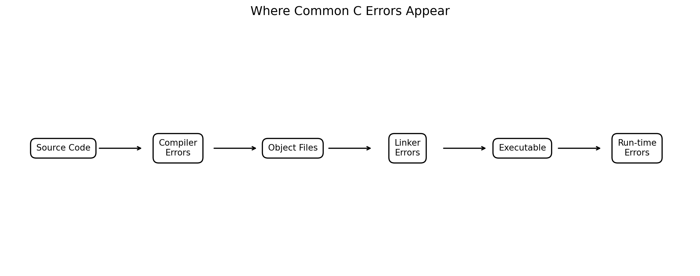
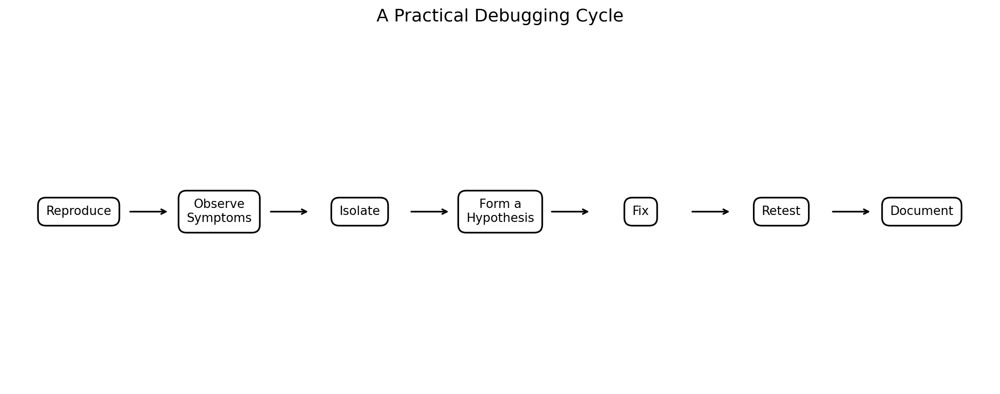
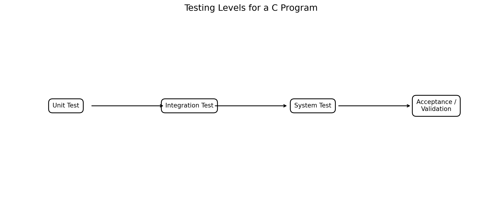
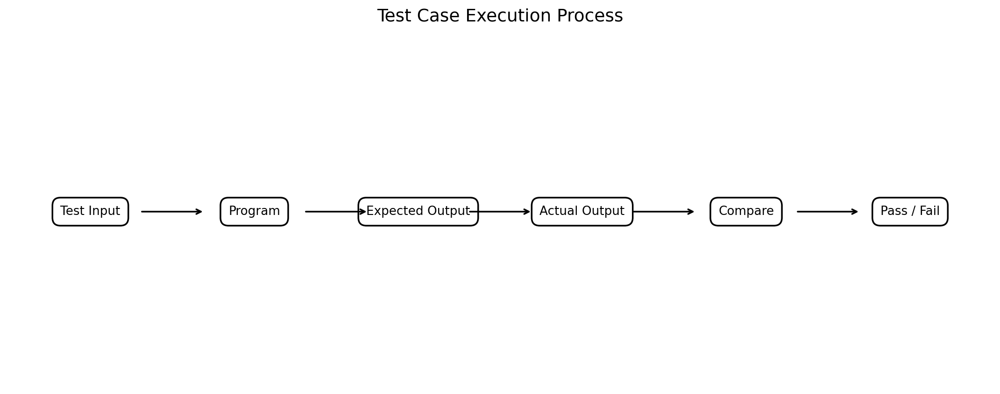
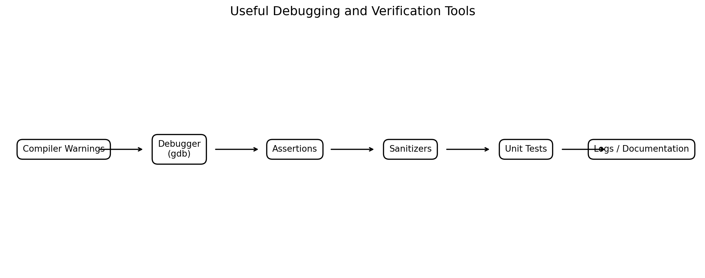
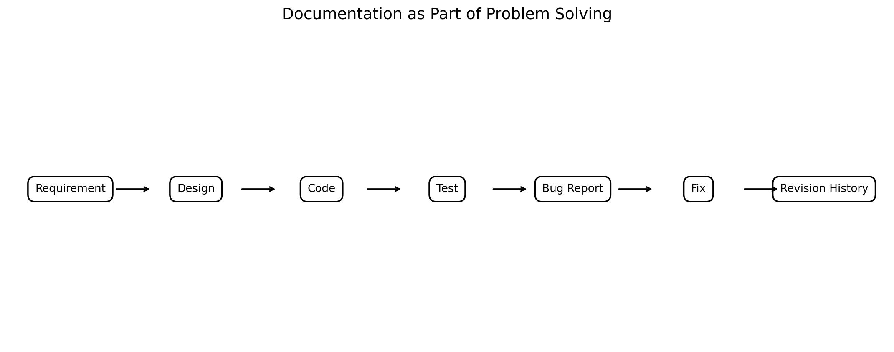
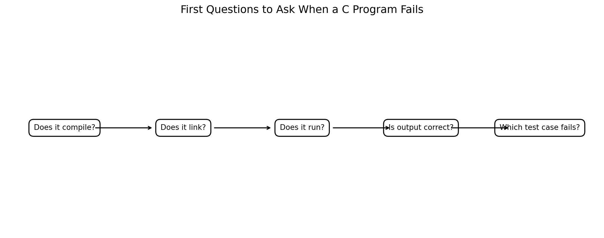
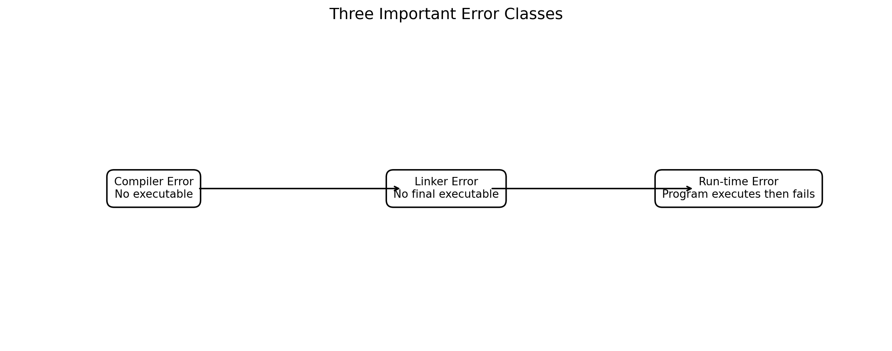

# :classical_building: Problem Solving Using Programming - B.Tech-IT, IIIT Allahabad
## Unit 1: Introduction to Computers and Hardware
* ### Current Topic: Debugging Cases, Testing Cases and Documentation in C
* **Purpose:** Introductory C Programming / Problem Solving - Compiler Errors, Linker Errors and Run-Time Errors
---

---
## 👥 Instructor Information
* **Edited by Instructor:** [Dr. Mohammed Javed](https://sites.google.com/site/mohammedjaved2016/)
* **Email:** javed@iiita.ac.in
* **Senior Teaching Assistants:** Mr. Subrata Pramanik (pmm2024003@iiita.ac.in)
---
## 🎯 Learning Objectives

After completing this unit, students should be able to:

1. Explain why debugging, testing and documentation are essential parts of programming.
2. Distinguish compiler errors, linker errors and run-time errors.
3. Read and interpret compiler and linker diagnostics.
4. Debug syntax, declaration, type and semantic mistakes in C programs.
5. Identify common causes of linker errors.
6. Identify common run-time failures such as division by zero, invalid memory access and out-of-bounds access.
7. Design useful test cases using normal, boundary and invalid inputs.
8. Distinguish expected output from actual output.
9. Use compiler warnings and debugging tools effectively.
10. Use assertions and sanitizers as aids to finding defects.
11. Write concise bug reports and test records.
12. Document programs using comments, function descriptions, usage instructions and revision history.
13. Follow a systematic debugging cycle rather than changing code randomly.

---

# 1. Introduction

Writing a C program is only one part of solving a programming problem.

A complete engineering solution normally involves:

```text
Understand the problem
        ↓
Design an algorithm
        ↓
Write the program
        ↓
Compile
        ↓
Link
        ↓
Run
        ↓
Test
        ↓
Debug
        ↓
Document
        ↓
Maintain / Improve
```

A program can fail at several different stages.

For example:

- The **compiler** may reject the source code.
- The **linker** may fail to build the final executable.
- The program may run but produce an incorrect answer.
- The program may terminate unexpectedly.
- The program may access invalid memory.
- The program may appear to work for normal input but fail for boundary values.

Therefore:

> **Debugging, testing and documentation are engineering activities, not optional tasks performed only after programming.**

---

# 2. What Is a Program Defect?

A **defect** is a mistake or flaw in software that can cause incorrect behavior.

Examples include:

```c
total = price * quantity;
```

when the intended formula was:

```c
total = price + tax;
```

or:

```c
if (marks > 40)
```

when the requirement says:

```text
marks >= 40
```

A defect may exist even when the program compiles successfully.

---

# 3. Error, Defect, Failure and Bug

These terms are often used informally as synonyms, but they can be distinguished.

| Term | Meaning |
|---|---|
| Error | Human mistake in reasoning, coding or understanding |
| Defect | Fault introduced into the software |
| Bug | Informal term for a software defect |
| Failure | Observable incorrect behavior of a program |
| Debugging | Process of finding the cause of a defect and correcting it |

Example:

```text
Requirement:
A student scoring 40 or more should pass.

Program:
if (marks > 40)

Input:
marks = 40

Result:
Program says "Fail"

```

The incorrect comparison is a **defect**.

The incorrect output is an observable **failure**.

---

# 4. Where Do Errors Occur?



**Figure 1. Common locations of compiler, linker and run-time errors.**

A simplified C development pipeline is:

```text
Source Code
    ↓
Preprocessing / Compilation
    ↓
Object Code
    ↓
Linking
    ↓
Executable
    ↓
Execution
```

Errors can appear at different stages.

---

# 5. Three Important Error Classes

| Error class | Typical stage | Does executable normally get produced? | Example |
|---|---|---:|---|
| Compiler error | Compilation | No | Missing `;`, undeclared identifier |
| Linker error | Linking | No final executable | Undefined function |
| Run-time error | Execution | Yes | Invalid memory access |
| Logic error | Execution/testing | Yes | Wrong formula or condition |

The distinction is useful because the **location of the failure suggests where to investigate first**.

---

# 6. Compiler Errors

A **compiler error** occurs when the compiler cannot successfully translate the source code into an object file or otherwise diagnose a condition that prevents compilation.

Typical causes include:

- syntax errors,
- missing semicolons,
- unmatched braces,
- undeclared identifiers,
- incompatible declarations,
- invalid expressions,
- incorrect use of operators,
- invalid types or conversions.

GCC distinguishes errors from warnings: errors prevent successful compilation, while warnings identify suspicious or unusual constructs for which compilation may still continue. citeturn0search0

---

# 7. Compiler Error Case 1 — Missing Semicolon

Consider:

```c
#include <stdio.h>

int main(void)
{
    int x = 10
    printf("x = %d\n", x);

    return 0;
}
```

The statement:

```c
int x = 10
```

is missing a semicolon.

### Typical compiler diagnostic

A GCC diagnostic may resemble:

```text
error: expected ',' or ';' before 'printf'
```

The exact wording and line number can vary with compiler version.

### Correct program

```c
#include <stdio.h>

int main(void)
{
    int x = 10;

    printf("x = %d\n", x);

    return 0;
}
```

### Output

```text
x = 10
```

---

# 8. Debugging Strategy for a Syntax Error

When the compiler reports an error:

1. Read the **first error** carefully.
2. Look at the reported source line.
3. Also inspect the lines immediately before it.
4. Check punctuation:
   - `;`
   - `{ }`
   - `( )`
   - `[ ]`
5. Check keywords and identifiers.
6. Compile again after making one logical correction.

Do not automatically assume that the reported line contains the original mistake.

A missing `;` or `}` on an earlier line may cause the compiler to complain at a later line.

---

# 9. Compiler Error Case 2 — Undeclared Identifier

Incorrect program:

```c
#include <stdio.h>

int main(void)
{
    int length = 10;
    int width = 5;

    int area = length * widht;

    printf("Area = %d\n", area);

    return 0;
}
```

The identifier:

```c
widht
```

is not the variable that was declared.

### Typical diagnostic

```text
error: 'widht' undeclared
```

### Correct code

```c
int area = length * width;
```

### Output

```text
Area = 50
```

---

# 10. Compiler Error Case 3 — Missing Header Declaration

Consider:

```c
int main(void)
{
    printf("Hello\n");

    return 0;
}
```

`printf` is declared by the standard I/O header.

Correct:

```c
#include <stdio.h>

int main(void)
{
    printf("Hello\n");

    return 0;
}
```

The general lesson is:

> Use the appropriate header for the library interface you call.

---

# 11. Compiler Warnings

A warning is not necessarily a compilation failure.

For example:

```c
#include <stdio.h>

int main(void)
{
    int x;

    printf("%d\n", x);

    return 0;
}
```

A compiler may warn that `x` may be used without being initialized.

Warnings are valuable because they often identify defects before the program fails.

GCC provides warning options such as:

```bash
-Wall
-Wextra
-Wpedantic
-Werror
```

GCC documentation notes that `-Wall` enables a useful collection of warnings, while `-Werror` turns warnings into errors. citeturn0search0turn0search9

A useful learning command is:

```bash
gcc -Wall -Wextra -std=c17 program.c -o program
```

---

# 12. Why Warnings Matter

A program that compiles without errors is **not automatically correct**.

Consider:

```c
#include <stdio.h>

int main(void)
{
    int total;
    int count = 5;

    printf("Average = %d\n", total / count);

    return 0;
}
```

The compiler may issue a warning because `total` has not been initialized.

A better program is:

```c
#include <stdio.h>

int main(void)
{
    int total = 100;
    int count = 5;

    printf("Average = %d\n", total / count);

    return 0;
}
```

### Output

```text
Average = 20
```

---

# 13. Linker Errors

A **linker error** occurs after compilation when the linker cannot resolve required symbols or otherwise cannot construct the final executable.

Common causes include:

- function declared but not defined,
- source file omitted from the build,
- library not linked,
- incorrect library order/options,
- spelling mismatch between declaration and definition.

The important distinction is:

```text
Compiler:
"Can I translate this source file?"

Linker:
"Can I connect all required pieces into the final program?"
```

---

# 14. Linker Error Case 1 — Missing Function Definition

Consider:

```c
#include <stdio.h>

int add(int a, int b);

int main(void)
{
    printf("Sum = %d\n", add(10, 20));

    return 0;
}
```

The declaration exists:

```c
int add(int a, int b);
```

but the definition is missing.

### Typical linker diagnostic

It may resemble:

```text
undefined reference to `add'
```

The exact text varies by linker/platform.

---

# 15. Correcting the Linker Error

Add the definition:

```c
#include <stdio.h>

int add(int a, int b)
{
    return a + b;
}

int main(void)
{
    printf("Sum = %d\n", add(10, 20));

    return 0;
}
```

### Output

```text
Sum = 30
```

---

# 16. Linker Error Case 2 — Missing Source File

Suppose the project contains:

```text
main.c
calculator.c
calculator.h
```

`main.c` contains:

```c
#include <stdio.h>
#include "calculator.h"

int main(void)
{
    printf("%d\n", add(10, 20));

    return 0;
}
```

and `calculator.c` contains:

```c
#include "calculator.h"

int add(int a, int b)
{
    return a + b;
}
```

If you compile only:

```bash
gcc main.c -o program
```

the linker may report something like:

```text
undefined reference to `add'
```

because `calculator.c` was not included in the build.

Correct:

```bash
gcc main.c calculator.c -o program
```

---

# 17. Linker Error Case 3 — Library Not Linked

Some C libraries require explicit linker options depending on the compiler/platform.

For example:

```c
#include <stdio.h>
#include <math.h>

int main(void)
{
    printf("%.2f\n", sqrt(25.0));

    return 0;
}
```

On many GCC/Linux configurations, a command such as:

```bash
gcc sqrt_demo.c -o sqrt_demo -lm
```

is used.

If the required library is not linked on a platform where it is separate, the linker may report an unresolved reference to `sqrt`.

The exact requirements vary by platform/toolchain.

---

# 18. Compiler Error vs Linker Error

| Question | Compiler error | Linker error |
|---|---|---|
| Source syntax examined? | Yes | Indirectly |
| Source file translated? | Fails | Usually succeeds |
| Object file produced? | Normally not for failed translation | Usually yes |
| Function declaration issue? | Can be | Can lead to linker failure |
| Function definition missing? | Not necessarily | Common cause |
| Missing source file in build? | No | Common cause |
| Missing library? | No | Common cause |
| Final executable produced? | No | No |

---

# 19. Run-Time Errors

A **run-time error** happens while the executable is executing.

The program has already passed compilation and linking.

Examples include:

- division by zero,
- invalid memory access,
- dereferencing a null pointer,
- out-of-bounds array access,
- use-after-free,
- stack overflow,
- resource failures,
- unexpected input conditions.

Some run-time problems are formally **undefined behavior** in C. Their observable result is not guaranteed.

---

# 20. Run-Time Error Case 1 — Division by Zero

Consider:

```c
#include <stdio.h>

int main(void)
{
    int a = 10;
    int b = 0;

    printf("%d\n", a / b);

    return 0;
}
```

The program can compile, but integer division by zero is invalid.

Possible behavior includes a run-time signal or abnormal termination. Do not depend on a particular message because it depends on the platform.

---

# 21. Correcting Division by Zero

```c
#include <stdio.h>

int main(void)
{
    int a = 10;
    int b = 0;

    if (b == 0)
    {
        printf("Error: division by zero is not allowed.\n");
        return 1;
    }

    printf("Result = %d\n", a / b);

    return 0;
}
```

### Output

```text
Error: division by zero is not allowed.
```

The program now handles the invalid condition explicitly.

---

# 22. Run-Time Error Case 2 — Array Out of Bounds

Consider:

```c
#include <stdio.h>

int main(void)
{
    int marks[5] = {10, 20, 30, 40, 50};

    printf("%d\n", marks[5]);

    return 0;
}
```

Valid indices are:

```text
0 1 2 3 4
```

Index `5` is outside the array.

In C, accessing outside an array's bounds can result in undefined behavior.

---

# 23. Correct Array Access

```c
#include <stdio.h>

int main(void)
{
    int marks[5] = {10, 20, 30, 40, 50};

    for (int i = 0; i < 5; i++)
    {
        printf("%d ", marks[i]);
    }

    printf("\n");

    return 0;
}
```

### Output

```text
10 20 30 40 50
```

A good habit is to verify array bounds before accessing elements.

---

# 24. Run-Time Error Case 3 — Invalid Pointer Access

Example:

```c
#include <stdio.h>

int main(void)
{
    int *p = NULL;

    printf("%d\n", *p);

    return 0;
}
```

Dereferencing a null pointer is invalid.

A typical system may terminate the program, but the C language does not guarantee a particular result.

A debugger or sanitizer can help identify this type of problem.

---

# 25. Correct Pointer Check

```c
#include <stdio.h>

int main(void)
{
    int *p = NULL;

    if (p == NULL)
    {
        printf("Error: pointer is NULL.\n");
        return 1;
    }

    printf("%d\n", *p);

    return 0;
}
```

### Output

```text
Error: pointer is NULL.
```

---

# 26. Logic Errors

A logic error is different from a compiler or linker error.

Example:

```c
#include <stdio.h>

int main(void)
{
    int length = 10;
    int width = 5;

    int area = length + width;

    printf("Area = %d\n", area);

    return 0;
}
```

### Output

```text
Area = 15
```

The program compiles, links and runs.

But the intended rectangle-area formula is:

\[
A = l \times w
\]

So the correct program is:

```c
int area = length * width;
```

### Correct output

```text
Area = 50
```

This is a major lesson:

> **Successful execution does not prove correctness.**

---

# 27. Debugging

**Debugging** is the systematic process of locating the cause of a software defect and correcting it.

Good debugging is not:

```text
Change code randomly
↓
Compile
↓
Hope it works
```

Instead, use:



**Figure 2. A systematic debugging cycle.**

```text
Reproduce
   ↓
Observe
   ↓
Isolate
   ↓
Hypothesize
   ↓
Fix
   ↓
Retest
   ↓
Document
```

---

# 28. Step 1 — Reproduce the Problem

First determine whether the failure can be reproduced.

Record:

- input,
- expected output,
- actual output,
- compiler/toolchain,
- operating environment,
- command used,
- exact error message.

Example:

```text
Input:
radius = -5

Expected:
Reject invalid radius

Actual:
Area = 78.54
```

This gives a concrete starting point.

---

# 29. Step 2 — Read the Diagnostic

Never ignore compiler or linker messages.

Look for:

```text
file name
line number
error/warning type
identifier
suggested cause
```

For example:

```text
main.c:12:5: error: ...
```

Start at the first meaningful diagnostic.

One error can cause many follow-up diagnostics.

---

# 30. Step 3 — Isolate the Fault

Reduce the problem.

Instead of debugging:

```text
1000 lines of code
```

try to reduce it to:

```text
20 lines
```

This is often called creating a **minimal reproducible example**.

Benefits:

- fewer possible causes,
- easier reasoning,
- faster testing,
- easier communication with instructors/team members.

---

# 31. Step 4 — Form a Hypothesis

Ask:

> What is the most likely cause of this behavior?

Example:

```text
Observed:
Array access crashes for input 101.

Hypothesis:
The program is using input as an array index
without checking its valid range.
```

Then design a test to confirm or reject the hypothesis.

---

# 32. Step 5 — Make One Logical Fix

Avoid changing ten things at once.

Suppose:

```c
if (marks > 40)
```

is suspected to be wrong.

Change only:

```c
if (marks >= 40)
```

Then retest.

If the result changes as expected, your evidence becomes stronger.

---

# 33. Step 6 — Retest

After fixing a defect:

1. Repeat the original failing test.
2. Run related tests.
3. Run boundary cases.
4. Run normal cases.
5. Check that the fix did not break existing behavior.

This is the beginning of **regression testing**.

---

# 34. Step 7 — Document the Fix

A useful defect record includes:

```text
Bug ID:
Description:
Input:
Expected output:
Actual output:
Root cause:
Fix:
Test performed:
Result:
Date / revision:
```

This prevents the same debugging work from being repeated.

---

# 35. Testing

Testing is the process of evaluating software by executing it with selected inputs and observing whether the results satisfy requirements.

Testing can reveal:

- incorrect calculations,
- incorrect conditions,
- missing validation,
- boundary failures,
- integration problems,
- unexpected behavior.

But testing does not prove that a program contains no defects.

---

# 36. Testing Levels



**Figure 3. Common levels of testing.**

### Unit Testing

Test one function/module.

Example:

```c
int square(int x);
```

Test:

```text
square(5) → 25
```

### Integration Testing

Test multiple modules together.

Example:

```text
input module + calculation module
```

### System Testing

Test the complete application.

### Acceptance / Validation Testing

Check whether the system satisfies user or engineering requirements.

---

# 37. What Is a Test Case?

A **test case** is a defined set of conditions and inputs used to check a program's behavior.

A useful test case contains:

```text
Test ID
Description
Input
Expected output
Actual output
Pass/Fail
Remarks
```

Example:

| Test ID | Input | Expected | Actual | Result |
|---|---:|---:|---:|---|
| TC01 | 10 | 100 | 100 | PASS |
| TC02 | 0 | 0 | 0 | PASS |
| TC03 | -5 | Reject | 25 | FAIL |

---

# 38. Test Case Execution



**Figure 4. Test case execution and pass/fail decision.**

The basic process is:

```text
Test input
    ↓
Run program
    ↓
Observe actual output
    ↓
Compare with expected output
    ↓
PASS / FAIL
```

---

# 39. Types of Test Cases

Important introductory categories include:

### 1. Normal Test Case

Uses ordinary valid input.

Example:

```text
Radius = 5
```

### 2. Boundary Test Case

Tests values at or near limits.

Example:

```text
Marks = 0
Marks = 40
Marks = 100
```

### 3. Invalid Test Case

Tests prohibited input.

Example:

```text
Radius = -5
```

### 4. Special Test Case

Tests unusual but meaningful conditions.

Example:

```text
Number of items = 1
```

---

# 40. Boundary Testing Example

Suppose the requirement is:

```text
Marks must be between 0 and 100.
```

Good tests include:

```text
-1
0
1
39
40
99
100
101
```

Why test:

```text
39
40
41
```

?

Because a boundary mistake such as:

```c
if (marks > 40)
```

instead of:

```c
if (marks >= 40)
```

may only become visible at the boundary.

---

# 41. Complete Testable C Program

```c
#include <stdio.h>

int main(void)
{
    int marks;

    printf("Enter marks (0-100): ");
    scanf("%d", &marks);

    if (marks < 0 || marks > 100)
    {
        printf("Invalid marks.\n");
    }
    else if (marks >= 40)
    {
        printf("Pass\n");
    }
    else
    {
        printf("Fail\n");
    }

    return 0;
}
```

---

# 42. Test Cases for the Program

| Test | Input | Expected Output |
|---|---:|---|
| TC01 | -1 | Invalid marks |
| TC02 | 0 | Fail |
| TC03 | 39 | Fail |
| TC04 | 40 | Pass |
| TC05 | 41 | Pass |
| TC06 | 100 | Pass |
| TC07 | 101 | Invalid marks |

### Sample run

```text
Enter marks (0-100): 40
Pass
```

---

# 43. Test-Driven Thinking

Before writing code, ask:

```text
What inputs are valid?
What inputs are invalid?
What output is expected?
What are the boundary values?
What special conditions exist?
```

For a division program:

```text
Input:
a, b

Normal:
b = 5

Boundary:
b = 1
b = -1

Invalid:
b = 0
```

This makes the algorithm more robust.

---

# 44. Regression Testing

Suppose you fix:

```c
if (marks > 40)
```

to:

```c
if (marks >= 40)
```

The test:

```text
marks = 40
```

now passes.

But you should also retest:

```text
0
39
41
100
-1
101
```

Testing existing behavior after a modification is part of **regression testing**.

---

# 45. Debugging Tools



**Figure 5. Tools that support debugging and testing.**

Useful tools include:

- compiler warnings,
- debugger,
- breakpoints,
- watch expressions,
- assertions,
- sanitizers,
- unit tests,
- logging,
- static analysis tools.

---

# 46. Compiler Warnings as a First Line of Defense

Compile with useful warnings.

For GCC:

```bash
gcc -Wall -Wextra -std=c17 program.c -o program
```

Warnings can identify:

- suspicious conversions,
- unused variables,
- missing cases,
- questionable constructs,
- possible uninitialized values.

GCC documents `-Wall`, `-Wextra`, and related warning controls. citeturn0search0turn0search9

During development, some teams also use:

```bash
-Werror
```

which treats enabled warnings as errors. This can be useful in controlled projects, though it should be applied thoughtfully.

---

# 47. Debugging with `gdb`

A debugger lets programmers inspect program execution.

Compile with debugging information:

```bash
gcc -g -Wall -Wextra program.c -o program
```

Start GDB:

```bash
gdb ./program
```

Useful commands include:

```text
break main
run
next
step
print variable
continue
backtrace
quit
```

Example:

```text
(gdb) break main
(gdb) run
(gdb) next
(gdb) print x
```

This allows the programmer to observe variable values while the program executes.

---

# 48. Breakpoints

A **breakpoint** pauses program execution at a selected location.

Example:

```c
int result = calculate(a, b);
```

Set a breakpoint at this line.

Then inspect:

```text
a
b
result
```

before and after the calculation.

This is often more reliable than inserting many temporary `printf()` statements.

---

# 49. Assertions

Assertions help verify assumptions.

Example:

```c
#include <assert.h>
#include <stdio.h>

int main(void)
{
    int age = 20;

    assert(age >= 0);

    printf("Age = %d\n", age);

    return 0;
}
```

### Output

```text
Age = 20
```

If the condition becomes false, the assertion reports a failure and normally terminates the program.

Assertions are especially useful for assumptions that should always hold at a particular point in the program.

---

# 50. Sanitizers

Modern GCC supports instrumentation options that can detect several classes of run-time problems.

For example:

```bash
gcc -g -fsanitize=address -fno-omit-frame-pointer program.c -o program
```

AddressSanitizer can help detect memory errors such as out-of-bounds access and use-after-free. GCC also provides UndefinedBehaviorSanitizer through `-fsanitize=undefined`. citeturn0search1turn0search7

For example:

```bash
gcc -g -fsanitize=undefined -Wall -Wextra program.c -o program
```

The exact diagnostics depend on the program, compiler and platform.

---

# 51. Example: Finding an Array Bug with a Sanitizer

Consider:

```c
#include <stdio.h>

int main(void)
{
    int a[3] = {10, 20, 30};

    printf("%d\n", a[3]);

    return 0;
}
```

Compile normally:

```bash
gcc -Wall -Wextra array.c -o array
```

The program may compile successfully.

Now try:

```bash
gcc -g -fsanitize=address -fno-omit-frame-pointer array.c -o array
```

The sanitizer can detect the invalid memory access and provide diagnostic information.

This demonstrates:

> **Compilation success does not mean memory safety.**

---

# 52. Documentation

Documentation explains how software works, how it should be used, what assumptions it makes, and how it has changed.

Good documentation helps:

- students understand their own code later,
- team members understand interfaces,
- testers understand expected behavior,
- maintainers modify programs safely,
- users operate software correctly.

---

# 53. Types of Documentation

Important types include:

### 1. Source Code Comments

Explain important logic.

### 2. Function Documentation

Describe inputs, outputs and assumptions.

### 3. README

Explains how to build and run the project.

### 4. Test Documentation

Records test cases and results.

### 5. Bug Reports

Record defects and fixes.

### 6. Design Documentation

Explains architecture and important decisions.

### 7. Revision History

Records significant changes between versions.

---

# 54. Good Comments

Poor comment:

```c
i++;  // increment i
```

The code already says that.

Better comment:

```c
/* Skip the header row before processing sensor records. */
i++;
```

The second comment explains **why**.

---

# 55. Function Documentation

Example:

```c
/*
 * Calculates the area of a rectangle.
 *
 * length: rectangle length; must be non-negative
 * width:  rectangle width; must be non-negative
 *
 * Returns length multiplied by width.
 */
double rectangle_area(double length, double width)
{
    return length * width;
}
```

This tells another programmer:

- what the function does,
- what the parameters mean,
- what assumptions apply,
- what is returned.

---

# 56. README Documentation

A small project README might contain:

```markdown
# Student Result Calculator

## Description

Calculates pass/fail status from student marks.

## Requirements

- C compiler
- GCC or compatible compiler

## Compile

gcc -Wall -Wextra -std=c17 main.c -o result

## Run

./result

## Example

Input:
40

Output:
Pass
```

A README should allow a new user to understand the project without asking the original programmer.

---

# 57. Bug Report Format

A useful bug report can be:

```text
Bug ID: BUG-004

Title:
Marks of exactly 40 are reported as Fail.

Environment:
GCC, C17, Linux

Input:
40

Expected:
Pass

Actual:
Fail

Root Cause:
Condition used:
marks > 40

Correct Condition:
marks >= 40

Fix:
Updated comparison operator.

Regression Tests:
0, 39, 40, 41, 100

Status:
Fixed
```

---

# 58. Test Documentation Format

A simple test record:

| Test ID | Description | Input | Expected | Actual | Status |
|---|---|---|---|---|---|
| TC01 | Minimum valid mark | 0 | Fail | Fail | PASS |
| TC02 | Boundary pass mark | 40 | Pass | Pass | PASS |
| TC03 | Above maximum | 101 | Invalid | Invalid | PASS |
| TC04 | Negative mark | -1 | Invalid | Fail | FAIL |

The failed case immediately identifies a defect.

---

# 59. Documentation and Traceability

Engineering projects benefit from connecting:

```text
Requirement
     ↓
Design
     ↓
Implementation
     ↓
Test Case
     ↓
Test Result
     ↓
Defect / Fix
```



**Figure 6. Documentation supports traceability throughout development.**

---

# 60. Debugging Decision Process

When a program fails, ask questions in order.



**Figure 7. A simple diagnostic decision process.**

### Question 1

Does it compile?

If **No**:

```text
Investigate compiler diagnostics.
```

### Question 2

Does it link?

If **No**:

```text
Investigate missing definitions,
source files or libraries.
```

### Question 3

Does it run?

If **No / crashes**:

```text
Investigate run-time behavior,
memory access and input conditions.
```

### Question 4

Is the output correct?

If **No**:

```text
Investigate logic and requirements.
```

### Question 5

Which test case fails?

Use the failed test to narrow the defect.

---

# 61. Integrated Debugging Example

Suppose we need to calculate average marks.

Initial program:

```c
#include <stdio.h>

int main(void)
{
    int total;
    int count;

    printf("Enter total marks: ");
    scanf("%d", &total);

    printf("Enter number of subjects: ");
    scanf("%d", &count);

    printf("Average = %d\n", total / count);

    return 0;
}
```

Potential problems:

1. `count` can be zero.
2. Input may be invalid.
3. Integer division may lose fractional information.
4. No validation of negative values.
5. The output requirement may expect a decimal average.

---

# 62. Improved Program

```c
#include <stdio.h>

int main(void)
{
    int total;
    int count;

    printf("Enter total marks: ");
    scanf("%d", &total);

    printf("Enter number of subjects: ");
    scanf("%d", &count);

    if (count <= 0)
    {
        printf("Error: number of subjects must be positive.\n");
        return 1;
    }

    printf("Average = %.2f\n", (double)total / count);

    return 0;
}
```

### Sample Output

```text
Enter total marks: 420
Enter number of subjects: 5
Average = 84.00
```

---

# 63. Test Cases for Average Program

| Test | Total | Count | Expected |
|---|---:|---:|---|
| TC01 | 420 | 5 | 84.00 |
| TC02 | 0 | 5 | 0.00 |
| TC03 | 100 | 1 | 100.00 |
| TC04 | 420 | 0 | Error |
| TC05 | 420 | -2 | Error |

Testing the zero and negative cases helps expose input-validation defects.

---

# 64. Compiler vs Linker vs Run-Time vs Logic



**Figure 8. Comparison of compiler, linker and run-time errors.**

| Type | Example | Typical response |
|---|---|---|
| Compiler | Missing `;` | Fix source syntax |
| Compiler | Unknown identifier | Check declaration/spelling |
| Linker | Undefined reference | Check definitions/build files |
| Linker | Missing library | Check link options/dependencies |
| Run-time | Invalid memory access | Inspect pointers/bounds |
| Run-time | Division by zero | Validate input |
| Logic | Wrong formula | Compare implementation with requirement |

---

# 65. Debugging Checklist

## Before Compilation

- [ ] Check braces.
- [ ] Check semicolons.
- [ ] Check parentheses.
- [ ] Check variable declarations.
- [ ] Check function prototypes.
- [ ] Check header files.
- [ ] Check spelling.
- [ ] Check input assumptions.

## During Compilation

- [ ] Read the first error.
- [ ] Read warnings.
- [ ] Note file and line number.
- [ ] Compile with warnings enabled.

## During Linking

- [ ] Check that all `.c` files are included.
- [ ] Check function definitions.
- [ ] Check library dependencies.
- [ ] Check linker options.

## During Execution

- [ ] Test normal input.
- [ ] Test boundary input.
- [ ] Test invalid input.
- [ ] Check array bounds.
- [ ] Check pointers.
- [ ] Check division operations.
- [ ] Check resource handling.

## After Fixing

- [ ] Reproduce original test.
- [ ] Run regression tests.
- [ ] Document the root cause.
- [ ] Document the fix.

---

# 66. Debugging Do's

1. Read error messages carefully.
2. Fix the first meaningful error first.
3. Reproduce the problem.
4. Change one logical thing at a time.
5. Use compiler warnings.
6. Use a debugger for difficult execution problems.
7. Use sanitizers for memory/undefined-behavior investigations.
8. Create small test cases.
9. Test boundary values.
10. Record what you discovered.

---

# 67. Debugging Don'ts

1. Do not ignore warnings without understanding them.
2. Do not randomly modify many lines.
3. Do not assume a program is correct because it compiles.
4. Do not assume one successful test proves correctness.
5. Do not hide defects by disabling useful diagnostics.
6. Do not rely on undefined behavior.
7. Do not delete failing test cases after fixing the code.
8. Do not forget to document important fixes.

---

# 68. Practical C Debugging Commands

### Compile with warnings

```bash
gcc -Wall -Wextra -std=c17 program.c -o program
```

### Generate debug information

```bash
gcc -g program.c -o program
```

### Compile with AddressSanitizer

```bash
gcc -g -fsanitize=address -fno-omit-frame-pointer program.c -o program
```

### Compile with UndefinedBehaviorSanitizer

```bash
gcc -g -fsanitize=undefined program.c -o program
```

### Start GDB

```bash
gdb ./program
```

### Inspect preprocessing

```bash
gcc -E program.c > program.i
```

These commands are examples for GCC-based environments; options and behavior can vary across platforms.

---

# 69. Mini Project: Student Result Processing System

Create a small C application that:

1. accepts marks for several subjects,
2. validates the range,
3. calculates total,
4. calculates average,
5. determines pass/fail,
6. handles invalid input,
7. contains at least 10 documented test cases,
8. includes a README,
9. records known defects and fixes.

Suggested structure:

```text
student_result/
│
├── main.c
├── result.c
├── result.h
├── README.md
├── TEST_CASES.md
└── BUG_REPORT.md
```

---

# 70. Suggested Test Cases for the Mini Project

Include:

```text
All marks = 0
All marks = maximum
One subject at pass boundary
One subject below pass boundary
Negative mark
Mark above maximum
One subject
Many subjects
Invalid number of subjects
Normal valid student
```

Students should record:

```text
Input
Expected result
Actual result
Pass/Fail
Remarks
```

---

# 71. Laboratory Exercise 1 — Compiler Errors

Write a program containing **three deliberate compiler errors**.

Examples:

```c
int x = 10
printf("%d\n", x);
```

and:

```c
int result = value + unknown;
```

### Tasks

1. Compile the program.
2. Record the diagnostics.
3. Identify each cause.
4. Correct one error at a time.
5. Compile again.
6. Document the corrections.

---

# 72. Laboratory Exercise 2 — Linker Error

Create:

```text
main.c
operations.c
operations.h
```

Declare:

```c
int multiply(int a, int b);
```

Define the function in `operations.c`.

First compile only:

```bash
gcc main.c -o program
```

Observe the linker failure.

Then compile:

```bash
gcc main.c operations.c -o program
```

Compare the results.

---

# 73. Laboratory Exercise 3 — Run-Time Error

Write a program containing:

```c
int a[3] = {10, 20, 30};
printf("%d\n", a[3]);
```

Compile normally.

Then compile with:

```bash
gcc -g -fsanitize=address -fno-omit-frame-pointer program.c -o program
```

Observe the diagnostic information.

Discuss:

1. Why did the normal compiler accept the code?
2. Why is the execution still invalid?
3. How did the sanitizer help?
4. How should the program be corrected?

---

# 74. Laboratory Exercise 4 — Test Design

Write a program that accepts a number between:

```text
1 and 100
```

Create at least:

- 3 normal test cases,
- 4 boundary test cases,
- 3 invalid test cases.

Record them in a table.

---

# 75. Laboratory Exercise 5 — Documentation

Take an existing C program and create:

```text
README.md
TEST_CASES.md
BUG_REPORT.md
```

The README should explain:

- purpose,
- input,
- output,
- compilation,
- execution.

The test document should contain:

- test ID,
- input,
- expected output,
- actual output,
- result.

The bug report should contain:

- problem,
- reproduction steps,
- root cause,
- correction,
- regression test.

---

# 76. Viva Questions

### Q1. What is debugging?

The systematic process of locating and correcting defects in software.

### Q2. What is a compiler error?

An error that prevents successful compilation of the source code.

### Q3. What is a linker error?

An error occurring while required compiled components are being combined into the final executable.

### Q4. What is a run-time error?

A problem that occurs while the executable is running.

### Q5. What is a logic error?

A defect where the program executes but does not produce the intended result.

### Q6. Does successful compilation prove correctness?

No.

### Q7. Why are test cases important?

They provide controlled inputs and expected results for evaluating program behavior.

### Q8. What is boundary testing?

Testing values at and around the limits of an allowed range.

### Q9. What is regression testing?

Retesting previously working behavior after a change or bug fix.

### Q10. What is a debugger?

A tool that allows programmers to inspect and control program execution.

### Q11. What is an assertion?

A run-time check that verifies a condition expected to be true.

### Q12. What does `-g` do in GCC?

It requests generation of debugging information for supported debugging tools.

### Q13. What does `-Wall` do?

It enables a useful collection of GCC warning diagnostics.

### Q14. What is AddressSanitizer?

A run-time instrumentation tool that can detect several memory-access errors.

### Q15. Why is documentation important?

It communicates program behavior, usage, assumptions, tests and changes to current and future developers.

---

# 77. Review Questions

## Short Answer

1. Define debugging.
2. Define testing.
3. Define documentation.
4. What is a compiler error?
5. What is a linker error?
6. What is a run-time error?
7. What is a logic error?
8. What is a warning?
9. What is a test case?
10. What is boundary testing?
11. What is regression testing?
12. What is a bug report?
13. What is a debugger?
14. What is an assertion?
15. What is a sanitizer?

## Descriptive

1. Explain the complete debugging cycle.
2. Differentiate compiler, linker and run-time errors.
3. Explain compiler errors with C examples.
4. Explain linker errors with C examples.
5. Explain run-time errors with C examples.
6. Explain logic errors and why testing is necessary to find them.
7. Explain boundary-value testing with examples.
8. Explain the role of compiler warnings in debugging.
9. Explain how GDB can help diagnose program behavior.
10. Explain how AddressSanitizer can help identify memory errors.
11. Explain the importance of documentation in engineering software.
12. Design a test plan for a student result program.

---

# 78. Key Takeaways

Remember these distinctions:

```text
Compiler Error
    ↓
Source cannot be successfully compiled.

Linker Error
    ↓
Required program components cannot be connected.

Run-Time Error
    ↓
Program fails while executing.

Logic Error
    ↓
Program executes but produces the wrong result.
```

And remember:

```text
Compile ≠ Correct
Run ≠ Correct
One Test ≠ Correct
```

A reliable engineering program requires:

```text
Good Design
    +
Careful Coding
    +
Warnings
    +
Testing
    +
Debugging
    +
Documentation
```

---

# 79. Final Summary

Professional problem solving in C requires more than writing syntactically valid programs.

Students should learn to:

1. **Compile carefully** and understand diagnostics.
2. **Distinguish compiler and linker failures.**
3. **Investigate run-time failures systematically.**
4. **Identify logic errors through testing.**
5. **Use normal, boundary and invalid test cases.**
6. **Retest after every important fix.**
7. **Use warnings, debuggers, assertions and sanitizers appropriately.**
8. **Document requirements, tests, defects and corrections.**

A good programmer does not merely ask:

> "Does my program run?"

A better engineering question is:

> **"Does my program behave correctly for the required inputs, including boundary and invalid cases, and can another engineer understand, test and maintain it?"**

---

# References and Further Reading

1. **GCC Documentation — Warnings and Errors:** compiler diagnostics and the distinction between warnings and errors.  
   https://gcc.gnu.org/onlinedocs/gcc/Warnings-and-Errors.html

2. **GCC Documentation — Warning Options:** options such as `-Wall`, `-Wextra`, `-Werror` and `-fsyntax-only`.  
   https://gcc.gnu.org/onlinedocs/gcc/Warning-Options.html

3. **GCC Documentation — Instrumentation Options:** sanitizers and run-time diagnostics.  
   https://gcc.gnu.org/onlinedocs/gcc/Instrumentation-Options.html

4. **GCC Documentation — Debugging Options:** debugging information and run-time checking facilities.  
   https://gcc.gnu.org/onlinedocs/gcc/Debugging-Options.html

5. **GCC Online Documentation:** complete GCC manuals and command references.  
   https://gcc.gnu.org/onlinedocs/

---

## Suggested GitHub Folder Structure

```text
c-debugging-testing-documentation/
│
├── README.md
├── c_debugging_testing_documentation.md
│
├── figures/
│   ├── 01_build_and_execution_errors.png
│   ├── 02_debugging_cycle.png
│   ├── 03_testing_levels.png
│   ├── 04_test_case_process.png
│   ├── 05_error_types_comparison.png
│   ├── 06_debug_tools.png
│   ├── 07_documentation_cycle.png
│   └── 08_debugging_decision_tree.png
│
└── examples/
    ├── compiler_error.c
    ├── linker_error/
    ├── runtime_error.c
    └── testing_example.c
```

This material is designed to be used as a **teaching/reading chapter plus laboratory reference** for Bachelor of Engineering students learning problem solving using C.
