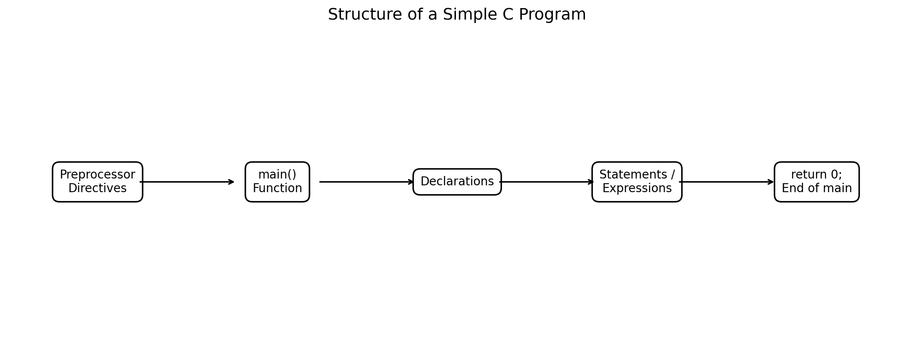
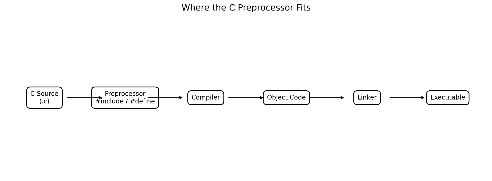
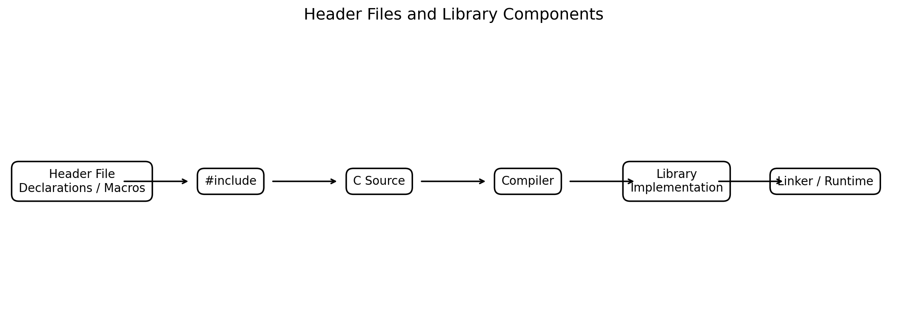
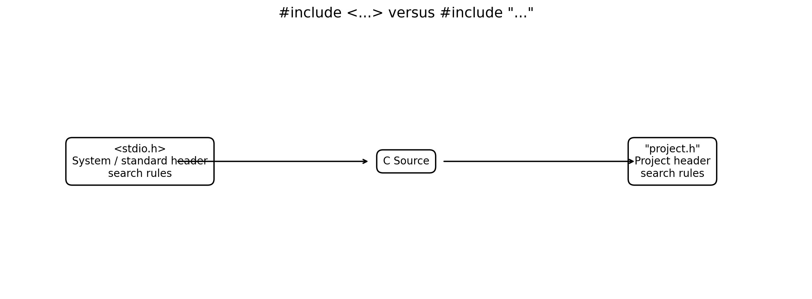
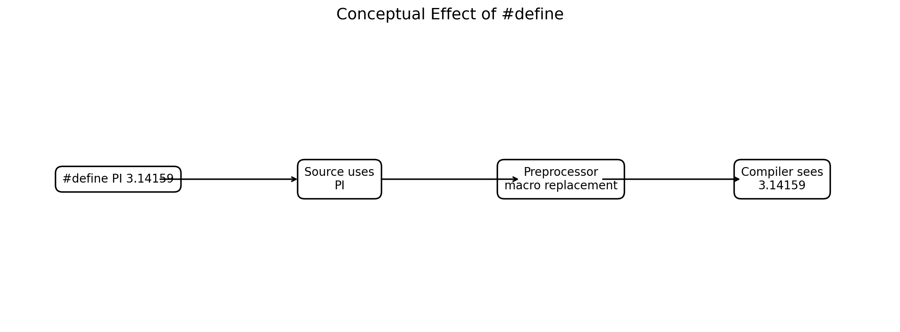
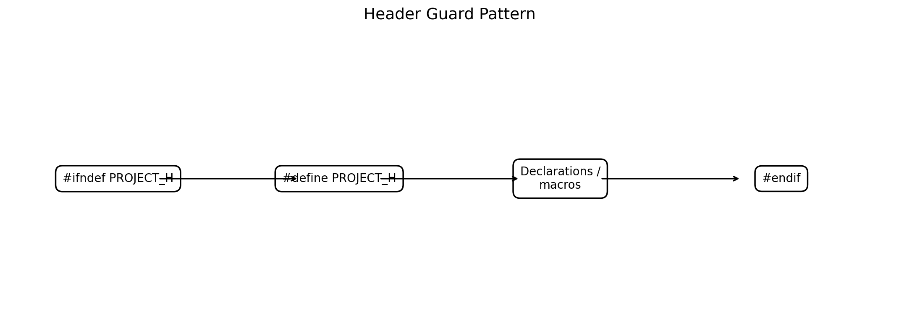
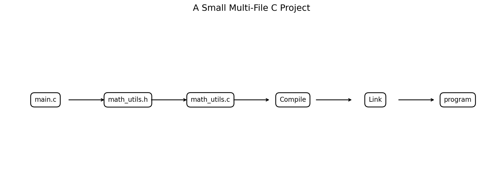

# :classical_building: Problem Solving Using Programming - B.Tech-IT, IIIT Allahabad
## Unit 2: Programming Basics
* ### Current Topic: Structure of a Simple C Program - Preprocessor Directives, `#include`, `#define`, Header Files and Library Files
* **Purpose:** Introductory Programming
---

---
## 👥 Instructor Information
* **Edited by Instructor:** [Dr. Mohammed Javed](https://sites.google.com/site/mohammedjaved2016/)
* **Email:** javed@iiita.ac.in
* **Senior Teaching Assistants:** Mr. Subrata Pramanik (pmm2024003@iiita.ac.in)
---
## 🎯 Learning Objectives

After completing this unit, students should be able to:

1. Identify the major parts of a simple C program.
2. Explain the role of the C preprocessor.
3. Understand preprocessing directives and why they begin with `#`.
4. Explain the purpose of `#include`.
5. Distinguish system/standard headers from project headers.
6. Explain the purpose and limitations of `#define`.
7. Understand object-like and function-like macros.
8. Distinguish header files from library implementations.
9. Explain the relationship among source files, headers, object files and libraries.
10. Write and compile small C programs using standard headers and user-defined headers.
11. Use header guards correctly.
12. Trace a C program from preprocessing through linking and execution.

---

# 1. Introduction

A C program is not simply a collection of statements. Even a small program usually has several logically different parts:

- preprocessing directives,
- declarations,
- functions,
- statements,
- expressions,
- comments,
- return statements.

A very small C program is:

```c
#include <stdio.h>

int main(void)
{
    printf("Hello, Engineering Students!\n");

    return 0;
}
```

### Output

```text
Hello, Engineering Students!
```

The two lines

```c
#include <stdio.h>
```

and

```c
int main(void)
```

have very different roles.

The first is a **preprocessing directive**. The second defines the program's `main` function.

Understanding this distinction is important because it helps students understand how C source code becomes an executable program.

---

# 2. General Structure of a Simple C Program

A useful introductory template is:

```c
/* Documentation / comments */

#include <header_file.h>

#define SYMBOL value

/* Other declarations */

int main(void)
{
    /* Local declarations */

    /* Executable statements */

    return 0;
}

/* Other functions */
```



**Figure 1. Main components of a simple C program.**

The order and exact contents can vary. Not every program needs every component.

---

# 3. Components of a C Program

| Component | Purpose |
|---|---|
| Comments | Explain code to human readers |
| Preprocessor directives | Control preprocessing before compilation |
| Header inclusion | Make declarations/macros from a header available |
| Macro definitions | Define preprocessing substitutions |
| Global declarations | Declare objects, functions, types, etc. |
| `main()` | Program entry point for a hosted C program |
| Local declarations | Define variables/types within a block |
| Statements | Perform operations |
| Expressions | Produce values or perform computations |
| `return` | Return a value from a function |

---

# 4. What Is the C Preprocessor?

The **C preprocessor** processes preprocessing directives before the compiler proper processes the resulting translation unit.

Important preprocessing capabilities include:

- including files using `#include`,
- defining and replacing macros using `#define`,
- conditional compilation using `#if`, `#ifdef`, `#ifndef`, etc.,
- generating preprocessing errors with `#error`,
- implementation-specific controls through `#pragma`.

The preprocessing stage occurs before the actual compilation stage. citeturn0search0

A simplified model is:

```text
C Source File
      ↓
Preprocessor
      ↓
Preprocessed Translation Unit
      ↓
Compiler
      ↓
Object Code
```



**Figure 2. Simplified position of preprocessing in the C build process.**

---

# 5. What Is a Preprocessor Directive?

A preprocessing directive begins with the `#` character.

Examples:

```c
#include <stdio.h>
#define PI 3.14159
#ifdef DEBUG
#endif
```

The `#` does not mean that these are ordinary C statements.

For example:

```c
#include <stdio.h>
```

is not a function call.

Similarly:

```c
#define MAX 100
```

does not create an ordinary C variable named `MAX`.

It instructs the preprocessor to perform a macro definition.

---

# 6. Common Preprocessor Directives

Some important directives are:

| Directive | Purpose |
|---|---|
| `#include` | Include another file |
| `#define` | Define a macro |
| `#undef` | Remove a macro definition |
| `#if` | Conditional compilation |
| `#ifdef` | Test whether a macro is defined |
| `#ifndef` | Test whether a macro is not defined |
| `#else` | Alternative conditional section |
| `#elif` | Additional conditional branch |
| `#endif` | End conditional section |
| `#error` | Request a preprocessing diagnostic |
| `#pragma` | Implementation-specific instruction |

The C preprocessor standardizes several of these directives; compiler implementations may additionally provide extensions. citeturn0search0

---

# 7. The `#include` Directive

The `#include` directive requests inclusion of another file.

Two common forms are:

```c
#include <filename>
```

and:

```c
#include "filename"
```

The exact search rules are implementation-defined, but the conventional distinction is:

- `<...>` is normally used for system/standard headers.
- `"..."` is normally used for headers belonging to the current project.

GCC documents these two forms and their different search behavior. citeturn0search14turn0search6

---

# 8. Example of `#include <stdio.h>`

Consider:

```c
#include <stdio.h>

int main(void)
{
    printf("Welcome to C programming!\n");

    return 0;
}
```

### Output

```text
Welcome to C programming!
```

Why do we write:

```c
#include <stdio.h>
```

?

Because the program uses the standard I/O facilities declared by the standard header `stdio.h`.

The header provides declarations needed by the compiler for interfaces such as `printf`.

The actual library implementation is a separate issue and is supplied by the implementation/toolchain.

---

# 9. Header File

A **header file** commonly contains declarations and macro definitions intended to be shared among source files.

Examples of standard C headers include:

```text
stdio.h
stdlib.h
string.h
math.h
ctype.h
time.h
stdbool.h
```

GCC describes header files as files containing C declarations and macro definitions that can be shared among source files. citeturn0search6

---

# 10. Why Are Header Files Needed?

Suppose several source files need to use the same function declarations.

Without a header, the programmer might have to duplicate declarations across many source files.

With a header:

```text
              math_utils.h
             /             \
            /               \
        main.c           test.c
```

Both source files can include the same declarations.

This improves:

- organization,
- consistency,
- maintainability,
- reuse.

GCC specifically notes that header files allow shared declarations and macro definitions to be maintained in one place. citeturn0search6

---

# 11. Header File vs Library File

This distinction is extremely important.

### Header file

A header commonly contains **declarations and macros**.

Example:

```text
stdio.h
```

It tells the compiler about interfaces such as:

```c
printf(...)
scanf(...)
```

### Library implementation

A library contains compiled implementations of functions or other reusable code.

Conceptually:

```text
Header
  ↓
Declarations / interface
  ↓
Compiler understands how code is called

Library
  ↓
Implementation
  ↓
Linker / runtime provides required code
```

Therefore:

> **A header file is not the same thing as the library implementation.**

---

# 12. Relationship Between Header and Library



**Figure 3. Conceptual relationship among header files, source code and library implementations.**

For example:

```c
#include <math.h>
```

makes declarations for mathematical functions available to the source file.

The actual implementation of functions such as `sqrt()` is supplied by the C implementation's library environment.

---

# 13. The `#include <...>` Form

Example:

```c
#include <stdio.h>
```

This form is conventionally used for standard/system headers.

Typical compilers search standard include directories for such headers.

The precise search mechanism depends on the implementation and compiler configuration. citeturn0search3turn0search14

---

# 14. The `#include "..."` Form

Example:

```c
#include "student.h"
```

This form is conventionally used for a project's own header files.

A common search behavior is:

```text
Current/project-related directory
          ↓
Configured quote include directories
          ↓
Other include directories
```

The exact rules are implementation-defined.

GCC documents that quoted includes typically search the directory containing the current source file before the standard include search locations. citeturn0search14



**Figure 4. Conventional distinction between the two `#include` forms.**

---

# 15. Standard Header Examples

## `stdio.h`

Used for standard input/output functions.

```c
#include <stdio.h>
```

Common functions:

```c
printf()
scanf()
getchar()
putchar()
```

---

## `stdlib.h`

```c
#include <stdlib.h>
```

Provides declarations for facilities including:

```c
malloc()
free()
exit()
strtol()
```

---

## `string.h`

```c
#include <string.h>
```

Common functions include:

```c
strlen()
strcpy()
strcmp()
```

---

## `math.h`

```c
#include <math.h>
```

Provides mathematical functions such as:

```c
sqrt()
pow()
sin()
cos()
```

Some implementations/toolchains require an additional linker option for the mathematical library when using GCC, depending on the platform and toolchain.

---

# 16. Example Using `math.h`

```c
#include <stdio.h>
#include <math.h>

int main(void)
{
    double x = 25.0;
    double result = sqrt(x);

    printf("Square root = %.2f\n", result);

    return 0;
}
```

### Output

```text
Square root = 5.00
```

On many GCC/Linux environments, compile this as:

```bash
gcc square_root.c -o square_root -lm
```

The `-lm` option explicitly links the math library on typical GCC/Linux setups.

The exact command can vary by platform and compiler.

---

# 17. The `#define` Directive

The `#define` directive creates a macro.

Example:

```c
#define PI 3.141592653589793
```

Then:

```c
double area = PI * r * r;
```

uses the macro name.

The preprocessor performs macro replacement before the compiler proper processes the resulting source. citeturn0search0

---

# 18. Object-Like Macro

A simple macro has the form:

```c
#define NAME replacement
```

Example:

```c
#define MAX_STUDENTS 60
```

Then:

```c
printf("%d\n", MAX_STUDENTS);
```

conceptually becomes:

```c
printf("%d\n", 60);
```

during macro replacement.



**Figure 5. Conceptual effect of an object-like macro.**

---

# 19. Example of `#define`

```c
#include <stdio.h>

#define PI 3.14159

int main(void)
{
    float radius = 5.0f;
    float area = PI * radius * radius;

    printf("Radius = %.2f\n", radius);
    printf("Area = %.2f\n", area);

    return 0;
}
```

### Output

```text
Radius = 5.00
Area = 78.54
```

---

# 20. Macro Names

A common convention is to use uppercase names for macros:

```c
#define MAX_SIZE 100
#define PI 3.14159
#define PASS_MARK 40
```

This is a convention, not a language requirement.

It helps readers distinguish macros from ordinary variables.

---

# 21. Function-Like Macros

A macro can also accept parameters:

```c
#define SQUARE(x) ((x) * (x))
```

Example:

```c
#include <stdio.h>

#define SQUARE(x) ((x) * (x))

int main(void)
{
    int n = 6;

    printf("Square = %d\n", SQUARE(n));

    return 0;
}
```

### Output

```text
Square = 36
```

---

# 22. Why Parentheses Matter in Macros

Consider:

```c
#define SQUARE(x) x * x
```

Now:

```c
SQUARE(2 + 3)
```

can expand conceptually to:

```c
2 + 3 * 2 + 3
```

which is:

```text
11
```

rather than:

```text
25
```

A safer macro form is:

```c
#define SQUARE(x) ((x) * (x))
```

Then:

```c
SQUARE(2 + 3)
```

expands conceptually to:

```c
((2 + 3) * (2 + 3))
```

giving:

```text
25
```

---

# 23. Macro Side Effects

Function-like macros can introduce surprising behavior.

Consider:

```c
#define SQUARE(x) ((x) * (x))
```

Then:

```c
SQUARE(i++)
```

can result in `i++` being evaluated more than once.

This is dangerous and should be avoided.

For calculations, a function is often clearer:

```c
int square(int x)
{
    return x * x;
}
```

Then:

```c
square(i++)
```

evaluates the argument once before entering the function.

---

# 24. `#define` Does Not Create a Variable

This:

```c
#define MAX 100
```

does **not** create:

```text
a memory location named MAX
```

It defines a preprocessing macro.

Compare:

```c
#define MAX 100
```

with:

```c
const int max = 100;
```

The second is an actual C object declaration.

For typed constants and modern C programming, `const` variables or enumerations may sometimes be preferable to macros.

---

# 25. `#define` vs `const`

| Feature | `#define` | `const` |
|---|---|---|
| Preprocessor macro | Yes | No |
| Has C type | No | Yes |
| Type checking | No | Yes |
| Scope behavior | Macro rules | C language scope rules |
| Replacement | Text/token based | Object/value based |
| Useful for conditional compilation | Yes | No |
| Can represent typed constant | Not directly | Yes |

Example:

```c
#define MAX 100
```

versus:

```c
const int MAX = 100;
```

Both may be useful, but they are not equivalent language mechanisms.

---

# 26. Header Files Can Contain `#define`

A header can contain both declarations and macros.

Example:

```c
/* config.h */

#ifndef CONFIG_H
#define CONFIG_H

#define MAX_STUDENTS 60

extern int total_students;

#endif
```

A source file can use:

```c
#include "config.h"
```

This makes the shared definition available.

---

# 27. Header Guards

A header can accidentally be included more than once through direct or indirect inclusion.

A common solution is a **header guard**:

```c
#ifndef MY_HEADER_H
#define MY_HEADER_H

/* declarations */

#endif
```

The pattern prevents the contents from being processed repeatedly within the same translation unit.

Header guards are a common technique for avoiding repeated inclusion and recursive inclusion problems. citeturn0search3turn0search6



**Figure 6. Basic header guard pattern.**

---

# 28. Complete Header Guard Example

### `geometry.h`

```c
#ifndef GEOMETRY_H
#define GEOMETRY_H

#define PI 3.141592653589793

double circle_area(double radius);

#endif
```

### `geometry.c`

```c
#include "geometry.h"

double circle_area(double radius)
{
    return PI * radius * radius;
}
```

### `main.c`

```c
#include <stdio.h>
#include "geometry.h"

int main(void)
{
    double radius = 4.0;

    printf("Area = %.2f\n", circle_area(radius));

    return 0;
}
```

### Output

```text
Area = 50.27
```

---

# 29. Multi-File C Programs

Larger programs are usually divided into multiple source and header files.

Example:

```text
project/
│
├── main.c
├── geometry.c
├── geometry.h
└── Makefile
```



**Figure 7. Conceptual organization of a small multi-file C project.**

---

# 30. What Goes in a Header?

A project header commonly contains:

- function declarations,
- type definitions,
- structure definitions,
- enumeration definitions,
- macro definitions,
- constants represented appropriately,
- declarations of shared objects when necessary.

Example:

```c
#ifndef CALCULATOR_H
#define CALCULATOR_H

int add(int a, int b);
int subtract(int a, int b);

#endif
```

---

# 31. What Goes in a `.c` File?

A `.c` source file commonly contains:

- function definitions,
- private helper functions,
- variable definitions,
- executable logic.

Example:

```c
#include "calculator.h"

int add(int a, int b)
{
    return a + b;
}

int subtract(int a, int b)
{
    return a - b;
}
```

---

# 32. Header Declaration vs Function Definition

This distinction is fundamental.

### Declaration

```c
int add(int a, int b);
```

It tells the compiler that such a function exists and describes its interface.

### Definition

```c
int add(int a, int b)
{
    return a + b;
}
```

It supplies the function's implementation.

A typical design is:

```text
calculator.h
       ↓
Function declarations

calculator.c
       ↓
Function definitions
```

---

# 33. Complete Multi-File Example

## File 1: `calculator.h`

```c
#ifndef CALCULATOR_H
#define CALCULATOR_H

int add(int a, int b);
int multiply(int a, int b);

#endif
```

## File 2: `calculator.c`

```c
#include "calculator.h"

int add(int a, int b)
{
    return a + b;
}

int multiply(int a, int b)
{
    return a * b;
}
```

## File 3: `main.c`

```c
#include <stdio.h>
#include "calculator.h"

int main(void)
{
    int a = 8;
    int b = 5;

    printf("Sum = %d\n", add(a, b));
    printf("Product = %d\n", multiply(a, b));

    return 0;
}
```

---

# 34. Output

```text
Sum = 13
Product = 40
```

---

# 35. Compiling the Multi-File Program

Using GCC:

```bash
gcc main.c calculator.c -o calculator
```

Then run:

```bash
./calculator
```

Output:

```text
Sum = 13
Product = 40
```

An alternative two-stage build is:

```bash
gcc -c main.c
gcc -c calculator.c
gcc main.o calculator.o -o calculator
```

Conceptually:

```text
main.c
   ↓
main.o
   \
    \
     → Linker → calculator
    /
   /
calculator.o
   ↑
calculator.c
```

---

# 36. Header Files and Compilation Units

When a source file contains:

```c
#include "calculator.h"
```

the preprocessor processes the included header as part of preprocessing.

Conceptually:

```text
main.c
  +
calculator.h
  ↓
Preprocessed translation unit
  ↓
Compiler
```

This is why the compiler can see the function declarations from the header while compiling `main.c`.

The inclusion process is specified as source-file inclusion during preprocessing. citeturn0search3turn0search6

---

# 37. A Useful Mental Model

Think of the components this way:

```text
Header
  =
"Here is the interface."

Source file
  =
"Here is the implementation."

Library
  =
"Here is reusable compiled functionality."

Linker
  =
"Connect the required pieces."
```

This model is simplified but very useful for beginners.

---

# 38. Standard Library Headers

The C standard library provides many headers.

Some commonly encountered headers are:

| Header | Typical purpose |
|---|---|
| `<stdio.h>` | Input/output |
| `<stdlib.h>` | General utilities, memory allocation, conversions |
| `<string.h>` | String and memory operations |
| `<math.h>` | Mathematical functions |
| `<ctype.h>` | Character classification/conversion |
| `<time.h>` | Date and time |
| `<limits.h>` | Integer type limits |
| `<float.h>` | Floating-point characteristics |
| `<assert.h>` | Assertions |
| `<stdint.h>` | Integer types with specified widths where provided |
| `<stdbool.h>` | Boolean macros/types in versions of C where applicable |

Exact availability and details depend on the C standard version and implementation.

---

# 39. Example Using Multiple Headers

```c
#include <stdio.h>
#include <stdlib.h>
#include <math.h>

int main(void)
{
    double value = 49.0;
    double root = sqrt(value);

    printf("Square root = %.2f\n", root);

    return EXIT_SUCCESS;
}
```

### Output

```text
Square root = 7.00
```

Here:

```c
#include <stdio.h>
```

supports standard I/O declarations,

```c
#include <stdlib.h>
```

provides `EXIT_SUCCESS`,

and:

```c
#include <math.h>
```

provides the declaration for `sqrt`.

---

# 40. User-Defined Header

Suppose an engineering project contains a temperature-conversion module.

### `temperature.h`

```c
#ifndef TEMPERATURE_H
#define TEMPERATURE_H

double celsius_to_fahrenheit(double celsius);
double fahrenheit_to_celsius(double fahrenheit);

#endif
```

### `temperature.c`

```c
#include "temperature.h"

double celsius_to_fahrenheit(double celsius)
{
    return (9.0 * celsius / 5.0) + 32.0;
}

double fahrenheit_to_celsius(double fahrenheit)
{
    return (fahrenheit - 32.0) * 5.0 / 9.0;
}
```

### `main.c`

```c
#include <stdio.h>
#include "temperature.h"

int main(void)
{
    double c = 25.0;

    printf("%.2f C = %.2f F\n",
           c, celsius_to_fahrenheit(c));

    return 0;
}
```

### Output

```text
25.00 C = 77.00 F
```

---

# 41. Why Use User-Defined Headers?

They make programs modular.

Instead of:

```text
One huge C file
```

we can have:

```text
main.c
   +
temperature.c
   +
temperature.h
```

This makes it easier to:

- divide work among team members,
- reuse functions,
- test modules,
- maintain code,
- separate interface from implementation.

---

# 42. Header Guards in a Real Project

A good project header should commonly protect itself against repeated inclusion.

Example:

```c
#ifndef MOTOR_CONTROL_H
#define MOTOR_CONTROL_H

void start_motor(void);
void stop_motor(void);

#endif
```

If the header is included again, the macro is already defined, so its declarations are skipped.

---

# 43. Common Mistake: Missing Header

Incorrect:

```c
int main(void)
{
    printf("Hello\n");

    return 0;
}
```

The program uses `printf()` without including its required standard header.

Correct:

```c
#include <stdio.h>

int main(void)
{
    printf("Hello\n");

    return 0;
}
```

The compiler needs the declaration provided through the appropriate header.

---

# 44. Common Mistake: Wrong Header

Do not include random headers merely to silence an error.

For example:

```c
#include <stdio.h>
```

is appropriate for `printf`.

The correct approach is to identify which interface is being used and include the header that declares it.

---

# 45. Common Mistake: Confusing Header and Library

Incorrect mental model:

```text
stdio.h = printf implementation
```

Better mental model:

```text
stdio.h
   ↓
Declaration/interface information

C library
   ↓
Implementation of standard I/O functionality
```

The header and implementation are related but not the same thing.

---

# 46. Common Mistake: Treating `#define` as a Variable

Incorrect:

```c
#define COUNT 10
COUNT++;
```

A macro is not an ordinary variable.

If the program needs a modifiable object, use an actual variable:

```c
int count = 10;
count++;
```

---

# 47. Common Mistake: Missing Parentheses in Macros

Avoid:

```c
#define DOUBLE(x) x + x
```

because:

```c
DOUBLE(2 * 3)
```

can produce unexpected precedence behavior.

Prefer:

```c
#define DOUBLE(x) ((x) + (x))
```

But remember that macros can still have side-effect problems when their arguments are expressions such as `i++`.

---

# 48. Common Mistake: Defining Variables in Headers

Avoid putting ordinary global variable definitions directly into a header:

```c
/* bad.h */
int count = 0;
```

If multiple `.c` files include this header, it can create multiple-definition problems.

A common approach is:

### Header

```c
extern int count;
```

### One `.c` file

```c
int count = 0;
```

This separates the declaration from the definition.

---

# 49. Header vs Source vs Library

| Item | Usually contains | Main purpose |
|---|---|---|
| `.h` header | Declarations, types, macros | Share interfaces |
| `.c` source | Definitions and program logic | Implement functionality |
| Object file | Compiled machine-oriented code | Intermediate build product |
| Static library | Collection of object code | Reusable compiled code |
| Shared library | Dynamically loadable compiled code | Reusable runtime code |
| Executable | Linked program | Run the application |

Library formats and linking behavior vary across operating systems and toolchains.

---

# 50. Static and Shared Libraries

Two common library models are:

### Static library

Conceptually:

```text
Program
  +
Required library object code
  ↓
Executable
```

The required library code is incorporated into the executable during linking.

### Shared library

Conceptually:

```text
Executable
    +
Shared library
    ↓
Runtime loading / dynamic linking
```

The exact mechanism depends on the operating system and executable format.

---

# 51. Example of a Static Library Workflow

Suppose:

```text
math_utils.c
math_utils.h
main.c
```

Compile:

```bash
gcc -c math_utils.c
gcc -c main.c
```

Create a static library on a typical Unix-like environment:

```bash
ar rcs libmath_utils.a math_utils.o
```

Link:

```bash
gcc main.o -L. -lmath_utils -o program
```

Run:

```bash
./program
```

This illustrates the general relationship:

```text
Source
 ↓
Object
 ↓
Library
 ↓
Linker
 ↓
Executable
```

---

# 52. Engineering Example: Sensor Module

Suppose a project reads sensor data.

A clean organization might be:

```text
sensor.h
sensor.c
main.c
```

### `sensor.h`

```c
#ifndef SENSOR_H
#define SENSOR_H

double convert_voltage_to_temperature(double voltage);

#endif
```

### `sensor.c`

```c
#include "sensor.h"

double convert_voltage_to_temperature(double voltage)
{
    return voltage * 100.0;
}
```

### `main.c`

```c
#include <stdio.h>
#include "sensor.h"

int main(void)
{
    double voltage = 2.5;

    printf("Temperature = %.2f C\n",
           convert_voltage_to_temperature(voltage));

    return 0;
}
```

### Output

```text
Temperature = 250.00 C
```

The formula is only an illustrative engineering model.

---

# 53. Engineering Example: Motor Control Interface

A header can define the interface:

```c
#ifndef MOTOR_H
#define MOTOR_H

void motor_start(void);
void motor_stop(void);
void motor_set_speed(int rpm);

#endif
```

The implementation can be placed in:

```text
motor.c
```

and the application in:

```text
main.c
```

This separates:

```text
Interface
```

from:

```text
Implementation
```

which is a fundamental software-engineering principle.

---

# 54. Conditional Compilation

The preprocessor can selectively include code.

Example:

```c
#include <stdio.h>

#define DEBUG

int main(void)
{
#ifdef DEBUG
    printf("Debug mode enabled.\n");
#endif

    printf("Program running.\n");

    return 0;
}
```

### Output

```text
Debug mode enabled.
Program running.
```

If `DEBUG` is not defined, the first `printf` is excluded during preprocessing.

---

# 55. `#ifdef` and `#ifndef`

### `#ifdef`

Tests whether a macro is defined:

```c
#ifdef DEBUG
printf("Debug information\n");
#endif
```

### `#ifndef`

Tests whether a macro is not defined:

```c
#ifndef MAX_SIZE
#define MAX_SIZE 100
#endif
```

Header guards commonly use exactly this pattern.

---

# 56. Preprocessing Example

Consider:

```c
#define MAX 100

int main(void)
{
    int x = MAX;

    return 0;
}
```

Conceptually, macro replacement causes the compiler to receive something equivalent to:

```c
int main(void)
{
    int x = 100;

    return 0;
}
```

This is a conceptual simplification of preprocessing; the actual preprocessed output also contains other source information and transformations.

---

# 57. Inspecting Preprocessor Output

With GCC, the `-E` option can be used to stop after preprocessing.

Example:

```bash
gcc -E program.c
```

This is useful for understanding:

- what `#include` contributes,
- what macros expand to,
- how conditional compilation changes source,
- why preprocessing errors occur.

GCC's preprocessor documentation also describes options for examining macro definitions and include directives. citeturn0search11turn0search23

---

# 58. Practical Demonstration

Create:

```c
#include <stdio.h>

#define MESSAGE "Hello from preprocessing!"

int main(void)
{
    printf("%s\n", MESSAGE);

    return 0;
}
```

Compile:

```bash
gcc message.c -o message
```

Run:

```bash
./message
```

Output:

```text
Hello from preprocessing!
```

Now inspect preprocessing:

```bash
gcc -E message.c
```

Look for the effect of:

```c
#define MESSAGE ...
```

and:

```c
#include <stdio.h>
```

This is an excellent laboratory demonstration.

---

# 59. A Complete Simple C Program Template

Students can begin with:

```c
#include <stdio.h>

#define PI 3.14159

int main(void)
{
    double radius;
    double area;

    printf("Enter radius: ");
    scanf("%lf", &radius);

    area = PI * radius * radius;

    printf("Area = %.2f\n", area);

    return 0;
}
```

### Sample Output

```text
Enter radius: 5
Area = 78.54
```

---

# 60. Line-by-Line Analysis

### Line 1

```c
#include <stdio.h>
```

Requests inclusion of the standard I/O header.

### Line 2

Blank line for readability.

### Line 3

```c
#define PI 3.14159
```

Defines an object-like preprocessing macro.

### Line 5

```c
int main(void)
```

Defines the program's `main` function.

### Lines 6–10

```c
{
    double radius;
    double area;

    ...
}
```

Contain the function body and local variables/statements.

### Final statement

```c
return 0;
```

Returns zero from `main`, conventionally indicating successful termination in a hosted C environment.

---

# 61. Concept Map

```text
                     SIMPLE C PROGRAM
                           │
        ┌──────────────────┼──────────────────┐
        │                  │                  │
  Preprocessor          main()            Other functions
     directives            │
        │                  │
   ┌────┴────┐        ┌────┴────────┐
   │         │        │             │
#include   #define  Declarations  Statements
   │         │
   │         └────── Macro replacement
   │
   └──────── Header file
                 │
                 ↓
       Declarations / macros
                 │
                 ↓
        Compiler / build system
                 │
          ┌──────┴──────┐
          ↓             ↓
      Object code     Libraries
          └──────┬──────┘
                 ↓
               Linker
                 ↓
             Executable
                 ↓
                CPU
```

---

# 62. Key Differences

## `#include`

Purpose:

```text
Include another file's contents during preprocessing.
```

Example:

```c
#include <stdio.h>
```

---

## `#define`

Purpose:

```text
Define a preprocessing macro.
```

Example:

```c
#define MAX 100
```

---

## Header File

Purpose:

```text
Share declarations, types and macros.
```

Example:

```text
calculator.h
```

---

## Library

Purpose:

```text
Provide reusable implementation code.
```

Examples include standard C library facilities and third-party/project libraries.

---

# 63. Important Terminology

| Term | Meaning |
|---|---|
| Preprocessor | Processes C preprocessing directives before compilation |
| Directive | Instruction to the preprocessor |
| Macro | Preprocessor replacement definition |
| `#include` | Directive for source/header inclusion |
| `#define` | Directive for macro definition |
| Header | File containing declarations/macros intended for sharing |
| Source file | `.c` file containing C program implementation |
| Declaration | Announces an entity/interface |
| Definition | Provides an entity's implementation or storage definition |
| Object file | Compiled intermediate file |
| Library | Reusable compiled or source-based functionality |
| Linker | Combines object files and libraries |
| Executable | Program prepared for execution |
| Header guard | Conditional-preprocessing pattern preventing repeated inclusion |

---

# 64. Review Questions

## Short-Answer Questions

1. What is a C preprocessor?
2. What is a preprocessing directive?
3. Why do preprocessing directives begin with `#`?
4. What is the purpose of `#include`?
5. What is the purpose of `#define`?
6. What is a header file?
7. Give five examples of standard C headers.
8. What is the difference between `<file.h>` and `"file.h"`?
9. What is a macro?
10. What is an object-like macro?
11. What is a function-like macro?
12. Why are parentheses important in function-like macros?
13. What is a header guard?
14. Why are header guards used?
15. What is the difference between a header file and a library?
16. What is the difference between a declaration and a definition?
17. What does the linker do?
18. What is the purpose of `extern`?
19. What does the GCC `-E` option do?
20. Why should programmers avoid confusing macros with variables?

---

# 65. Descriptive Questions

1. Explain the structure of a simple C program with an example.
2. Explain the role of the C preprocessor.
3. Explain `#include` with examples.
4. Explain the difference between `#include <file.h>` and `#include "file.h"`.
5. Explain `#define` and object-like macros.
6. Explain function-like macros and the importance of parentheses.
7. Explain header files and their importance in modular programming.
8. Differentiate header files and library files.
9. Explain header guards with a complete example.
10. Explain the relationship between `.c`, `.h`, object and library files.
11. Explain the preprocessing, compilation and linking stages of a C program.
12. Explain how a multi-file C project is compiled and linked.
13. Discuss the advantages and limitations of macros.
14. Explain conditional compilation using `#ifdef` and `#ifndef`.
15. Explain how C headers support software reuse and maintainability.

---

# 66. Programming Exercises

### Exercise 1 — Simple Header

Create:

```text
message.h
message.c
main.c
```

Declare and implement:

```c
void display_message(void);
```

Call it from `main()`.

---

### Exercise 2 — Macro Constant

Write a program using:

```c
#define GRAVITY 9.81
```

to calculate the weight of an object:

\[
W = mg
\]

---

### Exercise 3 — Function-Like Macro

Create:

```c
#define CUBE(x) ((x) * (x) * (x))
```

Test it with several integers.

Then explain why:

```c
CUBE(i++)
```

should not be used.

---

### Exercise 4 — Engineering Header

Create:

```text
ohms_law.h
ohms_law.c
main.c
```

Implement:

\[
V = IR
\]

using a function:

```c
double voltage(double current, double resistance);
```

---

### Exercise 5 — Multiple Headers

Write a program that uses:

```c
#include <stdio.h>
#include <math.h>
#include <stdlib.h>
```

to calculate the square root of a user-entered positive number.

---

### Exercise 6 — Header Guard

Create a header:

```c
#ifndef STUDENT_H
#define STUDENT_H

/* declarations */

#endif
```

and explain each line.

---

# 67. Laboratory Activity

## Experiment: Observe the Effect of the Preprocessor

### Objective

Understand how `#include` and `#define` affect C source code before compilation.

### Program

```c
#include <stdio.h>

#define PI 3.14159

int main(void)
{
    double r = 5.0;

    printf("Area = %.2f\n", PI * r * r);

    return 0;
}
```

### Tasks

1. Compile and run the program.
2. Record the output.
3. Generate preprocessed output using:

```bash
gcc -E program.c > program.i
```

4. Search the output for evidence of macro replacement.
5. Observe the effect of including `stdio.h`.
6. Explain the difference between preprocessing and compilation.

---

# 68. Mini Project: Engineering Utility Library

Develop a small reusable C library containing engineering calculations.

Suggested structure:

```text
engineering_project/
│
├── main.c
├── electrical.h
├── electrical.c
├── geometry.h
├── geometry.c
└── README.md
```

Functions may include:

```c
double voltage(double current, double resistance);
double power(double voltage, double current);
double rectangle_area(double length, double width);
double circle_area(double radius);
```

Use:

- header guards,
- function declarations,
- function definitions,
- `#include`,
- `#define` where appropriate,
- standard library headers,
- separate source files.

### Expected learning

```text
Problem
  ↓
Algorithm
  ↓
Header design
  ↓
C implementation
  ↓
Compilation
  ↓
Linking
  ↓
Executable
```

---

# 69. Good Programming Practices

1. Include only the headers you need.
2. Use meaningful header names.
3. Protect project headers with header guards.
4. Keep declarations in headers and implementations in `.c` files where appropriate.
5. Avoid unnecessary macros.
6. Parenthesize function-like macro parameters and the overall expression.
7. Prefer functions or typed constants when they provide clearer semantics than macros.
8. Avoid defining ordinary global objects in headers.
9. Keep modules small and focused.
10. Use comments to explain *why*, not merely repeat what the code says.
11. Compile with warnings enabled during development.
12. Test each module separately where practical.

A common GCC compilation command for learning is:

```bash
gcc -Wall -Wextra -std=c17 main.c calculator.c -o calculator
```

The exact standard and options should match your course/toolchain requirements.

---

# 70. Common Viva Questions

### Q1. What is `#include`?

It is a preprocessing directive used to include another source/header file during preprocessing.

### Q2. Is `#include` a C function?

No.

### Q3. Is `#define` a variable declaration?

No. It defines a preprocessing macro.

### Q4. What is `stdio.h`?

A standard C header that declares interfaces for standard input/output facilities.

### Q5. Is `stdio.h` the same as the C library?

No. The header provides declarations/macros; library components provide implementations.

### Q6. Why use `"myheader.h"`?

It is conventionally used for project headers and commonly searches the current/project-related directory first.

### Q7. Why use `<stdio.h>`?

It conventionally identifies a system/standard header.

### Q8. What is a header guard?

A conditional-preprocessing pattern that prevents repeated inclusion of a header's contents within a translation unit.

### Q9. What does `#define PI 3.14` do?

It defines a preprocessing macro named `PI`.

### Q10. What does the linker do?

It combines object files and required library components into a final program, subject to the platform/toolchain.

---

# 71. Summary

A simple C program may contain several layers:

```text
                 C PROGRAM
                     │
        ┌────────────┴────────────┐
        │                         │
 Preprocessor                 C Language
 Directives                    Constructs
        │                         │
 ┌──────┴──────┐            ┌─────┴─────┐
 │             │            │           │
#include     #define      main()      Functions
 │             │
Header       Macro
 │
Declarations
```

The key ideas are:

- The **preprocessor** works before the compiler proper.
- `#include` includes a header/source file during preprocessing.
- `#define` defines a preprocessing macro.
- A **header** commonly contains declarations and macros intended for sharing.
- A **library** provides reusable implementations.
- A `.c` file generally contains implementation code.
- Header guards help prevent repeated inclusion.
- The compiler and linker transform separate source components into an executable.
- Good header/source organization supports modular engineering software.

---

# 72. Final Conceptual Picture


A useful mental model is:

```text
               YOUR C PROGRAM
                     │
             ┌───────┴────────┐
             │                │
          #include          #define
             │                │
             ↓                ↓
         Header Files       Macros
             │                │
             └───────┬────────┘
                     ↓
               Preprocessor
                     ↓
                C Compiler
                     ↓
                Object Code
                     ↓
                  Linker
                     ↑
                     │
                 Libraries
                     ↓
                Executable
                     ↓
                   CPU
```

Understanding this flow gives engineering students a strong foundation for later topics such as:

- functions,
- modular programming,
- data structures,
- dynamic memory,
- operating systems,
- embedded programming,
- compilation,
- build systems,
- software engineering.

---

# References and Further Reading

1. **cppreference — C Preprocessor:** overview of preprocessing directives, macro replacement and conditional compilation.
2. **cppreference — C `#include`:** syntax and semantics of source-file inclusion.
3. **GCC — The C Preprocessor, Header Files:** explanation of system and user header files and their purpose.
4. **GNU C Language Manual — `#include` Syntax:** practical description of angle-bracket and quoted include forms.
5. **GCC documentation — Preprocessor options:** useful for inspecting preprocessing output and macro definitions.

