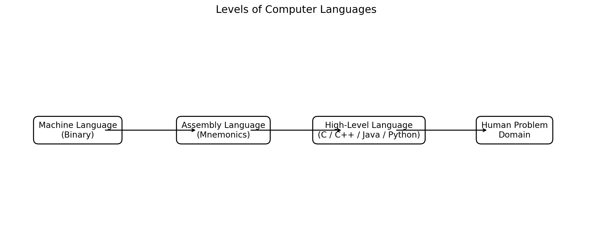
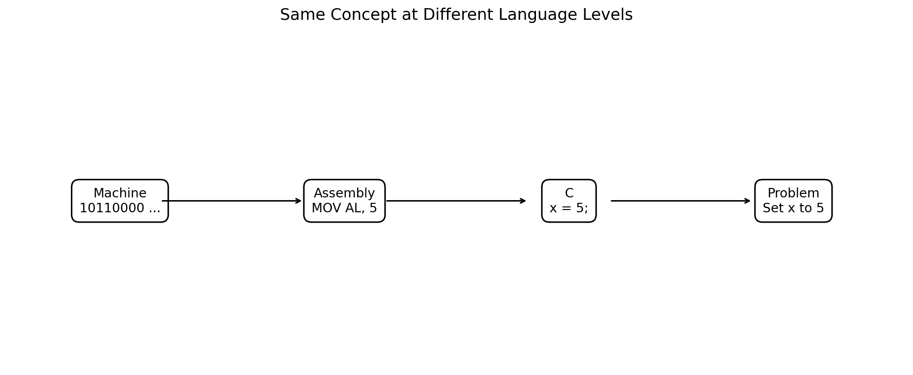
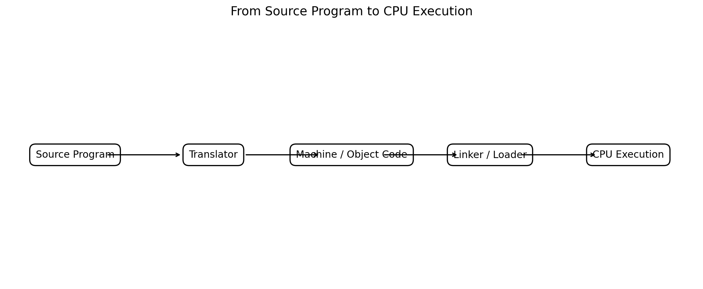
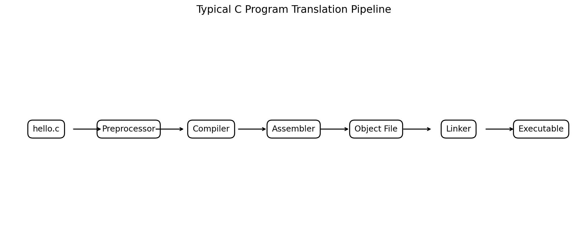
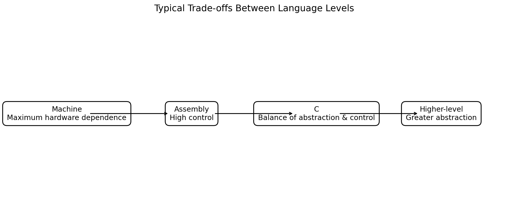
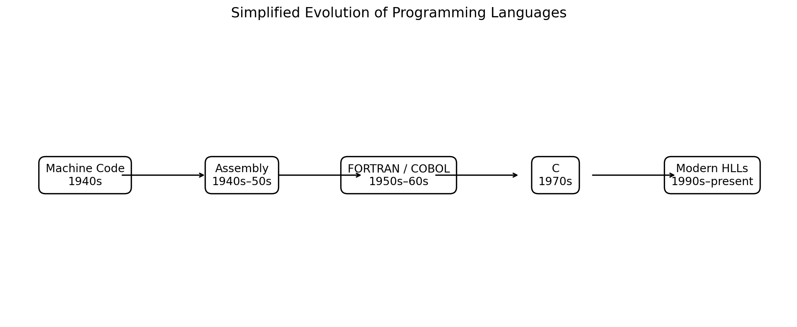

# :classical_building: Problem Solving Using Programming - B.Tech-IT, IIIT Allahabad
## Unit 2: Programming Basics
* ### Current Topic: Introduction to Computer Languages
* **Purpose:** Introduce Machine Language, Assembly Language and High-Level Languages
---

---
## 👥 Instructor Information
* **Edited by Instructor:** [Dr. Mohammed Javed](https://sites.google.com/site/mohammedjaved2016/)
* **Email:** javed@iiita.ac.in
* **Senior Teaching Assistants:** Mr. Subrata Pramanik (pmm2024003@iiita.ac.in)
---
## 🎯 Learning Objectives

After studying this unit, students should be able to:

1. Explain what a computer language is.
2. Distinguish machine language, assembly language and high-level languages.
3. Explain the relationship between source code, translators and machine code.
4. Describe the roles of an assembler, compiler, linker and loader.
5. Compare the advantages and limitations of different language levels.
6. Explain why C is especially useful for engineering students.
7. Write simple C programs and understand how they are translated and executed.
8. Relate programming-language levels to problem-solving activities.

---

# 1. Introduction

A computer ultimately executes instructions represented in a form understood by its processor. Human beings, however, normally describe problems using mathematical notation, diagrams, algorithms and natural language.

A **computer language** provides a formal way to express instructions or computations for a computer.

Computer languages range from very low-level machine code and assembly language to high-level languages that hide many hardware details. citeturn0search8turn0search3

The three broad levels considered in this unit are:

- **Machine language**
- **Assembly language**
- **High-level languages**



**Figure 1. Levels of computer languages.**

---

# 2. Why Do We Need Computer Languages?

Suppose an engineer wants to calculate the area of a circle:

\[
A = \pi r^2
\]

A human can easily understand this mathematical expression.

A processor does not directly understand the mathematical notation `πr²`. It needs instructions encoded according to the processor's instruction set.

A programming language acts as a bridge:

```text
Engineering Problem
       ↓
Algorithm / Logic
       ↓
Programming Language
       ↓
Translator
       ↓
Machine Instructions
       ↓
CPU
```

The major purpose of programming languages is therefore to make it possible for humans to express computational solutions in a systematic form that can eventually be executed by computers.

---

# 3. Classification of Computer Languages

A simplified classification is:

```text
Computer Languages
│
├── Low-Level Languages
│   ├── Machine Language
│   └── Assembly Language
│
└── High-Level Languages
    ├── C
    ├── C++
    ├── Java
    ├── Python
    ├── Fortran
    └── Many others
```

The terms *high-level* and *low-level* describe relative abstraction from hardware. C is often described as occupying an interesting middle position: it provides high-level programming constructs while retaining substantial control over memory and hardware-oriented operations. citeturn0search20turn0search0

---

# 4. Machine Language

## 4.1 Definition

**Machine language** is the instruction representation directly understood by a particular processor.

Instructions are encoded as binary patterns, conventionally represented using `0` and `1`.

A simplified example might look like:

```text
10110000 00000101
```

This should be treated as an illustrative binary representation, not as a universal instruction for every CPU.

The exact machine instruction encoding depends on the processor architecture.

---

## 4.2 Characteristics of Machine Language

### Advantages

- Directly executable by the processor.
- No assembler is needed to translate the instruction itself.
- Can provide very direct control of hardware.
- Execution can be highly efficient when the instructions are appropriate for the processor.

### Disadvantages

- Extremely difficult for humans to read.
- Difficult to write.
- Difficult to debug.
- Highly dependent on processor architecture.
- Programs are difficult to maintain.
- A program written for one instruction set may not work on another.

---

## 4.3 Example

Imagine an abstract processor with an instruction encoding such as:

```text
0001 = ADD
0010 = SUB
0011 = LOAD
0100 = STORE
```

An instruction could be represented conceptually as:

```text
0011 0001 00000101
```

The exact interpretation depends on the architecture's instruction format.

**Important:** Real processors have their own instruction sets, instruction formats, registers and binary encodings.

---

# 5. Assembly Language

## 5.1 Definition

**Assembly language** uses symbolic names called **mnemonics** to represent processor instructions.

Instead of writing binary patterns such as:

```text
10110000 ...
```

a programmer may write instructions resembling:

```text
MOV
ADD
SUB
LOAD
STORE
JMP
```

The exact syntax depends on the processor architecture and assembler.

Assembly language is still closely tied to processor hardware.

---

## 5.2 Example of Assembly Notation

A simplified example:

```asm
MOV R1, #5
MOV R2, #3
ADD R1, R2
```

Conceptually:

```text
R1 ← 5
R2 ← 3
R1 ← R1 + R2
```

After execution:

```text
R1 = 8
```

This example is intentionally generic. Real assembly syntax differs among architectures such as x86, ARM and RISC-V.

---

## 5.3 Assembler

An **assembler** translates assembly-language source code into machine/object code.

```text
Assembly Program
       ↓
    Assembler
       ↓
Machine / Object Code
```

Unlike a compiler for a general high-level language, an assembler works closely with the instruction set and syntax of a particular processor family.

---

# 6. High-Level Languages

A **high-level programming language** provides abstractions that allow programmers to express algorithms without specifying every processor-level instruction.

Examples include:

- C
- C++
- Java
- Python
- Fortran
- JavaScript
- C#
- Rust

OpenStax describes high-level languages as languages designed to be easier for humans to read, write and understand while abstracting many hardware details. citeturn0search3

---

## 6.1 Advantages

High-level languages generally provide:

- easier programming,
- clearer syntax,
- better abstraction,
- easier maintenance,
- easier debugging,
- reusable libraries,
- improved programmer productivity,
- greater portability when standard language features are used.

---

## 6.2 Disadvantages

Depending on the language and implementation:

- some low-level hardware details may be hidden,
- execution may require additional translation/runtime mechanisms,
- precise hardware control can be less direct,
- performance characteristics can be less predictable than carefully optimized low-level code.

These are general tendencies rather than absolute rules.

---

# 7. Comparison of Three Language Levels

| Feature | Machine Language | Assembly Language | High-Level Language |
|---|---|---|---|
| Representation | Binary / encoded instructions | Mnemonics and symbols | Human-readable syntax |
| Hardware dependence | Very high | Very high | Usually lower |
| Ease of learning | Very difficult | Difficult | Generally easier |
| Translator | Not needed for the machine code itself | Assembler | Compiler/interpreter/runtime as appropriate |
| Portability | Very low | Low | Generally higher |
| Hardware control | Maximum | Very high | Varies by language |
| Development speed | Very low | Low | Generally higher |
| Maintenance | Difficult | Difficult | Generally easier |



**Figure 2. The same conceptual operation can be represented at different abstraction levels.**

---

# 8. Machine Language vs Assembly Language

The relationship can be summarized as:

```text
Machine Language
      ↑
   Assembler
      ↑
Assembly Language
```

Assembly language makes machine instructions easier for humans to understand by replacing many binary encodings with symbolic mnemonics.

For example, conceptually:

```text
Machine representation
    1010 0001 ...

          ↓ assembler

Assembly representation
    LOAD R1, ...
```

The actual mapping is processor-specific.

---

# 9. Assembly Language vs C

Consider the problem:

> Add two values.

In C:

```c
#include <stdio.h>

int main(void)
{
    int a = 5;
    int b = 3;
    int sum = a + b;

    printf("Sum = %d\n", sum);

    return 0;
}
```

### Output

```text
Sum = 8
```

A compiler translates this C source into lower-level instructions appropriate for the target architecture.

The equivalent assembly representation depends on:

- processor architecture,
- compiler,
- compiler version,
- optimization level,
- operating system,
- ABI and calling convention.

Therefore, there is **no single universal assembly listing for a C program**.

---

# 10. High-Level Language Example: C

C was developed at Bell Labs in the early 1970s, with Dennis Ritchie playing the central role in its development. It evolved from earlier languages including B and was designed for systems programming, especially Unix. citeturn0search0turn0search1

C became important because it combines:

- structured programming,
- functions,
- data types,
- pointers,
- arrays,
- low-level memory access,
- efficient compiled code,
- portability across many systems when portable C is used.

The development of C was strongly connected with Unix; Unix was substantially rewritten in C during the early 1970s. citeturn0search1turn0search6

---

# 11. Why C Is Important for Engineering Students

C is particularly valuable in an engineering curriculum because it helps students connect:

```text
Problem Solving
      ↓
Algorithms
      ↓
Data Representation
      ↓
Programming
      ↓
Memory
      ↓
Processor Operations
```

C provides abstractions such as:

- variables,
- expressions,
- loops,
- functions,
- arrays,
- structures,

while also exposing concepts such as:

- addresses,
- pointers,
- memory layout,
- bit operations.

This makes C useful as a bridge between algorithmic thinking and computer hardware.

---

# 12. Simple C Program

Consider:

```c
#include <stdio.h>

int main(void)
{
    int a = 10;
    int b = 20;
    int sum = a + b;

    printf("Sum = %d\n", sum);

    return 0;
}
```

### Output

```text
Sum = 30
```

---

# 13. How Does This C Program Reach the CPU?

The programmer writes:

```text
a + b
```

The CPU eventually executes machine instructions that perform operations such as:

```text
Load data
Perform arithmetic
Store result
Prepare output
Call required runtime/library functions
```

The exact instructions depend on the target architecture and compiler.

A simplified model is:

```text
C Source Code
      ↓
Compiler
      ↓
Assembly / Intermediate Representation
      ↓
Assembler / Compiler Backend
      ↓
Object Code
      ↓
Linker
      ↓
Executable
      ↓
Loader
      ↓
CPU
```



**Figure 3. Simplified path from source program to CPU execution.**

---

# 14. Compiler

A **compiler** translates a source program written in a high-level language into a lower-level representation or machine-oriented output.

For C, a compiler typically performs several stages, including:

1. preprocessing,
2. compilation,
3. assembly,
4. linking.

The precise internal organization differs between compiler implementations.

---

# 15. Preprocessor

C has a preprocessing stage.

For example:

```c
#include <stdio.h>
```

is handled by the C preprocessor before the main compilation stage.

Other common preprocessing directives include:

```c
#define
#ifdef
#ifndef
#include
```

---

# 16. Compiler

The compiler analyzes C source code and generates lower-level code.

For example:

```c
int sum = a + b;
```

is transformed into lower-level operations suitable for the target architecture.

The compiler may also perform:

- syntax checking,
- type checking,
- optimization,
- code generation.

---

# 17. Assembler

When the compiler generates assembly code, an assembler can convert that assembly representation into an object file containing machine-oriented code and associated information.

```text
Assembly
   ↓
Assembler
   ↓
Object File
```

---

# 18. Linker

A C program may use functions provided by libraries.

For example:

```c
printf()
```

comes from the C standard library interface.

The **linker** combines object files and required library components into a final executable, subject to the platform and build configuration.

---

# 19. Loader

When an executable is started, the operating system loads the program into memory and prepares it for execution.

A simplified model:

```text
Executable File
      ↓
Operating System
      ↓
Memory
      ↓
CPU Executes Instructions
```

---

# 20. Complete C Compilation Pipeline



**Figure 4. Typical C translation/build pipeline.**

A simplified sequence is:

```text
hello.c
   ↓
Preprocessor
   ↓
Compiler
   ↓
Assembler
   ↓
hello.o
   ↓
Linker
   ↓
Executable
```

---

# 21. Example: Compiling a C Program

Suppose the file is:

```text
sum.c
```

A GCC-based environment may use:

```bash
gcc sum.c -o sum
```

Run it with:

```bash
./sum
```

Expected output:

```text
Sum = 30
```

On Windows, the executable name and command may differ depending on the compiler/toolchain.

---

# 22. Example with User Input

The following program demonstrates a typical high-level C solution.

```c
#include <stdio.h>

int main(void)
{
    int a, b;

    printf("Enter two integers: ");

    if (scanf("%d %d", &a, &b) != 2)
    {
        printf("Invalid input.\n");
        return 1;
    }

    printf("Sum = %d\n", a + b);

    return 0;
}
```

### Sample Output

```text
Enter two integers: 15 25
Sum = 40
```

This example illustrates several high-level concepts:

- variables,
- input,
- output,
- conditional logic,
- arithmetic,
- error checking.

The programmer does not need to manually write every CPU instruction.

---

# 23. Example: Decision Making

Problem:

> Read an integer and determine whether it is even or odd.

```c
#include <stdio.h>

int main(void)
{
    int n;

    printf("Enter an integer: ");
    scanf("%d", &n);

    if (n % 2 == 0)
        printf("%d is even.\n", n);
    else
        printf("%d is odd.\n", n);

    return 0;
}
```

### Output

```text
Enter an integer: 17
17 is odd.
```

Here, the programmer expresses the problem in terms of:

```text
if
else
%
```

instead of explicitly managing processor instruction encodings.

---

# 24. Example: Repetition

Problem:

> Print numbers from 1 to 5.

```c
#include <stdio.h>

int main(void)
{
    int i;

    for (i = 1; i <= 5; i++)
    {
        printf("%d ", i);
    }

    printf("\n");

    return 0;
}
```

### Output

```text
1 2 3 4 5
```

The `for` loop is a high-level abstraction for repeated operations.

At the machine level, the processor ultimately performs comparisons, branches, increments and memory/register operations.

---

# 25. Example: Function Abstraction

```c
#include <stdio.h>

int square(int x)
{
    return x * x;
}

int main(void)
{
    int n = 6;

    printf("Square = %d\n", square(n));

    return 0;
}
```

### Output

```text
Square = 36
```

The function:

```c
square(n)
```

provides a useful abstraction.

The compiler translates the function into lower-level instructions according to the target system.

---

# 26. Example: C and Memory

C also allows students to observe memory-related concepts.

```c
#include <stdio.h>

int main(void)
{
    int x = 25;

    printf("Value = %d\n", x);
    printf("Address = %p\n", (void *)&x);

    return 0;
}
```

### Sample Output

The address varies from system to system, so an output might look like:

```text
Value = 25
Address = 0x7ffd12345678
```

The exact address **will not normally be the same** on different runs or computers.

This example demonstrates an important feature of C:

```text
Variable
   ↓
Value stored in memory
   ↓
Memory address
```

---

# 27. Language Levels and Abstraction

The higher the abstraction level, the more implementation detail is generally hidden from the programmer.



**Figure 5. General trade-offs among language levels.**

A simplified view:

```text
More hardware detail
        ↑
        │
Machine Language
        │
Assembly Language
        │
C
        │
Higher-level languages
        ↓
More abstraction
```

This does **not** mean that higher-level languages are always better. The appropriate level depends on the problem.

---

# 28. When Is Machine Language Useful?

Machine code is rarely written manually in ordinary application development.

It is important for understanding:

- CPU instruction execution,
- instruction sets,
- binary representation,
- processor architecture,
- reverse engineering,
- compiler output,
- hardware-software interaction.

---

# 29. When Is Assembly Language Useful?

Assembly may be used when engineers require detailed control over:

- processor instructions,
- registers,
- memory,
- interrupt handling,
- startup code,
- embedded systems,
- performance-critical routines,
- processor-specific operations.

Assembly is architecture-specific, so knowledge of the target CPU is essential.

---

# 30. When Are High-Level Languages Useful?

High-level languages are appropriate for many software-development tasks because they improve programmer productivity and abstraction.

Examples:

| Language | Typical areas |
|---|---|
| C | Systems, embedded, operating systems |
| C++ | Systems, games, performance-oriented applications |
| Java | Enterprise, backend, Android-related development |
| Python | Data science, automation, AI, scripting |
| JavaScript | Web applications |
| Fortran | Scientific and numerical computing |
| C# | Applications, enterprise and game development |

These are broad examples; modern languages often span multiple application areas.

---

# 31. Why Not Write Everything in Machine Language?

Imagine implementing:

```text
Read 100 values
Calculate their average
Find the largest value
Print the result
```

in raw machine instructions.

The programmer would have to think about:

- instruction encodings,
- registers,
- memory addresses,
- branches,
- data movement,
- processor-specific details.

A C solution can express the algorithm much more directly:

```c
sum = sum + value;
```

and:

```c
if (value > maximum)
    maximum = value;
```

This is one reason high-level languages significantly improve programmer productivity.

---

# 32. Why Not Hide Everything From the Hardware?

Engineering applications sometimes require:

- predictable memory use,
- efficient execution,
- direct hardware access,
- bit manipulation,
- device control,
- low-level interfaces.

C provides a useful balance.

It supports abstractions such as functions and structures while also allowing pointers and low-level operations.

C's design is historically connected to systems programming and Unix, and its ability to map relatively closely to hardware contributed to its importance in systems software. citeturn0search0turn0search2

---

# 33. Portability

A key benefit of a high-level language is that source code can often be moved between systems with less rewriting than machine code.

For example:

```text
Same C Source
      │
      ├── Compiler for System A → Machine Code A
      │
      ├── Compiler for System B → Machine Code B
      │
      └── Compiler for System C → Machine Code C
```

The resulting machine code can differ even when the C source is the same.

Portability is not absolute: operating-system APIs, processor-specific features, compiler extensions and assumptions about data representation can reduce portability.

---

# 34. C as a Bridge Between Levels

C can be viewed as a bridge:

```text
Engineering Problem
        ↓
Algorithm
        ↓
C Program
        ↓
Compiler
        ↓
Assembly / Machine Code
        ↓
CPU
```

This makes C especially valuable in an introductory engineering course.

Students learn both:

```text
How to solve the problem
```

and:

```text
How a computer ultimately executes the solution
```

---

# 35. Historical Evolution

Programming languages have evolved toward greater abstraction and programmer productivity.

A simplified timeline is:



**Figure 6. Simplified historical evolution of programming languages.**

The timeline is only a broad educational overview; many languages and developments existed between these milestones.

---

# 36. Early Machine-Oriented Programming

Early electronic computers required programming close to the machine's architecture.

Programmers dealt with:

- numeric instruction codes,
- memory locations,
- processor operations,
- machine-specific representations.

This was powerful but difficult and error-prone.

---

# 37. Assembly Language as an Improvement

Assembly introduced symbolic names for machine instructions.

Instead of remembering numeric instruction codes, programmers could work with mnemonics.

Conceptually:

```text
Machine:
1010 0011 ...

Assembly:
LOAD R1, ...
```

An assembler performs the translation.

---

# 38. High-Level Languages

High-level languages introduced more abstraction.

Historical examples include:

- FORTRAN,
- COBOL,
- ALGOL,
- BASIC,
- Pascal,
- C.

FORTRAN emerged in the 1950s for scientific and engineering computation, while COBOL became important for business data processing. citeturn0search8turn0search18

---

# 39. Development of C

A simplified C lineage is:

```text
BCPL
  ↓
B
  ↓
C
  ↓
C standards and later C-family languages
```

C was developed at Bell Labs in the early 1970s. Its historical development is documented in sources such as cppreference and accounts of C's history. citeturn0search1turn0search2

C was standardized through ANSI and later ISO processes, with major standards including C90, C99, C11, C17 and C23. citeturn0search1turn0search13

---

# 40. Translators

A **translator** is software that converts a program from one representation/language into another.

Important translators include:

### Assembler

```text
Assembly → Machine/Object Code
```

### Compiler

```text
High-Level Source → Lower-Level Code
```

### Interpreter

An interpreter executes or evaluates program constructs through a runtime system rather than producing a standalone native executable in the same way as a traditional ahead-of-time compiler.

---

# 41. Compiler vs Interpreter

| Feature | Compiler | Interpreter |
|---|---|---|
| General idea | Translates source into another form before execution | Executes/evaluates source through a runtime |
| Output | Often object/executable code | Often no standalone native executable required |
| Error reporting | Many errors found during translation | Many errors can appear during execution |
| Execution model | Depends on compiled result | Runtime performs interpretation/evaluation |
| Examples | Traditional C compilers | Many scripting-language implementations |

Modern language implementations often combine compilation, interpretation and runtime techniques, so this table is a simplified conceptual comparison.

---

# 42. C Is Normally Compiled

A typical C development process is:

```text
C Source
   ↓
Preprocessing
   ↓
Compilation
   ↓
Assembly
   ↓
Linking
   ↓
Executable
   ↓
Execution
```

This is why C is commonly described as a compiled language. citeturn0search13turn0search0

---

# 43. A Small Problem-Solving Example

## Problem

Write a C program to calculate the area of a rectangle.

### Step 1: Understand the problem

Inputs:

```text
length
width
```

Output:

```text
area
```

Formula:

\[
Area = length \times width
\]

### Step 2: Algorithm

```text
START
  ↓
Read length
  ↓
Read width
  ↓
area = length × width
  ↓
Display area
  ↓
STOP
```

### Step 3: C Program

```c
#include <stdio.h>

int main(void)
{
    float length, width, area;

    printf("Enter length: ");
    scanf("%f", &length);

    printf("Enter width: ");
    scanf("%f", &width);

    area = length * width;

    printf("Area = %.2f\n", area);

    return 0;
}
```

### Output

```text
Enter length: 8
Enter width: 5
Area = 40.00
```

The student focuses on the **problem-solving logic**, while the compiler handles the translation into lower-level instructions.

---

# 44. Another Example: Temperature Conversion

Problem:

Convert Celsius to Fahrenheit.

Formula:

\[
F = \frac{9C}{5} + 32
\]

### C Program

```c
#include <stdio.h>

int main(void)
{
    float celsius, fahrenheit;

    printf("Enter temperature in Celsius: ");
    scanf("%f", &celsius);

    fahrenheit = (9.0f * celsius / 5.0f) + 32.0f;

    printf("Temperature in Fahrenheit = %.2f\n", fahrenheit);

    return 0;
}
```

### Output

```text
Enter temperature in Celsius: 25
Temperature in Fahrenheit = 77.00
```

---

# 45. Example: Engineering Calculation

Calculate electrical power:

\[
P = VI
\]

### C Program

```c
#include <stdio.h>

int main(void)
{
    float voltage, current, power;

    printf("Enter voltage (V): ");
    scanf("%f", &voltage);

    printf("Enter current (A): ");
    scanf("%f", &current);

    power = voltage * current;

    printf("Power = %.2f W\n", power);

    return 0;
}
```

### Output

```text
Enter voltage (V): 230
Enter current (A): 2
Power = 460.00 W
```

This demonstrates how engineering equations can be converted into computational algorithms and then into C programs.

---

# 46. Advantages of C for Engineering Education

C helps students understand:

- algorithm design,
- variables,
- data types,
- arithmetic,
- conditions,
- loops,
- functions,
- arrays,
- pointers,
- memory,
- compilation,
- computer architecture.

It also prepares students for topics such as:

- embedded systems,
- operating systems,
- data structures,
- computer architecture,
- microprocessors,
- systems programming.

---

# 47. Limitations of C

C also requires programmers to be careful.

Important challenges include:

- manual memory management,
- pointer errors,
- buffer overflows,
- undefined behavior,
- limited built-in abstraction compared with some modern languages,
- platform-specific code when non-standard features are used.

Therefore, C teaches both **problem-solving power** and **programming discipline**.

---

# 48. Language Selection

There is no universally best programming language.

Choose according to:

```text
Problem
  +
Performance Requirements
  +
Hardware Requirements
  +
Safety / Security
  +
Libraries / Ecosystem
  +
Team Skills
  +
Maintainability
```

For example:

- embedded control → C may be appropriate,
- data analysis → Python may be appropriate,
- scientific numerical computing → Fortran, C/C++, Python and others may be appropriate,
- web front-end → JavaScript/TypeScript and related technologies may be appropriate.

The correct language depends on the engineering problem.

---

# 49. Summary Comparison

```text
Machine Language
      ↓
Closest to CPU
      ↓
Very difficult for humans

Assembly Language
      ↓
Symbolic representation of processor instructions
      ↓
Still hardware-dependent

C
      ↓
High-level structured programming + low-level control
      ↓
Useful for systems and engineering

Other High-Level Languages
      ↓
Greater abstraction
      ↓
Often high programmer productivity
```

---

# 50. Key Terms

| Term | Meaning |
|---|---|
| Computer Language | Formal system for expressing computation/instructions |
| Machine Language | Processor-executable instruction representation |
| Assembly Language | Symbolic representation closely related to machine instructions |
| Mnemonic | Symbolic instruction name such as `ADD` or `MOV` |
| Assembler | Converts assembly language into machine/object code |
| High-Level Language | Language that abstracts many hardware details |
| Compiler | Translates source code into a lower-level representation |
| Interpreter | Executes/evaluates program constructs through a runtime |
| Source Code | Human-readable program written in a programming language |
| Object Code | Machine-oriented output produced during building |
| Linker | Combines object code and required libraries/components |
| Executable | Program prepared for execution by the operating system |
| CPU | Processor that executes machine instructions |
| Portability | Ability to move software between systems with limited modification |
| Abstraction | Hiding lower-level details behind simpler concepts |

---

# 51. Review Questions

## Short-Answer Questions

1. What is a computer language?
2. What is machine language?
3. Why is machine language difficult for humans?
4. What is assembly language?
5. What is a mnemonic?
6. What does an assembler do?
7. What is a high-level language?
8. Give five examples of high-level languages.
9. Why is C important for engineering students?
10. What is a compiler?
11. What is an interpreter?
12. What is a linker?
13. What is an executable file?
14. What is portability?
15. Why is C considered close to hardware compared with many high-level languages?
16. What is the purpose of a CPU instruction set?
17. What is the difference between source code and machine code?
18. Why can the same C program produce different machine code on different processors?
19. What is abstraction?
20. Why are programming languages needed?

---

# 52. Descriptive Questions

1. Explain machine language with advantages and disadvantages.
2. Explain assembly language and the role of an assembler.
3. Explain high-level programming languages with examples.
4. Compare machine, assembly and high-level languages.
5. Explain the translation process from C source code to an executable program.
6. Explain compiler, assembler, linker and loader.
7. Explain why C is useful for engineering students.
8. Discuss the advantages and limitations of C.
9. Explain the relationship between abstraction and programming-language levels.
10. Discuss portability of C programs.
11. Explain the historical evolution from machine language to high-level languages.
12. Explain how an engineering problem can be converted into a C program.
13. Compare compiler-based and interpreter-based execution models.
14. Explain why assembly language is architecture-dependent.
15. Discuss why a high-level language does not eliminate the need to understand computer hardware.

---

# 53. Practical C Exercises

## Exercise 1 — Arithmetic

Write a C program to read two numbers and display:

- sum,
- difference,
- product,
- quotient.

---

## Exercise 2 — Engineering Formula

Write a C program to calculate:

\[
V = IR
\]

given current `I` and resistance `R`.

---

## Exercise 3 — Decision Making

Write a C program that reads a temperature and prints:

```text
Cold
Moderate
Hot
```

according to suitable limits chosen by your instructor.

---

## Exercise 4 — Repetition

Write a C program to print the multiplication table of an integer.

---

## Exercise 5 — Functions

Write:

```c
double circle_area(double radius);
```

and use it to calculate the area of a circle.

---

## Exercise 6 — Compare Abstraction Levels

For a simple operation such as adding two numbers, investigate:

1. A C implementation.
2. Assembly output generated by your compiler.
3. Machine-code bytes produced for the target architecture.

Explain why the assembly and machine code depend on the processor and compiler.

---

# 54. Laboratory Activity

## Objective

Understand how a C program moves through the compilation process.

### Activity

1. Create `hello.c`.
2. Compile it normally.
3. Run the executable.
4. Generate assembly output if your compiler supports it.
5. Inspect the generated assembly.
6. Compare the C statement with the assembly representation.
7. Explain why the assembly differs across architectures.

Example with GCC:

```bash
gcc -S hello.c
```

This commonly produces an assembly source file such as:

```text
hello.s
```

The exact output depends on your compiler, operating system, target architecture and options.

---

# 55. Mini Project

## Engineering Calculator Using C

Develop a menu-driven program containing:

```text
1. Ohm's Law
2. Electrical Power
3. Rectangle Area
4. Circle Area
5. Temperature Conversion
6. Exit
```

The program should use:

- variables,
- arithmetic operators,
- `if` / `switch`,
- loops,
- functions,
- input/output.

### Suggested structure

```text
main()
 ├── display_menu()
 ├── ohms_law()
 ├── electrical_power()
 ├── rectangle_area()
 ├── circle_area()
 └── temperature_conversion()
```

### Learning outcomes

The project connects:

```text
Engineering Formula
        ↓
Algorithm
        ↓
C Program
        ↓
Compiler
        ↓
Machine Instructions
        ↓
Computer
```

---

# 56. Important Conceptual Distinction

Students should remember:

> **A C program is not directly executed by the CPU as C text.**

Instead, a compiler/toolchain translates the program into a form appropriate for the target machine.

Therefore:

```text
C source
≠
Machine code
```

and:

```text
C source
→
Translation / Build Process
→
Machine-oriented executable
```

---

# 57. Final Takeaways

1. Computer languages allow humans to express computational solutions.
2. Machine language is closest to the processor.
3. Assembly language represents machine instructions symbolically.
4. High-level languages provide greater abstraction.
5. An assembler translates assembly language.
6. A compiler translates high-level source code into lower-level representations.
7. A linker combines object code and required libraries/components.
8. The operating system loads an executable for execution.
9. C combines structured high-level programming with relatively direct hardware control.
10. C is highly valuable for engineering students because it connects algorithms, memory and hardware.
11. Programming-language abstraction improves productivity and maintainability.
12. Low-level knowledge remains important when engineers work close to hardware.
13. The best programming language depends on the problem and engineering requirements.
14. Understanding language levels helps students understand what happens between writing a program and executing it.

---

# 58. One-Page Concept Map

```text
                         COMPUTER LANGUAGES
                                │
             ┌──────────────────┼──────────────────┐
             │                  │                  │
       Machine Language   Assembly Language   High-Level Languages
             │                  │                  │
        Binary / CPU       Mnemonics          C, C++, Java,
        instructions       / symbols          Python, etc.
             │                  │                  │
             │              Assembler          Compiler /
             │                  │              Runtime
             └──────────────────┼──────────────────┘
                                ↓
                         Machine-Oriented Code
                                ↓
                              CPU
                                ↓
                           Computation
```

---

# References and Further Reading

1. **IEEE Technology Navigator — Computer Languages.** Overview of machine code, assembly language and high-level languages.
2. **OpenStax — Introduction to Computer Science, Programming Language Foundations.** Overview of high-level languages and their abstraction.
3. **cppreference — History of C.** Historical development and standardization of C.
4. **George Washington University — Introduction to C.** Introductory discussion of C history and its relationship to lower-level programming.
5. **IEEE Technology Navigator — C Languages.** Discussion of C's systems-programming role and influence.
6. **Kernighan, B. W. and Ritchie, D. M., The C Programming Language.** Classic reference for the C language.

---

## Suggested Teaching Sequence

```text
Computer Languages
       ↓
Need for Programming Languages
       ↓
Machine Language
       ↓
Assembly Language
       ↓
Assembler
       ↓
High-Level Languages
       ↓
Compiler / Interpreter
       ↓
C Language
       ↓
C Compilation Pipeline
       ↓
C Programs + Output
       ↓
Engineering Problem Solving
       ↓
Practical Exercises
       ↓
Mini Project
```
