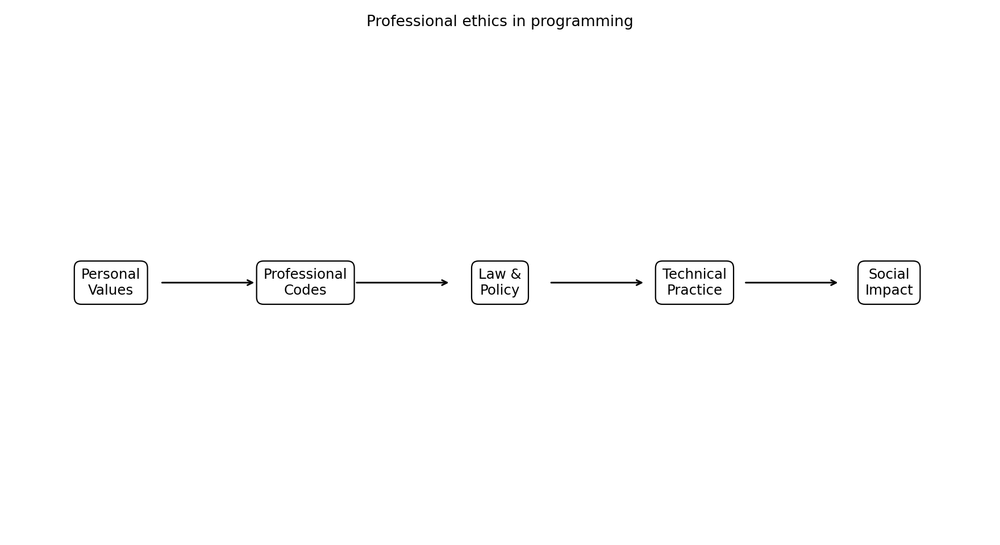
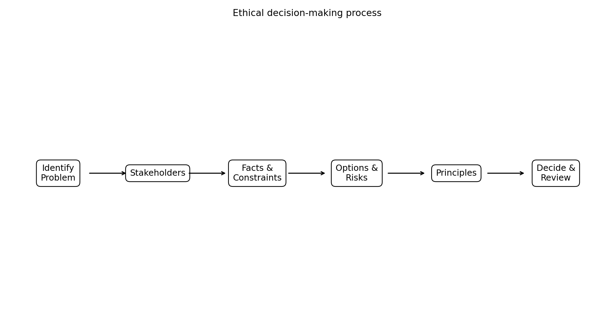
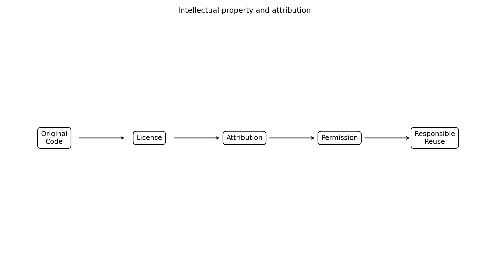
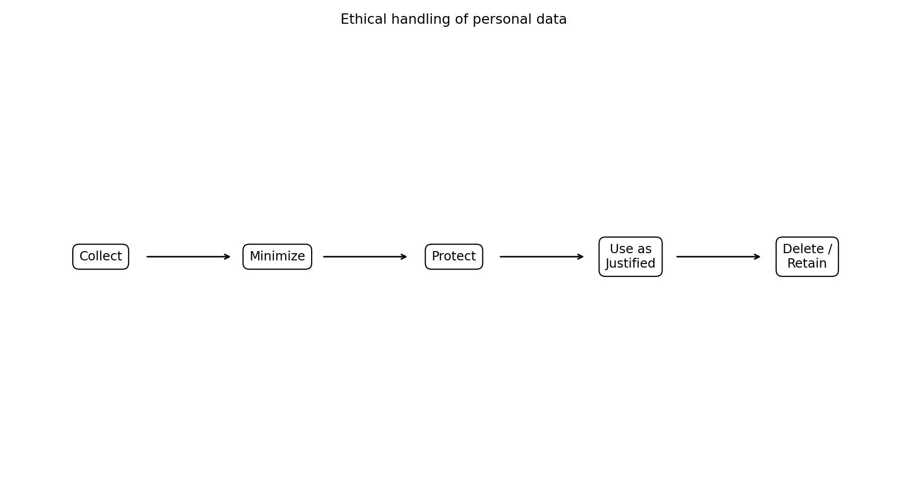
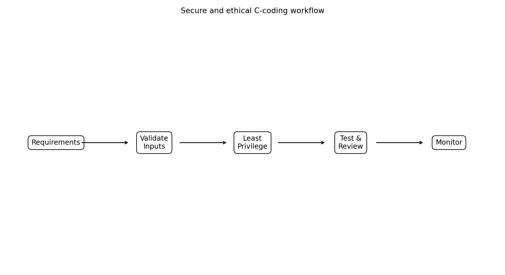
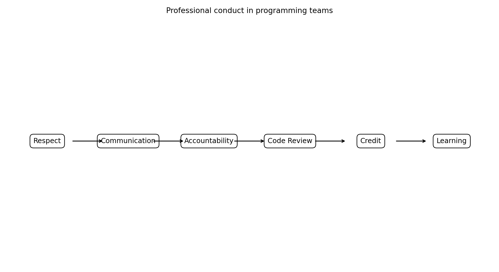
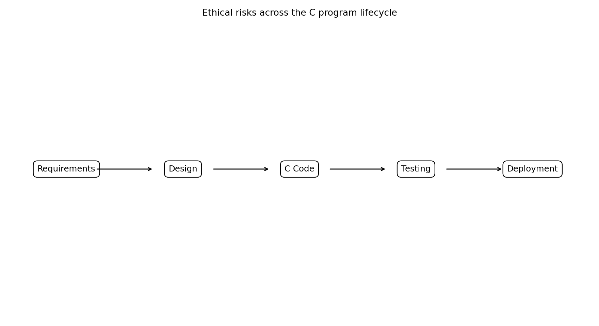
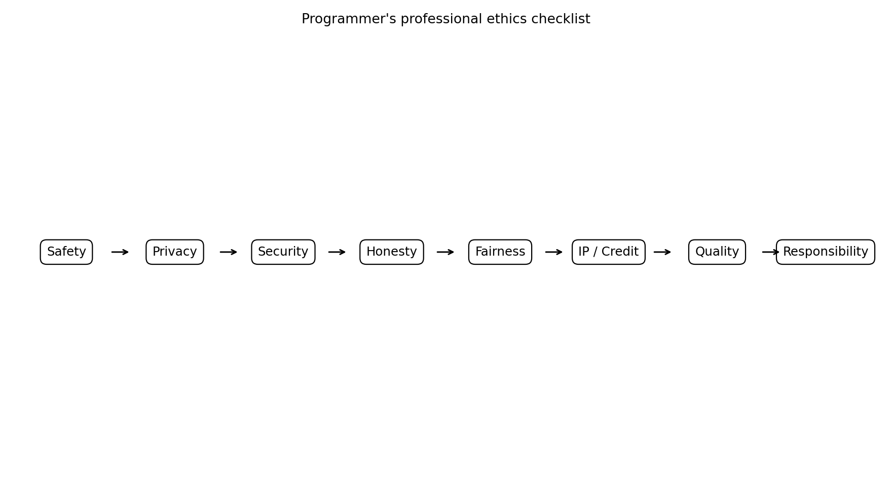

# Professional Ethics for Computer Programmers
## Reading Material for Bachelor of Engineering Students — Problem Solving Using C

**Course:** Problem Solving Using C  
**Level:** Bachelor of Engineering

---

## Learning Objectives

After studying this unit, students should be able to:

1. Explain professional ethics in programming.
2. Distinguish ethics, law, policy and personal values.
3. Identify programmer responsibilities toward users, clients, employers, colleagues and society.
4. Apply ethical principles to C programming decisions.
5. Recognize privacy, security, intellectual-property, plagiarism and academic-integrity issues.
6. Explain honesty, competence, accountability and professional communication.
7. Identify ethical risks throughout the software lifecycle.
8. Apply a practical ethical decision-making framework.
9. Demonstrate ethical conduct in team-based C projects.
10. Analyze programming ethics case studies.

---

# 1. Introduction

Programming is not only a technical activity. A programmer makes decisions that can affect people, organizations, property, privacy, safety and the environment.

Software may control machines, process student records, store personal information, operate engineering equipment or support critical infrastructure. Therefore, a programmer must ask both:

> **Can I implement this solution?**

and

> **Should I implement it this way?**

The ACM Code of Ethics emphasizes contributing to society and human well-being, avoiding harm, being honest and trustworthy, and acting fairly. citeturn0search24turn0search25



**Figure 1. Professional ethics is influenced by personal values, professional codes, law/policy, technical practice and social impact.**

# 2. Ethics and Professional Ethics

**Ethics** is the systematic consideration of right, responsible and appropriate conduct.

**Professional ethics** applies ethical principles to responsibilities arising from professional work.

For programmers, professional ethics includes:

- honesty,
- responsibility,
- competence,
- confidentiality,
- fairness,
- accountability,
- respect,
- security,
- privacy,
- intellectual-property compliance,
- quality,
- continuous learning.

The IEEE and ACM provide professional ethics frameworks for software and computing professionals. The joint IEEE-CS/ACM software engineering framework addresses public welfare, clients and employers, product quality, professional judgment, management, the profession, colleagues and lifelong learning. citeturn0search0turn0search6

# 3. Why Ethics Matters to C Programmers

A simple C program may look harmless:

```c
#include <stdio.h>

int main(void) {
    printf("Hello World\n");
    return 0;
}
```

But C is also used in:

- embedded systems,
- automotive systems,
- medical devices,
- industrial controllers,
- operating systems,
- network equipment,
- scientific instruments.

A programming defect or dishonest engineering decision can therefore have serious consequences.

```text
Programming Skill
      +
Engineering Knowledge
      +
Professional Ethics
      =
Responsible Software Professional
```

# 4. Programmer Responsibilities

A programmer has responsibilities toward:

```text
Users • Clients • Employers • Colleagues • Society • Environment
```

These responsibilities include:

- reporting important defects,
- protecting sensitive information,
- writing maintainable software,
- respecting licenses,
- acknowledging others' work,
- avoiding discrimination,
- maintaining competence,
- considering foreseeable harm.

# 5. Important Ethical Principles

## 5.1 Contribute to Society

Software should be developed with consideration for its effects on people and society.

## 5.2 Avoid Harm

Programmers should identify foreseeable negative consequences and reduce or mitigate them. citeturn0search24

## 5.3 Be Honest and Trustworthy

Do not:

- fabricate test results,
- falsify data,
- hide important limitations,
- make misleading technical claims,
- misrepresent qualifications.

The ACM Code explicitly addresses honesty, transparency and truthful representation. citeturn0search25

## 5.4 Be Fair

Software and professional behavior should support fair participation and avoid inappropriate discrimination. citeturn0search25

## 5.5 Respect Intellectual Property

Respect:

- copyrights,
- patents,
- trade secrets,
- licenses,
- attribution requirements,
- other creators' contributions. citeturn0search25

# 6. Ethics Is Not the Same as Law

Law asks:

> What is legally permitted?

Ethics asks:

> What is responsible, fair and appropriate?

An action can be legal but still ethically questionable.

For example, collecting more user information than necessary may create privacy concerns even when a particular collection practice is technically permitted.

# 7. Ethical Decision-Making

Ethical reasoning cannot always be reduced to:

```text
IF legal
THEN ethical
```

Real decisions may involve competing concerns:

```text
Privacy ↔ Business requirements
Security ↔ Convenience
Cost ↔ Quality
Deadline ↔ Safety
Performance ↔ Resource use
```

CS2023 emphasizes ethical analysis, professional responsibility and consideration of social impacts throughout computing education. citeturn0search3turn0search16



**Figure 2. A practical ethical decision-making process.**

A useful process is:

1. Identify the ethical problem.
2. Identify stakeholders.
3. Collect facts.
4. Identify constraints.
5. Generate alternatives.
6. Identify harms and benefits.
7. Consider professional codes and applicable law/policy.
8. Evaluate privacy, safety, security and fairness.
9. Choose the responsible option.
10. Document and review the decision.

# 8. Honesty in Programming

A programmer should not claim:

```text
"All tests passed."
```

unless the tests were actually performed and passed.

Do not:

- fabricate measurements,
- manipulate results,
- hide known critical bugs,
- exaggerate performance,
- misrepresent qualifications.

Honest reporting is essential to engineering trust.

# 9. Accountability

**Responsibility** is the obligation to perform work properly.

**Accountability** means being answerable for technical decisions and outcomes.

Good professional practice includes:

- documenting decisions,
- testing software,
- reporting defects,
- responding to mistakes,
- correcting errors when possible.

Do not automatically blame the compiler, operating system, customer or another programmer. Investigate the facts first.

# 10. Competence and Continuous Learning

Technology changes continuously. Professional programmers should maintain and improve their:

- programming skills,
- algorithms knowledge,
- debugging skills,
- testing skills,
- security knowledge,
- development-tool knowledge,
- professional knowledge.

CS2023 identifies continuing competence and keeping current with tools, skills and professional frameworks as part of professional development. citeturn0search3

# 11. Knowing Your Limitations

A programmer should not claim expertise they do not possess.

If asked to develop safety-critical software without sufficient experience, a responsible programmer should disclose the limitation and seek appropriate supervision, review or specialist support.

Recognizing limitations is professional behavior.

# 12. Intellectual Property and Software Licenses

Intellectual property can include:

- source code,
- algorithms,
- documentation,
- designs,
- images,
- reports,
- inventions.

Before reusing code:

```text
Find source
   ↓
Read license
   ↓
Understand permissions
   ↓
Check obligations
   ↓
Preserve required notices
   ↓
Attribute where required
```

The ACM Code specifically requires computing professionals to respect creators' work and intellectual-property protections. citeturn0search25



**Figure 5. Responsible reuse of code and other intellectual property.**

# 13. Programming Plagiarism

Programming plagiarism includes presenting another person's program, algorithm or substantial work as your own without appropriate acknowledgment or permission.

Examples:

- copying another student's C program,
- submitting internet code as original work,
- removing attribution,
- copying a project without disclosure.

Ethical practice means understanding permitted sources, following course rules and acknowledging assistance.

# 14. Academic Integrity

Academic integrity develops habits that become professional habits.

Students should not:

- submit another student's program,
- fabricate laboratory results,
- falsify project measurements,
- misrepresent team contributions.

A useful principle is:

> **The habits developed during college become habits carried into professional life.**

# 15. Privacy

Privacy concerns the appropriate collection, use, storage and disclosure of information about people.

Before collecting data, ask:

```text
Do we need this data?
       ↓
Why are we collecting it?
       ↓
Who can access it?
       ↓
How long should it be retained?
       ↓
How will it be protected?
```

# 16. Data Minimization

Collect and retain only information necessary for a legitimate purpose.

For a temperature-calculation program, information such as:

```text
Password
Home address
Personal photographs
```

would normally be unrelated to the calculation and should not be collected merely because it is technically possible.



**Figure 4. Ethical handling of personal data.**

# 17. Security as an Ethical Responsibility

Security failures can cause:

- financial loss,
- privacy violations,
- service disruption,
- identity theft,
- safety risks.

Security should therefore be considered during design and coding.

CS2023 identifies principles including **least privilege**, **fail-safe defaults**, **complete mediation**, **separation** and **minimizing trust**. citeturn0search5

# 18. Secure C Programming

C gives programmers low-level control, but that power requires care.

Potential problems include:

- buffer overflows,
- out-of-bounds access,
- use-after-free,
- invalid pointers,
- integer overflow,
- uninitialized memory,
- unsafe input.

For example:

```c
char name[10];
scanf("%s", name);
```

can be unsafe if the input is longer than the array.

A responsible programmer validates and bounds input appropriately.



**Figure 3. Security and ethical responsibility should be considered throughout the coding process.**

# 19. Input Validation

Do not assume input is valid.

A robust program should consider:

- non-numeric input,
- negative values,
- unreasonable values,
- input failure,
- unexpected characters,
- buffer limits.

General pattern:

```text
Input
 ↓
Validate
 ↓
Process
 ↓
Output
```

# 20. Least Privilege

Least privilege means giving a program only the permissions it needs.

If a C program only needs to read a data file, it should not automatically receive unrestricted system privileges.

Least privilege is also identified in current CS2023 security guidance. citeturn0search5

# 21. Confidentiality and Credentials

Protect:

- passwords,
- API keys,
- customer records,
- proprietary source code,
- research data,
- internal documents.

Avoid unnecessary hard-coded credentials such as:

```c
char password[] = "MyPassword123";
```

Production systems should use appropriate secret-management and authentication mechanisms.

# 22. Testing and Professional Responsibility

Testing should be:

- planned,
- relevant,
- repeatable,
- documented,
- honest.

For:

```c
int divide(int a, int b);
```

test cases should include ordinary and exceptional conditions:

```text
10 / 2
9 / 3
0 / 5
5 / 0
negative values
large values
```

The exact test plan depends on requirements, but important failures should never be deliberately hidden.

# 23. Quality and Maintainability

Good C programming practice includes:

- meaningful names,
- appropriate comments,
- consistent indentation,
- modular functions,
- validation,
- error handling,
- testing,
- documentation,
- reasonable complexity.

For example:

```c
double calculate_average(const int values[], int n);
```

is more descriptive than:

```c
double f(int a[], int n);
```

# 24. Code Review

Code review should identify:

- defects,
- security risks,
- unclear assumptions,
- maintainability problems,
- requirement mismatches.

A code review should focus on the work, not attack the person.

Instead of:

> "Your program is terrible."

use:

> "This function does not validate input before using it, so invalid input may produce incorrect results."

# 25. Teamwork

Professional programming is frequently collaborative.

Good teams require:

- respect,
- communication,
- trust,
- accountability,
- proper credit,
- knowledge sharing,
- constructive disagreement.



**Figure 6. Professional conduct in a programming team.**

# 26. Giving Proper Credit

Suppose:

```text
A → Program design
B → File handling
C → Testing
D → Documentation
```

The final report should accurately describe these contributions.

Do not claim all work as your own when it was performed by others.

# 27. Conflict of Interest

A conflict of interest may occur when personal interests interfere with professional judgment.

For example, recommending a library because it provides a personal benefit rather than because it is technically appropriate creates an ethical concern.

Relevant conflicts should be disclosed appropriately.

# 28. Fairness and Non-Discrimination

Programmers should treat users and colleagues fairly.

Technology can unintentionally create unfair outcomes through:

- biased data,
- inappropriate rules,
- poor accessibility,
- exclusionary design,
- discriminatory algorithms.

The ACM Code emphasizes fairness, inclusion and avoiding inappropriate discrimination. citeturn0search25

# 29. Accessibility

Where relevant, software should support users with different abilities.

Consider:

- clear text,
- understandable errors,
- keyboard accessibility,
- readable interfaces,
- alternative representations of information.

Accessibility contributes to fairness and inclusion.

# 30. Environmental Responsibility

Computing has environmental effects.

Programmers can contribute to sustainability through:

- efficient algorithms,
- efficient resource usage,
- reduced unnecessary computation,
- appropriate storage,
- responsible data retention,
- longer software/hardware life.

Environmental sustainability is included in the ACM Code's conception of professional responsibility. citeturn0search24

# 31. Open Source and Ethical Reuse

Open-source software is valuable, but:

```text
Open source ≠ no restrictions
```

Before using a library:

1. Identify the project.
2. Read the license.
3. Understand obligations.
4. Preserve required notices.
5. Provide attribution where required.
6. Follow project and organizational policies.

# 32. AI-Assisted Programming Ethics

AI tools can help programmers:

- explain C concepts,
- generate examples,
- find bugs,
- suggest tests,
- improve documentation,
- explore algorithms.

Responsible use requires:

- verifying generated code,
- understanding important code,
- testing it,
- checking security,
- protecting confidential information,
- following organizational and academic rules,
- disclosing assistance when required.

The programmer remains responsible for the software they deliver.

# 33. Confidential Information and AI

Do not automatically paste confidential code or data into external AI systems.

Before sharing information, ask:

```text
Is it confidential?
       ↓
Is external processing permitted?
       ↓
Does policy allow this tool?
       ↓
Can sensitive data be removed?
```

Potentially sensitive information includes passwords, API keys, customer data, proprietary algorithms and internal source code.

# 34. Ethical Issues Across the C Lifecycle



**Figure 7. Ethical considerations can arise at every stage of a C program lifecycle.**

### Requirements
- Is the purpose legitimate?
- Are risks identified?

### Design
- Is privacy considered?
- Is security considered?

### Coding
- Is input validated?
- Are dependencies and licenses respected?

### Testing
- Are important cases tested?
- Are results reported honestly?

### Deployment
- Are users informed?
- Are known limitations disclosed?

# 35. Case Study — Hiding a Bug

You develop C software for a laboratory instrument and discover that unusually large sensor values can produce incorrect results.

The deadline is tomorrow.

### Unethical response

Ignore the defect and claim:

```text
"The software has been fully tested."
```

### Ethical response

1. Reproduce the problem.
2. Determine severity.
3. Notify the appropriate person/team.
4. Assess affected conditions.
5. Fix or mitigate.
6. Retest.
7. Document remaining limitations.

**Discussion:** Why should safety and reliability take priority over a misleading deadline-based success claim?

# 36. Case Study — Copying Code

A student finds a C program online, changes variable names and submits it as original work.

### Issues

- plagiarism,
- academic integrity,
- possible license violation,
- lack of independent learning.

### Better practice

Use external examples to learn, follow assignment rules and provide required acknowledgment.

# 37. Case Study — Student Data

A program calculates student averages but stores:

```text
Name
Roll number
Phone
Address
Email
Marks
```

If only roll number and marks are required, unnecessary personal data should not be collected.

This is an example of **data minimization**.

# 38. Case Study — Hard-Coded Password

Consider:

```c
if (strcmp(password, "admin123") == 0) {
    printf("Access granted
");
}
```

This can be used as a simplified classroom illustration of string comparison, but it is not an appropriate pattern for real security-sensitive authentication.

Production systems require appropriate authentication, credential storage, access control and secret management.

# 39. Case Study — Misleading Performance Claim

Suppose a program is tested with ten small inputs and performs well.

The programmer claims:

```text
"The program is highly efficient for all inputs."
```

This conclusion is not justified.

A professional report should describe:

- test conditions,
- input sizes,
- environment,
- measured results,
- known limitations.

# 40. Professional Documentation

A C project should document, as appropriate:

```text
Purpose
Requirements
Compilation
Execution
Input
Output
Dependencies
Testing
Known limitations
License / attribution
```

Good documentation improves communication and maintenance.

# 41. Version Control and Ethics

Git and similar systems support:

- history,
- collaboration,
- change tracking,
- recovery,
- authorship.

Ethical use means:

- do not claim others' work,
- do not expose confidential information,
- use meaningful commit messages,
- follow team policies,
- preserve accurate contribution history.

# 42. Responsible Error Reporting

When a serious defect is found:

```text
Observe
 ↓
Verify
 ↓
Document
 ↓
Report
 ↓
Mitigate
 ↓
Track resolution
```

Do not deliberately exploit a vulnerability merely because you discovered it. Follow responsible disclosure and organizational procedures.

# 43. Ethical Coding Checklist



**Figure 8. Programmer's professional ethics checklist.**

Before submitting a C program, ask:

### Safety
Could it cause avoidable harm?

### Privacy
Am I collecting unnecessary personal information?

### Security
Are inputs, memory and permissions handled safely?

### Honesty
Are my claims and test results accurate?

### Fairness
Could the software unfairly exclude or discriminate?

### Intellectual Property
Have I respected licenses and attribution?

### Quality
Have I tested important cases?

### Responsibility
Have I documented known limitations?

# 44. Professional Ethics in a C Laboratory

Students should:

1. Follow laboratory rules.
2. Use authorized systems.
3. Never access another student's files without permission.
4. Never intentionally damage or disrupt systems.
5. Avoid plagiarism.
6. Give proper credit.
7. Report important problems.
8. Keep projects organized.
9. Test honestly.
10. Protect credentials and personal information.

# 45. Practical Exercise 1 — Ethical Code Review

Consider:

```c
#include <stdio.h>

int main(void) {
    int marks[5] = {90, 85, 78, 92, 88};

    printf("Average = %d
",
           (marks[0] + marks[1] + marks[2] +
            marks[3] + marks[4]) / 5);

    return 0;
}
```

Discuss:

1. Is it technically valid?
2. Is integer division appropriate?
3. Is student data sensitive?
4. Should student identities be stored?
5. What changes would be required for real software?
6. What documentation would be needed?

# 46. Practical Exercise 2 — Find Ethical Risks

Situation:

```text
A student downloads a C library,
copies its source into a project,
removes its copyright notice,
and submits the project.
```

Identify the:

- IP issue,
- attribution issue,
- license issue,
- academic-integrity issue.

Propose an ethical alternative.

# 47. Practical Exercise 3 — Privacy by Design

Compare:

```text
Version A:
Name, Roll No., Phone, Address, Email, Marks

Version B:
Roll No., Marks
```

Discuss which data are actually required and why.

# 48. Practical Exercise 4 — Secure Input

Analyze:

```c
char name[20];

printf("Enter name: ");
scanf("%s", name);
```

Discuss:

1. What can go wrong?
2. Why is validation important?
3. How can input be bounded?
4. What other input problems should be handled?

# 49. Practical Exercise 5 — Honest Testing

Implement:

```c
int divide(int a, int b);
```

Test:

| Test | Input | Expected behavior |
|---|---|---|
| 1 | 10, 2 | 5 |
| 2 | 9, 3 | 3 |
| 3 | 0, 5 | 0 |
| 4 | 5, 0 | Error handling |
| 5 | -10, 2 | -5 |

Discuss why a professional should not report only successful tests.

# 50. Practical Exercise 6 — Team Ethics

Form teams of 4–5 students and assign:

- programmer,
- tester,
- reviewer,
- documentation engineer,
- project coordinator.

At the end, each student documents their actual contribution.

Discuss:

> Why is accurate attribution important in team software development?

# 51. Mini Project — Ethical Engineering Data System

Develop a C program that stores:

```text
Measurement ID
Sensor ID
Temperature
Pressure
Timestamp
```

### Features

1. Add measurements.
2. Display measurements.
3. Search measurements.
4. Calculate averages.
5. Find minimum and maximum.
6. Save/load data.
7. Generate a summary report.

### Ethical documentation

Also document:

- data collected,
- purpose,
- access control,
- invalid-input handling,
- error reporting,
- testing,
- external code/libraries,
- licenses,
- team contributions,
- ethical concerns.

# 52. Ethical Design Template

```text
Project:
Purpose:

Stakeholders:
Potential benefits:
Potential harms:

Data collected:
Why needed:
Security measures:
Privacy considerations:
Accessibility considerations:

External code/libraries:
License information:

Testing performed:
Known limitations:
Team contributions:
Ethical concerns:

Final decision:
```

# 53. Professional Problem-Solving Process

A responsible C problem-solving process can be:

```text
Understand Problem
       ↓
Identify Stakeholders
       ↓
Define Requirements
       ↓
Consider Ethical Constraints
       ↓
Design Algorithm
       ↓
Write C Program
       ↓
Test
       ↓
Review Security / Privacy / Fairness
       ↓
Document
       ↓
Deploy Responsibly
       ↓
Improve
```

Ethical reasoning is therefore part of problem solving, not a separate activity.

# 54. Common Unethical Practices

Avoid:

- plagiarism,
- code theft,
- license violations,
- fabricated test results,
- falsified data,
- hidden defects,
- unauthorized access,
- credential sharing,
- privacy violations,
- discriminatory design,
- misleading performance claims,
- deliberate concealment of security weaknesses,
- claiming another person's contribution.

# 55. Good Professional Practices

Adopt:

- honest reporting,
- code review,
- testing,
- documentation,
- secure coding,
- input validation,
- least privilege,
- proper attribution,
- license compliance,
- respectful teamwork,
- continuous learning,
- responsible disclosure,
- clear communication,
- consideration of social impact.

# 56. Review Questions

## Short Answer

1. Define professional ethics.
2. Why is ethics important for programmers?
3. Differentiate ethics and law.
4. What is professional accountability?
5. What is intellectual property?
6. What is plagiarism?
7. Why is attribution important?
8. What is software licensing?
9. What is data privacy?
10. What is data minimization?
11. What is least privilege?
12. Why is input validation important in C?
13. Why should known defects be reported?
14. Why is continuous learning important?
15. What is a conflict of interest?
16. Why is code review useful?
17. What is responsible testing?
18. Why should confidential information be protected?
19. What are ethical concerns in AI-assisted programming?
20. Why is professional communication important?

## Descriptive Questions

1. Explain professional ethics for computer programmers.
2. Discuss programmer responsibilities toward users and society.
3. Explain ACM/IEEE professional ethics frameworks.
4. Discuss intellectual property and software licensing.
5. Explain programming plagiarism and academic integrity.
6. Discuss privacy and data minimization using a C example.
7. Explain security as an ethical responsibility.
8. Discuss responsible use of AI-assisted programming.
9. Explain ethical issues throughout the C development lifecycle.
10. Discuss professional conduct in programming teams.
11. Explain why honest testing is an ethical requirement.
12. Discuss continuous learning as professional responsibility.
13. Analyze the ethics of hiding a critical defect.
14. Explain how ethical thinking can be integrated into problem solving using C.

# 57. Key Takeaways

1. Programming is both technical and professional.
2. Software decisions can affect users, organizations and society.
3. Programmers should be honest and trustworthy.
4. Foreseeable harm should be reduced or mitigated.
5. Privacy and security belong in the design process.
6. C programmers must pay particular attention to memory safety and input validation.
7. Intellectual property and licenses must be respected.
8. Academic integrity supports professional integrity.
9. Test results and technical claims should be truthful.
10. Contributions from others should be acknowledged.
11. Professional teams require respect and accountability.
12. Programmers should continuously improve their competence.
13. AI tools can assist programming, but humans remain responsible for code they use.
14. Ethical reasoning belongs in the complete problem-solving lifecycle.

# 58. Final Perspective

A professional programmer is not simply someone who makes code compile.

A professional programmer asks:

```text
Is the solution correct?
        ↓
Is it safe?
        ↓
Is it secure?
        ↓
Does it respect privacy?
        ↓
Is it fair?
        ↓
Does it respect intellectual property?
        ↓
Have I tested it honestly?
        ↓
Have I communicated limitations?
        ↓
Could it cause avoidable harm?
```

The goal is:

```text
Programming Skill
       +
Problem-Solving Ability
       +
Engineering Judgment
       +
Professional Ethics
       ↓
Responsible Computing Professional
```

Ethics is therefore part of what it means to be a competent engineering professional.

# References and Further Reading

1. **ACM Code of Ethics and Professional Conduct** — public good, avoiding harm, honesty, fairness and intellectual property. citeturn0search24turn0search25
2. **IEEE TechEthics — IEEE Frameworks** — IEEE and IEEE-CS/ACM professional ethics frameworks. citeturn0search0
3. **IEEE Technology Navigator — Ethics** — engineering ethics, public welfare, conflicts of interest, honesty and responsibility. citeturn0search10
4. **ACM CS2023 — Society, Ethics and Professionalism** — professional ethics, IP, plagiarism and programmer responsibility. citeturn0search3turn0search16
5. **ACM Software Engineering Guidance** — ethical and professional software engineering responsibilities. citeturn0search11

## Suggested Teaching Sequence

```text
Ethics
 ↓
Professional Ethics
 ↓
Programmer Responsibilities
 ↓
ACM / IEEE Codes
 ↓
Honesty & Accountability
 ↓
IP & Academic Integrity
 ↓
Privacy & Security
 ↓
Fairness & Accessibility
 ↓
Teamwork & Communication
 ↓
AI-Assisted Programming Ethics
 ↓
Ethical C Programming
 ↓
Case Studies
 ↓
Mini Project
```
