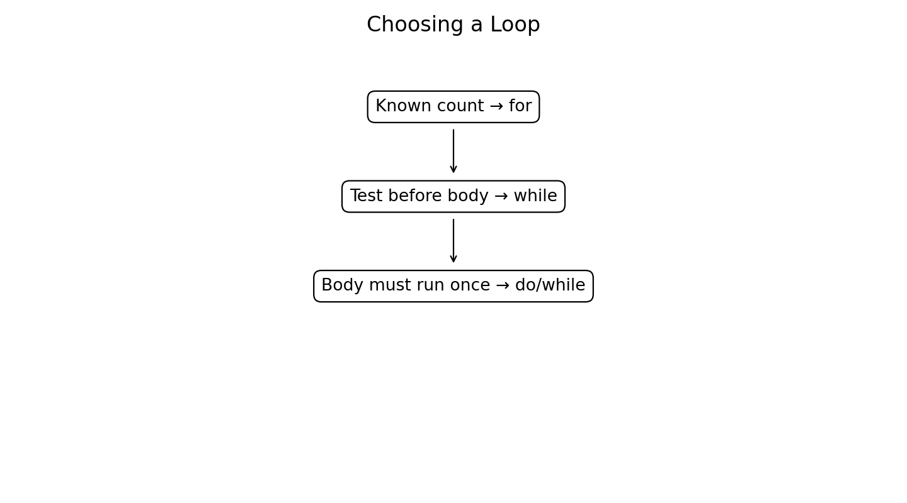
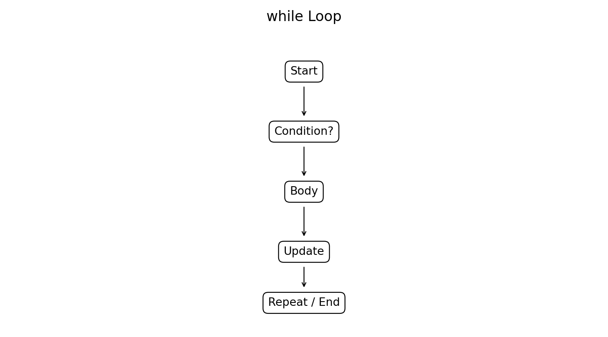
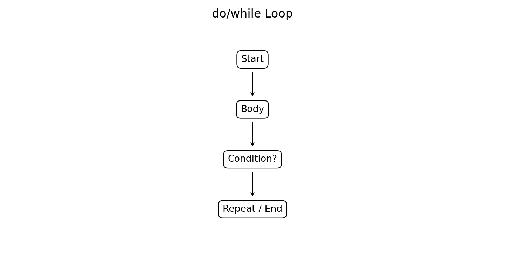
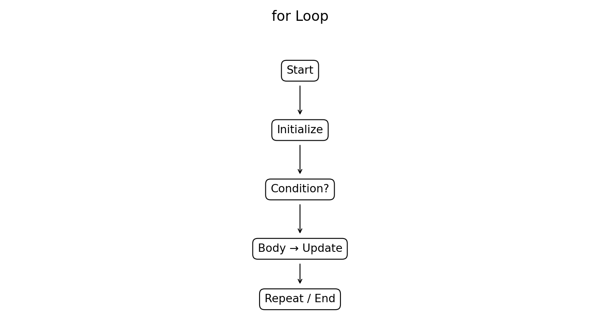
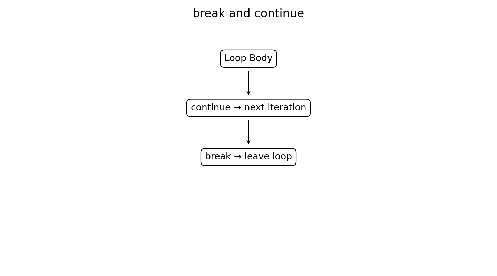
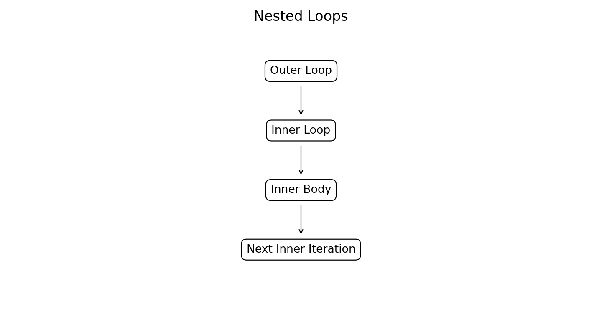

# :classical_building: Problem Solving Using Programming - B.Tech-IT, IIIT Allahabad
## Unit 3: Input-Output, Iterative and Conditional Statements
* ### Current Topic: Loop Structures in C
* **Purpose:** Introduce Basic Programming entities
---

---
## 👥 Instructor Information
* **Edited by Instructor:** [Dr. Mohammed Javed](https://sites.google.com/site/mohammedjaved2016/)
* **Email:** javed@iiita.ac.in
* **Senior Teaching Assistants:** Mr. Subrata Pramanik (pmm2024003@iiita.ac.in)
---
## 🎯 Learning Objectives

- Explain iteration and repetition.
- Use `while`, `do/while`, and `for`.
- Use `break`, `continue`, and `exit()`.
- Write nested loops.
- Trace loops and identify infinite/off-by-one errors.
- Apply loops to engineering problems.

## 1. Introduction
Loops repeat a block of statements. They are essential for sensor processing, arrays, simulations, searching, numerical computation, and continuous monitoring.



## 2. `while` Loop
A `while` loop is a **pre-test loop**.

```c
while (condition)
{
    statements;
}
```



Example:

```c
#include <stdio.h>

int main(void)
{
    int i = 1;

    while (i <= 5)
    {
        printf("%d\n", i);
        i++;
    }

    return 0;
}
```

Output:
```text
1
2
3
4
5
```

If the condition is false initially, the body executes zero times.

### Engineering example

```c
#include <stdio.h>

int main(void)
{
    int i = 1;
    double sum = 0.0;

    while (i <= 10)
    {
        double measurement = i * 2.5;
        sum += measurement;
        i++;
    }

    printf("Total = %.2f\n", sum);
    return 0;
}
```

Output:
```text
Total = 137.50
```

## 3. Sentinel-controlled `while`

```c
#include <stdio.h>

int main(void)
{
    int value, sum = 0;

    scanf("%d", &value);

    while (value != -1)
    {
        sum += value;
        scanf("%d", &value);
    }

    printf("Sum = %d\n", sum);
    return 0;
}
```

For input `10 20 30 -1`, output is:

```text
Sum = 60
```

## 4. `do/while` Loop
A `do/while` loop is a **post-test loop** and executes at least once.

```c
do
{
    statements;
}
while (condition);
```



Example:

```c
#include <stdio.h>

int main(void)
{
    int i = 1;

    do
    {
        printf("%d\n", i);
        i++;
    }
    while (i <= 5);

    return 0;
}
```

Output:
```text
1
2
3
4
5
```

**Note:** The semicolon after `while (condition);` is required.

### `while` vs `do/while`

| Feature | `while` | `do/while` |
|---|---|---|
| Test | Before body | After body |
| Minimum executions | 0 | 1 |
| Typical use | Condition-controlled | Menus/input |

## 5. Menu using `do/while`

```c
#include <stdio.h>

int main(void)
{
    int choice;

    do
    {
        printf("\n1. Start\n2. Stop\n3. Exit\n");
        printf("Enter choice: ");
        scanf("%d", &choice);

        switch (choice)
        {
            case 1: printf("System started.\n"); break;
            case 2: printf("System stopped.\n"); break;
            case 3: printf("Exiting.\n"); break;
            default: printf("Invalid choice.\n");
        }
    }
    while (choice != 3);

    return 0;
}
```

## 6. `for` Loop
The `for` loop is particularly useful for counter-controlled repetition.

```c
for (initialization; condition; update)
{
    statements;
}
```



Example:

```c
#include <stdio.h>

int main(void)
{
    for (int i = 1; i <= 10; i++)
        printf("%d ", i);

    printf("\n");
    return 0;
}
```

Output:
```text
1 2 3 4 5 6 7 8 9 10
```

### Engineering example

```c
#include <stdio.h>

int main(void)
{
    for (int i = 1; i <= 5; i++)
    {
        double measurement = 10.0 + i * 0.5;
        printf("Measurement %d = %.2f\n", i, measurement);
    }
    return 0;
}
```

Output:
```text
Measurement 1 = 10.50
Measurement 2 = 11.00
Measurement 3 = 11.50
Measurement 4 = 12.00
Measurement 5 = 12.50
```

## 7. Infinite Loops
An infinite loop never terminates.

```c
while (1)
{
    /* continuous operation */
}
```

Accidental example:

```c
int i = 1;

while (i <= 10)
{
    printf("%d\n", i);
    /* i never changes */
}
```

Correct:

```c
while (i <= 10)
{
    printf("%d\n", i);
    i++;
}
```

Infinite loops can be intentional in embedded systems.

## 8. `break`
`break` terminates the nearest enclosing loop.



```c
#include <stdio.h>

int main(void)
{
    for (int i = 1; i <= 10; i++)
    {
        if (i == 6)
            break;

        printf("%d ", i);
    }
    return 0;
}
```

Output:
```text
1 2 3 4 5
```

### Search example

```c
#include <stdio.h>

int main(void)
{
    int target = 7;

    for (int i = 1; i <= 10; i++)
    {
        if (i == target)
        {
            printf("Target found at %d\n", i);
            break;
        }
    }
    return 0;
}
```

Output:
```text
Target found at 7
```

## 9. `continue`
`continue` skips the rest of the current iteration.

```c
#include <stdio.h>

int main(void)
{
    for (int i = 1; i <= 10; i++)
    {
        if (i % 2 == 0)
            continue;

        printf("%d ", i);
    }
    return 0;
}
```

Output:
```text
1 3 5 7 9
```

### Difference

| Statement | Effect |
|---|---|
| `break` | Stop the nearest loop |
| `continue` | Skip current iteration |

**Caution:** In a `while` loop, `continue` can accidentally skip the update and cause an infinite loop.

## 10. Nested Loops

A loop inside another loop is a nested loop.



```c
#include <stdio.h>

int main(void)
{
    for (int i = 1; i <= 3; i++)
    {
        for (int j = 1; j <= 4; j++)
            printf("(%d,%d) ", i, j);

        printf("\n");
    }
    return 0;
}
```

Output:
```text
(1,1) (1,2) (1,3) (1,4)
(2,1) (2,2) (2,3) (2,4)
(3,1) (3,2) (3,3) (3,4)
```

Applications include matrices, tables, image processing, and simulations.

## 11. `exit()` Function

`exit()` terminates the **entire program** and is declared in `<stdlib.h>`.

```c
exit(EXIT_SUCCESS);
exit(EXIT_FAILURE);
```

Example:

```c
#include <stdio.h>
#include <stdlib.h>

int main(void)
{
    int value = -5;

    if (value < 0)
    {
        printf("Invalid input.\n");
        exit(EXIT_FAILURE);
    }

    printf("Processing continues...\n");
    return 0;
}
```

Output:
```text
Invalid input.
```

### `break` vs `exit()`

```text
break  → leave the nearest loop
exit() → terminate the entire program
```

## 12. Engineering Example — First Fault

```c
#include <stdio.h>

int main(void)
{
    int sensor[] = {10, 12, 15, 18, -1, 20};

    for (int i = 0; i < 6; i++)
    {
        if (sensor[i] < 0)
        {
            printf("Fault found at position %d\n", i);
            break;
        }
    }
    return 0;
}
```

Output:
```text
Fault found at position 4
```

## 13. Engineering Example — Critical Failure

```c
#include <stdio.h>
#include <stdlib.h>

int main(void)
{
    double pressure = 15.0;
    const double critical_pressure = 12.0;

    for (int cycle = 1; cycle <= 10; cycle++)
    {
        printf("Cycle %d\n", cycle);

        if (pressure > critical_pressure)
        {
            printf("CRITICAL PRESSURE! Shutting down.\n");
            exit(EXIT_FAILURE);
        }
    }

    return 0;
}
```

Output:
```text
Cycle 1
CRITICAL PRESSURE! Shutting down.
```

## 14. Common Loop Errors

### Missing update

```c
while (i <= 10)
{
    printf("%d\n", i);
}
```

### Off-by-one error

```c
for (int i = 0; i <= 10; i++)
```

runs 11 times.

For exactly 10 iterations:

```c
for (int i = 0; i < 10; i++)
```

### Other errors

- Incorrect termination condition.
- `continue` skipping the loop update.
- Incorrect nesting.
- Missing `do/while` semicolon.
- Unexpected `break`.
- Accidental infinite loop.

## 15. Best Practices

1. Initialize loop variables clearly.
2. Make termination conditions obvious.
3. Ensure loop-control variables change.
4. Test boundary conditions.
5. Avoid accidental infinite loops.
6. Use meaningful variable names.
7. Use braces for clarity.
8. Avoid unnecessary deep nesting.
9. Use `break` for logical early termination.
10. Use `continue` only when it improves clarity.
11. Use `exit()` for program-level termination.
12. Trace loops during debugging.

## 16. Laboratory Exercises

1. Calculate `1 + 2 + ... + n` using `for`.
2. Calculate factorial using `while`.
3. Create an arithmetic menu using `do/while`.
4. Read 10 measurements and skip negative values with `continue`.
5. Search an array and stop with `break`.
6. Print a triangle of `*` using nested loops.
7. Simulate 20 sensor readings using `continue` for invalid values and `break` for critical values.

## 17. Mini Project — Engineering Equipment Monitor

Develop a C program that:

- Displays a menu.
- Accepts a measurement.
- Classifies it as Normal, Warning, or Critical.
- Uses `continue` for invalid measurements.
- Uses `break` for operator shutdown.
- Uses `exit(EXIT_FAILURE)` for an emergency condition.
- Repeats until shutdown.

## 18. Debugging Checklist

Ask:

1. Is the loop variable initialized?
2. Is the condition correct?
3. Does the variable change?
4. Can the condition become false?
5. Is there an off-by-one error?
6. Did `continue` skip an update?
7. Did `break` terminate the intended loop?
8. Is `exit()` terminating the whole program?
9. Are nested-loop variables correct?
10. Are boundary cases tested?

## 19. Viva Questions

1. What is iteration?
2. What is a loop?
3. What is a `while` loop?
4. Why is `while` a pre-test loop?
5. What is a `do/while` loop?
6. Why does `do/while` execute at least once?
7. What are the three components of a `for` loop?
8. What is an infinite loop?
9. What is an off-by-one error?
10. What does `break` do?
11. What does `continue` do?
12. Differentiate `break` and `continue`.
13. What is `exit()`?
14. Differentiate `break` and `exit()`.
15. What is a nested loop?
16. When should `for` be used?
17. When is `do/while` useful?
18. What is a sentinel-controlled loop?
19. Give two engineering applications of loops.
20. Why must loop termination conditions be tested?

## 20. Key Takeaways

```text
while    → test first; 0 or more executions
do/while → execute first; 1 or more executions
for      → counter-controlled repetition
break    → leave nearest loop
continue → skip current iteration
exit()   → terminate entire program
```

Loops are fundamental to engineering programming because they support repeated calculations, data acquisition, simulations, searching, numerical methods, and continuous monitoring.

## GitHub Folder Structure

```text
c-loop-structures/
├── README.md
├── c_loop_structures.md
└── figures/
    ├── 01_while_flowchart.png
    ├── 02_do_while_flowchart.png
    ├── 03_for_flowchart.png
    ├── 04_break_continue.png
    ├── 05_loop_comparison.png
    └── 06_nested_loops.png
```
