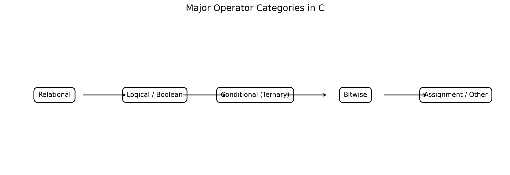
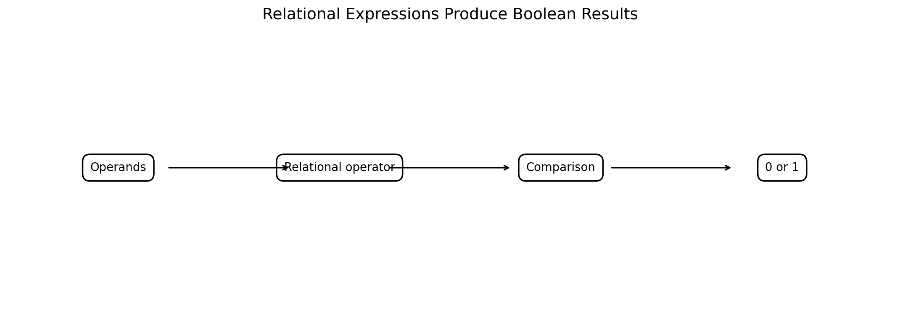
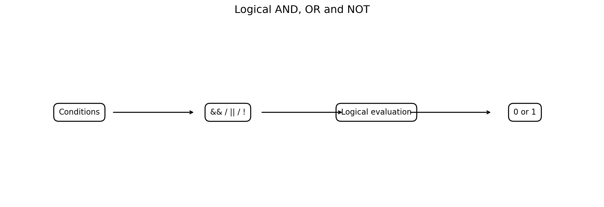
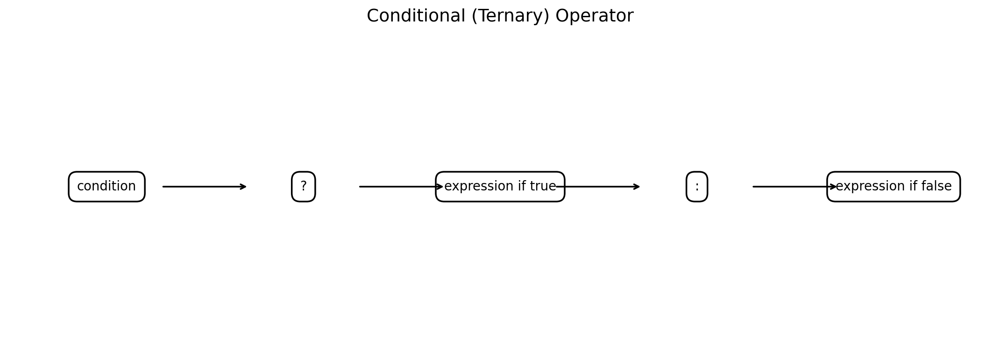
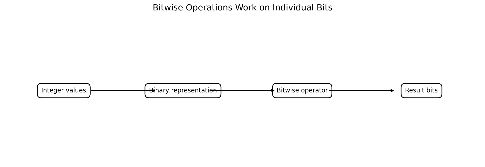
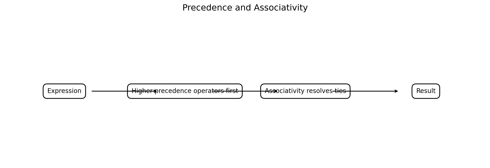
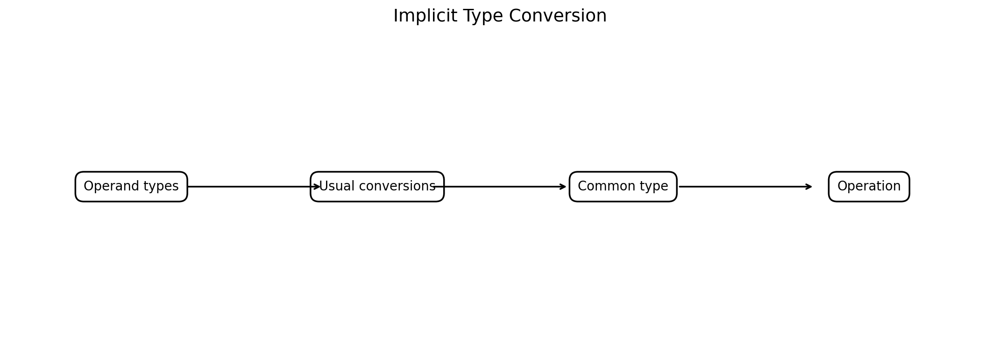
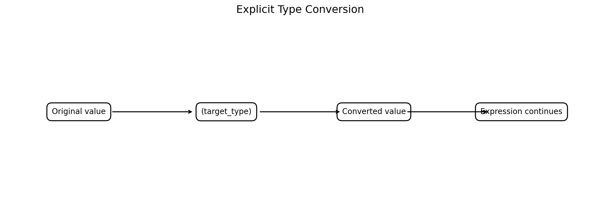

# Operators, Precedence and Associativity, and Type Conversion in C

**Course:** Problem Solving Using C  
**Level:** Bachelor of Engineering  
**Topic:** Relational, Logical, Boolean, Ternary, Bitwise, Conditional Operators; Precedence and Associativity; Implicit and Explicit Type Conversion

---

## Learning Objectives

After completing this chapter, students should be able to:

1. Explain the purpose of operators in C.
2. Use relational operators to compare values.
3. Use logical and Boolean expressions to make decisions.
4. Use the conditional/ternary operator for compact conditional expressions.
5. Perform bitwise operations on integer values.
6. Distinguish logical operators from bitwise operators.
7. Explain operator precedence and associativity.
8. Evaluate complex C expressions systematically.
9. Explain implicit type conversion.
10. Perform explicit type conversion using casts.
11. Identify common conversion-related errors.
12. Apply operators and type conversion to engineering calculations and problem-solving tasks.

---

# 1. Introduction to Operators

An **operator** is a symbol or construct that tells C to perform an operation on one or more operands.

Examples:

```c
a + b
x > y
p && q
n << 2
condition ? x : y
```

Here:

- `a`, `b`, `x`, `y`, `p`, `q`, `n` are operands.
- `+`, `>`, `&&`, `<<`, `?:` are operators.

Operators are fundamental to translating a problem-solving algorithm into a C program.



**Figure 1. Major operator categories relevant to this chapter.**

---

# 2. Relational Operators

Relational operators compare two values.

The main relational operators are:

| Operator | Meaning |
|---|---|
| `<` | less than |
| `>` | greater than |
| `<=` | less than or equal to |
| `>=` | greater than or equal to |
| `==` | equal to |
| `!=` | not equal to |

Example:

```c
int a = 10;
int b = 20;

printf("%d\n", a < b);
```

Output:

```text
1
```

In C, a relational expression evaluates to:

```text
0 → false
1 → true
```



---

# 3. Relational Operator Example

```c
#include <stdio.h>

int main(void)
{
    int temperature = 35;

    printf("temperature > 30  = %d\n", temperature > 30);
    printf("temperature < 30  = %d\n", temperature < 30);
    printf("temperature == 35 = %d\n", temperature == 35);
    printf("temperature != 35 = %d\n", temperature != 35);

    return 0;
}
```

Output:

```text
temperature > 30  = 1
temperature < 30  = 0
temperature == 35 = 1
temperature != 35 = 0
```

---

# 4. `=` Versus `==`

A very common beginner mistake is confusing:

```c
=
```

with:

```c
==
```

### Assignment

```c
x = 10;
```

means:

> Store 10 in `x`.

### Equality comparison

```c
x == 10
```

means:

> Is `x` equal to 10?

Example:

```c
if (x == 10)
{
    printf("x is 10\n");
}
```

---

# 5. Relational Operators in Engineering Problems

Suppose a system is safe only when pressure is below a maximum limit.

```c
#include <stdio.h>

int main(void)
{
    double pressure = 8.5;
    double maximum = 10.0;

    if (pressure <= maximum)
    {
        printf("Pressure is within the safe limit.\n");
    }
    else
    {
        printf("Warning: pressure exceeds the safe limit.\n");
    }

    return 0;
}
```

Output:

```text
Pressure is within the safe limit.
```

Relational operators therefore form the basis of many engineering decision-making programs.

---

# 6. Logical Operators

C provides three primary logical operators:

| Operator | Meaning |
|---|---|
| `&&` | Logical AND |
| `||` | Logical OR |
| `!` | Logical NOT |



---

# 7. Logical AND — `&&`

The expression:

```c
A && B
```

is true only when both `A` and `B` are true.

Truth table:

| A | B | `A && B` |
|---:|---:|---:|
| 0 | 0 | 0 |
| 0 | 1 | 0 |
| 1 | 0 | 0 |
| 1 | 1 | 1 |

Example:

```c
int age = 20;
int has_id = 1;

if (age >= 18 && has_id)
{
    printf("Entry permitted.\n");
}
```

Output:

```text
Entry permitted.
```

---

# 8. Logical OR — `||`

The expression:

```c
A || B
```

is true if at least one condition is true.

Truth table:

| A | B | `A || B` |
|---:|---:|---:|
| 0 | 0 | 0 |
| 0 | 1 | 1 |
| 1 | 0 | 1 |
| 1 | 1 | 1 |

Example:

```c
int emergency = 0;
int maintenance = 1;

if (emergency || maintenance)
{
    printf("Special operating mode.\n");
}
```

Output:

```text
Special operating mode.
```

---

# 9. Logical NOT — `!`

The operator:

```c
!A
```

reverses the logical value.

| A | `!A` |
|---:|---:|
| 0 | 1 |
| 1 | 0 |

Example:

```c
int motor_running = 0;

if (!motor_running)
{
    printf("Motor is stopped.\n");
}
```

Output:

```text
Motor is stopped.
```

---

# 10. Boolean Values in C

C's logical operators treat:

```text
0 → false
nonzero → true
```

When a logical or relational expression is evaluated as a result, C produces an `int` value of:

```text
0 or 1
```

For programs that explicitly use Boolean objects, modern C provides:

```c
#include <stdbool.h>
```

Example:

```c
#include <stdio.h>
#include <stdbool.h>

int main(void)
{
    bool sensor_ok = true;

    if (sensor_ok)
    {
        printf("Sensor is operational.\n");
    }

    return 0;
}
```

Output:

```text
Sensor is operational.
```

---

# 11. Logical vs Bitwise Operators

Do not confuse:

```c
&&
||
!
```

with:

```c
&
|
~
^
```

Logical operators work with **logical truth values**.

Bitwise operators work on **individual bits** of integer operands.

| Logical | Bitwise |
|---|---|
| `&&` | `&` |
| `||` | `|` |
| `!` | `~` |
| — | `^` |
| — | `<<`, `>>` |

This distinction is extremely important in C programming.

---

# 12. Short-Circuit Evaluation

C's logical operators have an important property called **short-circuit evaluation**.

For:

```c
A && B
```

if `A` is false, `B` does not need to be evaluated.

For:

```c
A || B
```

if `A` is true, `B` does not need to be evaluated.

Example:

```c
if (denominator != 0 && numerator / denominator > 2)
{
    printf("Condition satisfied.\n");
}
```

The first condition prevents the division from being attempted when `denominator` is zero.

This is a useful problem-solving pattern.

---

# 13. Conditional / Ternary Operator

The conditional operator is:

```c
? :
```

It is often called the **ternary operator** because it has three operands.

General form:

```c
condition ? expression_if_true : expression_if_false
```



Example:

```c
int a = 10;
int b = 20;

int max = (a > b) ? a : b;
```

Here:

```text
if a > b
    max = a
else
    max = b
```

---

# 14. Ternary Operator Example

```c
#include <stdio.h>

int main(void)
{
    int marks = 72;

    const char *result =
        (marks >= 40) ? "Pass" : "Fail";

    printf("Result = %s\n", result);

    return 0;
}
```

Output:

```text
Result = Pass
```

---

# 15. Ternary Operator for Maximum

```c
#include <stdio.h>

int main(void)
{
    int a = 45;
    int b = 78;

    int maximum = (a > b) ? a : b;

    printf("Maximum = %d\n", maximum);

    return 0;
}
```

Output:

```text
Maximum = 78
```

### Important

The ternary operator is useful for simple alternatives. For complicated decision logic, an `if-else` statement is usually clearer.

---

# 16. Bitwise Operators

Bitwise operators operate on individual bits of integer operands.

The main bitwise operators are:

| Operator | Operation |
|---|---|
| `&` | Bitwise AND |
| `|` | Bitwise OR |
| `^` | Bitwise XOR |
| `~` | Bitwise NOT |
| `<<` | Left shift |
| `>>` | Right shift |



---

# 17. Binary Representation

Consider:

```text
5 = 0101
3 = 0011
```

Bitwise operations operate on corresponding bits.

For AND:

```text
  0101
& 0011
------
  0001
```

Therefore:

```c
5 & 3
```

produces:

```text
1
```

---

# 18. Bitwise AND — `&`

Example:

```c
#include <stdio.h>

int main(void)
{
    unsigned int a = 5;
    unsigned int b = 3;

    printf("%u\n", a & b);

    return 0;
}
```

Output:

```text
1
```

Bitwise AND is commonly used for:

- bit masks,
- embedded systems,
- hardware registers,
- permission flags,
- low-level data processing.

---

# 19. Bitwise OR — `|`

```text
  0101
| 0011
------
  0111
```

Therefore:

```c
5 | 3
```

produces:

```text
7
```

Program:

```c
#include <stdio.h>

int main(void)
{
    unsigned int a = 5;
    unsigned int b = 3;

    printf("%u\n", a | b);

    return 0;
}
```

Output:

```text
7
```

---

# 20. Bitwise XOR — `^`

XOR produces 1 when corresponding bits differ.

```text
  0101
^ 0011
------
  0110
```

Thus:

```c
5 ^ 3
```

produces:

```text
6
```

---

# 21. Bitwise NOT — `~`

The operator:

```c
~x
```

flips every bit of the operand's representation.

Example:

```c
unsigned int x = 5;
unsigned int result = ~x;
```

The exact decimal result depends on the width of `unsigned int` on the implementation.

Therefore, when teaching bitwise NOT, it is better to demonstrate the operation in terms of a specified bit width or focus on the bit pattern itself.

---

# 22. Left Shift — `<<`

Example:

```c
unsigned int x = 5;

printf("%u\n", x << 1);
```

For this example, the result is:

```text
10
```

Conceptually:

```text
0101 << 1
= 1010
```

For suitable unsigned values, left shifting by one position corresponds to multiplying by 2, provided no significant information is discarded.

---

# 23. Right Shift — `>>`

Example:

```c
unsigned int x = 20;

printf("%u\n", x >> 2);
```

Output:

```text
5
```

Conceptually:

```text
10100 >> 2
= 00101
```

For unsigned integers, right shift introduces zero bits from the left.

---

# 24. Engineering Application — Bit Flags

Suppose a controller stores three status flags:

```text
Bit 0 → Motor ON
Bit 1 → Alarm
Bit 2 → Maintenance
```

The bitwise AND operation can test a flag.

Example:

```c
#include <stdio.h>

#define MOTOR_ON  (1u << 0)
#define ALARM     (1u << 1)
#define MAINTENANCE (1u << 2)

int main(void)
{
    unsigned int status = MOTOR_ON | ALARM;

    if (status & MOTOR_ON)
    {
        printf("Motor is ON.\n");
    }

    if (status & ALARM)
    {
        printf("Alarm is active.\n");
    }

    if (!(status & MAINTENANCE))
    {
        printf("Maintenance flag is not active.\n");
    }

    return 0;
}
```

Output:

```text
Motor is ON.
Alarm is active.
Maintenance flag is not active.
```

This is a common pattern in embedded and computer engineering.

---

# 25. Operator Precedence

An expression can contain multiple operators.

For example:

```c
result = 2 + 3 * 4;
```

Does C calculate:

```text
(2 + 3) * 4 = 20
```

or:

```text
2 + (3 * 4) = 14
```

The answer is:

```text
14
```

because multiplication has higher precedence than addition.



---

# 26. What Is Precedence?

**Precedence** determines which operators bind more strongly when an expression contains different operators.

For example:

```c
a + b * c
```

is interpreted as:

```c
a + (b * c)
```

because `*` has higher precedence than `+`.

---

# 27. What Is Associativity?

When operators at the same precedence level occur together, **associativity** helps determine how they are grouped.

For example:

```c
a - b - c
```

is grouped as:

```c
(a - b) - c
```

because the relevant operators associate from left to right.

---

# 28. Important Operator Precedence Groups

A simplified hierarchy useful for introductory C programming is:

| Priority | Operators / Constructs | Associativity |
|---|---|---|
| High | postfix operators such as `()` `[]` | Left → Right |
| | unary operators such as `!`, `~`, unary `+`, unary `-`, casts | Right → Left |
| | `*`, `/`, `%` | Left → Right |
| | `+`, `-` | Left → Right |
| | `<<`, `>>` | Left → Right |
| | `<`, `<=`, `>`, `>=` | Left → Right |
| | `==`, `!=` | Left → Right |
| | `&` | Left → Right |
| | `^` | Left → Right |
| | `|` | Left → Right |
| | `&&` | Left → Right |
| | `||` | Left → Right |
| | `?:` | Right → Left |
| Low | assignment operators | Right → Left |

This is a **simplified teaching table**, not a complete C operator-precedence table.

---

# 29. Example of Precedence

Consider:

```c
int result = 5 + 2 * 3;
```

First:

```text
2 * 3 = 6
```

Then:

```text
5 + 6 = 11
```

Therefore:

```text
result = 11
```

---

# 30. Parentheses Override Default Grouping

Compare:

```c
5 + 2 * 3
```

with:

```c
(5 + 2) * 3
```

Results:

```text
5 + 2 * 3     → 11
(5 + 2) * 3   → 21
```

### Good programming practice

Use parentheses when they improve readability.

Instead of relying on readers to remember:

```c
a + b * c
```

you can write:

```c
a + (b * c)
```

when the grouping is important to the meaning of the algorithm.

---

# 31. Do Not Memorize Everything

Students should understand precedence, but they do not need to memorize the complete table before writing programs.

Use:

```c
()
```

to make intended grouping explicit.

For example:

```c
if ((temperature > 20) && (pressure < 10))
{
    ...
}
```

is clearer than relying on implicit grouping.

---

# 32. Example — Complex Condition

```c
if (temperature >= 20 &&
    temperature <= 30 &&
    pressure < 10)
{
    printf("Operating range is acceptable.\n");
}
```

This is easier to understand than a compressed expression with unnecessary cleverness.

---

# 33. Type Conversion

**Type conversion** occurs when a value of one data type is converted to another data type.

For example:

```text
int → double
double → int
char → int
```

Two major forms are:

1. **Implicit type conversion**
2. **Explicit type conversion**

---

# 34. Implicit Type Conversion

An **implicit conversion** is performed automatically by the compiler according to C's conversion rules.

Example:

```c
int a = 10;
double b = 2.5;

double result = a + b;
```

Conceptually:

```text
int 10
   ↓
converted for the operation
   ↓
double 10.0

10.0 + 2.5
     ↓
12.5
```



---

# 35. Integer to Floating-Point Conversion

```c
#include <stdio.h>

int main(void)
{
    int x = 10;
    double y = 2.5;

    double result = x + y;

    printf("Result = %.2f\n", result);

    return 0;
}
```

Output:

```text
Result = 12.50
```

The integer participates in the floating-point operation after conversion.

---

# 36. Integer Division

One of the most important conversion examples is:

```c
int a = 5;
int b = 2;

printf("%d\n", a / b);
```

Output:

```text
2
```

Both operands are integers, so integer division is performed.

The fractional part is discarded by integer division.

---

# 37. Avoiding Integer Division

If the intended result is a fractional value, make one operand floating-point.

```c
int a = 5;
int b = 2;

double result = (double)a / b;

printf("%.2f\n", result);
```

Output:

```text
2.50
```

This is an example of **explicit type conversion**.

---

# 38. Explicit Type Conversion — Cast

A cast has the form:

```c
(type) expression
```

Example:

```c
double x = (double)5 / 2;
```

The cast:

```c
(double)5
```

explicitly converts `5` to a `double`.



---

# 39. Explicit Conversion Example

```c
#include <stdio.h>

int main(void)
{
    int obtained = 73;
    int total = 100;

    double percentage =
        ((double)obtained / total) * 100.0;

    printf("Percentage = %.2f%%\n", percentage);

    return 0;
}
```

Output:

```text
Percentage = 73.00%
```

Without the cast, integer division could produce an incorrect intermediate result.

---

# 40. Floating-Point to Integer Conversion

Example:

```c
double x = 12.75;
int y = (int)x;
```

After the cast:

```text
y = 12
```

The fractional part is discarded.

Important:

```text
12.75 → 12
-12.75 → -12
```

For conversion to integer type, the fractional part is discarded toward zero, provided the resulting integer value is representable in the destination type.

---

# 41. Conversion Can Lose Information

Consider:

```c
int x = 300;
unsigned char y = (unsigned char)x;
```

A conversion to a smaller integer type may not preserve the original value.

Similarly:

```c
double x = 3.1415926535;
int y = (int)x;
```

loses the fractional part.

Therefore, type conversion should be used intentionally.

---

# 42. Implicit Conversion During Assignment

Consider:

```c
double x = 10;
```

The integer constant:

```c
10
```

is converted to a floating-point value for initialization of `x`.

Conceptually:

```text
10
↓
10.0
↓
x
```

Another example:

```c
int x = 10.9;
```

This converts the floating-point value to `int`, discarding the fractional part:

```text
x = 10
```

Such implicit narrowing conversions can lose information.

---

# 43. Explicit Conversion Can Improve Clarity

Compare:

```c
double average = sum / count;
```

with:

```c
double average = (double)sum / count;
```

The second form makes the programmer's intention explicit when `sum` and `count` are integers.

---

# 44. Character and Integer Conversion

Characters have integer representations.

Example:

```c
#include <stdio.h>

int main(void)
{
    char ch = 'A';

    printf("Character = %c\n", ch);
    printf("Integer representation = %d\n", ch);

    return 0;
}
```

The exact numeric value associated with a character depends on the execution character set. On common ASCII-based systems, `A` has value 65.

Output on such systems:

```text
Character = A
Integer representation = 65
```

---

# 45. Implicit Conversion in Expressions

Consider:

```c
int a = 10;
float b = 2.5f;

float result = a + b;
```

The integer value is converted as necessary for the arithmetic operation.

Conceptually:

```text
10
↓
10.0f
↓
10.0f + 2.5f
↓
12.5f
```

---

# 46. Usual Arithmetic Conversions

When arithmetic operators are applied to operands of different arithmetic types, C applies conversion rules to determine a common type for the operation.

A simplified teaching model is:

```text
integer + floating-point
        ↓
floating-point operation
```

For more detailed cases involving:

```text
signed vs unsigned
float vs double
different integer widths
```

the exact C conversion rules must be considered.

---

# 47. Mixed-Type Engineering Calculation

Suppose:

```text
distance = 100 m
time = 9 s
```

Velocity is:

```text
velocity = distance / time
```

A careful C implementation is:

```c
#include <stdio.h>

int main(void)
{
    double distance = 100.0;
    int time = 9;

    double velocity = distance / time;

    printf("Velocity = %.2f m/s\n", velocity);

    return 0;
}
```

Output:

```text
Velocity = 11.11 m/s
```

Because `distance` is `double`, the operation is performed using floating-point arithmetic.

---

# 48. Engineering Example — Percentage Efficiency

```c
#include <stdio.h>

int main(void)
{
    double output_power = 850.0;
    double input_power = 1000.0;

    double efficiency =
        (output_power / input_power) * 100.0;

    printf("Efficiency = %.2f%%\n", efficiency);

    return 0;
}
```

Output:

```text
Efficiency = 85.00%
```

---

# 49. Engineering Example — Average

Incorrect if both variables are integers:

```c
int sum = 17;
int count = 5;

double average = sum / count;
```

The division occurs as integer division before assignment to `average`.

The result is:

```text
3.0
```

rather than:

```text
3.4
```

Correct:

```c
double average = (double)sum / count;
```

Result:

```text
3.4
```

---

# 50. Conditional Operator and Type Conversion

The conditional operator can also involve different types.

Example:

```c
int a = 10;
double b = 20.5;

double x = (a > 5) ? a : b;
```

The selected operands participate in the conditional operator's type rules, so the resulting expression has an appropriate common type.

This is another reason programmers should understand both operators and type conversion.

---

# 51. Operator Precedence with Logical Operators

Consider:

```c
if (a > 0 && b > 0)
```

The relational comparisons have higher precedence than logical AND.

Conceptually:

```c
if ((a > 0) && (b > 0))
```

Writing the parentheses explicitly is often clearer.

---

# 52. Precedence Example

Consider:

```c
int x = 5;
int y = 10;

int result = x < y && y < 20;
```

It is interpreted conceptually as:

```c
int result = (x < y) && (y < 20);
```

Both comparisons are true, so:

```text
result = 1
```

---

# 53. Precedence and Bitwise Operators

Bitwise operators have different precedence levels from logical operators.

Therefore, code such as:

```c
if (flags & MASK == 0)
```

can be confusing and may not mean what a beginner expects.

Prefer:

```c
if ((flags & MASK) == 0)
```

The parentheses explicitly state that the bitwise AND is performed before the comparison.

This is an excellent example of using parentheses to prevent ambiguity.

---

# 54. Common Operator Errors

## Error 1 — Assignment instead of comparison

Incorrect:

```c
if (x = 5)
```

Usually intended:

```c
if (x == 5)
```

---

## Error 2 — Integer division

```c
double average = sum / count;
```

when both operands are integers.

Better:

```c
double average = (double)sum / count;
```

---

## Error 3 — Confusing logical and bitwise operators

```c
a && b
```

is not the same operation as:

```c
a & b
```

---

## Error 4 — Overly complicated expressions

Avoid expressions that depend heavily on the reader remembering precedence rules.

Prefer:

```c
if ((temperature > 20) && (pressure < 10))
```

---

## Error 5 — Unsafe assumptions about conversions

Do not assume that converting a larger or floating-point value to a smaller integer type always preserves its value.

---

# 55. Operator Summary

| Category | Operators | Main purpose |
|---|---|---|
| Relational | `< > <= >= == !=` | Compare values |
| Logical | `&& || !` | Combine/test logical conditions |
| Boolean concept | `0`, nonzero; `_Bool` / `bool` | Represent logical state |
| Conditional | `?:` | Select one of two expressions |
| Bitwise | `& | ^ ~` | Operate on bits |
| Shift | `<< >>` | Shift bits |
| Assignment | `= += -= *= /= ...` | Store/update values |
| Cast | `(type)` | Explicit conversion |

---

# 56. Worked Example — Temperature Safety

Problem:

> A machine is safe when temperature is between 20°C and 80°C inclusive, and pressure is below 10 units.

Algorithm:

```text
Read temperature
Read pressure

If temperature >= 20
AND temperature <= 80
AND pressure < 10
    Report safe
Else
    Report warning
```

C program:

```c
#include <stdio.h>

int main(void)
{
    double temperature = 65.5;
    double pressure = 8.2;

    if ((temperature >= 20.0) &&
        (temperature <= 80.0) &&
        (pressure < 10.0))
    {
        printf("System is operating safely.\n");
    }
    else
    {
        printf("Warning: operating conditions are outside limits.\n");
    }

    return 0;
}
```

Output:

```text
System is operating safely.
```

This combines:

- relational operators,
- logical AND,
- parentheses,
- floating-point data.

---

# 57. Worked Example — Bit Flags

Suppose:

```text
Bit 0 = Sensor active
Bit 1 = Alarm
Bit 2 = Fan active
```

Program:

```c
#include <stdio.h>

#define SENSOR  (1u << 0)
#define ALARM   (1u << 1)
#define FAN     (1u << 2)

int main(void)
{
    unsigned int status = SENSOR | FAN;

    printf("Sensor = %s\n",
           (status & SENSOR) ? "ON" : "OFF");

    printf("Alarm  = %s\n",
           (status & ALARM) ? "ON" : "OFF");

    printf("Fan    = %s\n",
           (status & FAN) ? "ON" : "OFF");

    return 0;
}
```

Output:

```text
Sensor = ON
Alarm  = OFF
Fan    = ON
```

This example combines:

- bitwise OR,
- bitwise AND,
- shift operators,
- conditional operator,
- strings,
- Boolean-style decisions.

---

# 58. Worked Example — Type Conversion

Problem:

> Calculate average marks for five subjects.

```c
#include <stdio.h>

int main(void)
{
    int marks1 = 78;
    int marks2 = 84;
    int marks3 = 69;
    int marks4 = 91;
    int marks5 = 76;

    int total = marks1 + marks2 + marks3 + marks4 + marks5;

    double average = (double)total / 5;

    printf("Total   = %d\n", total);
    printf("Average = %.2f\n", average);

    return 0;
}
```

Output:

```text
Total   = 398
Average = 79.60
```

The cast:

```c
(double)total
```

ensures floating-point division.

---

# 59. Problem-Solving Strategy for Expressions

When faced with a complicated C expression:

### Step 1 — Identify operands

Example:

```c
(a + b * c) > d && flag
```

### Step 2 — Identify operators

```text
+
*
>
&&
```

### Step 3 — Add parentheses according to precedence

```c
((a + (b * c)) > d) && flag
```

### Step 4 — Evaluate from inner expressions outward.

### Step 5 — Check data types and conversions.

This systematic method is useful for exams, debugging and program design.

---

# 60. Practical Guidelines

### Prefer clarity

Instead of:

```c
x = a + b * c > d && e;
```

prefer:

```c
x = ((a + (b * c)) > d) && e;
```

when the grouping matters.

### Use explicit casts when they communicate intent

```c
average = (double)sum / count;
```

### Avoid unnecessary casts

A cast should not be inserted merely to make code look sophisticated.

### Watch for narrowing conversions

Be careful with:

```c
double → int
long → int
unsigned → signed
```

because values may not be preserved.

---

# 61. Laboratory Exercises

## Exercise 1 — Relational Operators

Write a program that reads two numbers and displays the results of:

```text
a < b
a > b
a == b
a != b
a <= b
a >= b
```

---

## Exercise 2 — Logical Operators

Read:

```text
temperature
pressure
```

and determine whether the system is safe using:

```c
temperature >= minimum &&
temperature <= maximum &&
pressure < limit
```

---

## Exercise 3 — Ternary Operator

Read two numbers and find the larger using:

```c
condition ? value1 : value2
```

---

## Exercise 4 — Bitwise Operations

For two unsigned integers, display:

```text
AND
OR
XOR
```

and demonstrate left and right shifts.

---

## Exercise 5 — Integer Division

Write a program that demonstrates the difference between:

```c
5 / 2
```

and:

```c
(double)5 / 2
```

---

## Exercise 6 — Average

Read five integer marks and calculate the average correctly using explicit type conversion.

---

## Exercise 7 — Bit Flags

Create three flags:

```text
Bit 0 → Motor
Bit 1 → Alarm
Bit 2 → Fan
```

Use bitwise operations to turn flags on and test them.

---

## Exercise 8 — Expression Evaluation

Evaluate manually and then verify using C:

```c
5 + 3 * 2
(5 + 3) * 2
10 > 5 && 4 < 8
5 & 3
5 | 3
5 ^ 3
```

---

# 62. Mini Project — Engineering Condition Monitor

Design a C program that receives:

```text
Temperature
Pressure
Voltage
Status flags
```

The program should:

1. Determine whether temperature is within limits.
2. Determine whether pressure is within limits.
3. Determine whether voltage is within limits.
4. Use logical operators to determine overall safety.
5. Use bitwise flags to identify active alarms.
6. Use the ternary operator to display a compact status.
7. Use appropriate type conversions for calculations.

Possible output:

```text
Temperature : 65.50 C
Pressure    : 8.20 bar
Voltage     : 229.50 V

Temperature status : OK
Pressure status    : OK
Voltage status     : OK

Overall status     : SAFE
Alarm flag         : OFF
```

---

# 63. Viva Questions

### Q1. What is an operator?

A symbol or construct that specifies an operation on one or more operands.

### Q2. What are relational operators?

Operators used to compare values, such as `<`, `>`, `<=`, `>=`, `==` and `!=`.

### Q3. What does a relational expression produce?

A result that is false (`0`) or true (`1`) when evaluated as a logical result.

### Q4. What are the logical operators?

```c
&&
||
!
```

### Q5. What is short-circuit evaluation?

The second operand of `&&` or `||` may not be evaluated when the first operand already determines the result.

### Q6. What is the ternary operator?

The conditional operator:

```c
?:
```

which selects between two expressions based on a condition.

### Q7. What are bitwise operators?

Operators that operate on the bits of integer operands, such as:

```c
&
|
^
~
<<
>>
```

### Q8. What is operator precedence?

The rules determining how different operators are grouped relative to each other.

### Q9. What is associativity?

The direction in which operators of the same precedence level are grouped.

### Q10. What is implicit conversion?

Conversion performed automatically according to C's type-conversion rules.

### Q11. What is explicit conversion?

Conversion explicitly requested by the programmer, commonly with a cast:

```c
(type) expression
```

### Q12. What is the problem with integer division?

When both operands are integers, the division is integer division and the fractional part is discarded.

---

# 64. Review Questions

## Short Answer

1. Define an operator.
2. List all relational operators.
3. Explain the difference between `=` and `==`.
4. What is the purpose of `&&`?
5. What is the purpose of `||`?
6. What does `!` do?
7. What is Boolean logic in C?
8. Explain short-circuit evaluation.
9. What is the ternary operator?
10. What are bitwise operators?
11. Differentiate `&&` and `&`.
12. Differentiate `||` and `|`.
13. What is operator precedence?
14. What is associativity?
15. Why are parentheses useful in expressions?
16. What is implicit type conversion?
17. What is explicit type conversion?
18. What is a cast?
19. Why can `5 / 2` produce `2`?
20. How can you obtain `2.5` from integer operands 5 and 2?

## Programming Questions

1. Write a C program to compare two numbers using relational operators.
2. Write a program using all three logical operators.
3. Write a program to find the larger of two numbers using the ternary operator.
4. Write a program demonstrating bitwise AND, OR and XOR.
5. Write a program demonstrating left and right shift.
6. Write a program to calculate average marks using explicit conversion.
7. Write a program to determine whether engineering operating conditions are safe.
8. Write a program using bit flags for an embedded-system-style status register.
9. Write a program demonstrating implicit conversion between `int` and `double`.
10. Explain the result of several expressions by applying precedence and associativity rules.

---

# 65. Key Takeaways

### Relational

```c
< > <= >= == !=
```

Used to compare values.

### Logical

```c
&& || !
```

Used to combine or invert logical conditions.

### Conditional / Ternary

```c
condition ? x : y
```

Used for compact two-way selection.

### Bitwise

```c
& | ^ ~ << >>
```

Used to manipulate individual bits of integer values.

### Precedence

Determines how operators are grouped.

### Associativity

Determines grouping direction for operators at the same precedence level.

### Implicit conversion

```text
performed automatically
```

### Explicit conversion

```c
(type) expression
```

performed intentionally by the programmer.

### Most important practical lesson

When in doubt about expression grouping:

```c
use parentheses
```

When integer division is not intended:

```c
use an appropriate floating-point operand or an explicit cast
```

When working with bits:

```c
distinguish logical operators from bitwise operators
```

---

# References and Further Reading

1. cppreference — C language operators and expressions  
   https://en.cppreference.com/w/c/language/operator_precedence

2. cppreference — Arithmetic operators and conversions  
   https://en.cppreference.com/w/c/language/operator_arithmetic

3. cppreference — Logical operators  
   https://en.cppreference.com/w/c/language/operator_logical

4. cppreference — Bitwise operators  
   https://en.cppreference.com/w/c/language/operator_arithmetic

5. cppreference — Conditional operator  
   https://en.cppreference.com/w/c/language/operator_other

6. cppreference — Explicit conversions / casts  
   https://en.cppreference.com/w/c/language/cast

7. ISO/IEC 9899 — C language standard.

---

# GitHub Folder Structure

```text
c-operators-precedence-type-conversion/
│
├── README.md
├── c_operators_precedence_type_conversion.md
│
└── figures/
    ├── 01_operator_categories.png
    ├── 02_relational_logic.png
    ├── 03_logical_operators.png
    ├── 04_ternary_operator.png
    ├── 05_bitwise.png
    ├── 06_precedence_associativity.png
    ├── 07_implicit_conversion.png
    └── 08_explicit_cast.png
```
