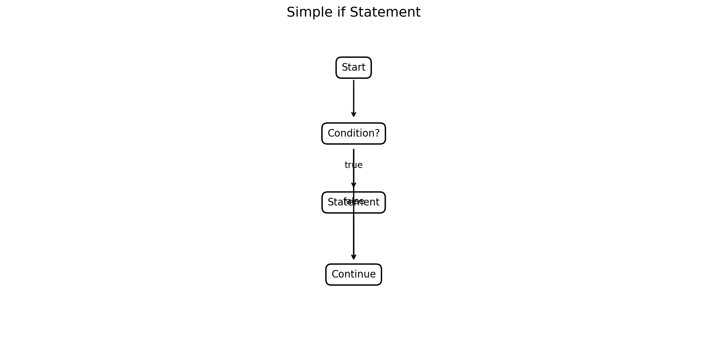
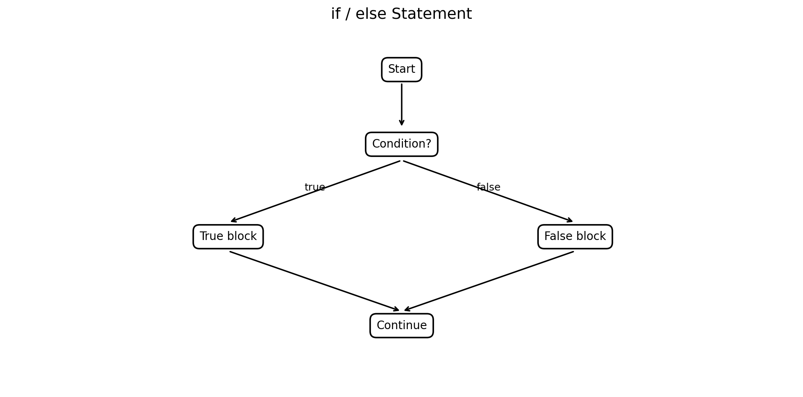
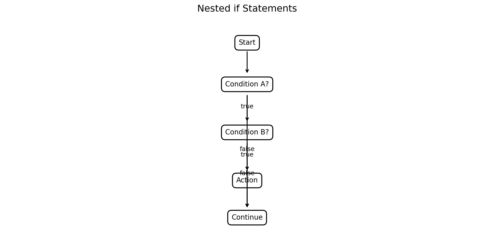
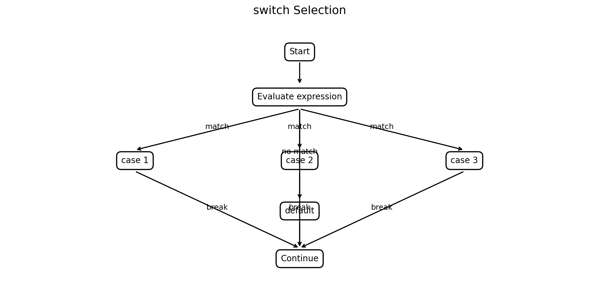
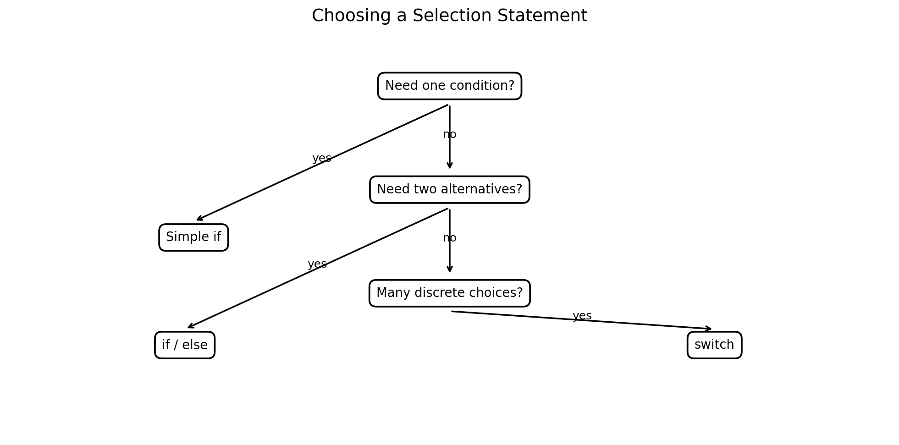

# :classical_building: Problem Solving Using Programming - B.Tech-IT, IIIT Allahabad
## Unit 3: Input-Output, Iterative and Conditional Statements
* ### Current Topic: Selection Statements in C: `if`, `if/else`, and `switch`
* **Purpose:** Introduce Conditional and iterative statements
---

---
## 👥 Instructor Information
* **Edited by Instructor:** [Dr. Mohammed Javed](https://sites.google.com/site/mohammedjaved2016/)
* **Email:** javed@iiita.ac.in
* **Senior Teaching Assistants:** Mr. Subrata Pramanik (pmm2024003@iiita.ac.in)
---
## 🎯 Learning Objectives

After studying this chapter, students should be able to:

1. Explain selection statements in problem solving.
2. Use simple `if`, `if/else`, `else if`, nested `if`, and `switch`.
3. Explain `case`, `break`, `default`, and fall-through.
4. Choose an appropriate decision structure for engineering problems.
5. Write, test, and debug C programs using selection statements.

## 1. Introduction

Engineering programs frequently need to make decisions:

- If temperature exceeds a limit, issue a warning.
- If marks are at least 40, report pass.
- If a motor status is active, report its state.
- If a menu choice is 1, perform one operation; if 2, another.

C provides selection statements to implement these decisions:

```c
if
if / else
switch
```

A C condition is false when it evaluates to `0` and true when it evaluates to a nonzero value.

## 2. Simple `if`

Syntax:

```c
if (condition)
{
    statements;
}
```



Example:

```c
#include <stdio.h>

int main(void)
{
    int temperature = 85;

    if (temperature > 80)
    {
        printf("Warning: High temperature!\n");
    }

    return 0;
}
```

Output:

```text
Warning: High temperature!
```

The statement is skipped if the condition is false.

### Engineering example

```c
#include <stdio.h>

int main(void)
{
    double pressure = 12.5;
    double maximum_pressure = 10.0;

    if (pressure > maximum_pressure)
    {
        printf("WARNING: Pressure is too high.\n");
    }

    return 0;
}
```

Output:

```text
WARNING: Pressure is too high.
```

## 3. `if/else`

Use `if/else` when there are two alternatives.

```c
if (condition)
{
    statements_if_true;
}
else
{
    statements_if_false;
}
```



Example:

```c
#include <stdio.h>

int main(void)
{
    int marks = 35;

    if (marks >= 40)
    {
        printf("Pass\n");
    }
    else
    {
        printf("Fail\n");
    }

    return 0;
}
```

Output:

```text
Fail
```

## 4. `else if`

For several conditions:

```c
if (condition1)
{
    ...
}
else if (condition2)
{
    ...
}
else
{
    ...
}
```

Example:

```c
#include <stdio.h>

int main(void)
{
    int marks = 76;

    if (marks >= 90)
        printf("Grade A+\n");
    else if (marks >= 80)
        printf("Grade A\n");
    else if (marks >= 70)
        printf("Grade B\n");
    else if (marks >= 60)
        printf("Grade C\n");
    else if (marks >= 40)
        printf("Grade D\n");
    else
        printf("Fail\n");

    return 0;
}
```

Output:

```text
Grade B
```

### Condition order matters

Always arrange overlapping ranges carefully. For grading, test the highest threshold first.

## 5. Nested `if`

An `if` can appear inside another `if`.

```c
if (temperature >= 20)
{
    if (temperature <= 80)
    {
        printf("Temperature is within range.\n");
    }
}
```



Often, nested conditions can be combined:

```c
if ((temperature >= 20) &&
    (temperature <= 80))
{
    printf("Safe\n");
}
```

Choose the version that makes the algorithm easiest to understand.

## 6. `switch`

`switch` is useful when one expression is compared against several discrete choices.

Syntax:

```c
switch (expression)
{
    case constant1:
        statements;
        break;

    case constant2:
        statements;
        break;

    default:
        statements;
        break;
}
```



### Components

- `switch` — expression being evaluated.
- `case` — a possible matching value.
- `break` — normally exits the `switch`.
- `default` — handles unmatched values.

## 7. Simple `switch` Example

```c
#include <stdio.h>

int main(void)
{
    int choice = 2;

    switch (choice)
    {
        case 1:
            printf("Addition selected.\n");
            break;

        case 2:
            printf("Subtraction selected.\n");
            break;

        case 3:
            printf("Multiplication selected.\n");
            break;

        default:
            printf("Invalid choice.\n");
    }

    return 0;
}
```

Output:

```text
Subtraction selected.
```

## 8. Menu-Driven Calculator

```c
#include <stdio.h>

int main(void)
{
    int choice = 3;
    double a = 12.0;
    double b = 4.0;

    switch (choice)
    {
        case 1:
            printf("Result = %.2f\n", a + b);
            break;

        case 2:
            printf("Result = %.2f\n", a - b);
            break;

        case 3:
            printf("Result = %.2f\n", a * b);
            break;

        case 4:
            if (b != 0.0)
                printf("Result = %.2f\n", a / b);
            else
                printf("Division by zero is not allowed.\n");
            break;

        default:
            printf("Invalid choice.\n");
    }

    return 0;
}
```

Output:

```text
Result = 48.00
```

## 9. `break` and Fall-Through

If `break` is omitted, execution continues into the next case.

```c
int x = 1;

switch (x)
{
    case 1:
        printf("One\n");

    case 2:
        printf("Two\n");
        break;
}
```

Output:

```text
One
Two
```

This is called **fall-through**.

Fall-through can be intentional:

```c
switch (day)
{
    case 1:
    case 2:
    case 3:
    case 4:
    case 5:
        printf("Working day\n");
        break;

    case 6:
    case 7:
        printf("Weekend\n");
        break;

    default:
        printf("Invalid day\n");
}
```

## 10. `default`

A `default` case handles values for which no case matches:

```c
switch (choice)
{
    case 1:
        printf("Add\n");
        break;

    case 2:
        printf("Subtract\n");
        break;

    default:
        printf("Invalid selection\n");
}
```

## 11. `switch` vs `if/else`

| Requirement | Recommended |
|---|---|
| One condition | Simple `if` |
| Two alternatives | `if/else` |
| Several ranges | `if/else if/else` |
| Complex Boolean conditions | `if/else` |
| Many discrete choices | `switch` |
| Menu program | `switch` |
| Character command selection | `switch` |



`switch` is appropriate for discrete choices such as `1`, `2`, `3` or `'A'`, `'B'`, `'C'`. It is not the natural choice for ranges such as `temperature > 80`; use `if/else` for those.

## 12. Character-Based `switch`

```c
#include <stdio.h>

int main(void)
{
    char grade = 'A';

    switch (grade)
    {
        case 'A':
            printf("Excellent\n");
            break;

        case 'B':
            printf("Very good\n");
            break;

        case 'C':
            printf("Good\n");
            break;

        default:
            printf("Other grade\n");
    }

    return 0;
}
```

Output:

```text
Excellent
```

## 13. Engineering Example — Sensor Diagnostic

```c
#include <stdio.h>

int main(void)
{
    int sensor_status = 2;
    double temperature = 85.0;

    switch (sensor_status)
    {
        case 0:
            printf("Sensor disconnected.\n");
            break;

        case 1:
            printf("Sensor operating normally.\n");
            break;

        case 2:
            printf("Sensor warning state.\n");

            if (temperature > 80.0)
                printf("High temperature detected.\n");

            break;

        default:
            printf("Unknown sensor state.\n");
    }

    return 0;
}
```

Output:

```text
Sensor warning state.
High temperature detected.
```

## 14. Engineering Safety Example

```c
#include <stdio.h>

int main(void)
{
    double temperature = 65.0;
    double pressure = 8.0;

    if ((temperature >= 20.0) &&
        (temperature <= 80.0) &&
        (pressure < 10.0))
    {
        printf("Operating conditions are safe.\n");
    }
    else
    {
        printf("WARNING: Operating conditions are unsafe.\n");
    }

    return 0;
}
```

Output:

```text
Operating conditions are safe.
```

## 15. Common Errors

### Assignment instead of comparison

Usually incorrect:

```c
if (x = 10)
```

Usually intended:

```c
if (x == 10)
```

### Missing braces

Risky:

```c
if (x > 0)
    printf("Positive\n");
    printf("Valid\n");
```

Prefer:

```c
if (x > 0)
{
    printf("Positive\n");
    printf("Valid\n");
}
```

### Incorrect `else if` ordering

Bad:

```c
if (marks >= 40)
    printf("Pass\n");
else if (marks >= 90)
    printf("Excellent\n");
```

Better:

```c
if (marks >= 90)
    printf("Excellent\n");
else if (marks >= 40)
    printf("Pass\n");
else
    printf("Fail\n");
```

### Forgetting `break`

Without `break`, a matching case may fall through into subsequent cases.

### Using `switch` for ranges

Do not use `switch` as a replacement for:

```c
if (temperature >= 20 && temperature <= 80)
```

## 16. Selection and Problem Solving

A flowchart decision:

```text
Condition?
 /       \
Yes       No
 ↓        ↓
Action A  Action B
```

maps naturally to:

```c
if (condition)
{
    actionA();
}
else
{
    actionB();
}
```

Thus:

```text
Problem
   ↓
Algorithm
   ↓
Flowchart
   ↓
Selection statement
   ↓
C program
```

## 17. Best Practices

1. Use braces for decision blocks.
2. Make conditions readable.
3. Use `if/else` for ranges and complex conditions.
4. Use `switch` for discrete choices.
5. Include `default` in menu-style switches.
6. Use `break` deliberately.
7. Handle invalid input.
8. Test boundary values such as `39`, `40`, `89`, `90`.
9. Avoid unnecessarily deep nesting.
10. Document non-obvious decisions.

## 18. Laboratory Exercises

### Exercise 1 — Positive, Negative or Zero

Read an integer and print whether it is positive, negative, or zero.

### Exercise 2 — Largest of Three

Find the largest of three numbers using selection statements.

### Exercise 3 — Engineering Safety

Read temperature and pressure and classify the system as `SAFE`, `WARNING`, or `CRITICAL`.

### Exercise 4 — Menu Calculator

Create:

```text
1. Addition
2. Subtraction
3. Multiplication
4. Division
```

Use `switch` and handle division by zero.

### Exercise 5 — Day of Week

Map:

```text
1 → Monday
...
7 → Sunday
```

using `switch`.

### Exercise 6 — Grade Classification

Use `if/else if/else`:

```text
90–100 → A+
80–89  → A
70–79  → B
60–69  → C
40–59  → D
0–39   → F
```

Also handle invalid marks.

## 19. Mini Project — Engineering Equipment Monitor

Create a program that receives:

```text
Equipment mode
Temperature
Pressure
Voltage
```

Modes:

```text
1 → OFF
2 → MANUAL
3 → AUTOMATIC
4 → MAINTENANCE
```

Use `switch` for the mode and `if/else` for safety checks.

Possible output:

```text
Equipment Mode: AUTOMATIC

Temperature: 65.00 C
Pressure: 8.50 bar
Voltage: 230.00 V

Temperature: SAFE
Pressure: SAFE
Voltage: SAFE

Overall Status: SYSTEM READY
```

## 20. Debugging Checklist

When a selection program behaves unexpectedly, check:

1. Did you use `==` rather than `=` for comparison?
2. Are the relational operators correct?
3. Are parentheses correctly placed?
4. Are overlapping conditions ordered correctly?
5. Is an `else` associated with the intended `if`?
6. Are braces present?
7. Did you forget `break`?
8. Is fall-through intentional?
9. Is there a `default` case?
10. Are input values valid?

## 21. Viva Questions

1. What is a selection statement?
2. Give the syntax of simple `if`.
3. Differentiate `if` and `if/else`.
4. What is an `else if` chain?
5. What is nested `if`?
6. What is a `switch` statement?
7. What is the purpose of `case`?
8. What is `break`?
9. What is `default`?
10. What is fall-through?
11. When should `switch` be preferred?
12. Why is `if/else` better for ranges?
13. What is the difference between `=` and `==`?
14. Why are braces recommended?
15. What is defensive selection?

## 22. Review Programming Questions

1. Determine whether an integer is positive, negative, or zero.
2. Determine whether a number is even or odd.
3. Find the largest of three numbers.
4. Classify marks into grades.
5. Check whether an engineering parameter is within a safe range.
6. Build a menu-driven calculator using `switch`.
7. Convert a day number to a day name using `switch`.
8. Select equipment operating mode using `switch`.
9. Combine `switch` and nested `if`.
10. Build an engineering safety monitor using all major selection constructs.

## 23. Key Takeaways

### Simple `if`

```c
if (condition)
{
    ...
}
```

Use when an action occurs only when a condition is true.

### `if/else`

```c
if (condition)
{
    ...
}
else
{
    ...
}
```

Use for two alternatives.

### `else if`

Use for several conditions or ranges.

### `switch`

```c
switch (choice)
{
    case 1:
        ...
        break;

    case 2:
        ...
        break;

    default:
        ...
}
```

Use for multiple discrete choices.

Remember:

```text
if       → one condition
if/else  → two alternatives
else if  → multiple conditions/ranges
switch   → multiple discrete choices
break    → normally exits switch
default  → unmatched choice
```

Selection statements are essential for translating engineering decision-making into reliable C programs.

## GitHub Folder Structure

```text
c-selection-statements/
│
├── README.md
├── c_selection_statements.md
│
└── figures/
    ├── 01_simple_if_flowchart.png
    ├── 02_if_else_flowchart.png
    ├── 03_switch_flowchart.png
    ├── 04_selection_comparison.png
    ├── 05_nested_if_flowchart.png
    └── 06_switch_break_default.png
```
