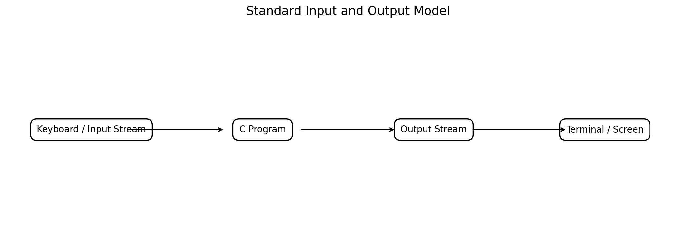
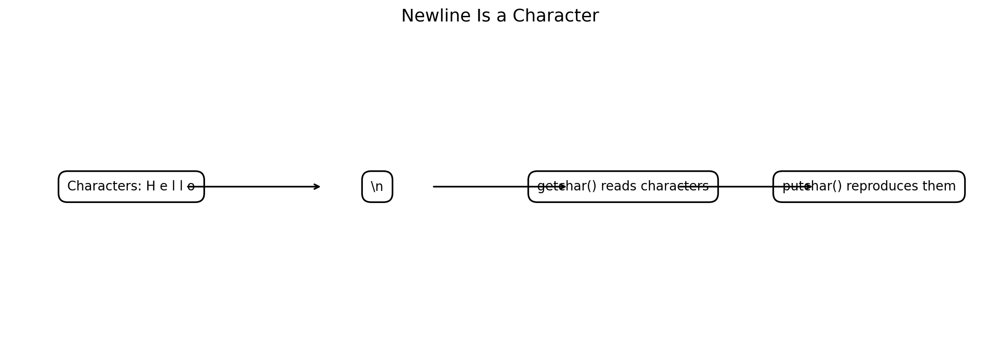
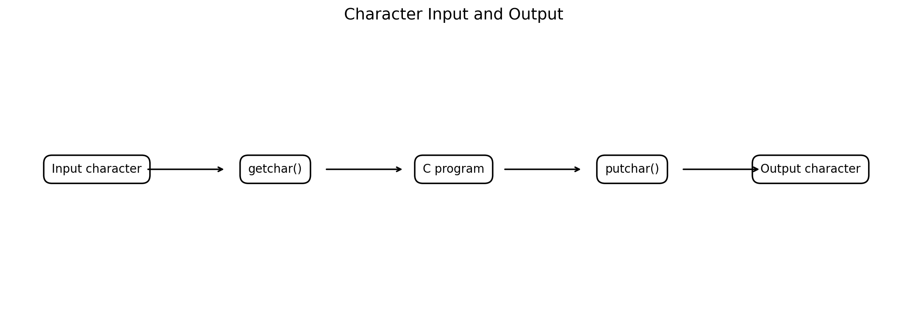
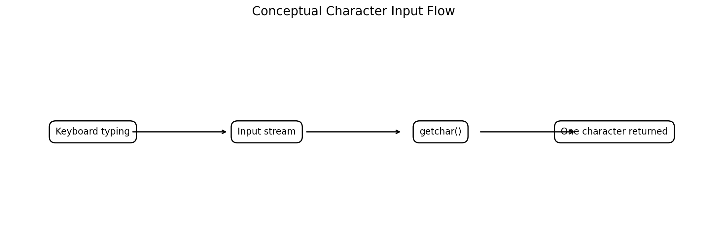
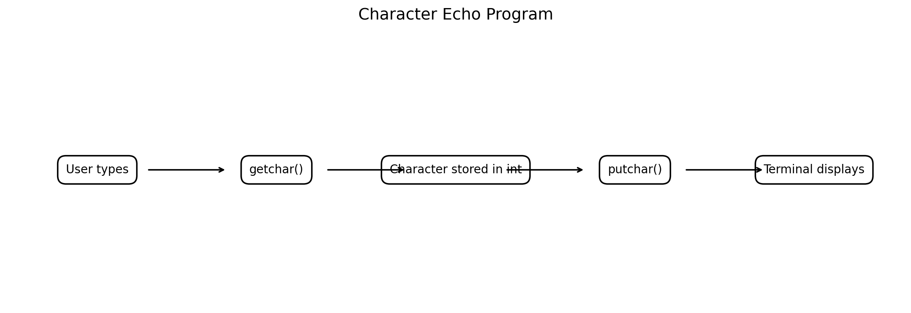
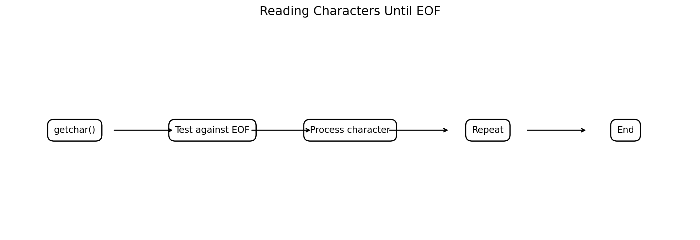
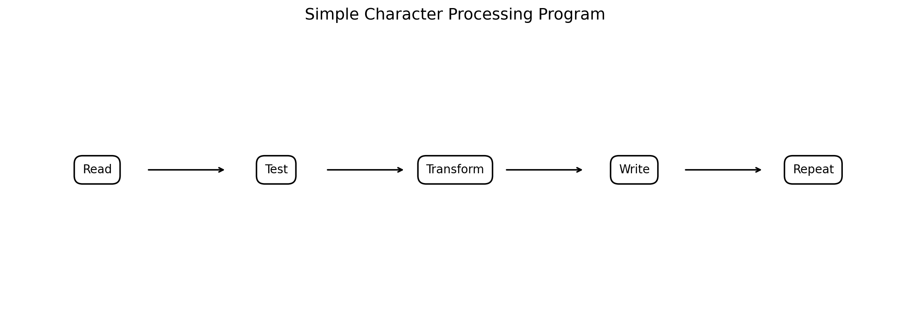
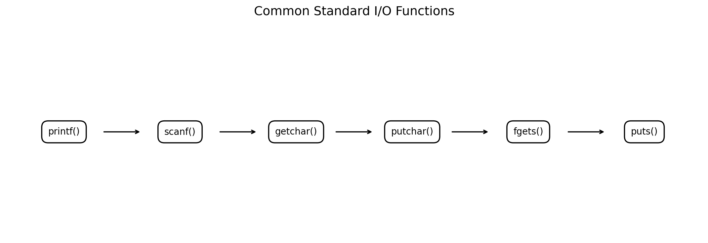

# Standard Input and Output, Character I/O in C

**Course:** Problem Solving Using C  
**Level:** Bachelor of Engineering  
**Audience:** First-year / introductory programming students

---

## Learning Objectives

After studying this chapter, students should be able to:

1. Explain standard input, standard output and standard error.
2. Understand the role of `<stdio.h>`.
3. Use `printf()` for formatted output.
4. Use `scanf()` for basic formatted input.
5. Understand format specifiers such as `%d`, `%f`, `%lf`, `%c` and `%s`.
6. Explain character input and output.
7. Use `getchar()` to read one character.
8. Use `putchar()` to write one character.
9. Understand that whitespace and newline are characters.
10. Explain the return type and EOF behavior of `getchar()`.
11. Write character-processing programs using loops.
12. Identify common input-related mistakes in beginner C programs.
13. Apply standard I/O and character I/O to simple engineering problems.

---

# 1. Introduction

A computer program frequently needs to communicate with the outside world.

For a simple C program:

```text
Input → Processing → Output
```

For example:

```text
User enters temperature
        ↓
C program calculates Fahrenheit
        ↓
Program displays result
```

C provides standard input/output facilities through the header:

```c
#include <stdio.h>
```

The `<stdio.h>` header declares functions and types used for input and output, including functions such as `printf()`, `scanf()`, `getchar()`, `putchar()`, `fgets()` and `puts()`.



**Figure 1. Conceptual standard input/output model.**

---

# 2. What Is Standard Input?

**Standard input**, commonly called `stdin`, is the default input stream of a C program.

In a typical terminal program:

```text
Keyboard → stdin → C program
```

Example:

```c
int age;

scanf("%d", &age);
```

The user can type:

```text
19
```

and the program receives the corresponding input through the standard input stream.

---

# 3. What Is Standard Output?

**Standard output**, commonly called `stdout`, is the default output stream.

In a typical terminal:

```text
C program → stdout → Screen
```

Example:

```c
printf("Hello, Engineering Students!\n");
```

Output:

```text
Hello, Engineering Students!
```

---

# 4. Standard Error

C also provides **standard error**, commonly called `stderr`.

It is conventionally used for diagnostic and error messages.

Example:

```c
fprintf(stderr, "Error: invalid input.\n");
```

This is different from:

```c
printf("Error: invalid input.\n");
```

because the latter writes to standard output.

A simplified model is:

```text
stdin   → normal input
stdout  → normal output
stderr  → diagnostic/error output
```

---

# 5. The `<stdio.h>` Header

Most standard I/O programs begin with:

```c
#include <stdio.h>
```

Example:

```c
#include <stdio.h>

int main(void)
{
    printf("Welcome to C programming!\n");

    return 0;
}
```

Output:

```text
Welcome to C programming!
```

The preprocessor directive:

```c
#include <stdio.h>
```

makes the declarations provided by the standard I/O header available to the program.

---

# 6. Formatted Output with `printf()`

The general form is:

```c
printf("format string", arguments);
```

Example:

```c
int age = 19;

printf("Age = %d\n", age);
```

Output:

```text
Age = 19
```

Another example:

```c
double temperature = 25.75;

printf("Temperature = %.2f\n", temperature);
```

Output:

```text
Temperature = 25.75
```

---

# 7. Common `printf()` Format Specifiers

Some frequently used conversions are:

| Specifier | Typical use |
|---|---|
| `%d` | `int` |
| `%i` | `int` |
| `%u` | unsigned integer |
| `%f` | floating-point output |
| `%c` | character |
| `%s` | string |
| `%x` | hexadecimal integer |
| `%p` | pointer address |

For example:

```c
#include <stdio.h>

int main(void)
{
    int count = 10;
    double voltage = 230.5;
    char grade = 'A';

    printf("Count   = %d\n", count);
    printf("Voltage = %.1f V\n", voltage);
    printf("Grade   = %c\n", grade);

    return 0;
}
```

Output:

```text
Count   = 10
Voltage = 230.5 V
Grade   = A
```

---

# 8. Escape Sequences

Escape sequences represent special characters.

Common examples:

| Escape sequence | Meaning |
|---|---|
| `\n` | Newline |
| `\t` | Horizontal tab |
| `\\` | Backslash |
| `\"` | Double quote |
| `\'` | Single quote |
| `\r` | Carriage return |
| `\b` | Backspace |

Example:

```c
printf("Name:\tJaved\n");
printf("Age:\t19\n");
```

Output:

```text
Name:   Javed
Age:    19
```

---

# 9. The Newline Character

The sequence:

```c
\n
```

represents a newline character.

Example:

```c
printf("Line 1\n");
printf("Line 2\n");
```

Output:

```text
Line 1
Line 2
```

The newline is important in both output formatting and character input processing.



**Figure 4. Newline participates in the stream of characters.**

---

# 10. Formatted Input with `scanf()`

The general form is:

```c
scanf("format", &variable);
```

Example:

```c
#include <stdio.h>

int main(void)
{
    int age;

    printf("Enter your age: ");
    scanf("%d", &age);

    printf("You entered: %d\n", age);

    return 0;
}
```

Possible interaction:

```text
Enter your age: 19
You entered: 19
```

---

# 11. Why Does `scanf()` Use `&`?

Consider:

```c
int age;

scanf("%d", &age);
```

The `&` operator obtains the address of `age`.

`scanf()` needs an address where it can store the input value.

Conceptually:

```text
User input
    ↓
scanf()
    ↓
address of age
    ↓
age receives value
```

This topic becomes much clearer when pointers are studied.

---

# 12. Common `scanf()` Format Specifiers

Examples:

| Data type | Typical `scanf()` specifier |
|---|---|
| `int` | `%d` |
| `unsigned int` | `%u` |
| `float` | `%f` |
| `double` | `%lf` |
| `char` | `%c` |
| String array | `%s` |

Example:

```c
int age;
float temperature;
double distance;
char grade;

scanf("%d", &age);
scanf("%f", &temperature);
scanf("%lf", &distance);
scanf(" %c", &grade);
```

Note the important distinction:

```text
printf("%f", double_value)
scanf("%lf", &double_value)
```

for `double` in the corresponding formatted conversions.

---

# 13. A Complete Input/Output Example

```c
#include <stdio.h>

int main(void)
{
    int age;
    double height;

    printf("Enter your age: ");
    scanf("%d", &age);

    printf("Enter your height in cm: ");
    scanf("%lf", &height);

    printf("\nAge    = %d years\n", age);
    printf("Height = %.2f cm\n", height);

    return 0;
}
```

Example interaction:

```text
Enter your age: 19
Enter your height in cm: 172.5

Age    = 19 years
Height = 172.50 cm
```

---

# 14. Character Input and Output

Character I/O deals with individual characters.

Two fundamental functions are:

```c
getchar()
putchar()
```



**Figure 2. Basic character input/output using `getchar()` and `putchar()`.**

---

# 15. `getchar()`

The function:

```c
getchar()
```

reads the next character from standard input.

Example:

```c
#include <stdio.h>

int main(void)
{
    int ch;

    ch = getchar();

    printf("You entered: ");
    putchar(ch);
    putchar('\n');

    return 0;
}
```

Example interaction:

```text
A
You entered: A
```

---

# 16. Why Is `getchar()` Assigned to `int`?

This is an important C programming concept.

Use:

```c
int ch;
```

rather than:

```c
char ch;
```

when storing the result of `getchar()`.

The reason is that `getchar()` must be able to return either:

1. a character converted to `unsigned char` and represented as an `int`, or
2. the special value `EOF`.

Therefore:

```c
int ch;
```

is the appropriate type for reliably checking:

```c
ch != EOF
```

---

# 17. `putchar()`

The function:

```c
putchar(ch);
```

writes one character to standard output.

Example:

```c
#include <stdio.h>

int main(void)
{
    putchar('C');
    putchar('\n');

    return 0;
}
```

Output:

```text
C
```

Another example:

```c
putchar('H');
putchar('i');
putchar('!');
putchar('\n');
```

Output:

```text
Hi!
```

---

# 18. Conceptual Character Flow



**Figure 3. A simplified view of how `getchar()` obtains the next character from the input stream.**

A useful conceptual model is:

```text
Input stream:
H e l l o \n

getchar()
   ↓
H

next getchar()
   ↓
e

next getchar()
   ↓
l
```

Each call reads the next available character from the stream.

---

# 19. Character Echo Program

One of the simplest character-processing programs is an **echo program**.

```c
#include <stdio.h>

int main(void)
{
    int ch;

    ch = getchar();
    putchar(ch);

    return 0;
}
```

If the user enters:

```text
A
```

the program writes:

```text
A
```



**Figure 5. Character echo using `getchar()` and `putchar()`.**

---

# 20. Reading Multiple Characters

A loop can repeatedly call `getchar()`.

```c
#include <stdio.h>

int main(void)
{
    int ch;

    while ((ch = getchar()) != '\n')
    {
        putchar(ch);
    }

    putchar('\n');

    return 0;
}
```

Example:

```text
Input:
Hello

Output:
Hello
```

The loop terminates when it encounters the newline character.

---

# 21. Reading Until EOF

For general character-stream processing, a common pattern is:

```c
int ch;

while ((ch = getchar()) != EOF)
{
    putchar(ch);
}
```

This reads characters until the input stream reaches end-of-file.



**Figure 7. Generic character-processing loop using `EOF`.**

This pattern is extremely useful for:

- copying text,
- counting characters,
- filtering input,
- processing files redirected to standard input,
- simple text-processing utilities.

---

# 22. What Is `EOF`?

`EOF` means **End Of File**.

It is a special negative integer value defined by the standard I/O library.

Important:

```c
EOF
```

is **not a character**.

It is a special return value used by input functions to indicate that no more input is available or that an input error occurred, depending on the function and situation.

Therefore:

```c
int ch;
```

is preferred for storing `getchar()`'s return value.

---

# 23. Counting Characters

A simple character-counting program:

```c
#include <stdio.h>

int main(void)
{
    int ch;
    int count = 0;

    while ((ch = getchar()) != EOF)
    {
        count++;
    }

    printf("Characters = %d\n", count);

    return 0;
}
```

If the input stream contains:

```text
ABC
```

the count includes the newline when the input is entered interactively:

```text
Characters = 4
```

because the stream may contain:

```text
A B C \n
```

This illustrates why understanding whitespace and newline characters is important.

---

# 24. Counting Non-Newline Characters

```c
#include <stdio.h>

int main(void)
{
    int ch;
    int count = 0;

    while ((ch = getchar()) != EOF)
    {
        if (ch != '\n')
        {
            count++;
        }
    }

    printf("Non-newline characters = %d\n", count);

    return 0;
}
```

For input:

```text
ABC
```

the result is:

```text
Non-newline characters = 3
```

---

# 25. Counting Digits

Character I/O can be used to identify digits.

```c
#include <stdio.h>

int main(void)
{
    int ch;
    int digits = 0;

    while ((ch = getchar()) != EOF)
    {
        if (ch >= '0' && ch <= '9')
        {
            digits++;
        }
    }

    printf("Number of digits = %d\n", digits);

    return 0;
}
```

Input:

```text
Engineering 2026
```

Output:

```text
Number of digits = 4
```

The characters:

```text
'0' '1' '2' ... '9'
```

can be compared as character values.

---

# 26. Character Classification

The `<ctype.h>` header provides functions for classifying characters.

Examples:

```c
isalpha()
isdigit()
isalnum()
isspace()
islower()
isupper()
```

Example:

```c
#include <stdio.h>
#include <ctype.h>

int main(void)
{
    int ch;

    ch = getchar();

    if (isdigit((unsigned char) ch))
    {
        printf("It is a digit.\n");
    }
    else
    {
        printf("It is not a digit.\n");
    }

    return 0;
}
```

For robust use of `<ctype.h>` classification functions, arguments should generally be `EOF` or representable as `unsigned char`.

---

# 27. Character Conversion

`<ctype.h>` also provides functions such as:

```c
toupper()
tolower()
```

Example:

```c
#include <stdio.h>
#include <ctype.h>

int main(void)
{
    int ch;

    ch = getchar();

    putchar(toupper((unsigned char) ch));
    putchar('\n');

    return 0;
}
```

Input:

```text
a
```

Output:

```text
A
```

---

# 28. Character Processing Example



**Figure 8. A simple read-test-transform-write loop.**

Program:

```c
#include <stdio.h>
#include <ctype.h>

int main(void)
{
    int ch;

    while ((ch = getchar()) != EOF)
    {
        if (isalpha((unsigned char) ch))
        {
            ch = toupper((unsigned char) ch);
        }

        putchar(ch);
    }

    return 0;
}
```

Input:

```text
C programming is useful.
```

Output:

```text
C PROGRAMMING IS USEFUL.
```

---

# 29. `getchar()` and Newline

Consider:

```c
int ch;

ch = getchar();
```

If the user types:

```text
A
```

the input stream can contain:

```text
'A' '\n'
```

The first call obtains:

```text
'A'
```

The newline may remain in the stream.

A subsequent:

```c
ch = getchar();
```

may then obtain:

```text
'\n'
```

This is a common source of confusion when mixing character input with other input functions.

---

# 30. Mixing `scanf()` and `getchar()`

Consider:

```c
int age;
int ch;

scanf("%d", &age);

ch = getchar();
```

After entering:

```text
19
```

and pressing Enter, the newline may remain in the input stream.

Consequently:

```c
ch = getchar();
```

may read:

```text
'\n'
```

instead of the next visible character.

This is an important beginner-level input issue.

---

# 31. A Safer Approach for Character Input

If the goal is to read a line of text, `fgets()` is often preferable to repeatedly combining `scanf()` with `getchar()`.

Example:

```c
#include <stdio.h>

int main(void)
{
    char name[50];

    printf("Enter your name: ");

    if (fgets(name, sizeof name, stdin) != NULL)
    {
        printf("Hello, %s", name);
    }

    return 0;
}
```

Example:

```text
Enter your name: Javed
Hello, Javed
```

`fgets()` reads a line of characters while limiting the number of characters stored in the array.

---

# 32. `puts()`

For simple string output:

```c
puts("Hello");
```

is convenient.

Example:

```c
#include <stdio.h>

int main(void)
{
    puts("Problem Solving Using C");

    return 0;
}
```

Output:

```text
Problem Solving Using C
```

`puts()` writes a string followed by a newline.

---

# 33. Character I/O vs Formatted I/O



**Figure 6. Common standard input/output functions and their typical roles.**

| Function | Typical purpose |
|---|---|
| `printf()` | Formatted output |
| `scanf()` | Formatted input |
| `getchar()` | Read one character |
| `putchar()` | Write one character |
| `fgets()` | Read a line/string safely with a size limit |
| `puts()` | Write a string plus newline |

---

# 34. `getchar()` vs `scanf("%c", ...)`

These are closely related in purpose.

Using `getchar()`:

```c
int ch;

ch = getchar();
```

Using `scanf()`:

```c
char ch;

scanf("%c", &ch);
```

For simple character-by-character stream processing, `getchar()` is generally clearer.

---

# 35. Whitespace Characters

Whitespace includes characters such as:

```text
space
tab
newline
```

For example:

```c
' '
'\t'
'\n'
```

The `<ctype.h>` function:

```c
isspace()
```

can be used to test for whitespace.

Example:

```c
#include <stdio.h>
#include <ctype.h>

int main(void)
{
    int ch = getchar();

    if (isspace((unsigned char) ch))
    {
        printf("Whitespace character\n");
    }
    else
    {
        printf("Non-whitespace character\n");
    }

    return 0;
}
```

---

# 36. Counting Lines

Character I/O can be used to count lines.

```c
#include <stdio.h>

int main(void)
{
    int ch;
    int lines = 0;

    while ((ch = getchar()) != EOF)
    {
        if (ch == '\n')
        {
            lines++;
        }
    }

    printf("Lines = %d\n", lines);

    return 0;
}
```

Input:

```text
First line
Second line
Third line
```

Output:

```text
Lines = 3
```

---

# 37. Counting Vowels

```c
#include <stdio.h>
#include <ctype.h>

int main(void)
{
    int ch;
    int vowels = 0;

    while ((ch = getchar()) != EOF)
    {
        ch = tolower((unsigned char) ch);

        if (ch == 'a' || ch == 'e' ||
            ch == 'i' || ch == 'o' ||
            ch == 'u')
        {
            vowels++;
        }
    }

    printf("Vowels = %d\n", vowels);

    return 0;
}
```

Input:

```text
Computer Engineering
```

Output:

```text
Vowels = 8
```

---

# 38. Character Replacement

Example: replace every space with an underscore.

```c
#include <stdio.h>

int main(void)
{
    int ch;

    while ((ch = getchar()) != EOF)
    {
        if (ch == ' ')
        {
            ch = '_';
        }

        putchar(ch);
    }

    return 0;
}
```

Input:

```text
C programming is powerful
```

Output:

```text
C_programming_is_powerful
```

This demonstrates a simple **filtering/transformation** problem.

---

# 39. Character-Based Engineering Example

Suppose a simple monitoring system receives status codes:

```text
N → Normal
W → Warning
E → Error
```

Program:

```c
#include <stdio.h>

int main(void)
{
    int status;

    printf("Enter status code (N/W/E): ");
    status = getchar();

    switch (status)
    {
        case 'N':
            printf("System status: Normal\n");
            break;

        case 'W':
            printf("System status: Warning\n");
            break;

        case 'E':
            printf("System status: Error\n");
            break;

        default:
            printf("Unknown status code\n");
    }

    return 0;
}
```

Example:

```text
Enter status code (N/W/E): W
System status: Warning
```

This illustrates how character I/O can be applied to engineering control/status systems.

---

# 40. Character-Based Menu

```c
#include <stdio.h>

int main(void)
{
    int choice;

    printf("A - Add\n");
    printf("D - Delete\n");
    printf("Q - Quit\n");
    printf("Enter choice: ");

    choice = getchar();

    switch (choice)
    {
        case 'A':
        case 'a':
            printf("Add selected.\n");
            break;

        case 'D':
        case 'd':
            printf("Delete selected.\n");
            break;

        case 'Q':
        case 'q':
            printf("Quit selected.\n");
            break;

        default:
            printf("Invalid choice.\n");
    }

    return 0;
}
```

Example:

```text
A - Add
D - Delete
Q - Quit
Enter choice: a
Add selected.
```

---

# 41. Standard Input/Output Redirection

Standard streams make it possible for operating systems and shells to redirect input/output.

Conceptually:

```text
Keyboard → stdin → Program → stdout → Screen
```

can become:

```text
File → stdin → Program → stdout → File
```

For example, in a Unix-like shell:

```bash
./program < input.txt
```

or:

```bash
./program > output.txt
```

This is one reason stream-based character processing is powerful.

---

# 42. Character Processing as a General Pattern

Many text-processing programs follow:

```text
Read character
      ↓
Check condition
      ↓
Transform / count / ignore
      ↓
Write character
      ↓
Repeat
```

This pattern can be used for:

- character counting,
- line counting,
- whitespace processing,
- filtering,
- case conversion,
- simple lexical processing,
- text transformation.

---

# 43. Complete Example — Character Statistics

```c
#include <stdio.h>
#include <ctype.h>

int main(void)
{
    int ch;
    int letters = 0;
    int digits = 0;
    int spaces = 0;

    while ((ch = getchar()) != EOF)
    {
        if (isalpha((unsigned char) ch))
        {
            letters++;
        }
        else if (isdigit((unsigned char) ch))
        {
            digits++;
        }
        else if (isspace((unsigned char) ch))
        {
            spaces++;
        }
    }

    printf("Letters = %d\n", letters);
    printf("Digits  = %d\n", digits);
    printf("Spaces  = %d\n", spaces);

    return 0;
}
```

Input:

```text
C Programming 2026
```

Output:

```text
Letters = 13
Digits  = 4
Spaces  = 2
```

The exact counts can be verified by manually examining the input characters.

---

# 44. Common Mistakes

## Mistake 1 — Forgetting `<stdio.h>`

Incorrect:

```c
int main(void)
{
    printf("Hello\n");
}
```

Better:

```c
#include <stdio.h>

int main(void)
{
    printf("Hello\n");
    return 0;
}
```

---

## Mistake 2 — Using `char` for EOF-sensitive input

Avoid:

```c
char ch;

while ((ch = getchar()) != EOF)
{
    ...
}
```

Prefer:

```c
int ch;

while ((ch = getchar()) != EOF)
{
    ...
}
```

---

## Mistake 3 — Forgetting `&` in `scanf()`

Incorrect:

```c
int age;

scanf("%d", age);
```

Correct:

```c
scanf("%d", &age);
```

---

## Mistake 4 — Wrong format specifier

For a `double` variable:

```c
double x;
scanf("%lf", &x);
```

For output:

```c
printf("%f\n", x);
```

---

## Mistake 5 — Confusing a character with a string

Character:

```c
'A'
```

String:

```c
"A"
```

---

# 45. Good Programming Practices

1. Include `<stdio.h>` when using standard I/O functions.
2. Use meaningful prompts for interactive programs.
3. Match format specifiers to the appropriate data types.
4. Store `getchar()`'s return value in an `int` when testing for `EOF`.
5. Understand that newline and spaces are input characters.
6. Use `fgets()` when reading lines of text into a character array.
7. Avoid mixing `scanf()` and character/line input without understanding the input stream.
8. Use `<ctype.h>` functions for character classification when appropriate.
9. Use parentheses and clear formatting to improve readability.
10. Check input function return values when robust input handling is required.

---

# 46. Laboratory Exercise 1 — Character Echo

Write a program that:

1. reads one character using `getchar()`;
2. displays it using `putchar()`.

Example:

```text
Input:
A

Output:
A
```

---

# 47. Laboratory Exercise 2 — Uppercase Conversion

Read one character and print its uppercase form.

Example:

```text
Input:
g

Output:
G
```

Use:

```c
toupper()
```

---

# 48. Laboratory Exercise 3 — Count Digits

Read characters until `EOF` and count how many are digits.

Example:

```text
Input:
CSE2026

Output:
Digits = 4
```

---

# 49. Laboratory Exercise 4 — Count Lines

Read text until `EOF` and count newline characters.

Example:

```text
Input:
Line one
Line two
Line three

Output:
Lines = 3
```

---

# 50. Laboratory Exercise 5 — Count Vowels

Write a program to count:

```text
a, e, i, o, u
```

regardless of uppercase or lowercase.

Use:

```c
tolower()
```

to simplify the logic.

---

# 51. Laboratory Exercise 6 — Character Statistics

Write a program that reads input until `EOF` and reports:

```text
Number of letters
Number of digits
Number of spaces
Number of newlines
```

---

# 52. Laboratory Exercise 7 — Engineering Status Monitor

Create a program that accepts:

```text
N → Normal
W → Warning
E → Error
```

and prints the corresponding system status.

Extend it so that lowercase input also works.

---

# 53. Mini Project — Text Analyzer

Create a simple character-based text analyzer.

It should read characters until `EOF` and calculate:

```text
Characters
Letters
Digits
Spaces
Newlines
Vowels
```

Suggested processing model:

```text
             Input Stream
                  ↓
              getchar()
                  ↓
        ┌─────────┼─────────┐
        ↓         ↓         ↓
     Letter     Digit    Whitespace
        ↓         ↓         ↓
      Count     Count     Count
        └─────────┼─────────┘
                  ↓
               Output
```

---

# 54. Viva Questions

### Q1. What is standard input?

The default input stream of a C program, conventionally represented by `stdin`.

### Q2. What is standard output?

The default output stream, conventionally represented by `stdout`.

### Q3. What is standard error?

The diagnostic output stream, conventionally represented by `stderr`.

### Q4. Which header provides standard I/O functions?

```c
#include <stdio.h>
```

### Q5. What does `printf()` do?

It performs formatted output.

### Q6. What does `scanf()` do?

It performs formatted input according to a format string.

### Q7. What does `getchar()` do?

It reads the next character from standard input and returns it as an `int`, or `EOF` when appropriate.

### Q8. What does `putchar()` do?

It writes one character to standard output.

### Q9. Why is `getchar()`'s result usually stored in an `int`?

Because it must represent both character values and the special `EOF` value.

### Q10. What is `EOF`?

A special negative integer value used to indicate end-of-file or input failure by applicable input functions.

### Q11. What does `\n` represent?

A newline character.

### Q12. What is the difference between `'A'` and `"A"`?

`'A'` is a character constant; `"A"` is a string literal.

---

# 55. Review Questions

## Short Answer

1. Define standard input.
2. Define standard output.
3. What is `stderr`?
4. What is the purpose of `<stdio.h>`?
5. What is `printf()`?
6. What is `scanf()`?
7. What is `getchar()`?
8. What is `putchar()`?
9. What is `EOF`?
10. Why is `getchar()`'s return value stored in an `int`?
11. What is a newline character?
12. What is the difference between a character and a string?
13. Why is `&` used with `scanf()` for ordinary scalar objects?
14. What is the difference between `%f` and `%lf` in formatted input/output contexts?
15. What is the purpose of `fgets()`?

## Descriptive Questions

1. Explain standard input and output in C with a suitable diagram.
2. Explain `printf()` and `scanf()` with examples.
3. Explain character I/O using `getchar()` and `putchar()`.
4. Explain the significance of `EOF`.
5. Explain why `getchar()` returns an `int`.
6. Explain how newline characters affect character input.
7. Compare formatted I/O and character I/O.
8. Explain the problems that can occur when mixing `scanf()` and `getchar()`.
9. Write a C program to count letters, digits and whitespace characters.
10. Develop a simple character-based engineering status monitor.

---

# 56. Key Takeaways

Remember these core ideas:

```text
stdin
  ↓
Standard input

stdout
  ↓
Standard output

stderr
  ↓
Diagnostic/error output
```

For formatted I/O:

```c
printf()
scanf()
```

For character I/O:

```c
getchar()
putchar()
```

For line-oriented text input:

```c
fgets()
```

For simple string output:

```c
puts()
```

For character classification:

```c
isalpha()
isdigit()
isspace()
```

For character conversion:

```c
toupper()
tolower()
```

Most importantly:

```c
int ch;

while ((ch = getchar()) != EOF)
{
    /* process ch */
}
```

is a fundamental pattern for character-stream processing in C.

---

# 57. Suggested Practice Progression

A useful learning progression is:

```text
printf()
   ↓
scanf()
   ↓
getchar()
   ↓
putchar()
   ↓
getchar() + putchar()
   ↓
Character classification
   ↓
Character transformation
   ↓
Character counting
   ↓
EOF-based processing
   ↓
Text analyzer
```

This progression gradually develops the student's ability to transform a problem statement into an algorithm and then into a C program.

---

# References and Further Reading

1. **cppreference — C I/O:** standard C input/output facilities and functions.  
   https://en.cppreference.com/c/io

2. **cppreference — `getchar`:** character input and `EOF` behavior.  
   https://en.cppreference.com/c/io/getchar

3. **cppreference — `putchar`:** character output.  
   https://en.cppreference.com/c/io/putchar

4. **cppreference — `printf`:** formatted output.  
   https://en.cppreference.com/c/io/fprintf

5. **cppreference — `scanf`:** formatted input.  
   https://en.cppreference.com/c/io/fscanf

6. **cppreference — `<ctype.h>`:** character classification and conversion functions.  
   https://en.cppreference.com/c/string/byte

7. **ISO/IEC 9899 C Standard:** authoritative language specification for C.

---

## GitHub Folder Structure

```text
c-standard-input-output-character-io/
│
├── README.md
├── c_standard_input_output_character_io.md
│
└── figures/
    ├── 01_standard_io_model.png
    ├── 02_character_input_output.png
    ├── 03_getchar_buffer.png
    ├── 04_newline_character.png
    ├── 05_echo_program.png
    ├── 06_input_output_functions.png
    ├── 07_char_loop.png
    └── 08_complete_example.png
```
