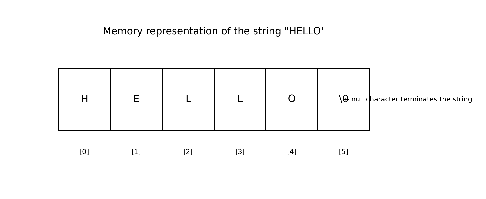
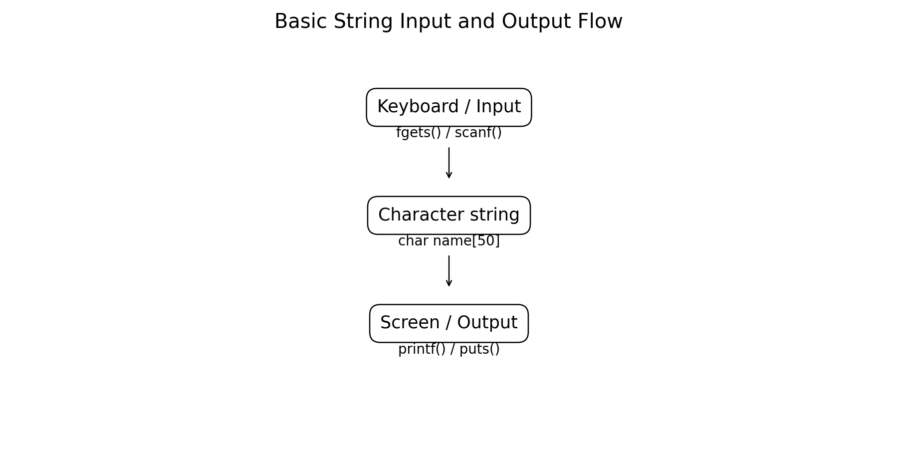
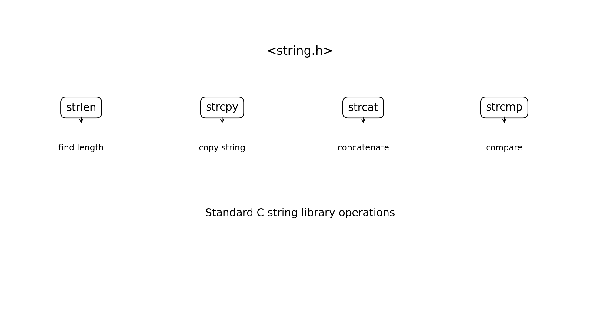
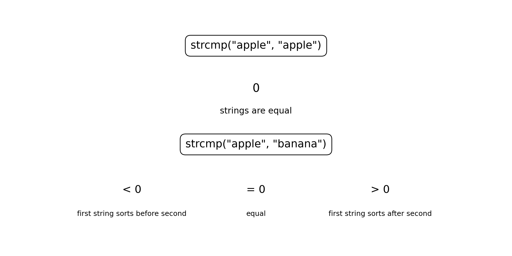

# :classical_building: Problem Solving Using Programming - B.Tech-IT, IIIT Allahabad
## Unit 4: Functions, Arrays 1D and 2D, Strings
* ### Current Topic: Character Strings in C
* **Purpose:** Introduce Basic Programming entities
---

---
## 👥 Instructor Information
* **Edited by Instructor:** [Dr. Mohammed Javed](https://sites.google.com/site/mohammedjaved2016/)
* **Email:** javed@iiita.ac.in
* **Senior Teaching Assistants:** Mr. Subrata Pramanik (pmm2024003@iiita.ac.in)
---
## 🎯 Learning Objectives

After studying this chapter, students will be able to:

- Explain how C represents character strings.
- Declare and initialize character arrays.
- Understand the role of the null character `'\0'`.
- Read and display strings using standard input/output functions.
- Distinguish between a character and a string.
- Use functions from `<string.h>`.
- Find string length using `strlen()`.
- Copy strings using `strcpy()`.
- Concatenate strings using `strcat()`.
- Compare strings using `strcmp()`.
- Identify common string programming errors.
- Apply strings to practical engineering and programming problems.

---

# 1. Introduction

A **character** is a single symbol such as:

```text
A
b
7
$
?
```

In C, a character is normally stored using the `char` data type.

A **string** is a sequence of characters terminated by a special character called the **null character**.

For example:

```text
"HELLO"
```

is stored conceptually as:

```text
H E L L O \0
```

C does not have a separate built-in `string` data type. Strings are represented using **arrays of `char`**.

---

# 2. Character vs String

A character constant is written using single quotes:

```c
'A'
```

A string literal is written using double quotes:

```c
"ABC"
```

Examples:

```c
char ch = 'A';

char word[] = "ABC";
```

The difference is important:

```text
'A'       → one character
"ABC"     → sequence of characters
```

---

# 3. String Representation in Memory

Consider:

```c
char name[] = "HELLO";
```

C stores:

```text
H E L L O \0
```

The null character marks the end of the string.



The array therefore needs space for **6 characters**, not 5.

```c
char name[6] = "HELLO";
```

---

# 4. The Null Character

The **null character** is written as:

```c
'\0'
```

Its numeric value is zero.

It is different from:

```c
'0'
```

which is the character zero.

Therefore:

```text
'\0'  → null character
'0'   → digit character zero
```

A C string must contain a null character at its end.

---

# 5. Declaring a Character Array

A character array can be declared as:

```c
char name[20];
```

This creates storage for 20 characters.

It can hold a C string of at most:

```text
19 visible characters + '\0'
```

assuming it is properly terminated.

---

# 6. String Initialization

### Method 1 — String literal

```c
char name[] = "Javed";
```

The compiler automatically reserves space for:

```text
J a v e d \0
```

### Method 2 — Explicit size

```c
char name[6] = "Javed";
```

### Method 3 — Character-by-character initialization

```c
char name[6] = {'J', 'a', 'v', 'e', 'd', '\0'};
```

---

# 7. Important Size Rule

This declaration:

```c
char name[5] = "Javed";
```

is **not sufficient** for a normal null-terminated string containing `"Javed"` because the array needs six elements:

```text
J a v e d \0
```

Use:

```c
char name[6] = "Javed";
```

or simply:

```c
char name[] = "Javed";
```

---

# 8. Reading a Single Character

A single character can be read using `getchar()`.

```c
#include <stdio.h>

int main(void)
{
    char ch;

    printf("Enter a character: ");
    ch = getchar();

    printf("You entered: %c\n", ch);

    return 0;
}
```

Example output:

```text
Enter a character: A
You entered: A
```

---

# 9. Writing a Single Character

The `putchar()` function outputs one character.

```c
#include <stdio.h>

int main(void)
{
    char ch = 'A';

    putchar(ch);
    putchar('\n');

    return 0;
}
```

Output:

```text
A
```

---

# 10. String Input and Output



Common functions include:

```c
fgets()
printf()
puts()
scanf()
```

For safe line-oriented input, `fgets()` is generally preferable to older unsafe approaches.

---

# 11. Reading a String with `fgets()`

Example:

```c
#include <stdio.h>

int main(void)
{
    char name[50];

    printf("Enter your name: ");
    fgets(name, sizeof(name), stdin);

    printf("Name: %s", name);

    return 0;
}
```

Possible output:

```text
Enter your name: Mohammed
Name: Mohammed
```

`fgets()` can store the newline character when one is read and there is room in the array.

---

# 12. Removing the Newline from `fgets()`

A common technique is:

```c
#include <stdio.h>
#include <string.h>

int main(void)
{
    char name[50];

    printf("Enter your name: ");
    fgets(name, sizeof(name), stdin);

    name[strcspn(name, "\n")] = '\0';

    printf("Name: %s\n", name);

    return 0;
}
```

The function:

```c
strcspn()
```

is also declared in:

```c
<string.h>
```

It finds the position of the first character from the specified set.

---

# 13. Reading a String with `scanf()`

The `%s` conversion can read a word:

```c
#include <stdio.h>

int main(void)
{
    char name[30];

    printf("Enter your name: ");
    scanf("%29s", name);

    printf("Name: %s\n", name);

    return 0;
}
```

Notice:

```c
scanf("%29s", name);
```

The width limit helps prevent writing beyond the array.

`scanf("%s", ...)` stops at whitespace, so it is not appropriate when the input may contain spaces.

For example:

```text
Mohammed Javed
```

would be read only as:

```text
Mohammed
```

---

# 14. Displaying a String with `printf()`

Use `%s`:

```c
printf("%s", name);
```

Example:

```c
#include <stdio.h>

int main(void)
{
    char name[] = "Engineering";

    printf("Department: %s\n", name);

    return 0;
}
```

Output:

```text
Department: Engineering
```

---

# 15. Displaying a String with `puts()`

The `puts()` function displays a string and normally appends a newline.

```c
#include <stdio.h>

int main(void)
{
    char message[] = "Welcome to C programming";

    puts(message);

    return 0;
}
```

Output:

```text
Welcome to C programming
```

---

# 16. String Library Functions

C provides commonly used string-processing functions through:

```c
#include <string.h>
```

Important functions include:

| Function | Purpose |
|---|---|
| `strlen()` | Find string length |
| `strcpy()` | Copy a string |
| `strcat()` | Concatenate strings |
| `strcmp()` | Compare strings |



---

# 17. `strlen()` — String Length

The function:

```c
strlen()
```

returns the number of characters in a string **before the terminating null character**.

Example:

```c
#include <stdio.h>
#include <string.h>

int main(void)
{
    char word[] = "Computer";

    printf("Length = %zu\n", strlen(word));

    return 0;
}
```

Output:

```text
Length = 8
```

The null character is not included in the returned length.

---

# 18. `strlen()` Example

```c
char text[] = "HELLO";
```

Conceptually:

```text
H E L L O \0
```

Therefore:

```c
strlen(text)
```

returns:

```text
5
```

not:

```text
6
```

---

# 19. `strlen()` and Array Size

Do not confuse:

```c
strlen(name)
```

with:

```c
sizeof(name)
```

For:

```c
char name[] = "Hello";
```

typically:

```text
strlen(name) → 5
sizeof(name) → 6
```

because `sizeof` includes the storage occupied by the terminating null character in this array.

---

# 20. `strcpy()` — String Copy

The function:

```c
strcpy(destination, source);
```

copies the source string, including its terminating null character, into the destination array.

Example:

```c
#include <stdio.h>
#include <string.h>

int main(void)
{
    char source[] = "Computer";
    char destination[20];

    strcpy(destination, source);

    printf("Source      : %s\n", source);
    printf("Destination : %s\n", destination);

    return 0;
}
```

Output:

```text
Source      : Computer
Destination : Computer
```

---

# 21. Important Rule for `strcpy()`

The destination must have enough storage.

For:

```c
char source[] = "Engineering";
char destination[20];

strcpy(destination, source);
```

the destination is large enough.

But this is dangerous:

```c
char destination[5];

strcpy(destination, "Engineering");
```

because the destination cannot hold the complete string and its null character.

This can cause undefined behavior.

---

# 22. `strcat()` — String Concatenation

Concatenation means joining two strings.

The function:

```c
strcat(destination, source);
```

appends the source string to the end of the destination string.

Example:

```c
#include <stdio.h>
#include <string.h>

int main(void)
{
    char first[30] = "Computer";
    char second[] = " Engineering";

    strcat(first, second);

    printf("%s\n", first);

    return 0;
}
```

Output:

```text
Computer Engineering
```

---

# 23. Important Rule for `strcat()`

The destination array must have enough free space for:

```text
existing destination
+
source
+
'\0'
```

For example:

```c
char a[20] = "Hello";
char b[] = " World";

strcat(a, b);
```

is valid because `a` has enough capacity.

---

# 24. `strcmp()` — String Comparison

The function:

```c
strcmp(first, second)
```

compares two null-terminated strings.

It returns:

```text
0       → strings are equal
< 0     → first string compares before second
> 0     → first string compares after second
```



---

# 25. Comparing Strings

Do not compare strings using:

```c
if (a == b)
```

for their textual contents.

Instead use:

```c
if (strcmp(a, b) == 0)
```

Example:

```c
#include <stdio.h>
#include <string.h>

int main(void)
{
    char a[] = "apple";
    char b[] = "apple";

    if (strcmp(a, b) == 0)
    {
        printf("Strings are equal\n");
    }
    else
    {
        printf("Strings are different\n");
    }

    return 0;
}
```

Output:

```text
Strings are equal
```

---

# 26. `strcmp()` Example

```c
#include <stdio.h>
#include <string.h>

int main(void)
{
    char a[] = "apple";
    char b[] = "banana";

    int result = strcmp(a, b);

    if (result == 0)
        printf("Equal\n");
    else if (result < 0)
        printf("a comes before b\n");
    else
        printf("a comes after b\n");

    return 0;
}
```

Possible output:

```text
a comes before b
```

The exact negative or positive value returned by `strcmp()` should not be assumed; only its sign and zero/nonzero relationship should be relied upon.

---

# 27. String Functions Summary

| Function | Syntax | Purpose |
|---|---|---|
| `strlen` | `strlen(s)` | Returns length |
| `strcpy` | `strcpy(d, s)` | Copies `s` to `d` |
| `strcat` | `strcat(d, s)` | Appends `s` to `d` |
| `strcmp` | `strcmp(a, b)` | Compares two strings |

All four are declared in:

```c
#include <string.h>
```

---

# 28. Complete Example — Student Name Processing

```c
#include <stdio.h>
#include <string.h>

int main(void)
{
    char first_name[30];
    char last_name[30];
    char full_name[70];

    printf("Enter first name: ");
    fgets(first_name, sizeof(first_name), stdin);

    printf("Enter last name: ");
    fgets(last_name, sizeof(last_name), stdin);

    first_name[strcspn(first_name, "\n")] = '\0';
    last_name[strcspn(last_name, "\n")] = '\0';

    strcpy(full_name, first_name);
    strcat(full_name, " ");
    strcat(full_name, last_name);

    printf("\nFull name: %s\n", full_name);
    printf("Length: %zu\n", strlen(full_name));

    return 0;
}
```

Example output:

```text
Enter first name: Mohammed
Enter last name: Javed

Full name: Mohammed Javed
Length: 14
```

---

# 29. Complete Example — Password Comparison

A simple educational example can demonstrate string comparison:

```c
#include <stdio.h>
#include <string.h>

int main(void)
{
    char password[30];

    printf("Enter password: ");
    fgets(password, sizeof(password), stdin);

    password[strcspn(password, "\n")] = '\0';

    if (strcmp(password, "CProgramming") == 0)
    {
        printf("Password matched.\n");
    }
    else
    {
        printf("Password did not match.\n");
    }

    return 0;
}
```

This demonstrates:

- String input
- Null termination
- `strcmp()`
- Conditional statements

For real authentication systems, passwords should **not** be stored or compared as plain text.

---

# 30. Common String Errors

## Error 1 — Missing space for `'\0'`

Incorrect:

```c
char word[5] = "Hello";
```

Use:

```c
char word[6] = "Hello";
```

or:

```c
char word[] = "Hello";
```

---

## Error 2 — Comparing with `==`

Incorrect:

```c
if (a == b)
```

Use:

```c
if (strcmp(a, b) == 0)
```

when comparing string contents.

---

## Error 3 — Buffer overflow

Dangerous:

```c
char name[10];

scanf("%s", name);
```

Use an appropriate width:

```c
scanf("%9s", name);
```

or preferably use:

```c
fgets(name, sizeof(name), stdin);
```

for line-oriented input.

---

## Error 4 — Insufficient destination space

Dangerous:

```c
char a[10] = "Computer";
char b[] = " Engineering";

strcat(a, b);
```

The destination does not have enough capacity.

---

## Error 5 — Forgetting that `fgets()` may store `'\n'`

Input:

```text
Hello
```

may result in:

```text
H e l l o \n \0
```

when there is enough space.

Use:

```c
name[strcspn(name, "\n")] = '\0';
```

when you want to remove the newline.

---

# 31. Strings and Functions

Strings can be passed to functions using character-array parameters.

Example:

```c
#include <stdio.h>

void display(const char text[])
{
    printf("%s\n", text);
}

int main(void)
{
    char message[] = "Hello from C";

    display(message);

    return 0;
}
```

Output:

```text
Hello from C
```

The `const` qualifier communicates that the function does not intend to modify the string characters.

---

# 32. Engineering Applications of Strings

Character strings are widely used in engineering software.

Examples include:

### Embedded systems

```text
Sensor_01
Motor_02
Temperature
```

### Networking

```text
HTTP
TCP
Ethernet
WiFi
```

### File processing

```text
data.csv
output.txt
config.ini
```

### User interfaces

```text
Enter voltage:
Invalid input
System ready
```

### Compilers

Source programs contain identifiers, keywords, literals, and other textual information.

---

# 33. Problem-Solving Strategy for Strings

When solving a string problem:

```text
Understand required text
        ↓
Choose character-array size
        ↓
Read input safely
        ↓
Ensure null termination
        ↓
Select string function
        ↓
Process the string
        ↓
Display the result
```

Always ask:

1. How much storage is required?
2. Does the array have space for `'\0'`?
3. Can the input exceed the buffer?
4. Does the input contain spaces?
5. Should a newline be removed?
6. Is the operation copy, concatenate, length, or comparison?

---

# 34. Practice Programs

## Exercise 1 — String Length

Write a program to read a string and display its length.

## Exercise 2 — Copy

Read a string and copy it into another character array using `strcpy()`.

## Exercise 3 — Concatenation

Read first name and last name and create a full name using `strcat()`.

## Exercise 4 — Comparison

Read two strings and determine whether they are equal.

## Exercise 5 — Count Characters

Read a string and count:

- vowels
- consonants
- digits
- spaces

## Exercise 6 — Engineering Identifier

Read an equipment identifier such as:

```text
MOTOR_101
```

and display its length.

## Exercise 7 — Command Processing

Read a command:

```text
START
STOP
RESET
```

and use `strcmp()` to determine which command was entered.

## Exercise 8 — String Analysis

Read a line of text and determine:

- number of characters
- number of words
- number of digits
- number of spaces

---

# 35. Viva Questions

1. What is a character in C?
2. What is a string?
3. Does C have a built-in `string` data type?
4. How are strings represented in C?
5. What is the null character?
6. Why is `'\0'` important?
7. What is the difference between `'A'` and `"A"`?
8. How do you declare a character array?
9. What does `%s` mean in `printf()`?
10. What is the purpose of `fgets()`?
11. What is the difference between `fgets()` and `scanf("%s", ...)`?
12. What does `strlen()` return?
13. Does `strlen()` count `'\0'`?
14. What does `strcpy()` do?
15. What does `strcat()` do?
16. What does `strcmp()` return when two strings are equal?
17. Why should strings not normally be compared using `==`?
18. Why must the destination of `strcpy()` have sufficient space?
19. Why must the destination of `strcat()` have sufficient free space?
20. What header file contains common string functions?

---

# 36. Quick Reference

### Character

```c
char ch = 'A';
```

### String

```c
char name[] = "Computer";
```

### Input

```c
fgets(name, sizeof(name), stdin);
```

### Output

```c
printf("%s", name);
```

### String length

```c
strlen(name);
```

### Copy

```c
strcpy(destination, source);
```

### Concatenate

```c
strcat(destination, source);
```

### Compare

```c
strcmp(first, second);
```

### Header

```c
#include <string.h>
```

### Remove newline after `fgets()`

```c
name[strcspn(name, "\n")] = '\0';
```

---

# 37. Key Takeaways

- A C string is a sequence of characters terminated by `'\0'`.
- Strings are represented using arrays of `char`.
- Double quotes create string literals:

```c
"Hello"
```

- Single quotes represent character constants:

```c
'H'
```

- `fgets()` is useful for reading a line of text while allowing a buffer size to be specified.
- `printf("%s", string)` and `puts(string)` can display strings.
- `strlen()` finds the number of characters before the null character.
- `strcpy()` copies a string into a destination array.
- `strcat()` appends one string to another.
- `strcmp()` compares the contents of two strings.
- String destinations must always have sufficient storage.
- Buffer overflow and missing null termination are important sources of string-related bugs.
- The common string functions are declared in `<string.h>`.

The fundamental representation is:

```text
C string
   ↓
character array
   ↓
characters + '\0'
   ↓
string library functions
   ↓
length / copy / concatenate / compare
```

---

# 38. Suggested Mini Project

## Engineering Equipment Information System

Create a C program that stores:

```text
Equipment ID
Equipment Name
Department
Status
```

Example:

```text
Equipment ID : LAB_MOTOR_01
Name         : Induction Motor
Department   : Electrical
Status       : Operational
```

Use character arrays for the textual fields.

The program should:

1. Read equipment information.
2. Display the information.
3. Calculate the length of the equipment name.
4. Create a combined equipment description using `strcat()`.
5. Compare status with `"Operational"` using `strcmp()`.
6. Display an appropriate message.

This combines **character strings, input/output, string length, copying, concatenation, comparison, arrays, and selection statements** into a practical engineering problem.

---

## GitHub Folder Structure

```text
c-character-strings/
├── README.md
├── c_character_strings.md
└── figures/
    ├── 01_string_memory_null_character.png
    ├── 02_string_input_output.png
    ├── 03_string_library_functions.png
    └── 04_string_comparison.png
```
