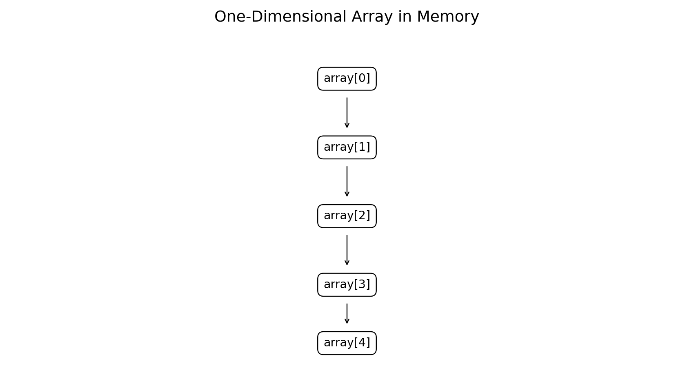
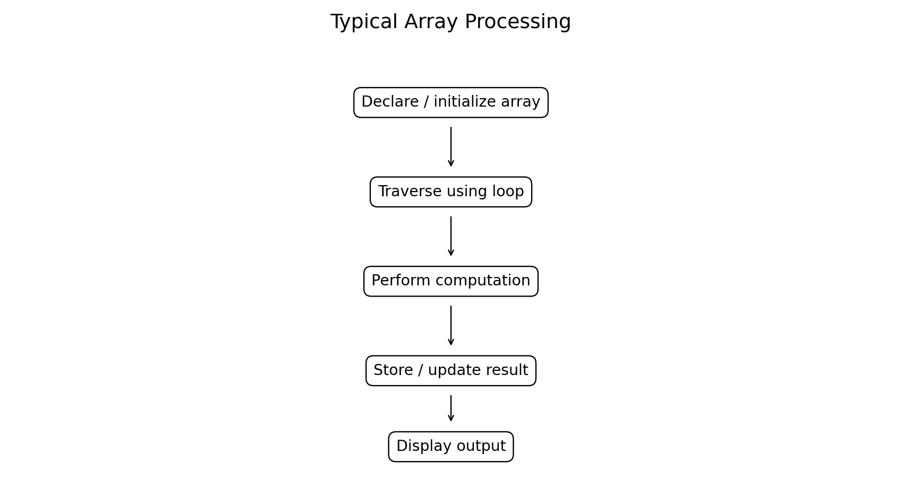
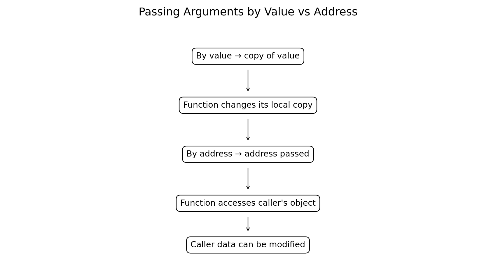
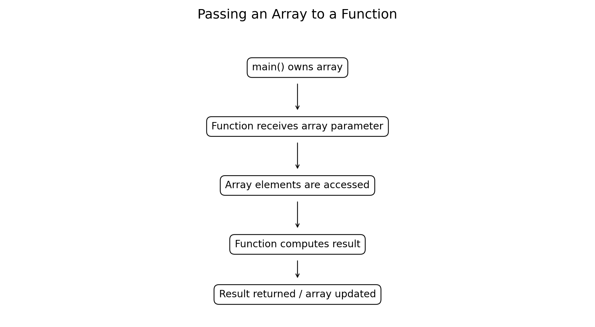

# :classical_building: Problem Solving Using Programming - B.Tech-IT, IIIT Allahabad
## Unit 4: Functions, Arrays 1D and 2D, Strings
* ### Current Topic: One-Dimensional Arrays in C
* **Purpose:** One-Dimensional Arrays — Definition and Initialization, Computations and Output, Function Arguments, Passing Arguments by Value, and Passing Arguments by Address
---

---
## 👥 Instructor Information
* **Edited by Instructor:** [Dr. Mohammed Javed](https://sites.google.com/site/mohammedjaved2016/)
* **Email:** javed@iiita.ac.in
* **Senior Teaching Assistants:** Mr. Subrata Pramanik (pmm2024003@iiita.ac.in)
---
## 🎯 Learning Objectives

After studying this chapter, students will be able to:

- Define and declare one-dimensional arrays in C.
- Initialize arrays during declaration and during program execution.
- Access individual array elements using indices.
- Traverse arrays using loops.
- Perform computations such as sum, average, maximum, minimum, and searching.
- Display array elements and calculated results.
- Pass individual values to functions.
- Explain passing arguments by value.
- Explain passing addresses using pointers.
- Pass arrays to functions.
- Modify array elements inside functions.
- Apply arrays and functions to engineering problems.

---

# 1. Introduction

An **array** is a collection of elements of the same data type stored under one variable name.

For example:

```c
int marks[5];
```

creates an array capable of storing five `int` values.

Instead of declaring:

```c
int mark1, mark2, mark3, mark4, mark5;
```

we can write:

```c
int marks[5];
```

Arrays are fundamental in engineering programming because measured data, sensor samples, examination marks, signal values, temperatures, and numerical results are often stored as collections.

---

# 2. One-Dimensional Array

A one-dimensional array can be visualized as a sequence of elements.



For:

```c
int numbers[5];
```

the valid indices are:

```text
0  1  2  3  4
```

The first element is:

```c
numbers[0]
```

and the last element is:

```c
numbers[4]
```

---

# 3. Array Declaration

The general syntax is:

```c
data_type array_name[size];
```

Examples:

```c
int marks[10];
float temperature[24];
double voltage[100];
char name[20];
```

Here:

- `int`, `float`, `double`, `char` → data types
- `marks`, `temperature`, `voltage`, `name` → array names
- `10`, `24`, `100`, `20` → array sizes

---

# 4. Array Index

C array indexing starts at **0**.

For:

```c
int a[5];
```

the elements are:

```text
a[0]
a[1]
a[2]
a[3]
a[4]
```

There is no valid:

```c
a[5]
```

for an array of five elements.

Accessing outside the valid range causes **undefined behavior**.

---

# 5. Array Initialization

An array can be initialized during declaration.

```c
int numbers[5] = {10, 20, 30, 40, 50};
```

The array contains:

```text
Index:    0   1   2   3   4
Value:   10  20  30  40  50
```

---

# 6. Partial Initialization

C allows fewer initializers than the declared size.

```c
int numbers[5] = {10, 20};
```

The remaining elements are initialized to zero:

```text
10  20  0  0  0
```

This is different from leaving an automatic local array completely uninitialized.

---

# 7. Size Inference

The size can be omitted when an initializer is provided.

```c
int numbers[] = {10, 20, 30, 40};
```

The compiler determines that the array has four elements.

Equivalent conceptual layout:

```text
numbers[0] = 10
numbers[1] = 20
numbers[2] = 30
numbers[3] = 40
```

---

# 8. Accessing Array Elements

Individual elements can be read or changed.

```c
#include <stdio.h>

int main(void)
{
    int marks[5] = {75, 82, 68, 91, 88};

    printf("First mark = %d\n", marks[0]);

    marks[2] = 70;

    printf("Updated third mark = %d\n", marks[2]);

    return 0;
}
```

Output:

```text
First mark = 75
Updated third mark = 70
```

---

# 9. Traversing an Array

A `for` loop is commonly used to process all elements.

```c
#include <stdio.h>

int main(void)
{
    int numbers[5] = {10, 20, 30, 40, 50};

    for (int i = 0; i < 5; i++)
    {
        printf("%d ", numbers[i]);
    }

    printf("\n");

    return 0;
}
```

Output:

```text
10 20 30 40 50
```

---

# 10. Typical Array Processing



A typical program follows:

```text
Declare / initialize
        ↓
Traverse using loop
        ↓
Perform computation
        ↓
Store or update result
        ↓
Display output
```

---

# 11. Reading Array Elements from the User

```c
#include <stdio.h>

int main(void)
{
    int numbers[5];

    for (int i = 0; i < 5; i++)
    {
        printf("Enter number %d: ", i + 1);
        scanf("%d", &numbers[i]);
    }

    printf("Numbers: ");

    for (int i = 0; i < 5; i++)
    {
        printf("%d ", numbers[i]);
    }

    printf("\n");

    return 0;
}
```

Example interaction:

```text
Enter number 1: 10
Enter number 2: 20
Enter number 3: 30
Enter number 4: 40
Enter number 5: 50
Numbers: 10 20 30 40 50
```

---

# 12. Computing the Sum

The sum of array elements can be calculated using an accumulator.

```c
#include <stdio.h>

int main(void)
{
    int numbers[5] = {10, 20, 30, 40, 50};
    int sum = 0;

    for (int i = 0; i < 5; i++)
    {
        sum += numbers[i];
    }

    printf("Sum = %d\n", sum);

    return 0;
}
```

Output:

```text
Sum = 150
```

---

# 13. Computing the Average

```c
#include <stdio.h>

int main(void)
{
    int marks[5] = {75, 82, 68, 91, 88};
    int sum = 0;
    double average;

    for (int i = 0; i < 5; i++)
    {
        sum += marks[i];
    }

    average = (double)sum / 5;

    printf("Sum = %d\n", sum);
    printf("Average = %.2f\n", average);

    return 0;
}
```

Output:

```text
Sum = 404
Average = 80.80
```

The explicit conversion:

```c
(double)sum
```

ensures floating-point division.

---

# 14. Finding Maximum

```c
#include <stdio.h>

int main(void)
{
    int numbers[6] = {12, 45, 7, 89, 34, 23};
    int maximum = numbers[0];

    for (int i = 1; i < 6; i++)
    {
        if (numbers[i] > maximum)
        {
            maximum = numbers[i];
        }
    }

    printf("Maximum = %d\n", maximum);

    return 0;
}
```

Output:

```text
Maximum = 89
```

---

# 15. Finding Minimum

```c
#include <stdio.h>

int main(void)
{
    int numbers[6] = {12, 45, 7, 89, 34, 23};
    int minimum = numbers[0];

    for (int i = 1; i < 6; i++)
    {
        if (numbers[i] < minimum)
        {
            minimum = numbers[i];
        }
    }

    printf("Minimum = %d\n", minimum);

    return 0;
}
```

Output:

```text
Minimum = 7
```

---

# 16. Searching an Array

A simple linear search checks elements one at a time.

```c
#include <stdio.h>

int main(void)
{
    int numbers[6] = {12, 45, 7, 89, 34, 23};
    int key = 34;
    int found = 0;

    for (int i = 0; i < 6; i++)
    {
        if (numbers[i] == key)
        {
            printf("%d found at index %d\n", key, i);
            found = 1;
            break;
        }
    }

    if (!found)
    {
        printf("%d not found\n", key);
    }

    return 0;
}
```

Output:

```text
34 found at index 4
```

---

# 17. Counting Values

Suppose we want to count how many measurements exceed a threshold.

```c
#include <stdio.h>

int main(void)
{
    double temperature[6] = {25.2, 31.5, 29.8, 35.1, 33.7, 27.4};
    int count = 0;

    for (int i = 0; i < 6; i++)
    {
        if (temperature[i] > 30.0)
        {
            count++;
        }
    }

    printf("Readings above 30 C = %d\n", count);

    return 0;
}
```

Output:

```text
Readings above 30 C = 3
```

---

# 18. Engineering Example — Sensor Measurements

Arrays are useful for storing sensor readings.

```c
#include <stdio.h>

int main(void)
{
    double voltage[5] = {4.8, 5.1, 4.9, 5.0, 5.2};
    double sum = 0.0;

    for (int i = 0; i < 5; i++)
    {
        sum += voltage[i];
    }

    printf("Average voltage = %.2f V\n", sum / 5.0);

    return 0;
}
```

Output:

```text
Average voltage = 5.00 V
```

---

# 19. Passing Arrays to Functions

Arrays are frequently processed by functions.

Example:

```c
#include <stdio.h>

void display_array(int a[], int n)
{
    for (int i = 0; i < n; i++)
    {
        printf("%d ", a[i]);
    }

    printf("\n");
}

int main(void)
{
    int numbers[] = {10, 20, 30, 40, 50};

    display_array(numbers, 5);

    return 0;
}
```

Output:

```text
10 20 30 40 50
```

Important:

```c
void display_array(int a[], int n)
```

The function needs the array and its length.

---

# 20. Array Parameter Syntax

For a one-dimensional array, these parameter forms are commonly used:

```c
void process(int a[], int n)
```

and:

```c
void process(int *a, int n)
```

for ordinary function parameters, the array parameter is adjusted to a pointer to its first element.

The size is therefore not automatically available inside the function.

That is why we usually pass:

```c
array + size
```

Example:

```c
process(numbers, 5);
```

---

# 21. Computing Sum Using a Function

```c
#include <stdio.h>

int array_sum(const int a[], int n)
{
    int sum = 0;

    for (int i = 0; i < n; i++)
    {
        sum += a[i];
    }

    return sum;
}

int main(void)
{
    int numbers[] = {10, 20, 30, 40, 50};

    printf("Sum = %d\n", array_sum(numbers, 5));

    return 0;
}
```

Output:

```text
Sum = 150
```

The `const` qualifier tells the function not to modify the array elements through `a`.

---

# 22. Function Arguments

A function can receive values as arguments.

```c
int square(int x)
{
    return x * x;
}
```

Call:

```c
int result = square(5);
```

Here:

```text
x → parameter
5 → argument
```

---

# 23. Passing Arguments by Value

In C, ordinary function arguments are passed **by value**.

This means the function receives a copy of the argument's value.

```c
#include <stdio.h>

void change(int x)
{
    x = 100;
}

int main(void)
{
    int number = 10;

    change(number);

    printf("number = %d\n", number);

    return 0;
}
```

Output:

```text
number = 10
```

The function changed its local copy, not the caller's variable.

---

# 24. Illustration of Pass by Value



Conceptually:

```text
main()
number = 10
    |
    | copy of 10
    ↓
change(x)
x = 10
    |
    | x = 100
    ↓
x disappears

main()
number = 10
```

The original variable remains unchanged.

---

# 25. Passing Arguments by Address

C does not have a separate pass-by-reference parameter mechanism. Instead, a programmer can pass an object's **address** using a pointer.

Example:

```c
#include <stdio.h>

void change(int *x)
{
    *x = 100;
}

int main(void)
{
    int number = 10;

    change(&number);

    printf("number = %d\n", number);

    return 0;
}
```

Output:

```text
number = 100
```

---

# 26. Address Operator `&`

The address-of operator is:

```c
&
```

If:

```c
int number = 10;
```

then:

```c
&number
```

means:

> address of `number`

The address can be passed to a pointer parameter:

```c
change(&number);
```

---

# 27. Dereference Operator `*`

If:

```c
int *x;
```

then:

```c
*x
```

refers to the object whose address is stored in `x`.

Example:

```c
void change(int *x)
{
    *x = 100;
}
```

The statement:

```c
*x = 100;
```

changes the original object whose address was passed.

---

# 28. Swapping Two Values

Passing addresses allows a function to modify two caller variables.

```c
#include <stdio.h>

void swap(int *a, int *b)
{
    int temp = *a;

    *a = *b;
    *b = temp;
}

int main(void)
{
    int x = 10;
    int y = 20;

    printf("Before: x = %d, y = %d\n", x, y);

    swap(&x, &y);

    printf("After:  x = %d, y = %d\n", x, y);

    return 0;
}
```

Output:

```text
Before: x = 10, y = 20
After:  x = 20, y = 10
```

---

# 29. Passing an Array by Address

When an array is passed to a function, the function receives access to its elements through the array parameter.

```c
#include <stdio.h>

void double_elements(int a[], int n)
{
    for (int i = 0; i < n; i++)
    {
        a[i] *= 2;
    }
}

int main(void)
{
    int numbers[] = {1, 2, 3, 4, 5};

    double_elements(numbers, 5);

    for (int i = 0; i < 5; i++)
    {
        printf("%d ", numbers[i]);
    }

    printf("\n");

    return 0;
}
```

Output:

```text
2 4 6 8 10
```

The function modifies the elements of the original array.

---

# 30. Important Point About Arrays and Functions

For:

```c
void process(int a[], int n)
```

the parameter `a` is adjusted to a pointer parameter.

Therefore, the function can access the original array elements.

This differs from passing a scalar such as:

```c
void process(int x)
```

where `x` is a copy of the caller's integer.

---

# 31. Passing Array to Function Without Modification

Use `const` when a function only reads the array.

```c
#include <stdio.h>

double average(const double a[], int n)
{
    double sum = 0.0;

    for (int i = 0; i < n; i++)
    {
        sum += a[i];
    }

    return sum / n;
}

int main(void)
{
    double readings[] = {10.0, 12.0, 14.0, 16.0};

    printf("Average = %.2f\n", average(readings, 4));

    return 0;
}
```

Output:

```text
Average = 13.00
```

`const` documents that the function does not intend to modify the elements.

---

# 32. Function That Returns Maximum

```c
#include <stdio.h>

int maximum(const int a[], int n)
{
    int max = a[0];

    for (int i = 1; i < n; i++)
    {
        if (a[i] > max)
        {
            max = a[i];
        }
    }

    return max;
}

int main(void)
{
    int data[] = {15, 42, 7, 91, 34};

    printf("Maximum = %d\n", maximum(data, 5));

    return 0;
}
```

Output:

```text
Maximum = 91
```

---

# 33. Function That Returns Minimum

```c
#include <stdio.h>

int minimum(const int a[], int n)
{
    int min = a[0];

    for (int i = 1; i < n; i++)
    {
        if (a[i] < min)
        {
            min = a[i];
        }
    }

    return min;
}

int main(void)
{
    int data[] = {15, 42, 7, 91, 34};

    printf("Minimum = %d\n", minimum(data, 5));

    return 0;
}
```

Output:

```text
Minimum = 7
```

---

# 34. Array Function Processing Model



A common design is:

```text
main()
   ↓
array + size
   ↓
processing function
   ↓
computed result
```

For example:

```c
sum = array_sum(numbers, 5);
```

This separates data processing from the main program.

---

# 35. Engineering Example — Average Sensor Reading

```c
#include <stdio.h>

double average(const double data[], int n)
{
    double sum = 0.0;

    for (int i = 0; i < n; i++)
    {
        sum += data[i];
    }

    return sum / n;
}

int main(void)
{
    double temperature[] =
    {
        28.4, 29.1, 30.2, 28.9, 29.7
    };

    printf("Average temperature = %.2f C\n",
           average(temperature, 5));

    return 0;
}
```

Output:

```text
Average temperature = 29.26 C
```

---

# 36. Engineering Example — Find Peak Voltage

```c
#include <stdio.h>

double maximum(const double a[], int n)
{
    double max = a[0];

    for (int i = 1; i < n; i++)
    {
        if (a[i] > max)
        {
            max = a[i];
        }
    }

    return max;
}

int main(void)
{
    double voltage[] =
    {
        2.1, 4.5, 3.8, 5.2, 4.9, 3.4
    };

    printf("Peak voltage = %.2f V\n",
           maximum(voltage, 6));

    return 0;
}
```

Output:

```text
Peak voltage = 5.20 V
```

---

# 37. Engineering Example — Count Faulty Measurements

```c
#include <stdio.h>

int count_faults(const double data[], int n, double limit)
{
    int count = 0;

    for (int i = 0; i < n; i++)
    {
        if (data[i] > limit)
        {
            count++;
        }
    }

    return count;
}

int main(void)
{
    double temperature[] =
    {
        25.0, 31.2, 28.5, 35.0, 33.1, 27.8
    };

    int faults = count_faults(temperature, 6, 30.0);

    printf("High-temperature readings = %d\n", faults);

    return 0;
}
```

Output:

```text
High-temperature readings = 3
```

---

# 38. Array Bounds

For:

```c
int a[5];
```

valid indices are:

```text
0, 1, 2, 3, 4
```

Invalid:

```c
a[5]
a[-1]
```

C does not automatically perform array-bounds checking.

Always ensure that:

```c
0 <= index < size
```

---

# 39. Common Array Mistakes

### Mistake 1 — Off-by-one error

Incorrect:

```c
for (int i = 0; i <= 5; i++)
```

for a five-element array.

Correct:

```c
for (int i = 0; i < 5; i++)
```

### Mistake 2 — Incorrect index

```c
numbers[5]
```

is invalid for:

```c
int numbers[5];
```

### Mistake 3 — Wrong size passed to function

```c
array_sum(numbers, 10);
```

is dangerous if `numbers` contains only five elements.

### Mistake 4 — Uninitialized automatic array

```c
int numbers[5];
```

inside a function does not automatically initialize all elements to zero.

Initialize it before reading its values.

---

# 40. Arrays and Memory

An array's elements are stored contiguously.

For:

```c
int a[4] = {10, 20, 30, 40};
```

the conceptual memory arrangement is:

```text
a[0] → 10
a[1] → 20
a[2] → 30
a[3] → 40
```

This contiguous representation makes array traversal efficient.

The exact byte addresses depend on the execution environment.

---

# 41. Array Size with `sizeof`

Inside the same scope where an actual array object exists, its total size can be calculated as:

```c
sizeof(a)
```

and the number of elements as:

```c
sizeof(a) / sizeof(a[0])
```

Example:

```c
#include <stdio.h>

int main(void)
{
    int a[] = {10, 20, 30, 40, 50};

    size_t n = sizeof(a) / sizeof(a[0]);

    printf("Number of elements = %zu\n", n);

    return 0;
}
```

Output:

```text
Number of elements = 5
```

When an array is passed to a normal function parameter, `sizeof(parameter)` gives the pointer size, not the original array size. Therefore, pass the length separately.

---

# 42. Array as Function Argument — Key Idea

Consider:

```c
void display(const int a[], int n)
```

Call:

```c
display(numbers, 5);
```

The function receives access to the array's elements and separately receives the number of elements.

Recommended pattern:

```c
function(array, size);
```

---

# 43. Comparison: Value vs Address

| Feature | Pass by value | Pass address using pointer |
|---|---|---|
| What is passed? | Value/copy | Address |
| Can function modify caller's scalar? | No | Yes, through pointer |
| Parameter example | `int x` | `int *x` |
| Call example | `f(n)` | `f(&n)` |
| Common use | Calculations/read-only scalar input | Modify caller data |
| Arrays | Not directly copied as whole array | Array parameters provide element access |

---

# 44. Important Terminology

### Array

Collection of same-type elements.

### Index

Position used to access an array element.

### Element

One individual value in an array.

### Parameter

Variable appearing in a function parameter list.

### Argument

Actual expression/value supplied in a function call.

### Pointer

Object that stores an address.

### Address-of operator

```c
&
```

### Dereference operator

```c
*
```

---

# 45. Complete Example — Array Statistics

```c
#include <stdio.h>

double average(const double a[], int n)
{
    double sum = 0.0;

    for (int i = 0; i < n; i++)
        sum += a[i];

    return sum / n;
}

double maximum(const double a[], int n)
{
    double max = a[0];

    for (int i = 1; i < n; i++)
    {
        if (a[i] > max)
            max = a[i];
    }

    return max;
}

double minimum(const double a[], int n)
{
    double min = a[0];

    for (int i = 1; i < n; i++)
    {
        if (a[i] < min)
            min = a[i];
    }

    return min;
}

int main(void)
{
    double measurements[] =
    {
        12.5, 15.2, 10.8, 18.4, 14.1
    };

    int n = sizeof(measurements) / sizeof(measurements[0]);

    printf("Average = %.2f\n", average(measurements, n));
    printf("Maximum = %.2f\n", maximum(measurements, n));
    printf("Minimum = %.2f\n", minimum(measurements, n));

    return 0;
}
```

Output:

```text
Average = 14.20
Maximum = 18.40
Minimum = 10.80
```

This example demonstrates modular problem solving using:

```text
Array
  ↓
Function arguments
  ↓
Functions
  ↓
Computations
  ↓
Output
```

---

# 46. Laboratory Exercises

### Exercise 1 — Array Input and Output

Read 10 integers into an array and display them.

### Exercise 2 — Sum and Average

Read `n` numbers and calculate their sum and average.

### Exercise 3 — Maximum and Minimum

Find the largest and smallest element.

### Exercise 4 — Search

Search for a value using linear search.

### Exercise 5 — Even and Odd

Count the number of even and odd elements.

### Exercise 6 — Array Function

Write:

```c
int array_sum(const int a[], int n);
```

### Exercise 7 — Pass by Value

Write a function that attempts to change an integer and observe why the caller's variable is unchanged.

### Exercise 8 — Pass by Address

Write a function:

```c
void swap(int *a, int *b);
```

to exchange two values.

### Exercise 9 — Sensor Data

Store 10 temperature measurements and calculate:

- Average
- Maximum
- Minimum
- Number of readings above a specified threshold

Use separate functions.

### Exercise 10 — Engineering Measurements

Store voltage measurements in an array and calculate the peak, average, and number of measurements outside a specified range.

---

# 47. Viva Questions

1. What is an array?
2. What is a one-dimensional array?
3. Why does C use zero-based indexing?
4. How do you declare an array?
5. How do you initialize an array?
6. What happens to remaining elements during partial initialization?
7. How do you find the number of elements of an array declared in the current scope?
8. Why should array size be passed to a function?
9. What is an array parameter?
10. What is the difference between a parameter and an argument?
11. What does passing by value mean?
12. Why does changing a scalar parameter not normally change the caller's variable?
13. What is an address?
14. What does `&x` mean?
15. What does `*p` mean?
16. How can a function modify a caller's variable?
17. How are arrays passed to functions?
18. Why is `const` useful in an array parameter?
19. What is an array-bounds error?
20. Give two engineering applications of arrays.

---

# 48. Summary

A one-dimensional array stores multiple values of the same data type under one name.

Basic declaration:

```c
int numbers[5];
```

Initialization:

```c
int numbers[5] = {10, 20, 30, 40, 50};
```

Access:

```c
numbers[i]
```

Traversal:

```c
for (int i = 0; i < n; i++)
{
    printf("%d ", numbers[i]);
}
```

Passing an array to a function:

```c
process(numbers, n);
```

Function parameter:

```c
void process(const int a[], int n)
```

Passing a scalar by value:

```c
function(x);
```

Passing an address:

```c
function(&x);
```

Pointer parameter:

```c
void function(int *p)
```

The key problem-solving pattern is:

```text
Understand problem
      ↓
Choose array representation
      ↓
Initialize / input data
      ↓
Traverse elements
      ↓
Perform computation
      ↓
Use functions for modularity
      ↓
Display result
```

Arrays and functions together provide a foundation for more advanced C topics such as strings, multidimensional arrays, pointers, dynamic memory, structures, and numerical algorithms.

---

## GitHub Folder Structure

```text
c-one-dimensional-arrays/
├── README.md
├── c_one_dimensional_arrays.md
└── figures/
    ├── 01_array_layout.png
    ├── 02_array_processing.png
    ├── 03_value_vs_address.png
    └── 04_array_function.png
```
