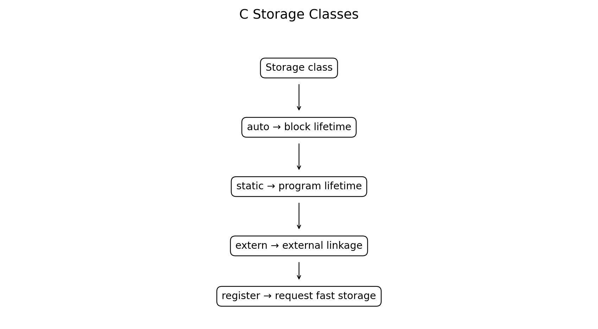
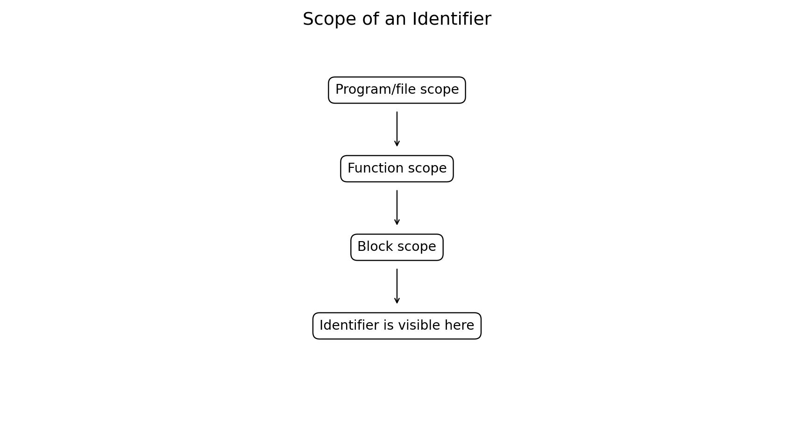
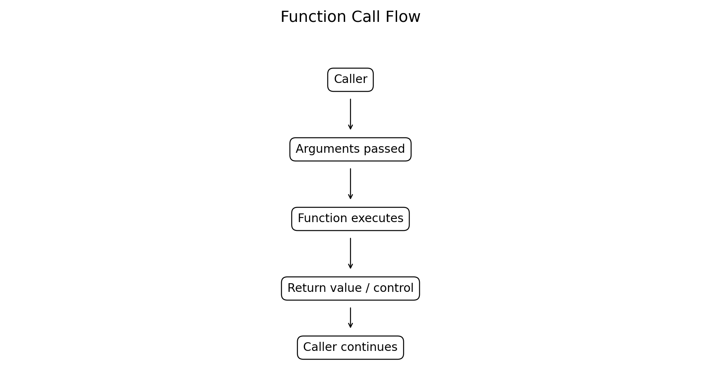
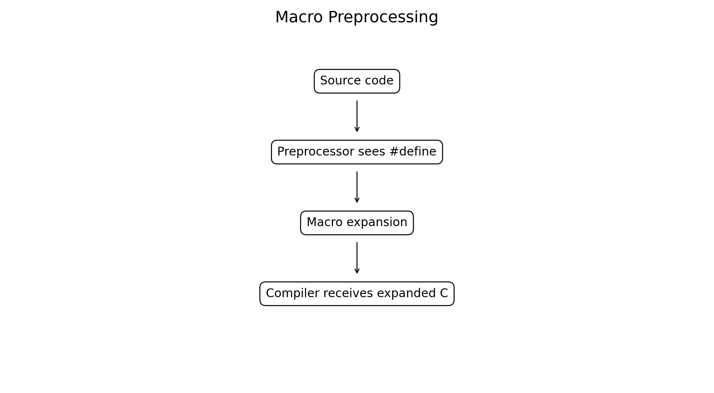
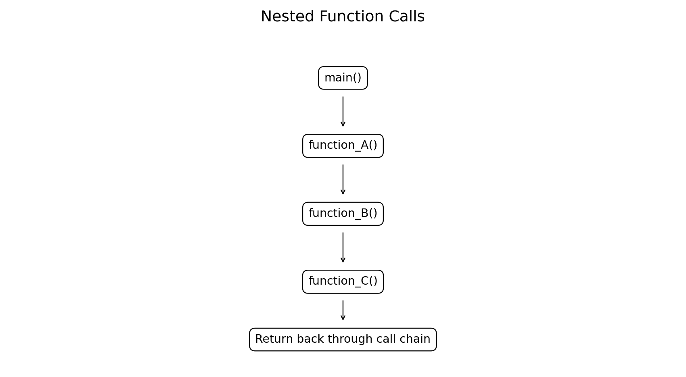
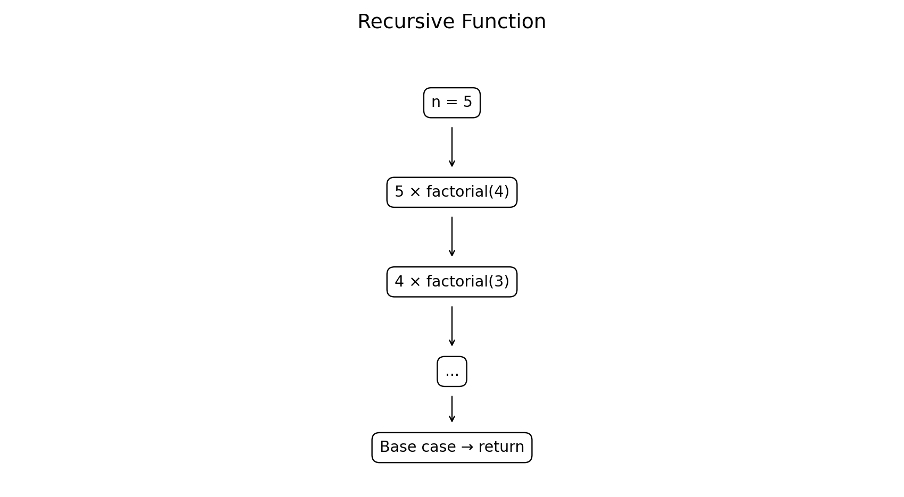
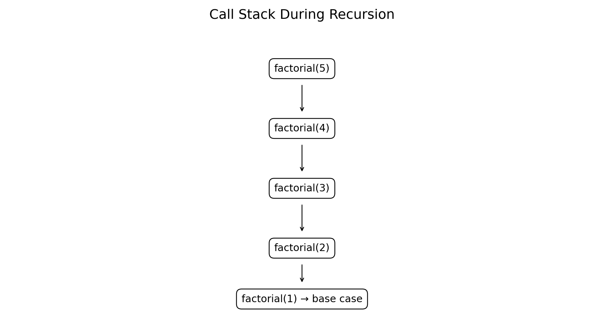

# Storage Class and Scope, Function Call, Macros, Nested and Recursive Functions in C

**Course:** Problem Solving Using C  
**Level:** Bachelor of Engineering

## Learning Objectives

After completing this chapter, students will be able to:

- Explain storage classes in C.
- Distinguish scope, lifetime, linkage, and visibility.
- Understand `auto`, `static`, `extern`, and `register`.
- Explain function calls and argument passing.
- Define and use preprocessor macros.
- Distinguish macros from functions.
- Use nested function calls effectively.
- Understand recursion and base cases.
- Implement recursive engineering and mathematical problems.
- Identify common errors involving scope, storage, macros, and recursion.

---

# 1. Introduction

As C programs become larger, understanding **where variables can be accessed**, **how long they exist**, and **how functions communicate** becomes essential.

This chapter covers:

```text
Storage Classes
      ↓
Scope and Lifetime
      ↓
Function Calls
      ↓
Macros
      ↓
Nested Function Calls
      ↓
Recursive Functions
```

---

# 2. Storage Classes

A storage class provides information about an identifier's:

- Scope
- Lifetime
- Linkage
- Storage duration

The commonly studied C storage-class specifiers are:

```text
auto
static
extern
register
```



> Note: In modern C, `auto` is mainly used for ordinary local variables, while `register` is largely a request to the compiler and modern optimizing compilers generally make their own register-allocation decisions.

---

# 3. `auto` Storage Class

Local variables declared inside a block are automatic by default.

Example:

```c
#include <stdio.h>

void display(void)
{
    auto int x = 10;

    printf("x = %d\n", x);
}

int main(void)
{
    display();
    return 0;
}
```

Output:

```text
x = 10
```

The following two declarations are equivalent for an ordinary local variable:

```c
int x = 10;
```

and

```c
auto int x = 10;
```

### Characteristics

- Usually block scope.
- Automatic storage duration.
- Created when execution enters its block.
- Ceases to exist when execution leaves its block.

---

# 4. `static` Local Variable

A local `static` variable retains its value between function calls.

Example:

```c
#include <stdio.h>

void counter(void)
{
    static int count = 0;

    count++;
    printf("Count = %d\n", count);
}

int main(void)
{
    counter();
    counter();
    counter();

    return 0;
}
```

Output:

```text
Count = 1
Count = 2
Count = 3
```

Although `count` has block scope, its storage duration lasts for the entire execution of the program.

---

# 5. Why Use a Static Variable?

A static local variable is useful when a function must remember information between calls.

Examples:

- Number of function calls
- Sensor sample count
- State information
- Running statistics
- Event counters

Example:

```c
#include <stdio.h>

void record_sample(void)
{
    static int samples = 0;

    samples++;
    printf("Samples received = %d\n", samples);
}

int main(void)
{
    record_sample();
    record_sample();
    record_sample();

    return 0;
}
```

Output:

```text
Samples received = 1
Samples received = 2
Samples received = 3
```

---

# 6. `static` at File Scope

A file-scope `static` variable has **internal linkage**.

Example:

```c
static int sensor_count = 0;
```

This identifier can be used within the same source file but is not available for linkage from another source file.

This is useful for hiding implementation details in larger programs.

---

# 7. `extern`

`extern` is used to declare an identifier whose definition may be provided elsewhere.

Example:

```c
extern int sensor_count;
```

It tells the compiler that the variable exists, but the declaration itself does not normally allocate a new definition for the object.

A multi-file project might contain:

**sensor.c**

```c
int sensor_count = 100;
```

**main.c**

```c
#include <stdio.h>

extern int sensor_count;

int main(void)
{
    printf("Sensors = %d\n", sensor_count);
    return 0;
}
```

Output:

```text
Sensors = 100
```

This is useful in multi-file engineering software.

---

# 8. `register`

The `register` keyword historically suggested that a variable should be stored in a CPU register.

Example:

```c
register int i;
```

However, modern compilers generally decide whether a variable should be kept in a register based on optimization.

Important points:

- It is only a request to the implementation.
- It does not guarantee register storage.
- The address-of operator cannot be applied to an object declared with `register`.

Example:

```c
register int i;

for (i = 0; i < 10; i++)
{
    /* processing */
}
```

In modern C programming, ordinary variables are usually sufficient and compiler optimization should be relied upon.

---

# 9. Storage Class Comparison

| Storage class | Typical scope | Storage duration | Main purpose |
|---|---|---|---|
| `auto` | Block | Automatic | Ordinary local variable |
| `static` local | Block | Entire program | Preserve value |
| `static` file-scope | File | Entire program | Restrict linkage to file |
| `extern` | Depends on declaration | Depends on definition | Refer to external definition |
| `register` | Block | Automatic | Historical optimization hint |

---

# 10. Scope

**Scope** specifies the region of a program in which an identifier can be referred to.

Common scope categories include:

```text
Block scope
Function scope
File scope
Function prototype scope
```



---

# 11. Block Scope

A variable declared inside `{ }` normally has block scope.

```c
#include <stdio.h>

int main(void)
{
    int x = 10;

    {
        int y = 20;

        printf("x = %d\n", x);
        printf("y = %d\n", y);
    }

    return 0;
}
```

Here:

```text
x → available throughout main's block
y → available only inside the inner block
```

Trying to use `y` after the inner block would be an error.

---

# 12. File Scope

A variable declared outside all functions has file scope.

```c
#include <stdio.h>

int sensor_limit = 100;

int main(void)
{
    printf("Limit = %d\n", sensor_limit);
    return 0;
}
```

`sensor_limit` can be referred to by functions appearing later in the same source file, subject to declarations and linkage rules.

---

# 13. Function Scope

Function scope is associated with labels.

Example:

```c
#include <stdio.h>

void test(int n)
{
    if (n > 0)
        goto positive;

    return;

positive:
    printf("Positive value\n");
}
```

The label `positive` has function scope.

---

# 14. Scope vs Lifetime

These concepts should not be confused.

### Scope

Answers:

> Where can I refer to this identifier?

### Lifetime / Storage Duration

Answers:

> How long does the object exist?

For example:

```c
void counter(void)
{
    static int count = 0;
    count++;
}
```

`count` has:

```text
Block scope
Static storage duration
```

---

# 15. Function Calls

A function call transfers control from the caller to the called function.

Example:

```c
result = add(10, 20);
```



The basic sequence is:

```text
Caller
   ↓
Pass arguments
   ↓
Function executes
   ↓
Return value
   ↓
Caller continues
```

---

# 16. Function Arguments

Consider:

```c
int add(int a, int b)
{
    return a + b;
}
```

Calling:

```c
add(10, 20);
```

means:

```text
a ← 10
b ← 20
```

In C, ordinary arguments are passed **by value**.

That means the function receives values rather than direct aliases to the caller's scalar variables.

---

# 17. Pass-by-Value Example

```c
#include <stdio.h>

void change(int x)
{
    x = 100;
}

int main(void)
{
    int n = 10;

    change(n);

    printf("n = %d\n", n);

    return 0;
}
```

Output:

```text
n = 10
```

Changing `x` does not change `n`.

---

# 18. Using Pointers to Modify Caller Data

C can achieve reference-like behavior by passing an address.

```c
#include <stdio.h>

void change(int *x)
{
    *x = 100;
}

int main(void)
{
    int n = 10;

    change(&n);

    printf("n = %d\n", n);

    return 0;
}
```

Output:

```text
n = 100
```

The pointer contains the address of the caller's object.

---

# 19. Macros

A macro is defined using the C preprocessor.

Syntax:

```c
#define NAME replacement
```

Example:

```c
#define PI 3.141592653589793
```

The preprocessor performs macro replacement before compilation.



---

# 20. Object-like Macro

Example:

```c
#include <stdio.h>

#define PI 3.141592653589793

int main(void)
{
    double r = 5.0;

    printf("Area = %.2f\n", PI * r * r);

    return 0;
}
```

Output:

```text
Area = 78.54
```

The preprocessor replaces `PI` with its replacement text.

---

# 21. Function-like Macro

A macro can accept arguments.

```c
#define SQUARE(x) ((x) * (x))
```

Example:

```c
#include <stdio.h>

#define SQUARE(x) ((x) * (x))

int main(void)
{
    printf("Square = %d\n", SQUARE(5));

    return 0;
}
```

Output:

```text
Square = 25
```

---

# 22. Why Parentheses Matter in Macros

Poor macro:

```c
#define SQUARE(x) x * x
```

Consider:

```c
SQUARE(2 + 3)
```

Expansion becomes:

```c
2 + 3 * 2 + 3
```

which gives:

```text
11
```

not `25`.

Better:

```c
#define SQUARE(x) ((x) * (x))
```

Now:

```c
SQUARE(2 + 3)
```

becomes:

```text
((2 + 3) * (2 + 3))
```

and produces:

```text
25
```

---

# 23. Macro Side Effects

Be careful with:

```c
#define SQUARE(x) ((x) * (x))
```

and:

```c
SQUARE(i++)
```

The argument can be expanded more than once, causing unintended behavior.

Prefer a function when type-safe, single-evaluation behavior is important.

For example:

```c
int square(int x)
{
    return x * x;
}
```

---

# 24. Macro vs Function

| Macro | Function |
|---|---|
| Preprocessor replacement | Executed through function call |
| No type checking by macro itself | Function prototype enables type checking |
| Can cause repeated evaluation | Arguments are evaluated according to function-call rules |
| Useful for constants/conditional compilation | Better for general computations |
| May increase expanded source | Provides modular executable code |

Modern C programming should use functions for most computational tasks and macros where preprocessing is genuinely useful.

---

# 25. Conditional Compilation

Macros are also used for conditional compilation.

```c
#include <stdio.h>

#define DEBUG

int main(void)
{
#ifdef DEBUG
    printf("Debug mode enabled\n");
#endif

    printf("Program running\n");

    return 0;
}
```

Output:

```text
Debug mode enabled
Program running
```

If `DEBUG` is not defined, the first `printf()` is removed during preprocessing.

---

# 26. Nested Function Calls

A function can call another function.

For example:

```c
main()
  ↓
calculate()
  ↓
square()
```



Example:

```c
#include <stdio.h>

int square(int x)
{
    return x * x;
}

int calculate(int x)
{
    return square(x) + 10;
}

int main(void)
{
    printf("Result = %d\n", calculate(5));

    return 0;
}
```

Output:

```text
Result = 35
```

Here:

```text
main()
 → calculate(5)
    → square(5)
       → 25
    → 25 + 10
 → 35
```

---

# 27. Nested Calls in Engineering Calculations

Consider:

```text
distance
   ↓
velocity
   ↓
kinetic energy
```

```c
#include <stdio.h>

double velocity(double distance, double time)
{
    return distance / time;
}

double kinetic_energy(double mass, double v)
{
    return 0.5 * mass * v * v;
}

double calculate_energy(double mass, double distance, double time)
{
    return kinetic_energy(mass, velocity(distance, time));
}

int main(void)
{
    double energy = calculate_energy(10.0, 20.0, 4.0);

    printf("Kinetic Energy = %.2f J\n", energy);

    return 0;
}
```

Output:

```text
Kinetic Energy = 125.00 J
```

This is an example of composing smaller functions to solve a larger problem.

---

# 28. Recursive Functions

A recursive function is a function that calls itself.

A recursive solution generally requires:

1. **Base case**
2. **Recursive case**



General form:

```c
return_type function(parameters)
{
    if (base_condition)
        return base_value;

    return function(modified_parameters);
}
```

---

# 29. Factorial Using Recursion

Mathematically:

```text
n! = n × (n - 1)!
```

with:

```text
0! = 1
```

C implementation:

```c
#include <stdio.h>

long long factorial(int n)
{
    if (n <= 1)
        return 1;

    return n * factorial(n - 1);
}

int main(void)
{
    printf("5! = %lld\n", factorial(5));

    return 0;
}
```

Output:

```text
5! = 120
```

---

# 30. How Recursive Factorial Works

For:

```c
factorial(5)
```

the calls are:

```text
factorial(5)
    ↓
5 × factorial(4)
        ↓
        4 × factorial(3)
                ↓
                3 × factorial(2)
                        ↓
                        2 × factorial(1)
                                ↓
                                1
```

Then the results return:

```text
1
↓
2
↓
6
↓
24
↓
120
```

---

# 31. Recursive Call Stack

Each recursive call requires an active function-call frame until the base case is reached.



For `factorial(5)`, conceptually:

```text
factorial(5)
factorial(4)
factorial(3)
factorial(2)
factorial(1)
```

After the base case:

```text
factorial(1) returns
factorial(2) returns
factorial(3) returns
factorial(4) returns
factorial(5) returns
```

Deep recursion can consume significant stack space.

---

# 32. Recursive Fibonacci

The Fibonacci sequence is:

```text
0, 1, 1, 2, 3, 5, 8, 13, ...
```

Recursive definition:

```text
F(0) = 0
F(1) = 1
F(n) = F(n-1) + F(n-2)
```

C implementation:

```c
#include <stdio.h>

int fibonacci(int n)
{
    if (n <= 1)
        return n;

    return fibonacci(n - 1) + fibonacci(n - 2);
}

int main(void)
{
    for (int i = 0; i < 8; i++)
        printf("%d ", fibonacci(i));

    printf("\n");

    return 0;
}
```

Output:

```text
0 1 1 2 3 5 8 13
```

This simple recursive implementation is useful for learning recursion, but it becomes inefficient for larger `n`. An iterative or dynamic-programming approach is generally preferable for practical computation.

---

# 33. Recursive Greatest Common Divisor

Euclid's algorithm can be implemented recursively.

```c
#include <stdio.h>

int gcd(int a, int b)
{
    if (b == 0)
        return a;

    return gcd(b, a % b);
}

int main(void)
{
    printf("GCD = %d\n", gcd(48, 18));

    return 0;
}
```

Output:

```text
GCD = 6
```

---

# 34. Recursion vs Iteration

| Recursion | Iteration |
|---|---|
| Function calls itself | Loop repeats statements |
| Often elegant for recursive definitions | Usually uses less call-stack memory |
| Requires a base case | Requires loop termination |
| Can be easier for trees/divide-and-conquer | Often efficient for repeated numerical processing |
| Deep recursion may cause stack overflow | Usually easier to control memory |

Example iterative factorial:

```c
long long factorial(int n)
{
    long long result = 1;

    for (int i = 2; i <= n; i++)
        result *= i;

    return result;
}
```

---

# 35. Common Recursion Errors

### Missing base case

Incorrect:

```c
int count(int n)
{
    return count(n - 1);
}
```

There is no stopping condition.

### Parameter never approaches base case

Incorrect:

```c
int count(int n)
{
    if (n == 0)
        return 0;

    return count(n + 1);
}
```

If called with a positive number, it moves away from `0`.

### Excessive recursion

Very deep recursion may exhaust stack memory.

---

# 36. Storage, Scope and Functions Together

Consider:

```c
#include <stdio.h>

void counter(void)
{
    static int count = 0;

    count++;
    printf("%d\n", count);
}

int main(void)
{
    counter();
    counter();

    return 0;
}
```

Here:

```text
count
 ├── block scope
 ├── static storage duration
 └── value retained between calls
```

This demonstrates how storage duration and scope are independent concepts.

---

# 37. Engineering Example — Sensor Event Counter

A static variable can count events across function calls.

```c
#include <stdio.h>

void process_sensor(double value)
{
    static int sample_count = 0;

    sample_count++;

    printf("Sample %d: %.2f\n", sample_count, value);
}

int main(void)
{
    process_sensor(21.5);
    process_sensor(22.1);
    process_sensor(22.8);

    return 0;
}
```

Output:

```text
Sample 1: 21.50
Sample 2: 22.10
Sample 3: 22.80
```

---

# 38. Engineering Example — Recursive Binary Conversion

The following function prints the binary representation of a positive integer recursively.

```c
#include <stdio.h>

void print_binary(unsigned int n)
{
    if (n > 1)
        print_binary(n / 2);

    printf("%u", n % 2);
}

int main(void)
{
    printf("Binary = ");
    print_binary(13);
    printf("\n");

    return 0;
}
```

Output:

```text
Binary = 1101
```

This demonstrates recursion in a data-representation problem.

---

# 39. Engineering Example — Macro for Unit Conversion

A macro can be useful for simple compile-time textual substitutions.

```c
#include <stdio.h>

#define CM_TO_M(x) ((x) / 100.0)

int main(void)
{
    double length_cm = 250.0;

    printf("%.2f cm = %.2f m\n",
           length_cm, CM_TO_M(length_cm));

    return 0;
}
```

Output:

```text
250.00 cm = 2.50 m
```

For complex calculations or expressions with side effects, prefer functions.

---

# 40. Common Errors and Debugging

## Error 1 — Scope violation

```c
void test(void)
{
    int x = 10;
}

int main(void)
{
    printf("%d", x);   // ERROR
}
```

`x` is local to `test()`.

## Error 2 — Incorrect `extern`

Declaring:

```c
extern int x;
```

does not by itself provide a definition.

A suitable definition must exist somewhere in the program:

```c
int x = 10;
```

## Error 3 — Recursive function without a base case

This can result in excessive recursion and eventually stack exhaustion.

## Error 4 — Unsafe macro

Avoid:

```c
#define SQUARE(x) x*x
```

Prefer:

```c
#define SQUARE(x) ((x)*(x))
```

but remember that even the safer macro can evaluate its argument more than once.

## Error 5 — Confusing `static` scope with lifetime

A static local variable remains alive for the entire program even though its name is accessible only within its block.

---

# 41. Best Practices

### Storage classes

- Use ordinary local variables unless a special storage behavior is required.
- Use `static` when persistent local state is intentional.
- Use `extern` carefully in multi-file programs.
- Avoid depending on `register` for optimization.

### Scope

- Keep variables as local as practical.
- Avoid unnecessary global variables.
- Use `static` file-scope objects when implementation details should remain private.

### Functions

- Give functions meaningful names.
- Keep functions focused.
- Use prototypes.
- Validate arguments where appropriate.
- Prefer return values over hidden global state.

### Macros

- Parenthesize macro parameters.
- Parenthesize the complete replacement expression.
- Avoid macros with side effects.
- Prefer functions for ordinary calculations.

### Recursion

- Always define a clear base case.
- Ensure each recursive call moves toward the base case.
- Consider an iterative solution when recursion depth may become large.

---

# 42. Laboratory Exercises

### Exercise 1 — Static Counter

Write a function that counts how many times it has been called using a `static` variable.

### Exercise 2 — Scope

Create a program containing:

- File-scope variable
- Function-local variable
- Block-local variable

Demonstrate their visibility.

### Exercise 3 — External Variable

Create two source files and use `extern` to access a variable defined in another source file.

### Exercise 4 — Macros

Define macros for:

```text
square
cube
maximum of two values
centimetres to metres
```

Test them carefully.

### Exercise 5 — Nested Calls

Create:

```text
main()
 → calculate()
   → convert()
```

for an engineering unit-conversion problem.

### Exercise 6 — Recursive Factorial

Implement factorial recursively and compare it with an iterative solution.

### Exercise 7 — Recursive GCD

Implement Euclid's algorithm recursively.

### Exercise 8 — Recursive Binary

Write a recursive function to display an integer in binary.

### Exercise 9 — Sensor Monitoring

Use a `static` variable to count sensor readings and a function to classify readings as normal, warning, or critical.

---

# 43. Viva Questions

1. What is a storage class?
2. What is the purpose of `auto`?
3. What is a static local variable?
4. What is the difference between scope and lifetime?
5. What is `extern`?
6. What is the purpose of `register`?
7. What is block scope?
8. What is file scope?
9. What is function scope?
10. What happens during a function call?
11. How are ordinary C arguments passed?
12. What is a macro?
13. What does `#define` do?
14. Why should macro parameters be parenthesized?
15. What is conditional compilation?
16. What is a nested function call?
17. What is recursion?
18. What is a base case?
19. What happens if a recursive function has no base case?
20. Compare recursion and iteration.
21. Give an engineering application of `static`.
22. Give an engineering application of recursion.
23. Why can macros be dangerous?
24. When should a function be preferred over a macro?
25. How can scope improve program reliability?

---

# 44. Quick Reference

## Storage classes

```c
auto int x;
static int count;
extern int total;
register int i;
```

## Function call

```c
result = calculate(a, b);
```

## Macro

```c
#define PI 3.141592653589793
#define SQUARE(x) ((x) * (x))
```

## Nested function call

```c
result = functionA(functionB(x));
```

## Recursive function

```c
int factorial(int n)
{
    if (n <= 1)
        return 1;

    return n * factorial(n - 1);
}
```

---

# 45. Key Takeaways

```text
Storage class
    ↓
Controls storage duration/linkage characteristics

Scope
    ↓
Determines where an identifier can be referred to

Function call
    ↓
Transfers control to a function

Macro
    ↓
Preprocessor performs textual replacement

Nested call
    ↓
One function calls another

Recursion
    ↓
A function calls itself
```

The most important principles are:

- **Scope** tells where a name is visible.
- **Storage duration** tells how long an object exists.
- **`static` local variables** retain their values between calls.
- **`extern`** allows references to definitions provided elsewhere.
- **Macros** are processed before compilation.
- **Functions** are generally safer and clearer than macros for computations.
- **Nested function calls** allow complex problems to be composed from smaller functions.
- **Recursive functions** need a base case and progress toward that base case.
- Good scope and modular functions make engineering programs easier to test, debug, and maintain.

---

## GitHub Folder Structure

```text
c-storage-scope-macros-functions/
├── README.md
├── c_storage_scope_macros_functions.md
└── figures/
    ├── 01_storage_classes.png
    ├── 02_scope.png
    ├── 03_function_call.png
    ├── 04_macro_expansion.png
    ├── 05_nested_functions.png
    ├── 06_recursion.png
    └── 07_recursion_stack.png
```
