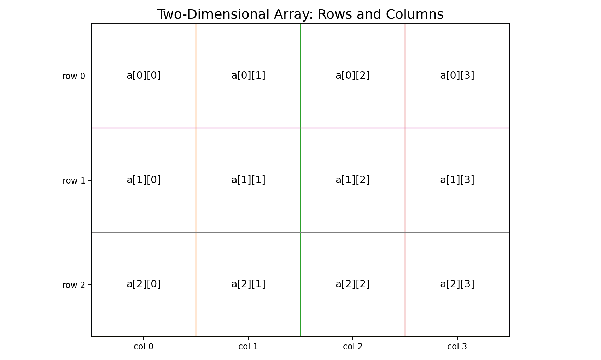
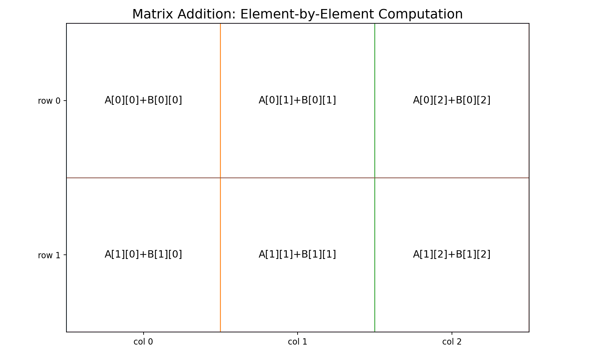
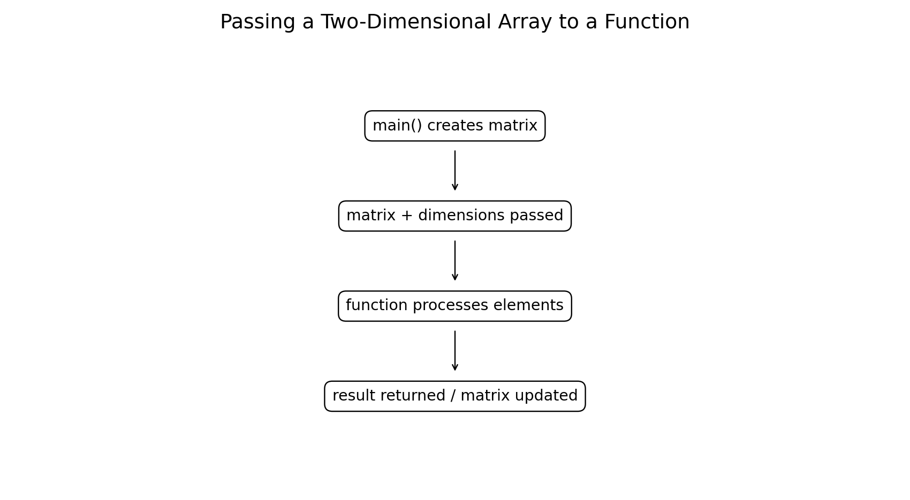
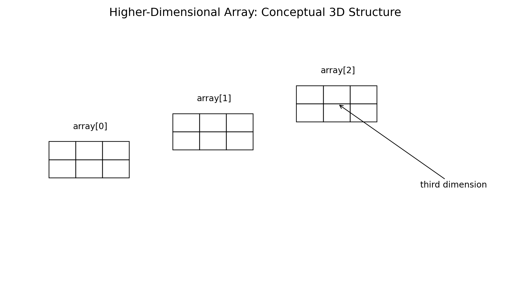

# :classical_building: Problem Solving Using Programming - B.Tech-IT, IIIT Allahabad
## Unit 4: Functions, Arrays 1D and 2D, Strings
* ### Current Topic: Two-Dimensional and Higher-Dimensional Arrays in C
* **Purpose:** Two-Dimensional Arrays — Definition and Initialization, Computations and Output, Function Arguments, Passing Arguments by Value, and Passing Arguments by Address
---

---
## 👥 Instructor Information
* **Edited by Instructor:** [Dr. Mohammed Javed](https://sites.google.com/site/mohammedjaved2016/)
* **Email:** javed@iiita.ac.in
* **Senior Teaching Assistants:** Mr. Subrata Pramanik (pmm2024003@iiita.ac.in)
---
## 🎯 Learning Objectives

After studying this chapter, students will be able to:

- Define and declare two-dimensional arrays in C.
- Initialize two-dimensional arrays.
- Access elements using row and column indices.
- Read and display matrices.
- Perform computations on two-dimensional arrays.
- Calculate row and column sums.
- Perform matrix addition and multiplication.
- Pass two-dimensional arrays to functions.
- Understand the role of dimensions in function parameters.
- Explain higher-dimensional arrays.
- Declare and initialize three-dimensional and higher-dimensional arrays.
- Apply multidimensional arrays to engineering and computing problems.

---

# 1. Introduction

A one-dimensional array stores data in a sequence:

```c
int a[5];
```

Many engineering and mathematical problems require data arranged in rows and columns.

Examples include:

- Matrices
- Tables
- Image pixels
- Marks of students in several subjects
- Temperature measurements across locations
- Engineering measurement tables
- Game boards
- Spreadsheet-like data

For these problems, C provides **multidimensional arrays**.

The most common multidimensional array is the **two-dimensional array**.

---

# 2. Two-Dimensional Arrays

A two-dimensional array contains elements arranged in:

```text
Rows × Columns
```

For example:

```c
int matrix[3][4];
```

means:

```text
3 rows
4 columns
```

and therefore:

```text
3 × 4 = 12 elements
```



---

# 3. Declaration of a Two-Dimensional Array

The general syntax is:

```c
data_type array_name[rows][columns];
```

Examples:

```c
int matrix[3][4];

float temperature[7][24];

double measurements[10][5];
```

For:

```c
int matrix[3][4];
```

the valid row indices are:

```text
0, 1, 2
```

and the valid column indices are:

```text
0, 1, 2, 3
```

---

# 4. Accessing an Element

An element is accessed using:

```c
array[row][column]
```

Example:

```c
int matrix[2][3] =
{
    {10, 20, 30},
    {40, 50, 60}
};
```

The elements are:

```text
matrix[0][0] = 10
matrix[0][1] = 20
matrix[0][2] = 30

matrix[1][0] = 40
matrix[1][1] = 50
matrix[1][2] = 60
```

---

# 5. Two-Dimensional Array Indexing

For:

```c
int a[3][4];
```

the index structure is:

```text
          columns
       0     1     2     3
    +-----+-----+-----+-----+
row 0
    +-----+-----+-----+-----+
row 1
    +-----+-----+-----+-----+
row 2
    +-----+-----+-----+-----+
```

The first index selects the row.

The second index selects the column.

```c
a[row][column]
```

---

# 6. Initialization of a Two-Dimensional Array

A two-dimensional array can be initialized using nested braces.

```c
#include <stdio.h>

int main(void)
{
    int matrix[2][3] =
    {
        {10, 20, 30},
        {40, 50, 60}
    };

    printf("%d\n", matrix[1][2]);

    return 0;
}
```

Output:

```text
60
```

---

# 7. Initialization Without Inner Braces

C also permits a flat initializer.

```c
int matrix[2][3] =
{
    10, 20, 30,
    40, 50, 60
};
```

This produces the same logical arrangement:

```text
10 20 30
40 50 60
```

Using nested braces is usually clearer for matrix-style data.

---

# 8. Partial Initialization

Consider:

```c
int matrix[2][3] =
{
    {1, 2},
    {3}
};
```

Unspecified elements are initialized to zero.

The resulting matrix is:

```text
1 2 0
3 0 0
```

For objects with static storage duration, unspecified elements are also initialized to zero. For an automatic array, this zero initialization occurs when an initializer is supplied with fewer values than the array contains.

---

# 9. Reading a Two-Dimensional Array

Two nested loops are normally used.

```c
#include <stdio.h>

int main(void)
{
    int matrix[2][3];

    for (int i = 0; i < 2; i++)
    {
        for (int j = 0; j < 3; j++)
        {
            scanf("%d", &matrix[i][j]);
        }
    }

    return 0;
}
```

Here:

```text
i → row index
j → column index
```

---

# 10. Displaying a Matrix

```c
#include <stdio.h>

int main(void)
{
    int matrix[2][3] =
    {
        {10, 20, 30},
        {40, 50, 60}
    };

    for (int i = 0; i < 2; i++)
    {
        for (int j = 0; j < 3; j++)
        {
            printf("%d ", matrix[i][j]);
        }

        printf("\n");
    }

    return 0;
}
```

Output:

```text
10 20 30
40 50 60
```

---

# 11. Row-Wise Processing

To process each row:

```c
for (int i = 0; i < rows; i++)
{
    for (int j = 0; j < columns; j++)
    {
        /* process matrix[i][j] */
    }
}
```

The outer loop controls rows.

The inner loop controls columns.

---

# 12. Column-Wise Processing

Column-wise processing can be performed by reversing the loop order:

```c
for (int j = 0; j < columns; j++)
{
    for (int i = 0; i < rows; i++)
    {
        /* process matrix[i][j] */
    }
}
```

The order of traversal can matter for performance because C stores ordinary multidimensional arrays in **row-major order**.

---

# 13. Computing the Sum of All Elements

```c
#include <stdio.h>

int main(void)
{
    int matrix[2][3] =
    {
        {10, 20, 30},
        {40, 50, 60}
    };

    int sum = 0;

    for (int i = 0; i < 2; i++)
    {
        for (int j = 0; j < 3; j++)
        {
            sum += matrix[i][j];
        }
    }

    printf("Sum = %d\n", sum);

    return 0;
}
```

Output:

```text
Sum = 210
```

---

# 14. Row Sum

To calculate the sum of every row:

```c
#include <stdio.h>

int main(void)
{
    int matrix[3][3] =
    {
        {1, 2, 3},
        {4, 5, 6},
        {7, 8, 9}
    };

    for (int i = 0; i < 3; i++)
    {
        int sum = 0;

        for (int j = 0; j < 3; j++)
        {
            sum += matrix[i][j];
        }

        printf("Row %d sum = %d\n", i, sum);
    }

    return 0;
}
```

Output:

```text
Row 0 sum = 6
Row 1 sum = 15
Row 2 sum = 24
```

---

# 15. Column Sum

```c
#include <stdio.h>

int main(void)
{
    int matrix[3][3] =
    {
        {1, 2, 3},
        {4, 5, 6},
        {7, 8, 9}
    };

    for (int j = 0; j < 3; j++)
    {
        int sum = 0;

        for (int i = 0; i < 3; i++)
        {
            sum += matrix[i][j];
        }

        printf("Column %d sum = %d\n", j, sum);
    }

    return 0;
}
```

Output:

```text
Column 0 sum = 12
Column 1 sum = 15
Column 2 sum = 18
```

---

# 16. Finding the Largest Element

```c
#include <stdio.h>

int main(void)
{
    int matrix[3][3] =
    {
        {12, 45, 7},
        {89, 34, 23},
        {56, 11, 67}
    };

    int maximum = matrix[0][0];

    for (int i = 0; i < 3; i++)
    {
        for (int j = 0; j < 3; j++)
        {
            if (matrix[i][j] > maximum)
            {
                maximum = matrix[i][j];
            }
        }
    }

    printf("Maximum = %d\n", maximum);

    return 0;
}
```

Output:

```text
Maximum = 89
```

---

# 17. Matrix Addition

Two matrices can be added when they have the same dimensions.

If:

```text
A = [aij]
B = [bij]
```

then:

```text
C = A + B
```

where:

```text
cij = aij + bij
```



---

# 18. Matrix Addition in C

```c
#include <stdio.h>

int main(void)
{
    int A[2][3] =
    {
        {1, 2, 3},
        {4, 5, 6}
    };

    int B[2][3] =
    {
        {10, 20, 30},
        {40, 50, 60}
    };

    int C[2][3];

    for (int i = 0; i < 2; i++)
    {
        for (int j = 0; j < 3; j++)
        {
            C[i][j] = A[i][j] + B[i][j];
        }
    }

    for (int i = 0; i < 2; i++)
    {
        for (int j = 0; j < 3; j++)
        {
            printf("%d ", C[i][j]);
        }

        printf("\n");
    }

    return 0;
}
```

Output:

```text
11 22 33
44 55 66
```

---

# 19. Matrix Subtraction

Matrix subtraction is performed element by element.

```c
C[i][j] = A[i][j] - B[i][j];
```

Example:

```text
A =       B =       A - B =
5  8      1  3      4  5
7  9      2  4      5  5
```

---

# 20. Matrix Multiplication

For:

```text
A = m × n
B = n × p
```

the product:

```text
C = A × B
```

has dimensions:

```text
m × p
```

Each element is calculated using:

```text
C[i][j] =
A[i][0]B[0][j]
+ A[i][1]B[1][j]
+ ...
```

The C implementation typically uses **three nested loops**.

---

# 21. Matrix Multiplication in C

```c
#include <stdio.h>

int main(void)
{
    int A[2][2] =
    {
        {1, 2},
        {3, 4}
    };

    int B[2][2] =
    {
        {5, 6},
        {7, 8}
    };

    int C[2][2] = {0};

    for (int i = 0; i < 2; i++)
    {
        for (int j = 0; j < 2; j++)
        {
            for (int k = 0; k < 2; k++)
            {
                C[i][j] += A[i][k] * B[k][j];
            }
        }
    }

    for (int i = 0; i < 2; i++)
    {
        for (int j = 0; j < 2; j++)
        {
            printf("%d ", C[i][j]);
        }

        printf("\n");
    }

    return 0;
}
```

Output:

```text
19 22
43 50
```

---

# 22. Transpose of a Matrix

The transpose changes rows into columns.

For:

```text
A =

1 2 3
4 5 6
```

the transpose is:

```text
Aᵀ =

1 4
2 5
3 6
```

C implementation:

```c
#include <stdio.h>

int main(void)
{
    int A[2][3] =
    {
        {1, 2, 3},
        {4, 5, 6}
    };

    for (int j = 0; j < 3; j++)
    {
        for (int i = 0; i < 2; i++)
        {
            printf("%d ", A[i][j]);
        }

        printf("\n");
    }

    return 0;
}
```

Output:

```text
1 4
2 5
3 6
```

---

# 23. Passing a Two-Dimensional Array to a Function

A two-dimensional array can be passed to a function.

Example:

```c
#include <stdio.h>

void display(int a[][3], int rows)
{
    for (int i = 0; i < rows; i++)
    {
        for (int j = 0; j < 3; j++)
        {
            printf("%d ", a[i][j]);
        }

        printf("\n");
    }
}

int main(void)
{
    int matrix[2][3] =
    {
        {1, 2, 3},
        {4, 5, 6}
    };

    display(matrix, 2);

    return 0;
}
```

Output:

```text
1 2 3
4 5 6
```

---

# 24. Why Must the Column Dimension Be Known?

For a parameter such as:

```c
void display(int a[][3], int rows)
```

the compiler needs to know the number of columns to calculate the location of:

```c
a[i][j]
```

For an ordinary multidimensional array parameter, later dimensions are therefore specified.

The first dimension may be omitted in the parameter declaration.

---

# 25. Using Variable Length Array Parameters

In C99 and later, variable length array (VLA) syntax can be used on implementations that support VLAs.

Example:

```c
void display(int rows, int cols, int a[rows][cols])
{
    for (int i = 0; i < rows; i++)
    {
        for (int j = 0; j < cols; j++)
        {
            printf("%d ", a[i][j]);
        }

        printf("\n");
    }
}
```

Call:

```c
display(2, 3, matrix);
```

This makes the dimensions explicit and useful for functions that operate on runtime-sized matrices.

---

# 26. Matrix Sum Function

```c
#include <stdio.h>

int matrix_sum(const int a[][3], int rows)
{
    int sum = 0;

    for (int i = 0; i < rows; i++)
    {
        for (int j = 0; j < 3; j++)
        {
            sum += a[i][j];
        }
    }

    return sum;
}

int main(void)
{
    int matrix[2][3] =
    {
        {10, 20, 30},
        {40, 50, 60}
    };

    printf("Sum = %d\n", matrix_sum(matrix, 2));

    return 0;
}
```

Output:

```text
Sum = 210
```

---

# 27. Modifying a Matrix in a Function

A function can modify the elements of a two-dimensional array.

```c
#include <stdio.h>

void double_matrix(int a[][2], int rows)
{
    for (int i = 0; i < rows; i++)
    {
        for (int j = 0; j < 2; j++)
        {
            a[i][j] *= 2;
        }
    }
}

int main(void)
{
    int matrix[2][2] =
    {
        {1, 2},
        {3, 4}
    };

    double_matrix(matrix, 2);

    for (int i = 0; i < 2; i++)
    {
        for (int j = 0; j < 2; j++)
        {
            printf("%d ", matrix[i][j]);
        }

        printf("\n");
    }

    return 0;
}
```

Output:

```text
2 4
6 8
```

---

# 28. `const` with Two-Dimensional Arrays

If a function only reads a matrix, use `const`.

```c
void display(const int a[][3], int rows)
{
    /* read-only processing */
}
```

This helps communicate intent and allows the compiler to diagnose attempts to modify the elements through that parameter.

---

# 29. Function Argument Flow



A common design is:

```text
main()
   ↓
matrix + dimensions
   ↓
processing function
   ↓
result
```

This makes programs modular and easier to test.

---

# 30. Engineering Application — Student Marks

Suppose an engineering class has:

```text
3 students
4 subjects
```

The data can be represented as:

```c
int marks[3][4];
```

Each row represents a student.

Each column represents a subject.

Example:

```text
        Math  Physics  C  Electronics

Student 1  80    75    91     84
Student 2  72    88    79     90
Student 3  91    82    85     87
```

---

# 31. Engineering Application — Temperature Table

A two-dimensional array can represent measurements taken at multiple locations and times.

```c
double temperature[4][6];
```

Possible interpretation:

```text
Rows    → locations
Columns → time samples
```

The same structure can be used for:

- Environmental monitoring
- Industrial monitoring
- Laboratory experiments
- Sensor networks

---

# 32. Engineering Application — Image Representation

A grayscale image can be represented as a two-dimensional array.

For example:

```c
unsigned char image[480][640];
```

Conceptually:

```text
Rows    → image height
Columns → image width
Values  → pixel intensity
```

A pixel might contain a value from:

```text
0 → black
255 → white
```

for a typical 8-bit grayscale representation.

This is one reason multidimensional arrays are important in computer engineering and image processing.

---

# 33. Higher-Dimensional Arrays

C supports arrays with more than two dimensions.

Examples:

```c
int a[2][3][4];
```

and:

```c
float data[5][10][20];
```

A three-dimensional array can be visualized as a collection of two-dimensional layers.



---

# 34. Three-Dimensional Array

Consider:

```c
int data[2][3][4];
```

This contains:

```text
2 × 3 × 4 = 24 elements
```

The indices are:

```text
data[layer][row][column]
```

Valid indices:

```text
layer → 0, 1
row   → 0, 1, 2
col   → 0, 1, 2, 3
```

---

# 35. Initializing a Three-Dimensional Array

```c
#include <stdio.h>

int main(void)
{
    int data[2][2][3] =
    {
        {
            {1, 2, 3},
            {4, 5, 6}
        },
        {
            {7, 8, 9},
            {10, 11, 12}
        }
    };

    printf("%d\n", data[1][0][2]);

    return 0;
}
```

Output:

```text
9
```

---

# 36. Traversing a Three-Dimensional Array

Three nested loops are used.

```c
for (int i = 0; i < layers; i++)
{
    for (int j = 0; j < rows; j++)
    {
        for (int k = 0; k < columns; k++)
        {
            printf("%d ", data[i][j][k]);
        }

        printf("\n");
    }

    printf("\n");
}
```

Each additional array dimension usually requires another index.

---

# 37. Example — 3D Temperature Data

Suppose temperature measurements are collected for:

```text
3 locations
4 days
2 readings per day
```

We could declare:

```c
double temperature[3][4][2];
```

Interpretation:

```text
temperature[location][day][reading]
```

This provides a natural representation for structured experimental data.

---

# 38. Four-Dimensional Arrays

C also permits four-dimensional arrays.

Example:

```c
int data[2][3][4][5];
```

Number of elements:

```text
2 × 3 × 4 × 5 = 120
```

An application might conceptually use dimensions such as:

```text
data[year][location][day][measurement]
```

However, the actual interpretation depends entirely on the program design.

---

# 39. Higher-Dimensional Array Syntax

General form:

```c
data_type array_name[d1][d2][d3]...[dn];
```

Examples:

```c
int a[2][3][4];

float b[2][5][10];

double c[2][3][4][5];
```

The total number of elements is the product of all dimensions.

---

# 40. Memory Considerations

A multidimensional array stores all its elements contiguously.

For:

```c
int a[2][3];
```

the logical structure is:

```text
a[0][0] a[0][1] a[0][2]
a[1][0] a[1][1] a[1][2]
```

C uses **row-major order**, meaning the rightmost dimension varies fastest in memory.

This is important for:

- Performance
- Cache utilization
- Pointer calculations
- Interfacing with numerical libraries

---

# 41. Common Errors

### Error 1 — Invalid index

For:

```c
int a[3][4];
```

this is invalid:

```c
a[3][0]
```

because valid row indices are:

```text
0, 1, 2
```

### Error 2 — Invalid column

```c
a[0][4]
```

is invalid because valid column indices are:

```text
0, 1, 2, 3
```

### Error 3 — Wrong dimensions

Passing a matrix to a function with an incompatible parameter type can cause incorrect interpretation of the data.

### Error 4 — Forgetting initialization

Reading uninitialized automatic array elements produces indeterminate values and can lead to undefined behavior.

---

# 42. Common Problem-Solving Pattern

For a two-dimensional array problem:

```text
Identify rows and columns
        ↓
Declare the matrix
        ↓
Initialize or read data
        ↓
Use nested loops
        ↓
Perform computation
        ↓
Display result
```

For a higher-dimensional problem:

```text
Identify meaning of each dimension
        ↓
Declare array
        ↓
Initialize/read data
        ↓
Use one loop per dimension
        ↓
Process data
        ↓
Display or store result
```

---

# 43. Complete Example — Matrix Statistics

```c
#include <stdio.h>

int total(const int a[][3], int rows)
{
    int sum = 0;

    for (int i = 0; i < rows; i++)
    {
        for (int j = 0; j < 3; j++)
        {
            sum += a[i][j];
        }
    }

    return sum;
}

int maximum(const int a[][3], int rows)
{
    int max = a[0][0];

    for (int i = 0; i < rows; i++)
    {
        for (int j = 0; j < 3; j++)
        {
            if (a[i][j] > max)
                max = a[i][j];
        }
    }

    return max;
}

int main(void)
{
    int data[2][3] =
    {
        {10, 25, 30},
        {45, 20, 50}
    };

    int n = 2 * 3;

    printf("Total = %d\n", total(data, 2));
    printf("Maximum = %d\n", maximum(data, 2));
    printf("Average = %.2f\n", (double)total(data, 2) / n);

    return 0;
}
```

Output:

```text
Total = 180
Maximum = 50
Average = 30.00
```

---

# 44. Laboratory Exercises

## Exercise 1 — Matrix Input and Output

Write a C program to read a `3 × 3` matrix and display it.

## Exercise 2 — Matrix Sum

Calculate the sum of all elements.

## Exercise 3 — Row and Column Sums

Calculate the sum of each row and each column.

## Exercise 4 — Matrix Addition

Add two matrices of equal dimensions.

## Exercise 5 — Matrix Multiplication

Multiply two compatible matrices.

## Exercise 6 — Transpose

Find the transpose of a matrix.

## Exercise 7 — Maximum and Minimum

Find the largest and smallest matrix elements.

## Exercise 8 — Function Argument

Write a function that receives a two-dimensional array and displays it.

## Exercise 9 — Engineering Measurements

Store temperature data for several locations and days. Calculate:

- Average temperature
- Maximum temperature
- Minimum temperature
- Number of readings above a threshold

## Exercise 10 — Three-Dimensional Array

Create a three-dimensional array representing:

```text
location × day × measurement
```

and calculate the average measurement for each location.

---

# 45. Viva Questions

1. What is a two-dimensional array?
2. How do you declare a two-dimensional array?
3. What does `a[2][3]` mean?
4. What are the valid indices of `int a[3][4]`?
5. How do you initialize a two-dimensional array?
6. How are nested loops used with matrices?
7. What is row-major order?
8. How do you calculate the sum of all matrix elements?
9. How do you calculate row sums?
10. How do you calculate column sums?
11. What is matrix addition?
12. What are the dimensions required for matrix multiplication?
13. Why does a two-dimensional array function parameter normally specify the column dimension?
14. What is a variable length array parameter?
15. What is a three-dimensional array?
16. How many elements are in `int a[2][3][4]`?
17. Give an engineering application of a 2D array.
18. Give an engineering application of a 3D array.
19. What is the difference between a 2D and 3D array?
20. What can happen if an array index goes outside its valid range?

---

# 46. Quick Reference

## 2D declaration

```c
int matrix[3][4];
```

## 2D initialization

```c
int matrix[2][3] =
{
    {1, 2, 3},
    {4, 5, 6}
};
```

## Access

```c
matrix[i][j]
```

## Traversal

```c
for (int i = 0; i < rows; i++)
{
    for (int j = 0; j < cols; j++)
    {
        printf("%d ", matrix[i][j]);
    }
}
```

## 2D function parameter

```c
void process(const int a[][3], int rows);
```

## 3D declaration

```c
int data[2][3][4];
```

## 3D access

```c
data[i][j][k]
```

---

# 47. Key Takeaways

- A **two-dimensional array** organizes elements into rows and columns.
- C uses **zero-based indexing**.
- Two-dimensional arrays are commonly processed using **nested loops**.
- Matrix operations such as addition, multiplication, transpose, row sums, and column sums can be implemented using arrays.
- A 2D array can be passed to a function.
- For ordinary multidimensional array parameters, dimensions after the first are important for address calculation.
- `const` should be used when a function only reads the matrix.
- C supports arrays with three or more dimensions.
- The number of elements in a multidimensional array is the product of its dimensions.
- C stores ordinary multidimensional arrays in **row-major order**.
- Multidimensional arrays are useful for matrices, images, sensor data, simulations, tables, and other engineering applications.

The central problem-solving idea is:

```text
Problem
   ↓
Choose dimensions
   ↓
Represent data as array
   ↓
Use nested loops
   ↓
Compute
   ↓
Use functions for modularity
   ↓
Display result
```

---

## GitHub Folder Structure

```text
c-two-dimensional-arrays/
├── README.md
├── c_two_dimensional_and_higher_dimensional_arrays.md
└── figures/
    ├── 01_2d_array.png
    ├── 02_matrix_computation.png
    ├── 03_higher_dimensional_array.png
    └── 04_2d_array_function.png
```
