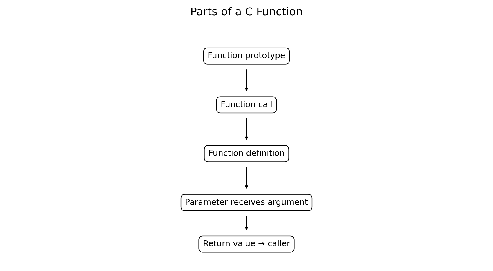
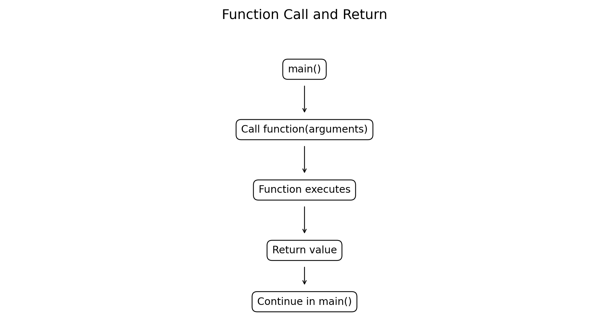
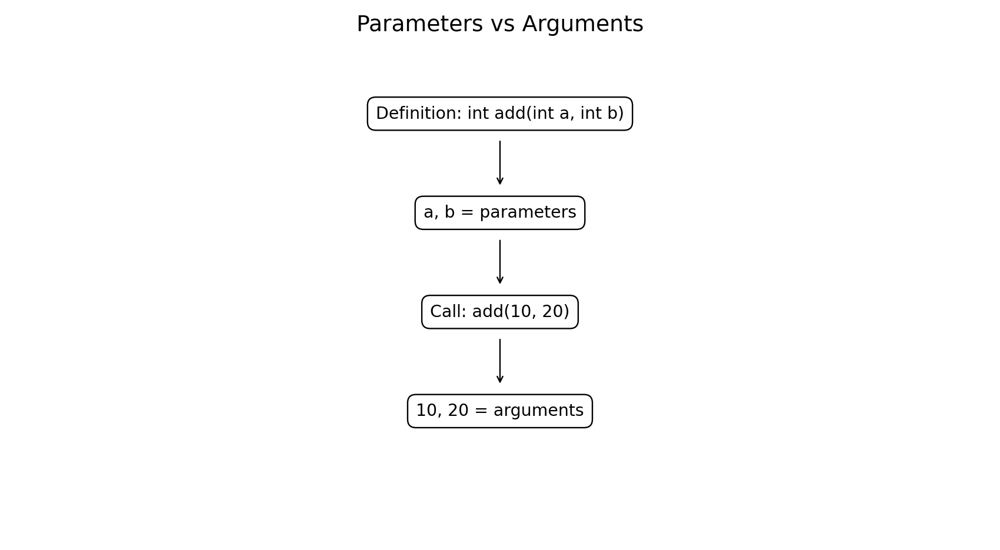
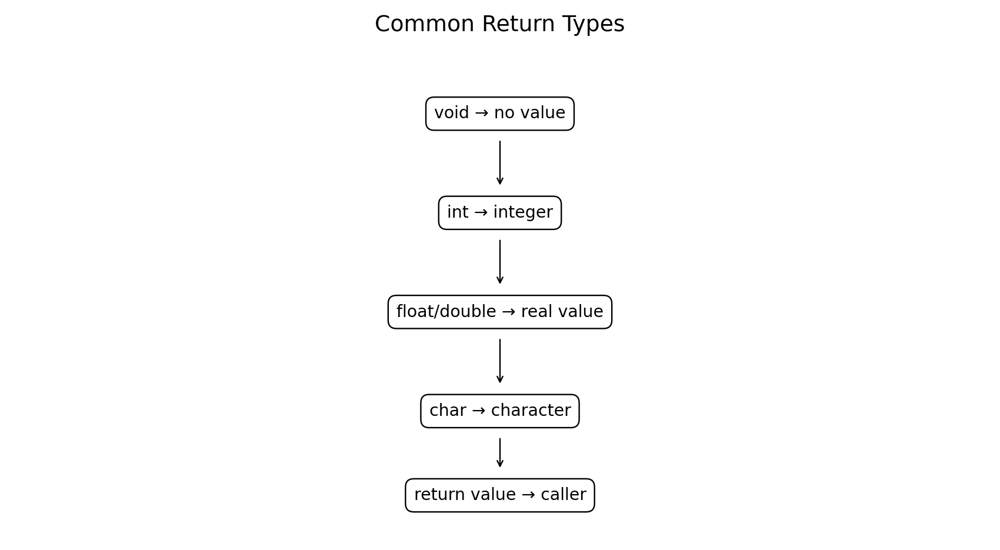

# User-Defined Functions in C

**Course:** Problem Solving Using C  
**Level:** Bachelor of Engineering  
**Topic:** User-defined functions, function definition, prototype, parameter list, function arguments, and return types

---

## Learning Objectives

After studying this chapter, students will be able to:

- Explain why functions are used in C programs.
- Define and call user-defined functions.
- Write function prototypes.
- Distinguish parameters from arguments.
- Understand return types and `return`.
- Use functions with and without parameters.
- Use functions for engineering calculations.
- Organize larger programs using modular design.

---

# 1. Introduction to Functions

A **function** is a named block of C statements designed to perform a specific task.

Instead of writing one long program, a problem can be divided into smaller functions.

Examples:

```text
Calculate average
Convert temperature
Find maximum
Calculate area
Check validity
Solve an equation
```

A user-defined function is written by the programmer.



---

# 2. Why Use Functions?

Functions provide:

1. **Modularity** — divide a large problem into smaller tasks.
2. **Reusability** — use the same operation multiple times.
3. **Readability** — make programs easier to understand.
4. **Testing** — test individual functions independently.
5. **Maintenance** — modify one function without rewriting the whole program.
6. **Abstraction** — hide implementation details behind a meaningful function name.

Example:

```c
area = rectangle_area(length, width);
```

is easier to understand than repeatedly writing the complete formula.

---

# 3. General Structure of a Function

A typical C function has the following form:

```c
return_type function_name(parameter_list)
{
    statements;
    return value;
}
```

Example:

```c
int add(int a, int b)
{
    return a + b;
}
```

Here:

- `int` → return type
- `add` → function name
- `int a, int b` → parameter list
- `return a + b;` → returned result

---

# 4. Function Prototype

A **function prototype** tells the compiler about a function before it is called.

Syntax:

```c
return_type function_name(parameter_list);
```

Example:

```c
int add(int a, int b);
```

The prototype provides information about:

- Function name
- Return type
- Number of parameters
- Parameter types

---

# 5. Function Definition

The **function definition** contains the actual implementation.

```c
int add(int a, int b)
{
    return a + b;
}
```

The definition tells the computer what the function actually does.

---

# 6. Function Call

A function is executed when it is called.

```c
result = add(10, 20);
```

The values `10` and `20` are passed to the function.



---

# 7. Complete Example

```c
#include <stdio.h>

int add(int a, int b);

int add(int a, int b)
{
    return a + b;
}

int main(void)
{
    int result;

    result = add(10, 20);

    printf("Sum = %d\n", result);

    return 0;
}
```

Output:

```text
Sum = 30
```

The sequence is:

```text
Prototype
    ↓
Definition
    ↓
main()
    ↓
Function call
    ↓
Function executes
    ↓
Return value
    ↓
main() continues
```

---

# 8. Parameters and Arguments

These two terms are related but different.

### Parameter

A **parameter** appears in the function definition.

```c
int add(int a, int b)
```

Here:

```text
a and b → parameters
```

### Argument

An **argument** is the actual value supplied during a function call.

```c
add(10, 20);
```

Here:

```text
10 and 20 → arguments
```



---

# 9. Parameter List

The parameter list specifies the data received by a function.

Example:

```c
double area(double length, double width)
{
    return length * width;
}
```

The parameter list is:

```c
double length, double width
```

A function may have:

- No parameters
- One parameter
- Multiple parameters

---

# 10. Function with No Parameters

A function does not have to receive arguments.

```c
#include <stdio.h>

void display_message(void)
{
    printf("Welcome to C programming!\n");
}

int main(void)
{
    display_message();
    return 0;
}
```

Output:

```text
Welcome to C programming!
```

Using `void` in the parameter list explicitly means that the function accepts no arguments.

---

# 11. Function with One Parameter

```c
#include <stdio.h>

void display_number(int n)
{
    printf("Number = %d\n", n);
}

int main(void)
{
    display_number(25);
    return 0;
}
```

Output:

```text
Number = 25
```

---

# 12. Function with Multiple Parameters

```c
#include <stdio.h>

double rectangle_area(double length, double width)
{
    return length * width;
}

int main(void)
{
    double area;

    area = rectangle_area(5.0, 3.0);

    printf("Area = %.2f\n", area);

    return 0;
}
```

Output:

```text
Area = 15.00
```

---

# 13. Return Types

The **return type** specifies the type of value returned by a function.

Common return types include:

| Return type | Meaning |
|---|---|
| `void` | No returned value |
| `int` | Integer |
| `float` | Single-precision real number |
| `double` | Double-precision real number |
| `char` | Character |



---

# 14. Function Returning `int`

```c
int square(int n)
{
    return n * n;
}
```

Complete program:

```c
#include <stdio.h>

int square(int n)
{
    return n * n;
}

int main(void)
{
    int result = square(6);

    printf("Square = %d\n", result);

    return 0;
}
```

Output:

```text
Square = 36
```

---

# 15. Function Returning `double`

```c
#include <stdio.h>

double circle_area(double radius)
{
    const double PI = 3.141592653589793;
    return PI * radius * radius;
}

int main(void)
{
    double area = circle_area(5.0);

    printf("Area = %.2f\n", area);

    return 0;
}
```

Output:

```text
Area = 78.54
```

This pattern is useful for engineering calculations involving physical quantities.

---

# 16. `void` Return Type

A `void` function does not return a value.

```c
#include <stdio.h>

void display_result(int value)
{
    printf("Result = %d\n", value);
}

int main(void)
{
    display_result(100);
    return 0;
}
```

Output:

```text
Result = 100
```

There is no value to assign from `display_result()`.

---

# 17. The `return` Statement

The `return` statement sends a value back to the calling function.

Example:

```c
int multiply(int a, int b)
{
    return a * b;
}
```

The value of:

```c
multiply(4, 5)
```

is:

```text
20
```

The caller can store or use the result:

```c
int result = multiply(4, 5);
```

---

# 18. Function Call Flow

Consider:

```c
int result = add(10, 20);
```

Execution is conceptually:

```text
main()
   │
   │ add(10, 20)
   ↓
add(a=10, b=20)
   │
   │ a + b
   ↓
30
   │
   ↓
main(): result = 30
```

---

# 19. Function Prototype Before `main()`

A common style is to place prototypes before `main()`.

```c
#include <stdio.h>

int maximum(int a, int b);

int main(void)
{
    int result = maximum(15, 27);

    printf("Maximum = %d\n", result);

    return 0;
}

int maximum(int a, int b)
{
    if (a > b)
        return a;

    return b;
}
```

Output:

```text
Maximum = 27
```

The prototype allows `main()` to call `maximum()` before its definition appears.

---

# 20. Multiple User-Defined Functions

A program can contain many functions.

```c
#include <stdio.h>

int add(int a, int b)
{
    return a + b;
}

int subtract(int a, int b)
{
    return a - b;
}

int multiply(int a, int b)
{
    return a * b;
}

int main(void)
{
    printf("Add = %d\n", add(10, 5));
    printf("Subtract = %d\n", subtract(10, 5));
    printf("Multiply = %d\n", multiply(10, 5));

    return 0;
}
```

Output:

```text
Add = 15
Subtract = 5
Multiply = 50
```

This is an example of **modular programming**.

---

# 21. Engineering Example — Temperature Conversion

```c
#include <stdio.h>

double celsius_to_fahrenheit(double c)
{
    return (9.0 / 5.0) * c + 32.0;
}

int main(void)
{
    double celsius = 25.0;
    double fahrenheit;

    fahrenheit = celsius_to_fahrenheit(celsius);

    printf("Celsius = %.2f\n", celsius);
    printf("Fahrenheit = %.2f\n", fahrenheit);

    return 0;
}
```

Output:

```text
Celsius = 25.00
Fahrenheit = 77.00
```

---

# 22. Engineering Example — Ohm's Law

Ohm's law:

```text
V = I × R
```

A function can calculate voltage.

```c
#include <stdio.h>

double voltage(double current, double resistance)
{
    return current * resistance;
}

int main(void)
{
    double I = 2.0;
    double R = 10.0;

    printf("Voltage = %.2f V\n", voltage(I, R));

    return 0;
}
```

Output:

```text
Voltage = 20.00 V
```

---

# 23. Engineering Example — Average of Measurements

```c
#include <stdio.h>

double average(double a, double b, double c)
{
    return (a + b + c) / 3.0;
}

int main(void)
{
    double result;

    result = average(10.5, 12.0, 11.5);

    printf("Average = %.2f\n", result);

    return 0;
}
```

Output:

```text
Average = 11.33
```

---

# 24. Function Arguments and Type Matching

The argument types should be compatible with the parameter types.

Example:

```c
double area(double radius)
{
    const double PI = 3.141592653589793;
    return PI * radius * radius;
}
```

Call:

```c
area(5.0);
```

The argument `5.0` is a `double`.

Another call:

```c
area(5);
```

uses an integer argument that can be converted to `double`.

For good programming practice, provide arguments with appropriate types and use prototypes.

---

# 25. Function Returning a Boolean Result

C does not have a built-in `boolean` type in the same way as some languages, but modern C can use `<stdbool.h>`.

```c
#include <stdio.h>
#include <stdbool.h>

bool is_even(int n)
{
    return n % 2 == 0;
}

int main(void)
{
    if (is_even(10))
        printf("10 is even.\n");
    else
        printf("10 is odd.\n");

    return 0;
}
```

Output:

```text
10 is even.
```

---

# 26. Function as a Problem-Solving Tool

A complex problem can be decomposed into functions.

Example: student result processing

```text
                    Main Program
                         |
          +--------------+--------------+
          |              |              |
      read_marks()   calculate()   display_result()
                         |
                    average()
```

This approach is called **top-down decomposition** or modular problem solving.

---

# 27. Advantages of User-Defined Functions

### Reusability

```c
area(5.0);
area(10.0);
area(20.0);
```

The same function can be reused.

### Readability

```c
total = calculate_total();
```

is easier to understand than a large expression.

### Testing

Individual functions can be tested separately.

### Maintenance

If the calculation changes, only the relevant function needs modification.

### Team Development

Different programmers can work on different functions.

---

# 28. Common Mistakes

### Mistake 1 — Missing prototype

If a function is called before the compiler has seen an appropriate declaration, compilation problems may occur.

Use:

```c
int add(int, int);
```

### Mistake 2 — Wrong return type

Incorrect:

```c
int average(int a, int b)
{
    return (a + b) / 2.0;
}
```

For a fractional result, prefer:

```c
double average(int a, int b)
{
    return (a + b) / 2.0;
}
```

### Mistake 3 — Forgetting `return`

For a non-`void` function, ensure the required result is returned on every appropriate execution path.

### Mistake 4 — Incorrect number of arguments

If:

```c
int add(int a, int b);
```

then normally call it with two arguments:

```c
add(10, 20);
```

### Mistake 5 — Confusing parameters and arguments

```c
int add(int a, int b)  // parameters
```

```c
add(10, 20);           // arguments
```

---

# 29. Function Declaration, Definition, and Call

These three concepts should be clearly distinguished.

| Concept | Example | Purpose |
|---|---|---|
| Prototype/declaration | `int add(int, int);` | Tells compiler about function |
| Definition | `int add(int a,int b){return a+b;}` | Implements function |
| Call | `add(10,20);` | Executes function |

---

# 30. General Function Design Pattern

```c
return_type function_name(parameter_list)
{
    // local variables
    // processing
    // return result
}
```

Example:

```c
double calculate_power(double voltage, double current)
{
    return voltage * current;
}
```

Call:

```c
double p = calculate_power(230.0, 5.0);
```

---

# 31. Practical Engineering Problem

Design a program to calculate:

- Force
- Work
- Power

using separate functions.

```c
#include <stdio.h>

double force(double mass, double acceleration)
{
    return mass * acceleration;
}

double work(double force_value, double distance)
{
    return force_value * distance;
}

double power(double work_value, double time)
{
    return work_value / time;
}

int main(void)
{
    double F = force(10.0, 2.0);
    double W = work(F, 5.0);
    double P = power(W, 2.0);

    printf("Force = %.2f N\n", F);
    printf("Work  = %.2f J\n", W);
    printf("Power = %.2f W\n", P);

    return 0;
}
```

Output:

```text
Force = 20.00 N
Work  = 100.00 J
Power = 50.00 W
```

This illustrates how functions can represent individual engineering operations.

---

# 32. Good Practices for Functions

1. Give functions meaningful names.
2. Keep each function focused on one task.
3. Use appropriate parameter types.
4. Use an appropriate return type.
5. Declare prototypes where needed.
6. Avoid unnecessarily long functions.
7. Document important functions.
8. Validate inputs where appropriate.
9. Avoid unnecessary global variables.
10. Test functions independently.

---

# 33. Laboratory Exercises

### Exercise 1
Write a function:

```c
int square(int n);
```

that returns the square of an integer.

### Exercise 2
Write:

```c
double cube(double x);
```

### Exercise 3
Write a function that returns the largest of three integers.

### Exercise 4
Write a function to calculate the area of a circle.

### Exercise 5
Write a function to convert Celsius to Fahrenheit.

### Exercise 6
Write a function to calculate electrical power:

```text
P = V × I
```

### Exercise 7
Create separate functions for:

```text
addition
subtraction
multiplication
division
```

### Exercise 8
Create a function that checks whether a number is prime.

---

# 34. Viva Questions

1. What is a function?
2. What is a user-defined function?
3. Why are functions used?
4. What is a function prototype?
5. What is a function definition?
6. What is a function call?
7. What is a parameter?
8. What is an argument?
9. Differentiate parameter and argument.
10. What is a return type?
11. What does `void` mean?
12. What is the purpose of `return`?
13. Can a function have no parameters?
14. Can a function return `double`?
15. Why are function prototypes useful?
16. What is modular programming?
17. How do functions help debugging?
18. How do functions improve code reuse?
19. Can a C program contain multiple user-defined functions?
20. Give two engineering applications of functions.

---

# 35. Summary

A user-defined function is a programmer-created block of code that performs a specific task.

The general form is:

```c
return_type function_name(parameter_list)
{
    statements;
    return value;
}
```

Important concepts:

```text
Prototype
   ↓
Definition
   ↓
Call
   ↓
Arguments → Parameters
   ↓
Function executes
   ↓
Return value
```

### Remember

- **Prototype** → declares the function.
- **Definition** → implements the function.
- **Call** → invokes the function.
- **Parameter** → variable in the function definition.
- **Argument** → actual value supplied in a call.
- **Return type** → type of value produced by the function.
- **`void`** → no return value.
- **`return`** → sends a result back to the caller.

Functions are one of the most important tools for structured problem solving in C because they transform a large problem into smaller, manageable, reusable, and testable components.

---

## GitHub Folder Structure

```text
c-user-defined-functions/
├── README.md
├── c_user_defined_functions.md
└── figures/
    ├── 01_function_parts.png
    ├── 02_function_flow.png
    ├── 03_parameters_arguments.png
    └── 04_return_types.png
```
