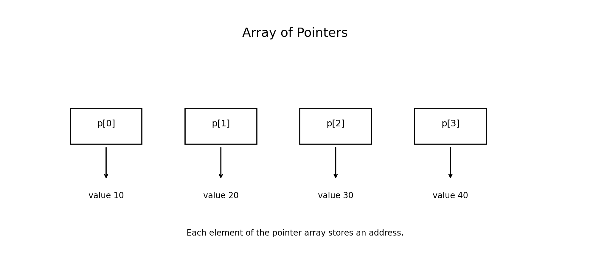
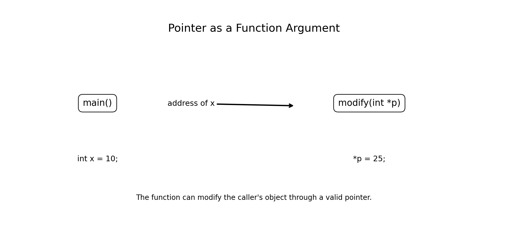
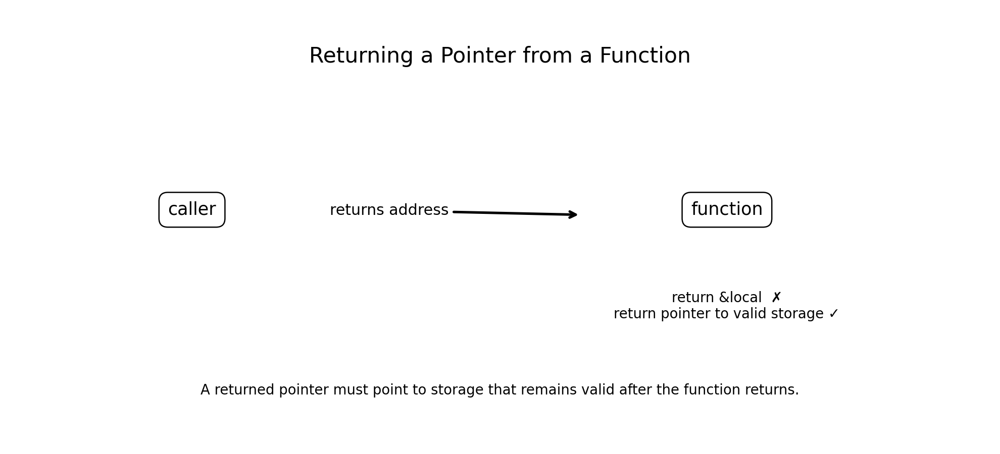
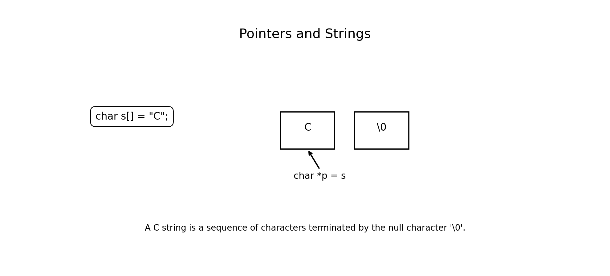
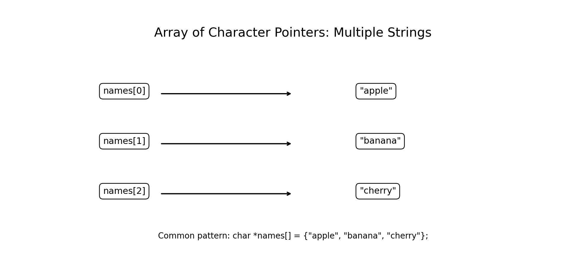

# Array of Pointers, Pointers as Function Arguments, Function Returning Pointers, and Pointers and Strings

**Course:** Problem Solving Using C  
**Level:** Bachelor of Engineering

---

## Learning Objectives

After completing this chapter, students will be able to:

- Explain an array of pointers.
- Declare and initialize arrays containing pointer elements.
- Use arrays of pointers to store addresses of variables.
- Use pointers as function arguments.
- Explain the difference between passing a value and passing an address.
- Modify caller data through pointer parameters.
- Return pointers from functions safely.
- Identify unsafe returned pointers.
- Understand the relationship between pointers and C strings.
- Traverse strings using character pointers.
- Use arrays of character pointers to store multiple strings.
- Use standard string functions with pointer-based data.
- Recognize common pointer and string errors.

---

# 1. Introduction

Pointers are one of the most powerful features of C.

A pointer stores the address of an object:

```c
int x = 10;
int *p = &x;
```

Here:

- `x` stores the value `10`.
- `&x` produces the address of `x`.
- `p` stores that address.
- `*p` accesses the value stored at that address.

This chapter extends the idea of pointers to four important areas:

1. Arrays of pointers
2. Pointers as function arguments
3. Functions returning pointers
4. Pointers and strings

These concepts are important in software engineering, embedded systems, operating systems, data structures, and systems programming.

---

# 2. Array of Pointers

An **array of pointers** is an array in which each element is a pointer.

For example:

```c
int *p[5];
```

means:

```text
p is an array of 5 pointers to int
```

It is different from:

```c
int (*p)[5];
```

which means:

```text
p is a pointer to an array of 5 int
```

Parentheses are therefore important in pointer declarations.



---

# 3. Declaring an Array of Pointers

Example:

```c
int a = 10;
int b = 20;
int c = 30;

int *p[3];

p[0] = &a;
p[1] = &b;
p[2] = &c;
```

Now:

```c
*p[0]
```

gives:

```text
10
```

and:

```c
*p[1]
```

gives:

```text
20
```

---

# 4. Example — Array of Pointers

```c
#include <stdio.h>

int main(void)
{
    int a = 10;
    int b = 20;
    int c = 30;

    int *p[3] = {&a, &b, &c};

    for (int i = 0; i < 3; i++)
    {
        printf("%d\n", *p[i]);
    }

    return 0;
}
```

Output:

```text
10
20
30
```

Each element of `p` stores an address.

---

# 5. Modifying Values Through an Array of Pointers

```c
#include <stdio.h>

int main(void)
{
    int a = 10;
    int b = 20;
    int c = 30;

    int *p[3] = {&a, &b, &c};

    *p[0] = 100;
    *p[1] = 200;
    *p[2] = 300;

    printf("%d %d %d\n", a, b, c);

    return 0;
}
```

Output:

```text
100 200 300
```

The pointer array provides indirect access to the original variables.

---

# 6. Applications of Arrays of Pointers

Arrays of pointers are useful for:

- Storing addresses of related variables
- Storing multiple strings
- Creating lookup tables
- Implementing dispatch tables
- Managing dynamically allocated objects
- Representing collections of variable-sized data
- Implementing data structures

A particularly common application is:

```c
char *names[];
```

which can store multiple strings.

---

# 7. Pointers as Function Arguments

A pointer can be passed to a function as an argument.

Example:

```c
void change(int *p)
{
    *p = 100;
}
```

Calling:

```c
int x = 10;

change(&x);
```

allows the function to modify `x`.



---

# 8. Passing by Value

Consider:

```c
#include <stdio.h>

void change(int x)
{
    x = 100;
}

int main(void)
{
    int a = 10;

    change(a);

    printf("%d\n", a);

    return 0;
}
```

Output:

```text
10
```

The function receives a copy of `a`.

Changing `x` does not change `a`.

---

# 9. Passing an Address

Now consider:

```c
#include <stdio.h>

void change(int *p)
{
    *p = 100;
}

int main(void)
{
    int a = 10;

    change(&a);

    printf("%d\n", a);

    return 0;
}
```

Output:

```text
100
```

The function receives the address of `a`.

Therefore:

```c
*p
```

refers to the original object.

---

# 10. Important C Terminology

C technically uses **pass-by-value** for function arguments.

When we write:

```c
change(&a);
```

the value being passed is the address of `a`.

The function receives a copy of that address:

```c
int *p
```

Because `p` contains the address of `a`, the function can access or modify `a` through `*p`.

This is often informally described as "passing by address."

---

# 11. Example — Swap Two Numbers

Pointers make it possible to modify two caller variables.

```c
#include <stdio.h>

void swap(int *a, int *b)
{
    int temp = *a;
    *a = *b;
    *b = temp;
}

int main(void)
{
    int x = 10;
    int y = 20;

    printf("Before: x = %d, y = %d\n", x, y);

    swap(&x, &y);

    printf("After:  x = %d, y = %d\n", x, y);

    return 0;
}
```

Output:

```text
Before: x = 10, y = 20
After:  x = 20, y = 10
```

---

# 12. Pointer Arguments and Arrays

An array can effectively be passed to a function using a pointer to its first element.

Example:

```c
void display(const int *p, int n)
{
    for (int i = 0; i < n; i++)
    {
        printf("%d ", *(p + i));
    }
}
```

Calling:

```c
int a[] = {10, 20, 30};

display(a, 3);
```

allows the function to process the array.

The size is normally supplied separately.

---

# 13. Example — Modify an Array Through a Pointer

```c
#include <stdio.h>

void double_values(int *p, int n)
{
    for (int i = 0; i < n; i++)
    {
        *(p + i) *= 2;
    }
}

int main(void)
{
    int a[] = {1, 2, 3, 4, 5};

    double_values(a, 5);

    for (int i = 0; i < 5; i++)
    {
        printf("%d ", a[i]);
    }

    printf("\n");

    return 0;
}
```

Output:

```text
2 4 6 8 10
```

---

# 14. Using `const` with Pointer Arguments

If a function should only read data:

```c
void display(const int *p, int n)
```

is preferable to:

```c
void display(int *p, int n)
```

The `const` qualifier communicates that the function should not modify the elements through `p`.

Example:

```c
void display(const int *p, int n)
{
    for (int i = 0; i < n; i++)
        printf("%d ", p[i]);
}
```

This is useful for safer program design.

---

# 15. Multiple Pointer Arguments

A function can receive several pointer arguments.

Example:

```c
void calculate(int a, int b, int *sum, int *product)
{
    *sum = a + b;
    *product = a * b;
}
```

Complete program:

```c
#include <stdio.h>

void calculate(int a, int b, int *sum, int *product)
{
    *sum = a + b;
    *product = a * b;
}

int main(void)
{
    int sum;
    int product;

    calculate(5, 4, &sum, &product);

    printf("Sum = %d\n", sum);
    printf("Product = %d\n", product);

    return 0;
}
```

Output:

```text
Sum = 9
Product = 20
```

---

# 16. Functions Returning Pointers

A function can return a pointer.

Example declaration:

```c
int *find_max(int *a, int n);
```

The return value is a pointer to an `int`.

A returned pointer can be useful when a function needs to identify an element rather than return only its value.



---

# 17. Example — Return Pointer to Maximum Element

```c
#include <stdio.h>

int *find_max(int *a, int n)
{
    int *max = &a[0];

    for (int i = 1; i < n; i++)
    {
        if (a[i] > *max)
        {
            max = &a[i];
        }
    }

    return max;
}

int main(void)
{
    int a[] = {20, 45, 10, 80, 35};

    int *p = find_max(a, 5);

    printf("Maximum = %d\n", *p);

    return 0;
}
```

Output:

```text
Maximum = 80
```

The returned pointer points to an element of the array, whose lifetime extends beyond the function call.

---

# 18. Returning a Pointer to an Array Element

A function can return a pointer to an element of an array supplied by the caller.

Example:

```c
int *find_value(int *a, int n, int value)
{
    for (int i = 0; i < n; i++)
    {
        if (a[i] == value)
            return &a[i];
    }

    return NULL;
}
```

Complete program:

```c
#include <stdio.h>

int *find_value(int *a, int n, int value)
{
    for (int i = 0; i < n; i++)
    {
        if (a[i] == value)
            return &a[i];
    }

    return NULL;
}

int main(void)
{
    int a[] = {10, 20, 30, 40};

    int *p = find_value(a, 4, 30);

    if (p != NULL)
        printf("Found value = %d\n", *p);
    else
        printf("Value not found\n");

    return 0;
}
```

Output:

```text
Found value = 30
```

---

# 19. Returning `NULL`

When a pointer-returning function cannot find an object, returning:

```c
NULL
```

is a common convention.

Example:

```c
return NULL;
```

The caller should test it before dereferencing:

```c
if (p != NULL)
{
    printf("%d", *p);
}
```

Never blindly dereference a possibly null pointer.

---

# 20. Dangerous Function Return

This is incorrect:

```c
int *wrong(void)
{
    int x = 10;
    return &x;
}
```

Why?

`x` is a local automatic variable.

Its lifetime ends when `wrong()` returns.

The returned pointer would point to an object that no longer exists.

This creates a **dangling pointer**.

---

# 21. Safe Ways to Return a Pointer

A function can safely return a pointer when it points to suitable storage whose lifetime continues.

Examples include:

### Caller-provided array

```c
return &a[i];
```

### Dynamically allocated memory

```c
int *p = malloc(sizeof(int));
return p;
```

The caller must eventually use:

```c
free(p);
```

### Static storage

A pointer to an object with static storage duration can remain valid, although using static local data has its own design considerations.

---

# 22. Pointers and Strings

A C string is an array of characters terminated by the null character:

```c
'\0'
```

Example:

```c
char s[] = "Hello";
```

Conceptually:

```text
H e l l o \0
```



A character pointer can point to the first character:

```c
char *p = s;
```

Then:

```c
*p
```

is:

```text
'H'
```

---

# 23. Traversing a String with a Pointer

```c
#include <stdio.h>

int main(void)
{
    char s[] = "Hello";
    char *p = s;

    while (*p != '\0')
    {
        putchar(*p);
        p++;
    }

    putchar('\n');

    return 0;
}
```

Output:

```text
Hello
```

The pointer moves from character to character until it reaches `'\0'`.

---

# 24. String Input and Character Pointers

Example:

```c
#include <stdio.h>

int main(void)
{
    char name[50];

    printf("Enter your name: ");
    scanf("%49s", name);

    char *p = name;

    while (*p != '\0')
    {
        putchar(*p);
        p++;
    }

    putchar('\n');

    return 0;
}
```

Possible output:

```text
Enter your name: Javed
Javed
```

For more robust line input, `fgets()` is generally preferable.

---

# 25. String Length Using a Pointer

```c
#include <stdio.h>

int string_length(const char *p)
{
    int length = 0;

    while (*p != '\0')
    {
        length++;
        p++;
    }

    return length;
}

int main(void)
{
    char s[] = "Computer";

    printf("Length = %d\n", string_length(s));

    return 0;
}
```

Output:

```text
Length = 8
```

---

# 26. Copying a String Using Pointers

```c
#include <stdio.h>

void string_copy(char *dest, const char *src)
{
    while (*src != '\0')
    {
        *dest = *src;
        dest++;
        src++;
    }

    *dest = '\0';
}

int main(void)
{
    char source[] = "Engineering";
    char destination[50];

    string_copy(destination, source);

    printf("%s\n", destination);

    return 0;
}
```

Output:

```text
Engineering
```

The terminating null character must also be copied.

---

# 27. Comparing Strings Using Pointers

A simple pointer-based comparison:

```c
#include <stdio.h>

int string_compare(const char *a, const char *b)
{
    while (*a && *b && *a == *b)
    {
        a++;
        b++;
    }

    return (unsigned char)*a - (unsigned char)*b;
}

int main(void)
{
    printf("%d\n", string_compare("cat", "cat"));
    printf("%d\n", string_compare("cat", "car"));

    return 0;
}
```

Output depends on the character codes, but:

```text
"cat" compared with "cat" → 0
```

A negative result indicates the first string compares before the second; a positive result indicates the opposite.

The standard library function:

```c
strcmp()
```

should normally be preferred for production code.

---

# 28. Array of Character Pointers

An array of pointers can be used to store multiple strings.

Example:

```c
char *names[] =
{
    "Alice",
    "Bob",
    "Charlie"
};
```

Conceptually:

```text
names[0] → "Alice"
names[1] → "Bob"
names[2] → "Charlie"
```



---

# 29. Example — Display Multiple Strings

```c
#include <stdio.h>

int main(void)
{
    const char *names[] =
    {
        "Alice",
        "Bob",
        "Charlie",
        "David"
    };

    int n = 4;

    for (int i = 0; i < n; i++)
    {
        printf("%s\n", names[i]);
    }

    return 0;
}
```

Output:

```text
Alice
Bob
Charlie
David
```

Using `const char *` is appropriate when the strings should not be modified.

---

# 30. Sorting Strings Using an Array of Pointers

One advantage of an array of string pointers is that strings can be rearranged by changing pointers instead of copying every character.

Conceptually:

```text
Before:

p[0] → "Orange"
p[1] → "Apple"
p[2] → "Banana"

After sorting pointers:

p[0] → "Apple"
p[1] → "Banana"
p[2] → "Orange"
```

This can be more efficient for large strings because only addresses need to be exchanged.

---

# 31. Example — Sort an Array of Strings

```c
#include <stdio.h>
#include <string.h>

int main(void)
{
    const char *names[] =
    {
        "Orange",
        "Apple",
        "Banana"
    };

    int n = 3;

    for (int i = 0; i < n - 1; i++)
    {
        for (int j = i + 1; j < n; j++)
        {
            if (strcmp(names[i], names[j]) > 0)
            {
                const char *temp = names[i];
                names[i] = names[j];
                names[j] = temp;
            }
        }
    }

    for (int i = 0; i < n; i++)
    {
        printf("%s\n", names[i]);
    }

    return 0;
}
```

Output:

```text
Apple
Banana
Orange
```

Only pointers are exchanged during the sorting operation.

---

# 32. Important String Pointer Distinction

Compare:

```c
char s[] = "Hello";
```

with:

```c
const char *p = "Hello";
```

In the first case, `s` is an array containing its own characters and can be modified:

```c
s[0] = 'Y';
```

In the second case, `p` points to a string literal. The characters of a string literal must not be modified.

Do not write:

```c
p[0] = 'Y';
```

for a pointer to a string literal.

---

# 33. Pointer Increment with Strings

For:

```c
char *p = s;
```

the following:

```c
p++;
```

moves to the next character.

Example:

```c
char s[] = "ABC";
char *p = s;

printf("%c\n", *p);

p++;
printf("%c\n", *p);

p++;
printf("%c\n", *p);
```

Output:

```text
A
B
C
```

---

# 34. Function Returning a String Pointer

A function can return a pointer to a string literal:

```c
const char *message(void)
{
    return "Hello from C";
}
```

Example:

```c
#include <stdio.h>

const char *message(void)
{
    return "Hello from C";
}

int main(void)
{
    printf("%s\n", message());

    return 0;
}
```

Output:

```text
Hello from C
```

The return type is `const char *` because the returned string literal should not be modified.

---

# 35. Function Returning a Pointer to Caller Storage

Example:

```c
#include <stdio.h>

char *first_character(char *s)
{
    return s;
}

int main(void)
{
    char text[] = "Engineering";

    char *p = first_character(text);

    printf("%c\n", *p);

    return 0;
}
```

Output:

```text
E
```

The returned pointer refers to storage owned by the caller.

---

# 36. Array of Pointers vs 2-D Character Array

Two common ways to store multiple strings are:

```c
char names[3][20];
```

and:

```c
const char *names[3];
```

### 2-D character array

Each row provides storage for up to 19 characters plus `'\0'`.

### Array of pointers

Each element stores a pointer to a string.

The second approach can use different string lengths and can make pointer swapping efficient.

---

# 37. Comparison

| Feature | `char names[3][20]` | `const char *names[3]` |
|---|---|---|
| Storage | Characters stored in array | Pointers store addresses |
| Maximum length | Fixed row size | Depends on pointed-to string |
| String swapping | Requires character copying if physically rearranging | Can swap pointers |
| Modification | Array characters can be modified | String literals should not be modified |
| Memory organization | Contiguous 2-D character array | Pointer array plus separate string storage |

---

# 38. Common Pointer Errors

### 1. Uninitialized pointer

Incorrect:

```c
int *p;
*p = 10;
```

`p` does not point to valid storage.

### 2. Null pointer dereference

Incorrect:

```c
int *p = NULL;
printf("%d", *p);
```

### 3. Dangling pointer

A pointer continues to exist after the object it pointed to has ceased to exist.

### 4. Returning the address of a local variable

Incorrect:

```c
int *f(void)
{
    int x;
    return &x;
}
```

### 5. Writing through a pointer to read-only data

Do not modify a string literal.

---

# 39. Pointer Safety Checklist

Before dereferencing a pointer, ask:

```text
Does it point to valid storage?
        ↓
Has it been initialized?
        ↓
Is the object still alive?
        ↓
Is the pointer type appropriate?
        ↓
Is the access within bounds?
        ↓
Is the object writable?
```

Only then should the program dereference the pointer.

---

# 40. Engineering Applications

### Embedded Systems

Pointers are used to access memory-mapped registers and buffers.

### Operating Systems

Pointers are fundamental to low-level memory management and data structures.

### Networking

Buffers and packet data are commonly manipulated through pointers.

### Compilers

Tables of pointers can support symbol and dispatch structures.

### Text Processing

Arrays of character pointers are useful for dictionaries, command tables, and lists of strings.

### Data Structures

Pointers are fundamental to:

- Linked lists
- Trees
- Graphs
- Dynamic data structures

---

# 41. Problem-Solving Pattern

For pointer function arguments:

```text
Caller object
     ↓
take address with &
     ↓
pass pointer
     ↓
function receives address
     ↓
dereference with *
     ↓
access or modify caller object
```

For a pointer-returning function:

```text
Function identifies object
        ↓
takes its address
        ↓
returns pointer
        ↓
caller checks pointer
        ↓
caller dereferences safely
```

For strings:

```text
character pointer
       ↓
current character
       ↓
p++
       ↓
next character
       ↓
stop at '\0'
```

---

# 42. Practice Programs

## Exercise 1 — Array of Pointers

Create three integer variables and an array of pointers to them. Print and modify the values through the pointer array.

## Exercise 2 — Swap

Write a function:

```c
void swap(int *a, int *b);
```

to swap two integers.

## Exercise 3 — Statistics

Write a function that receives an integer array through a pointer and returns the sum and average through pointer arguments.

## Exercise 4 — Maximum Pointer

Write:

```c
int *maximum(int *a, int n);
```

to return a pointer to the largest element.

## Exercise 5 — Search

Write a function that returns a pointer to the first occurrence of a value in an array.

## Exercise 6 — String Length

Implement string length using a character pointer without using `strlen()`.

## Exercise 7 — String Copy

Implement string copying using pointers without using `strcpy()`.

## Exercise 8 — String Reverse

Reverse a character array using two pointers.

## Exercise 9 — Multiple Strings

Store five names using an array of character pointers and display them.

## Exercise 10 — String Sorting

Sort an array of string pointers using `strcmp()` and pointer swapping.

---

# 43. Mini Project: Student Record Search

Create a simple student-record program using an array of structures and pointers.

Each student contains:

```c
struct Student
{
    int roll;
    char name[50];
    float marks;
};
```

Implement functions such as:

```c
struct Student *find_student(
    struct Student *students,
    int n,
    int roll);
```

The function should return a pointer to the matching student.

The caller should check:

```c
if (p != NULL)
```

before accessing the result.

This project combines:

- Arrays
- Pointers
- Function arguments
- Function return values
- Strings
- Structures

---

# 44. Viva Questions

1. What is an array of pointers?
2. What does `int *p[5]` mean?
3. What does `int (*p)[5]` mean?
4. What is the difference between the two declarations?
5. How can an array of pointers store multiple strings?
6. What is pointer-based argument passing?
7. Does C use pass-by-reference?
8. What is actually passed when `&x` is supplied as an argument?
9. How can a function modify a caller's variable?
10. Why is `const` useful in pointer parameters?
11. Can a function return a pointer?
12. Why is returning the address of a local variable unsafe?
13. What is a dangling pointer?
14. What is `NULL`?
15. What is a C string?
16. What is the purpose of `'\0'`?
17. How can a string be traversed using a pointer?
18. How can multiple strings be stored using an array of pointers?
19. Why should string literals not be modified?
20. Give two engineering applications of pointers.

---

# 45. Quick Reference

## Array of pointers

```c
int *p[5];
```

## Initialize pointer array

```c
int a = 10;
int b = 20;

int *p[2] = {&a, &b};
```

## Access pointed value

```c
*p[0]
```

## Pointer function argument

```c
void change(int *p)
{
    *p = 100;
}
```

Call:

```c
change(&x);
```

## Function returning pointer

```c
int *find(int *a, int n);
```

## Character pointer

```c
char *p = text;
```

## Traverse string

```c
while (*p != '\0')
{
    putchar(*p);
    p++;
}
```

## Array of string pointers

```c
const char *names[] =
{
    "Alice",
    "Bob",
    "Charlie"
};
```

---

# 46. Key Takeaways

- An **array of pointers** stores multiple pointer values.
- `int *p[5]` is an array of five pointers to `int`.
- Pointers can be supplied as function arguments to allow functions to access caller-owned objects.
- C still passes function arguments by value; when an address is passed, the value being copied is the address.
- A function can return a pointer when the pointed-to object remains valid after the function returns.
- Never return the address of an ordinary local automatic variable.
- Use `NULL` to indicate that a pointer result is unavailable when appropriate.
- C strings are null-terminated character sequences.
- Character pointers can traverse strings one character at a time.
- Arrays of character pointers are useful for storing collections of strings.
- `const char *` is appropriate when pointed-to string data should not be modified.
- Pointer safety requires careful attention to initialization, lifetime, bounds, and object mutability.

---

# 47. Final Concept Map

```text
                         POINTERS
                            |
          +-----------------+------------------+
          |                 |                  |
   Array of pointers   Function arguments   Strings
          |                 |                  |
      int *p[n]          int *p            char *p
          |                 |                  |
   addresses of       modify caller       traverse until
   multiple objects   through *p             '\0'
          |
          +-------------------------+
                                    |
                         Function returning pointer
                                    |
                           return valid address
                                    |
                         caller checks for NULL
```

These concepts provide an important foundation for later C topics such as **dynamic memory allocation, structures, linked lists, function pointers, command-line arguments, and advanced data structures**.
