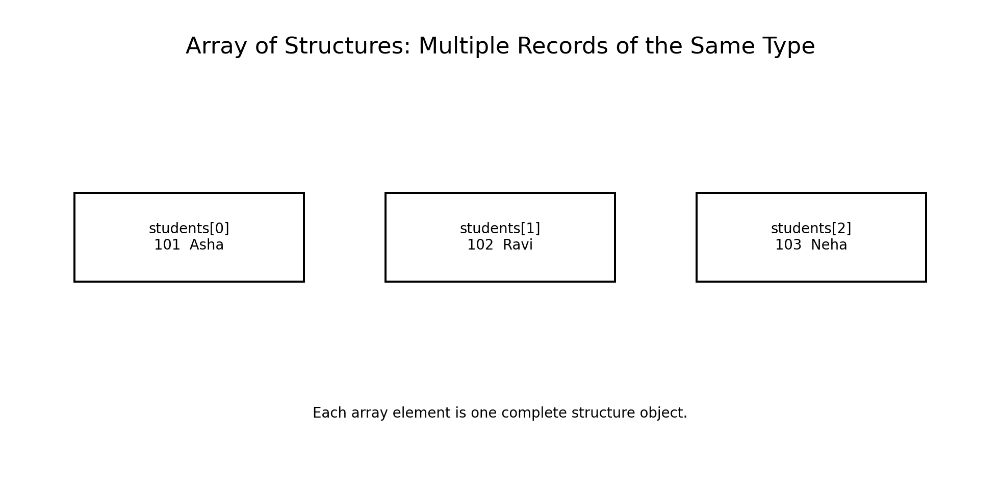
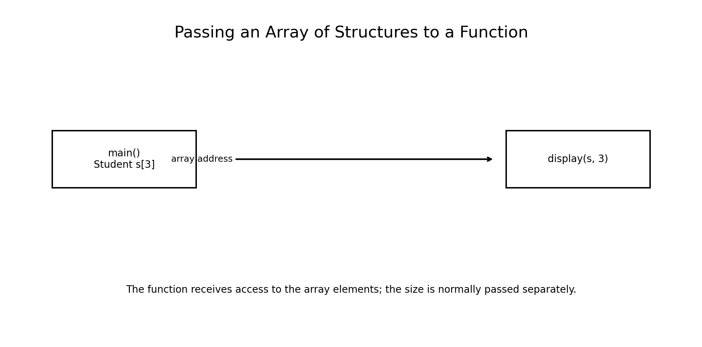
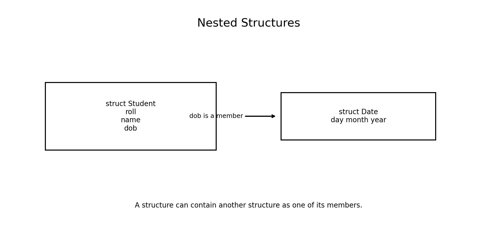
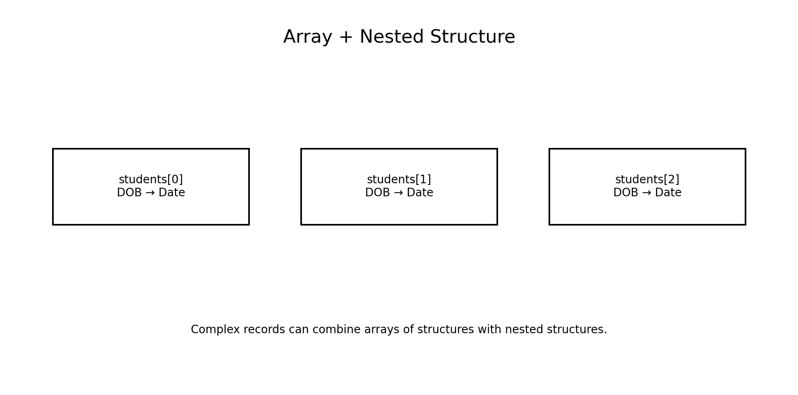
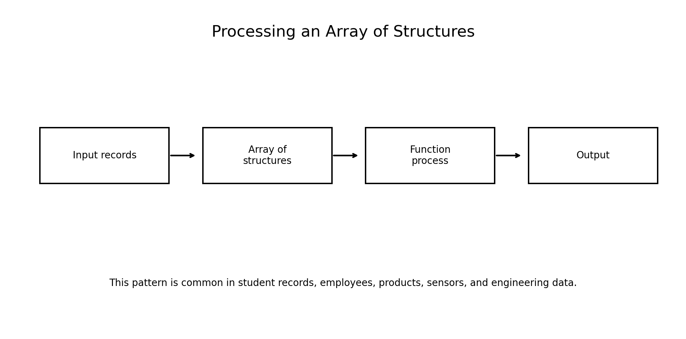

# :classical_building: Problem Solving Using Programming - B.Tech-IT, IIIT Allahabad
## Unit 5: Pointers and Structures
* ### Current Topic: Array of Structures, Passing an Array of Structures to Functions, and Nested Structures
* **Purpose:** Introduce Pointers and Structures
---

---
## 👥 Instructor Information
* **Edited by Instructor:** [Dr. Mohammed Javed](https://sites.google.com/site/mohammedjaved2016/)
* **Email:** javed@iiita.ac.in
* **Senior Teaching Assistants:** Mr. Subrata Pramanik (pmm2024003@iiita.ac.in)
---
## 🎯 Learning Objectives

After studying this chapter, students will be able to:

- Explain why arrays of structures are useful.
- Define and initialize arrays of structures.
- Read and display records stored in an array of structures.
- Traverse an array of structures using loops.
- Pass an array of structures to a function.
- Pass the number of elements to a function.
- Use `const` when a function only reads structure records.
- Modify structure elements through a function.
- Search, sort, and calculate statistics from an array of structures.
- Explain nested structures.
- Access members of nested structures.
- Combine arrays and nested structures to model engineering data.
- Identify common mistakes and improve program design.

---

# 1. Introduction

A structure groups related data items into one logical record.

For example:

```c
struct Student
{
    int roll;
    char name[30];
    float marks;
};
```

One structure variable represents one student.

But real applications normally need to store **many students**.

Instead of declaring:

```c
struct Student s1;
struct Student s2;
struct Student s3;
```

we can declare:

```c
struct Student students[3];
```

This is called an **array of structures**.



---

# 2. What Is an Array of Structures?

An array of structures is an array in which every element is a structure of the same type.

Example:

```c
struct Student
{
    int roll;
    char name[30];
    float marks;
};

struct Student students[3];
```

Conceptually:

```text
students
   |
   +---- students[0]
   |
   +---- students[1]
   |
   +---- students[2]
```

Each element contains all members of `struct Student`.

---

# 3. Accessing Elements of an Array of Structures

Use an array index followed by the dot operator.

```c
students[0].roll
students[0].name
students[0].marks
```

For the second student:

```c
students[1].roll
students[1].name
students[1].marks
```

General form:

```c
array[index].member
```

---

# 4. Initialization of an Array of Structures

An array of structures can be initialized at declaration.

```c
struct Student students[3] =
{
    {101, "Asha", 91.5f},
    {102, "Ravi", 84.0f},
    {103, "Neha", 88.5f}
};
```

Each inner brace represents one structure object.

---

# 5. Designated Initialization

Designated initialization can make larger records easier to understand.

```c
struct Student students[2] =
{
    {
        .roll = 101,
        .name = "Asha",
        .marks = 91.5f
    },
    {
        .roll = 102,
        .name = "Ravi",
        .marks = 84.0f
    }
};
```

This explicitly identifies each member.

---

# 6. Example — Display an Array of Structures

```c
#include <stdio.h>

struct Student
{
    int roll;
    char name[30];
    float marks;
};

int main(void)
{
    struct Student students[3] =
    {
        {101, "Asha", 91.5f},
        {102, "Ravi", 84.0f},
        {103, "Neha", 88.5f}
    };

    for (int i = 0; i < 3; i++)
    {
        printf("%d  %-10s %.2f\n",
               students[i].roll,
               students[i].name,
               students[i].marks);
    }

    return 0;
}
```

### Output

```text
101  Asha       91.50
102  Ravi       84.00
103  Neha       88.50
```

---

# 7. Input into an Array of Structures

A loop can be used to input records.

```c
for (int i = 0; i < n; i++)
{
    printf("Enter roll: ");
    scanf("%d", &students[i].roll);

    printf("Enter name: ");
    scanf("%29s", students[i].name);

    printf("Enter marks: ");
    scanf("%f", &students[i].marks);
}
```

This pattern is common in record-based applications.

---

# 8. Complete Input and Output Program

```c
#include <stdio.h>

struct Student
{
    int roll;
    char name[30];
    float marks;
};

int main(void)
{
    struct Student students[3];

    for (int i = 0; i < 3; i++)
    {
        printf("\nStudent %d\n", i + 1);

        printf("Roll: ");
        scanf("%d", &students[i].roll);

        printf("Name: ");
        scanf("%29s", students[i].name);

        printf("Marks: ");
        scanf("%f", &students[i].marks);
    }

    printf("\nStudent Records\n");

    for (int i = 0; i < 3; i++)
    {
        printf("%d  %s  %.2f\n",
               students[i].roll,
               students[i].name,
               students[i].marks);
    }

    return 0;
}
```

Sample output:

```text
Student 1
Roll: 101
Name: Asha
Marks: 91.5

Student 2
Roll: 102
Name: Ravi
Marks: 84

Student 3
Roll: 103
Name: Neha
Marks: 88.5

Student Records
101  Asha  91.50
102  Ravi  84.00
103  Neha  88.50
```

---

# 9. Passing an Array of Structures to a Function

An array of structures can be passed to a function.

Example:

```c
void display(struct Student students[], int n)
{
    for (int i = 0; i < n; i++)
    {
        printf("%d %s %.2f\n",
               students[i].roll,
               students[i].name,
               students[i].marks);
    }
}
```

Call:

```c
display(students, 3);
```



---

# 10. Why Is the Array Size Passed Separately?

When an array is passed to a function, the function does not automatically know how many elements it contains.

Therefore:

```c
display(students, 3);
```

is preferable to:

```c
display(students);
```

The second form does not provide the number of valid records.

A typical function interface is:

```c
void display(const struct Student students[], int n);
```

---

# 11. `const` with an Array of Structures

If a function only reads the records and should not modify them, use `const`.

```c
void display(const struct Student students[], int n)
{
    ...
}
```

This communicates the function's intention and allows the compiler to diagnose accidental modifications.

Example:

```c
students[0].marks = 100.0f;
```

would not be allowed inside such a function.

---

# 12. Example — Display Function

```c
#include <stdio.h>

struct Student
{
    int roll;
    char name[30];
    float marks;
};

void display(const struct Student students[], int n)
{
    for (int i = 0; i < n; i++)
    {
        printf("%d  %-10s %.2f\n",
               students[i].roll,
               students[i].name,
               students[i].marks);
    }
}

int main(void)
{
    struct Student students[3] =
    {
        {101, "Asha", 91.5f},
        {102, "Ravi", 84.0f},
        {103, "Neha", 88.5f}
    };

    display(students, 3);

    return 0;
}
```

Output:

```text
101  Asha       91.50
102  Ravi       84.00
103  Neha       88.50
```

---

# 13. How Does Array Passing Work?

For function parameters, these declarations are equivalent in practical use:

```c
void display(struct Student s[], int n);
```

and:

```c
void display(struct Student *s, int n);
```

The array parameter is adjusted to a pointer parameter.

Therefore, inside the function:

```c
s[i]
```

can be used to access each structure.

Conceptually:

```text
main()
  |
  | address of first element
  ↓
display(s, n)
  |
  +---- s[0]
  +---- s[1]
  +---- s[2]
```

---

# 14. Modifying an Array of Structures in a Function

Because the function has access to the original array elements, it can modify them.

Example:

```c
void add_bonus(struct Student students[], int n)
{
    for (int i = 0; i < n; i++)
    {
        students[i].marks += 5.0f;
    }
}
```

Call:

```c
add_bonus(students, 3);
```

The original array is modified.

---

# 15. Example — Modify Records

```c
#include <stdio.h>

struct Student
{
    int roll;
    char name[30];
    float marks;
};

void add_bonus(struct Student students[], int n)
{
    for (int i = 0; i < n; i++)
    {
        students[i].marks += 5.0f;
    }
}

int main(void)
{
    struct Student students[3] =
    {
        {101, "Asha", 80.0f},
        {102, "Ravi", 75.0f},
        {103, "Neha", 90.0f}
    };

    add_bonus(students, 3);

    for (int i = 0; i < 3; i++)
    {
        printf("%s %.2f\n",
               students[i].name,
               students[i].marks);
    }

    return 0;
}
```

Output:

```text
Asha 85.00
Ravi 80.00
Neha 95.00
```

---

# 16. Searching an Array of Structures

A common operation is searching for a record.

Example:

```c
int find_student(const struct Student students[],
                 int n,
                 int roll)
{
    for (int i = 0; i < n; i++)
    {
        if (students[i].roll == roll)
        {
            return i;
        }
    }

    return -1;
}
```

The function returns the index of the matching student.

---

# 17. Example — Search by Roll Number

```c
#include <stdio.h>

struct Student
{
    int roll;
    char name[30];
    float marks;
};

int find_student(const struct Student students[],
                 int n,
                 int roll)
{
    for (int i = 0; i < n; i++)
    {
        if (students[i].roll == roll)
            return i;
    }

    return -1;
}

int main(void)
{
    struct Student students[3] =
    {
        {101, "Asha", 91.5f},
        {102, "Ravi", 84.0f},
        {103, "Neha", 88.5f}
    };

    int index = find_student(students, 3, 102);

    if (index != -1)
    {
        printf("Found: %s, %.2f\n",
               students[index].name,
               students[index].marks);
    }
    else
    {
        printf("Student not found\n");
    }

    return 0;
}
```

Output:

```text
Found: Ravi, 84.00
```

---

# 18. Finding the Highest Value

Arrays of structures can also be processed to find maximum or minimum values.

Example:

```c
int highest_marks(const struct Student students[], int n)
{
    int index = 0;

    for (int i = 1; i < n; i++)
    {
        if (students[i].marks > students[index].marks)
        {
            index = i;
        }
    }

    return index;
}
```

This returns the index of the student with the highest marks.

---

# 19. Passing a Specific Element

A single element can also be passed to a function.

```c
display_student(students[0]);
```

Function:

```c
void display_student(struct Student s)
{
    printf("%d %s %.2f\n",
           s.roll, s.name, s.marks);
}
```

Here only one structure is passed, not the entire array.

---

# 20. Passing an Array and Its Size

A good general pattern is:

```c
void process(const struct Student students[], size_t n)
{
    for (size_t i = 0; i < n; i++)
    {
        ...
    }
}
```

This style makes the function reusable for different array sizes.

Required header:

```c
#include <stddef.h>
```

for `size_t`.

---

# 21. Nested Structures

A **nested structure** is a structure containing another structure as a member.

Example:

```c
struct Date
{
    int day;
    int month;
    int year;
};

struct Student
{
    int roll;
    char name[30];
    struct Date dob;
};
```

Here:

```text
Student
 ├── roll
 ├── name
 └── dob
       ├── day
       ├── month
       └── year
```



---

# 22. Why Use Nested Structures?

Nested structures are useful when an entity contains another logical entity.

Examples:

```text
Student
 └── Date of Birth

Employee
 └── Address

Vehicle
 └── Engine

Patient
 └── Contact Information

Product
 └── Manufacturer
```

They improve organization and make data models clearer.

---

# 23. Defining a Nested Structure

```c
struct Date
{
    int day;
    int month;
    int year;
};

struct Student
{
    int roll;
    char name[30];
    struct Date dob;
};
```

Declare:

```c
struct Student s;
```

Initialize:

```c
struct Student s =
{
    101,
    "Asha",
    {15, 8, 2005}
};
```

---

# 24. Accessing Nested Members

The syntax is:

```c
structure.outer_member.inner_member
```

Example:

```c
s.dob.day
s.dob.month
s.dob.year
```

For the student example:

```c
printf("%d/%d/%d",
       s.dob.day,
       s.dob.month,
       s.dob.year);
```

---

# 25. Example — Nested Structure

```c
#include <stdio.h>

struct Date
{
    int day;
    int month;
    int year;
};

struct Student
{
    int roll;
    char name[30];
    struct Date dob;
};

int main(void)
{
    struct Student s =
    {
        101,
        "Asha",
        {15, 8, 2005}
    };

    printf("Roll: %d\n", s.roll);
    printf("Name: %s\n", s.name);

    printf("DOB : %02d/%02d/%04d\n",
           s.dob.day,
           s.dob.month,
           s.dob.year);

    return 0;
}
```

Output:

```text
Roll: 101
Name: Asha
DOB : 15/08/2005
```

---

# 26. Array of Structures with Nested Structures

These concepts can be combined.

Example:

```c
struct Date
{
    int day;
    int month;
    int year;
};

struct Student
{
    int roll;
    char name[30];
    struct Date dob;
};

struct Student students[3];
```

Now the program can store multiple students, each with a date of birth.



---

# 27. Example — Array of Students with Date of Birth

```c
#include <stdio.h>

struct Date
{
    int day;
    int month;
    int year;
};

struct Student
{
    int roll;
    char name[30];
    struct Date dob;
};

int main(void)
{
    struct Student students[3] =
    {
        {101, "Asha", {15, 8, 2005}},
        {102, "Ravi", {4, 12, 2004}},
        {103, "Neha", {21, 3, 2005}}
    };

    for (int i = 0; i < 3; i++)
    {
        printf("%d  %s  %02d/%02d/%04d\n",
               students[i].roll,
               students[i].name,
               students[i].dob.day,
               students[i].dob.month,
               students[i].dob.year);
    }

    return 0;
}
```

Output:

```text
101  Asha  15/08/2005
102  Ravi  04/12/2004
103  Neha  21/03/2005
```

---

# 28. Passing an Array with Nested Structures to a Function

The same function mechanism applies.

```c
void display_students(const struct Student students[],
                      int n)
{
    for (int i = 0; i < n; i++)
    {
        printf("%d %s %02d/%02d/%04d\n",
               students[i].roll,
               students[i].name,
               students[i].dob.day,
               students[i].dob.month,
               students[i].dob.year);
    }
}
```

Call:

```c
display_students(students, 3);
```



---

# 29. Nested Structure with Employee Address

Another practical example:

```c
struct Address
{
    char city[30];
    char state[30];
    int pin;
};

struct Employee
{
    int id;
    char name[30];
    struct Address address;
};
```

Access:

```c
employee.address.city
employee.address.state
employee.address.pin
```

This creates a clean hierarchy.

---

# 30. Example — Employee and Address

```c
#include <stdio.h>

struct Address
{
    char city[30];
    char state[30];
    int pin;
};

struct Employee
{
    int id;
    char name[30];
    struct Address address;
};

int main(void)
{
    struct Employee e =
    {
        1001,
        "Arun",
        {"Prayagraj", "Uttar Pradesh", 211001}
    };

    printf("ID    : %d\n", e.id);
    printf("Name  : %s\n", e.name);
    printf("City  : %s\n", e.address.city);
    printf("State : %s\n", e.address.state);
    printf("PIN   : %d\n", e.address.pin);

    return 0;
}
```

Output:

```text
ID    : 1001
Name  : Arun
City  : Prayagraj
State : Uttar Pradesh
PIN   : 211001
```

---

# 31. Engineering Example — Sensor Records

Structures are particularly useful for engineering data.

```c
struct SensorReading
{
    float temperature;
    float pressure;
    float humidity;
};

struct Sensor
{
    int id;
    char location[30];
    struct SensorReading reading;
};
```

Access:

```c
sensor.reading.temperature
sensor.reading.pressure
sensor.reading.humidity
```

This can model real sensor systems.

---

# 32. Engineering Example — Array of Sensor Records

```c
struct Sensor sensors[10];
```

A processing function could be:

```c
void display_sensors(const struct Sensor sensors[],
                     int n)
{
    for (int i = 0; i < n; i++)
    {
        printf("ID: %d\n", sensors[i].id);
        printf("Location: %s\n", sensors[i].location);
        printf("Temperature: %.2f\n",
               sensors[i].reading.temperature);
    }
}
```

This pattern is useful in:

- IoT systems
- Embedded systems
- Industrial monitoring
- Data acquisition
- Environmental monitoring

---

# 33. Sorting an Array of Structures

An array of structures can be sorted according to one member.

For example, sort students by marks:

```c
for (int i = 0; i < n - 1; i++)
{
    for (int j = 0; j < n - i - 1; j++)
    {
        if (students[j].marks < students[j + 1].marks)
        {
            struct Student temp = students[j];
            students[j] = students[j + 1];
            students[j + 1] = temp;
        }
    }
}
```

Because structures can be assigned, swapping complete records is straightforward.

---

# 34. Passing Array to Function: Important Points

Remember:

1. The array name represents access to the first element when passed to a function.
2. The function normally receives a pointer to the first element.
3. The number of elements should be passed separately.
4. Use `const` if the function only reads the data.
5. The function can modify elements when the parameter is not `const`.
6. The structure type must be visible to the function.
7. A pointer to a structure uses `->`.
8. An ordinary structure uses `.`.

---

# 35. Common Errors

### Error 1 — Forgetting the index

Incorrect:

```c
students.roll
```

Correct:

```c
students[0].roll
```

### Error 2 — Forgetting the member

Incorrect:

```c
students[0]
```

when a particular value is required.

Correct:

```c
students[0].marks
```

### Error 3 — Not passing the size

Poor interface:

```c
void display(struct Student s[]);
```

Better:

```c
void display(const struct Student s[], int n);
```

---

# 36. More Common Errors

### Error 4 — Wrong nested access

Incorrect:

```c
s.day
```

when `day` belongs to `s.dob`.

Correct:

```c
s.dob.day
```

### Error 5 — Confusing `.` and `->`

For:

```c
struct Student *p;
```

use:

```c
p->dob.day
```

not:

```c
p.dob.day
```

### Error 6 — Unsafe string input

Avoid:

```c
scanf("%s", students[i].name);
```

Prefer a field width:

```c
scanf("%29s", students[i].name);
```

or use `fgets()` for names containing spaces.

---

# 37. Array of Structures vs Structure Containing an Array

These two designs are different.

### Array of structures

```c
struct Student students[10];
```

This means:

```text
10 Student objects
```

### Structure containing an array

```c
struct Classroom
{
    struct Student students[10];
};
```

This means:

```text
1 Classroom object
   |
   +-- 10 Student objects
```

Both are useful depending on the problem model.

---

# 38. Structures and Data Modeling

A good programming solution begins by identifying entities and relationships.

Example:

```text
University
    |
    +-- Department
          |
          +-- Student
                 |
                 +-- Date of Birth
```

This can be represented using nested structures.

The resulting program becomes closer to the real-world problem.

---

# 39. Mini Project — Student Management System

Design a program that stores up to 50 students.

Each student should have:

```text
Roll number
Name
Department
Date of birth
Three subject marks
```

Possible definitions:

```c
struct Date
{
    int day;
    int month;
    int year;
};

struct Student
{
    int roll;
    char name[50];
    char department[30];
    struct Date dob;
    float marks[3];
};
```

Implement:

```c
void input_students(struct Student s[], int n);
void display_students(const struct Student s[], int n);
int find_student(const struct Student s[], int n, int roll);
float average(const struct Student *s);
```

Possible features:

- Add records
- Display all records
- Search by roll number
- Calculate average
- Find highest scorer
- Sort by marks
- Display students by department

---

# 40. Mini Project — Sensor Monitoring System

Define:

```c
struct Reading
{
    float temperature;
    float pressure;
    float humidity;
};

struct Sensor
{
    int id;
    char location[30];
    struct Reading reading;
};
```

Store:

```c
struct Sensor sensors[20];
```

Functions:

```c
void input_sensors(struct Sensor s[], int n);
void display_sensors(const struct Sensor s[], int n);
int highest_temperature(const struct Sensor s[], int n);
```

This integrates:

- Arrays
- Structures
- Nested structures
- Functions
- Searching
- Numerical processing

---

# 41. Problem-Solving Pattern

For an array-of-structures problem:

```text
Identify record
      ↓
Define structure
      ↓
Create array
      ↓
Input records
      ↓
Pass array to function
      ↓
Process records
      ↓
Search / sort / calculate
      ↓
Display result
```

For nested data:

```text
Identify main entity
      ↓
Identify sub-entity
      ↓
Define sub-structure
      ↓
Include sub-structure
      ↓
Access nested members
```

---

# 42. Practice Exercises

### Exercise 1
Create an array of 10 employees and display their details.

### Exercise 2
Write a function that receives an array of employees and finds the employee with the highest salary.

### Exercise 3
Write a function that receives an array of structures and calculates the average marks.

### Exercise 4
Create a nested `Date` structure inside a `Student` structure.

### Exercise 5
Store 10 students with date of birth and display students born in a particular year.

### Exercise 6
Create:

```c
struct Address
```

and include it inside:

```c
struct Employee
```

### Exercise 7
Pass an array of employees to a function and increase every employee's salary by 10%.

### Exercise 8
Create an array of structures representing engineering components:

```text
ID
Name
Weight
Cost
```

Find the component with the highest cost.

### Exercise 9
Create a sensor structure containing a nested measurement structure. Display all sensors whose temperature exceeds a specified limit.

### Exercise 10
Sort an array of structures by one selected member.

---

# 43. Viva Questions

1. What is an array of structures?
2. Why are arrays of structures useful?
3. How is an array of structures declared?
4. How do you access a member of an array element?
5. How can an array of structures be initialized?
6. How is an array of structures passed to a function?
7. Why should the number of elements normally be passed to the function?
8. What is the difference between `struct Student s[]` and `struct Student *s` as function parameters?
9. Why is `const` useful for read-only structure arrays?
10. Can a function modify an array of structures?
11. What is a nested structure?
12. Give an example of a nested structure.
13. How do you access a member inside a nested structure?
14. What is the difference between `s.dob.day` and `p->dob.day`?
15. How can arrays and nested structures be combined?
16. Give two engineering applications of arrays of structures.
17. How can an array of structures be searched?
18. How can an array of structures be sorted?
19. Why is data modeling important in structure design?
20. What is the advantage of using structures instead of many unrelated variables?

---

# 44. Quick Reference

### Define structure

```c
struct Student
{
    int roll;
    char name[30];
    float marks;
};
```

### Array of structures

```c
struct Student students[10];
```

### Access

```c
students[i].roll
students[i].name
students[i].marks
```

### Function parameter

```c
void display(const struct Student s[], int n);
```

### Call

```c
display(students, 10);
```

### Modify through function

```c
void update(struct Student s[], int n);
```

### Nested structure

```c
struct Date
{
    int day;
    int month;
    int year;
};

struct Student
{
    int roll;
    struct Date dob;
};
```

### Nested access

```c
s.dob.day
```

### Pointer to nested structure

```c
p->dob.day
```

---

# 45. Key Takeaways

- An array of structures stores multiple records of the same structure type.
- Each array element is a complete structure.
- Use `array[index].member` to access individual members.
- Arrays of structures are commonly processed using loops.
- An array of structures can be passed to a function.
- The number of valid elements should normally be passed separately.
- `const` is useful when a function should only read the records.
- A function can modify an array of structures when it receives a non-`const` pointer parameter.
- A nested structure contains another structure as one of its members.
- Nested structures are useful for representing hierarchical real-world data.
- Arrays and nested structures can be combined for complex engineering applications.
- These concepts are fundamental for record processing, embedded systems, databases, file processing, and engineering software.

---

# 46. Final Concept Map

```text
                    STRUCTURES
                         |
          +--------------+--------------+
          |                             |
    Array of Structures           Nested Structures
          |                             |
    Multiple records             Structure inside
          |                       another structure
          |                             |
     +----+----+                  +-----+-----+
     |         |                  |           |
   Input     Output             Main       Sub-record
     |         |               entity      entity
     +----+----+                  |           |
          |                       +-----+-----+
       Functions                        |
          |                         Access with
     +----+----+                    . operator
     |         |
   Read      Modify
   const     non-const
     |
 Pass array + size
```

---

# 47. Summary

The combination of **arrays of structures, functions, and nested structures** provides a powerful foundation for modeling real-world engineering data.

A typical solution follows:

```text
Structure Definition
        ↓
Array of Structures
        ↓
Input Records
        ↓
Pass Array + Size
        ↓
Process / Search / Sort
        ↓
Nested Data Access
        ↓
Display Results
```

These concepts prepare students for advanced C programming topics including **pointers to structures, dynamic structures, linked lists, file handling, dynamic memory allocation, and data structures**.
