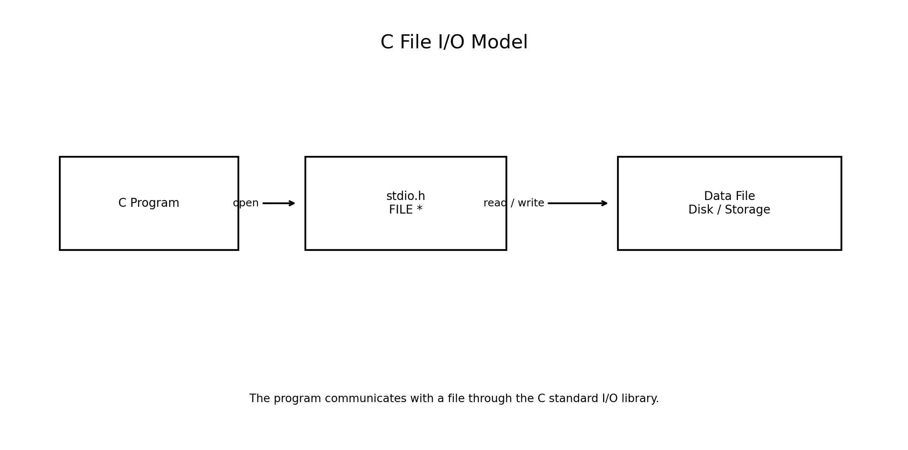
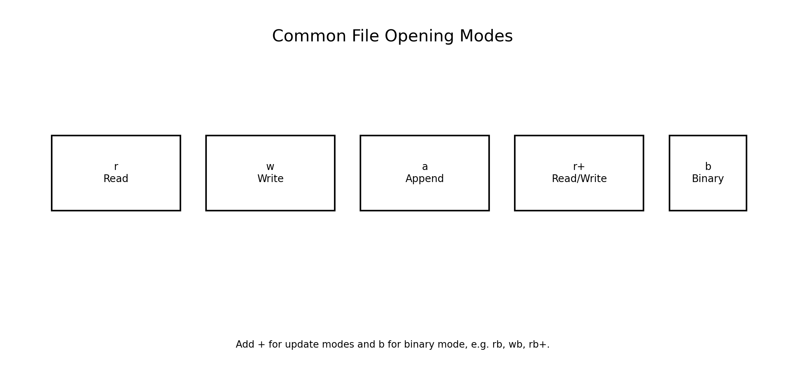
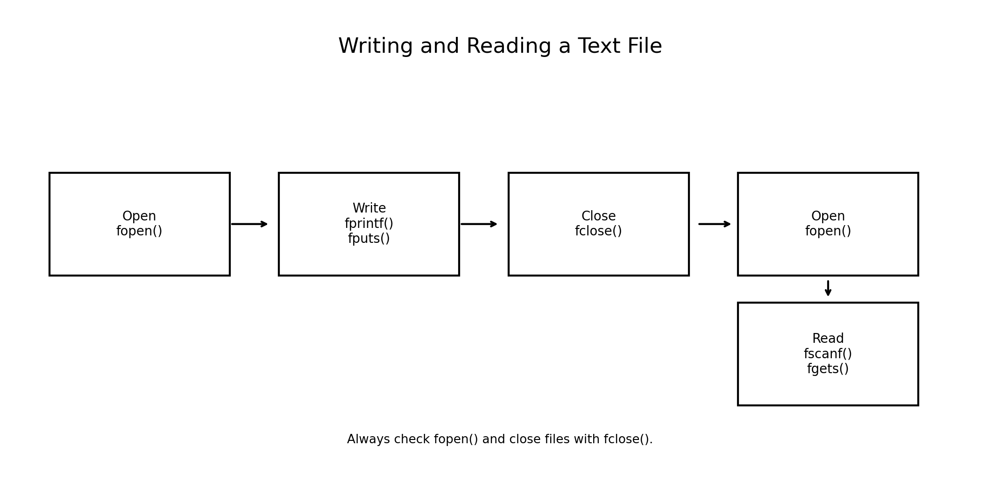
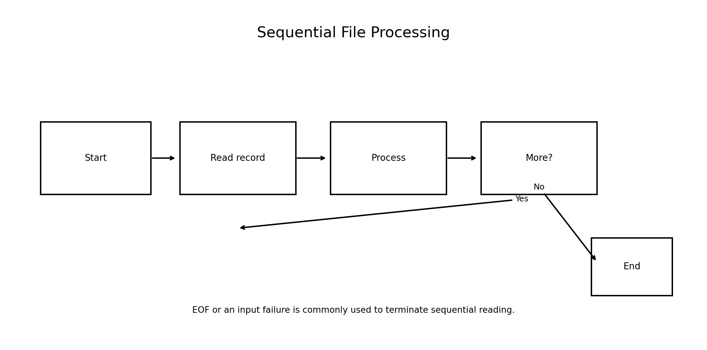
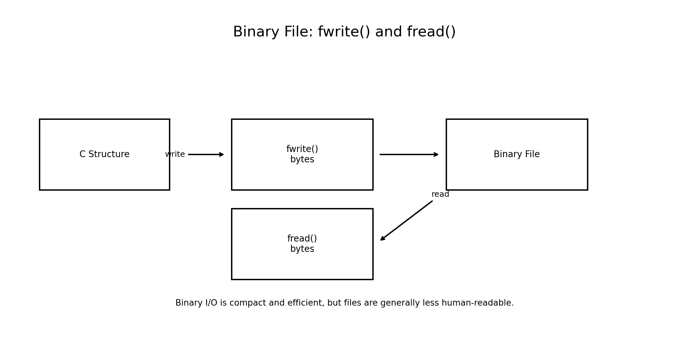
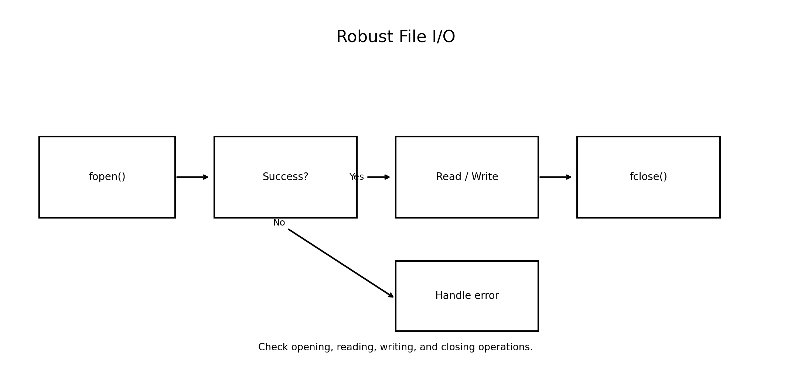

# Data Files: I/O Statements, Reading and Writing Data Files in C

**Course:** Problem Solving Using C  
**Level:** Bachelor of Engineering  
**Programming Language:** C

---

## Learning Objectives

After studying this chapter, students will be able to:

- Explain why programs use data files.
- Distinguish files from variables and arrays stored during program execution.
- Understand text and binary files.
- Use the `FILE` type and file pointers.
- Open files using `fopen()`.
- Close files using `fclose()`.
- Read and write formatted data using `fscanf()` and `fprintf()`.
- Read and write strings using `fgets()` and `fputs()`.
- Read and write characters using `fgetc()` and `fputc()`.
- Understand file opening modes such as `r`, `w`, `a`, `r+`, `w+`, and `a+`.
- Detect end-of-file conditions.
- Use `fread()` and `fwrite()` for binary files.
- Handle file errors safely.
- Develop small engineering applications using data files.

---

# 1. Introduction to Data Files

A program normally stores data in variables and arrays while it is running.

For example:

```c
int marks[5] = {80, 75, 91, 88, 95};
```

This data exists during program execution. When the program terminates, the values are normally lost.

A **data file** provides persistent storage.

```text
Program
   |
   | write
   v
Data File
   |
   | read
   v
Program
```

Data files are useful for:

- Student records
- Employee information
- Sensor measurements
- Test results
- Engineering calculations
- Configuration information
- Reports
- Transaction records
- Experimental data

---

# 2. C File I/O

C provides file input/output facilities through the standard library:

```c
#include <stdio.h>
```

The central type is:

```c
FILE
```

A file is usually accessed through a pointer:

```c
FILE *fp;
```



The file pointer identifies the stream used by the program.

---

# 3. Basic File I/O Workflow

A typical file-processing program follows these steps:

```text
1. Declare FILE pointer
        ↓
2. Open file using fopen()
        ↓
3. Check whether opening succeeded
        ↓
4. Read or write data
        ↓
5. Close file using fclose()
```

General pattern:

```c
FILE *fp;

fp = fopen("data.txt", "r");

if (fp == NULL)
{
    printf("Unable to open file\n");
    return 1;
}

/* file operations */

fclose(fp);
```

---

# 4. `fopen()`

The `fopen()` function opens a file.

Syntax:

```c
FILE *fopen(const char *filename, const char *mode);
```

Example:

```c
FILE *fp = fopen("students.txt", "r");
```

If the operation fails:

```c
fp == NULL
```

Therefore, always check:

```c
if (fp == NULL)
{
    printf("File could not be opened.\n");
    return 1;
}
```

---

# 5. File Opening Modes

Important modes include:

| Mode | Purpose |
|---|---|
| `r` | Open existing file for reading |
| `w` | Open for writing; creates or truncates file |
| `a` | Open for appending; creates file if needed |
| `r+` | Open existing file for reading and writing |
| `w+` | Read/write; creates or truncates |
| `a+` | Read/write; writes occur at end |
| `rb` | Read binary file |
| `wb` | Write binary file |
| `ab` | Append binary file |



### Important

Using:

```c
fopen("data.txt", "w");
```

can destroy the previous contents of an existing file because the file is truncated.

---

# 6. Closing a File

Use:

```c
fclose(fp);
```

Example:

```c
FILE *fp = fopen("data.txt", "r");

if (fp == NULL)
    return 1;

/* processing */

fclose(fp);
```

Closing a file:

- Releases system resources.
- Flushes buffered output.
- Completes the file-processing operation.

---

# 7. Writing to a Text File with `fprintf()`

`fprintf()` works like `printf()`, but writes formatted output to a file.

Syntax:

```c
fprintf(file_pointer, "format", values);
```

Example:

```c
fprintf(fp, "%d %.2f\n", roll, marks);
```

---

# 8. Example — Writing Student Data

```c
#include <stdio.h>

int main(void)
{
    FILE *fp = fopen("students.txt", "w");

    if (fp == NULL)
    {
        printf("Unable to create file.\n");
        return 1;
    }

    fprintf(fp, "101 Asha 91.5\n");
    fprintf(fp, "102 Ravi 84.0\n");
    fprintf(fp, "103 Neha 88.5\n");

    fclose(fp);

    printf("Data written successfully.\n");

    return 0;
}
```

Output:

```text
Data written successfully.
```

The file `students.txt` will contain:

```text
101 Asha 91.5
102 Ravi 84.0
103 Neha 88.5
```

---

# 9. Reading a Text File with `fscanf()`

`fscanf()` is similar to `scanf()`, but obtains formatted input from a file.

Syntax:

```c
fscanf(fp, "format", &variables);
```

Example:

```c
int roll;
char name[30];
float marks;

fscanf(fp, "%d %29s %f", &roll, name, &marks);
```

---

# 10. Example — Reading Student Data

```c
#include <stdio.h>

int main(void)
{
    FILE *fp = fopen("students.txt", "r");

    if (fp == NULL)
    {
        printf("Unable to open file.\n");
        return 1;
    }

    int roll;
    char name[30];
    float marks;

    while (fscanf(fp, "%d %29s %f",
                  &roll, name, &marks) == 3)
    {
        printf("Roll: %d, Name: %s, Marks: %.2f\n",
               roll, name, marks);
    }

    fclose(fp);

    return 0;
}
```

Output:

```text
Roll: 101, Name: Asha, Marks: 91.50
Roll: 102, Name: Ravi, Marks: 84.00
Roll: 103, Name: Neha, Marks: 88.50
```

Checking the return value of `fscanf()` is preferable to using `while (!feof(fp))`.

---

# 11. Why `while (!feof(fp))` Is Usually Wrong

A common beginner mistake is:

```c
while (!feof(fp))
{
    fscanf(fp, "%d", &x);
    printf("%d\n", x);
}
```

The EOF indicator is generally set only **after an attempted read reaches the end**.

Instead, test the input operation itself:

```c
while (fscanf(fp, "%d", &x) == 1)
{
    printf("%d\n", x);
}
```

This is more reliable.

---

# 12. Character I/O with Files

C provides:

```c
fgetc()
fputc()
```

### Read one character

```c
int ch = fgetc(fp);
```

### Write one character

```c
fputc(ch, fp);
```

The return type of `fgetc()` is `int`, not `char`, because it must be able to represent every unsigned character value as well as `EOF`.

---

# 13. Example — Character-by-Character Reading

```c
#include <stdio.h>

int main(void)
{
    FILE *fp = fopen("message.txt", "r");

    if (fp == NULL)
        return 1;

    int ch;

    while ((ch = fgetc(fp)) != EOF)
    {
        putchar(ch);
    }

    fclose(fp);

    return 0;
}
```

If `message.txt` contains:

```text
Hello Engineering Students!
```

Output:

```text
Hello Engineering Students!
```

---

# 14. Writing Characters with `fputc()`

```c
#include <stdio.h>

int main(void)
{
    FILE *fp = fopen("letters.txt", "w");

    if (fp == NULL)
        return 1;

    for (char ch = 'A'; ch <= 'Z'; ch++)
    {
        fputc(ch, fp);
    }

    fclose(fp);

    return 0;
}
```

The resulting file contains:

```text
ABCDEFGHIJKLMNOPQRSTUVWXYZ
```

---

# 15. String I/O with `fgets()` and `fputs()`

### Read a line

```c
fgets(buffer, sizeof buffer, fp);
```

### Write a string

```c
fputs(buffer, fp);
```

Example:

```c
char line[100];

if (fgets(line, sizeof line, fp) != NULL)
{
    printf("%s", line);
}
```

`fgets()` is generally safer than older functions such as `gets()`. The `gets()` function should not be used.

---

# 16. Example — Copying a Text File

```c
#include <stdio.h>

int main(void)
{
    FILE *source = fopen("input.txt", "r");
    FILE *destination = fopen("output.txt", "w");

    if (source == NULL || destination == NULL)
    {
        if (source != NULL)
            fclose(source);

        if (destination != NULL)
            fclose(destination);

        printf("File opening failed.\n");
        return 1;
    }

    char line[256];

    while (fgets(line, sizeof line, source) != NULL)
    {
        fputs(line, destination);
    }

    fclose(source);
    fclose(destination);

    printf("File copied successfully.\n");

    return 0;
}
```

Output:

```text
File copied successfully.
```

---

# 17. Text File Processing

A text file stores information in a human-readable form.

Example:

```text
101 Asha 91.5
102 Ravi 84.0
103 Neha 88.5
```

Text files are useful when:

- Humans need to inspect the data.
- Portability and readability are important.
- Simple records are being stored.
- Data needs to be exchanged with other programs.



---

# 18. Appending Data

The mode:

```c
"a"
```

opens a file for appending.

Example:

```c
FILE *fp = fopen("students.txt", "a");
```

Data written using:

```c
fprintf(fp, ...);
```

is added to the end of the file.

Example:

```c
fprintf(fp, "104 Omar 87.0\n");
```

This does not overwrite the existing records.

---

# 19. Example — Append a Record

```c
#include <stdio.h>

int main(void)
{
    FILE *fp = fopen("students.txt", "a");

    if (fp == NULL)
    {
        printf("Unable to open file.\n");
        return 1;
    }

    int roll = 104;
    char name[] = "Omar";
    float marks = 87.0f;

    fprintf(fp, "%d %s %.2f\n",
            roll, name, marks);

    fclose(fp);

    printf("Record appended.\n");

    return 0;
}
```

Output:

```text
Record appended.
```

---

# 20. Sequential File Processing

A common file-processing method is sequential processing:

```text
Start
  ↓
Open file
  ↓
Read one record
  ↓
Process record
  ↓
More data?
 ↙       ↘
Yes       No
 ↓         ↓
Repeat    Close
```



Examples:

- Calculate average marks.
- Find the maximum sensor reading.
- Count records.
- Search for a particular student.
- Calculate total sales.

---

# 21. Example — Calculate Average from a File

Suppose `marks.txt` contains:

```text
80
75
91
88
95
```

Program:

```c
#include <stdio.h>

int main(void)
{
    FILE *fp = fopen("marks.txt", "r");

    if (fp == NULL)
        return 1;

    double value;
    double total = 0.0;
    int count = 0;

    while (fscanf(fp, "%lf", &value) == 1)
    {
        total += value;
        count++;
    }

    fclose(fp);

    if (count > 0)
        printf("Average = %.2f\n", total / count);
    else
        printf("No data found.\n");

    return 0;
}
```

Output:

```text
Average = 85.80
```

---

# 22. Binary Files

A binary file stores data as bytes rather than formatted human-readable characters.

C provides:

```c
fwrite()
fread()
```



Binary files can be useful for:

- Large datasets
- Sensor records
- Image data
- Audio data
- Efficient storage
- Saving structures in controlled environments

However, raw binary structure files may have portability issues because of padding, alignment, endianness, type sizes, and representation differences.

---

# 23. `fwrite()`

Syntax:

```c
fwrite(pointer, size, count, file_pointer);
```

Example:

```c
fwrite(&value, sizeof value, 1, fp);
```

For an array:

```c
fwrite(array, sizeof *array, n, fp);
```

---

# 24. `fread()`

Syntax:

```c
fread(pointer, size, count, file_pointer);
```

Example:

```c
fread(&value, sizeof value, 1, fp);
```

The return value indicates how many complete items were successfully read.

---

# 25. Example — Binary Integer File

```c
#include <stdio.h>

int main(void)
{
    int values[] = {10, 20, 30, 40, 50};

    FILE *fp = fopen("numbers.bin", "wb");

    if (fp == NULL)
        return 1;

    fwrite(values, sizeof values[0], 5, fp);

    fclose(fp);

    fp = fopen("numbers.bin", "rb");

    if (fp == NULL)
        return 1;

    int x;

    while (fread(&x, sizeof x, 1, fp) == 1)
    {
        printf("%d ", x);
    }

    printf("\n");

    fclose(fp);

    return 0;
}
```

Output:

```text
10 20 30 40 50
```

---

# 26. Text vs Binary Files

| Feature | Text | Binary |
|---|---|---|
| Human readable | Usually yes | Usually no |
| Storage | Formatted characters | Raw bytes |
| Simple inspection | Easy | Difficult |
| Typical functions | `fprintf`, `fscanf`, `fgets`, `fputs` | `fread`, `fwrite` |
| Portability | Often easier | May require careful format design |
| Typical use | Reports, configuration, simple records | Efficient application-specific storage |

---

# 27. Writing Structures to Binary Files

Consider:

```c
struct Student
{
    int roll;
    char name[30];
    float marks;
};
```

A structure object can be written using:

```c
fwrite(&student,
       sizeof student,
       1,
       fp);
```

And read using:

```c
fread(&student,
      sizeof student,
      1,
      fp);
```

For files intended to be exchanged across different systems or languages, a defined serialization format such as CSV, JSON, or a specified binary protocol is generally preferable to blindly dumping C structures.

---

# 28. Example — Binary Student Records

```c
#include <stdio.h>

struct Student
{
    int roll;
    char name[30];
    float marks;
};

int main(void)
{
    struct Student s = {101, "Asha", 91.5f};

    FILE *fp = fopen("student.dat", "wb");

    if (fp == NULL)
        return 1;

    if (fwrite(&s, sizeof s, 1, fp) != 1)
    {
        printf("Write error.\n");
        fclose(fp);
        return 1;
    }

    fclose(fp);

    fp = fopen("student.dat", "rb");

    if (fp == NULL)
        return 1;

    struct Student result;

    if (fread(&result, sizeof result, 1, fp) == 1)
    {
        printf("Roll: %d\n", result.roll);
        printf("Name: %s\n", result.name);
        printf("Marks: %.2f\n", result.marks);
    }

    fclose(fp);

    return 0;
}
```

Output:

```text
Roll: 101
Name: Asha
Marks: 91.50
```

---

# 29. Error Handling

Robust file programs should check:

1. Whether the file opened successfully.
2. Whether reading succeeded.
3. Whether writing succeeded.
4. Whether closing or flushing encountered an error when important.

Basic pattern:

```c
FILE *fp = fopen("data.txt", "r");

if (fp == NULL)
{
    perror("data.txt");
    return 1;
}
```

`perror()` prints a descriptive message associated with the most recent system/library error.



---

# 30. `perror()`

Example:

```c
#include <stdio.h>

int main(void)
{
    FILE *fp = fopen("missing.txt", "r");

    if (fp == NULL)
    {
        perror("missing.txt");
        return 1;
    }

    fclose(fp);

    return 0;
}
```

Possible output:

```text
missing.txt: No such file or directory
```

The exact wording depends on the operating system.

---

# 31. End-of-File and `EOF`

C uses the special value:

```c
EOF
```

to indicate an input operation has reached the end of a stream.

For character input:

```c
int ch;

while ((ch = fgetc(fp)) != EOF)
{
    putchar(ch);
}
```

For formatted input, test the conversion count:

```c
while (fscanf(fp, "%d", &value) == 1)
{
    /* process value */
}
```

---

# 32. File Position

A file stream maintains a current position.

Functions for controlling the position include:

```c
fseek()
ftell()
rewind()
```

### `ftell()`

Reports the current file position.

```c
long pos = ftell(fp);
```

### `fseek()`

Moves the file position.

```c
fseek(fp, 0, SEEK_SET);
```

### `rewind()`

Moves back to the beginning:

```c
rewind(fp);
```

These functions are especially useful when implementing random-access files.

---

# 33. Random Access

Sequential access:

```text
Record 1 → Record 2 → Record 3 → Record 4
```

Random access allows the program to move directly to a desired file position.

Typical functions:

```c
fseek()
ftell()
rewind()
```

Applications include:

- Database-like files
- Large binary datasets
- Fixed-size records
- Index-based file systems

---

# 34. File I/O and Structures

File processing becomes especially useful when combined with structures.

Example:

```c
struct Sensor
{
    int id;
    float temperature;
    float pressure;
};
```

A program can:

```text
Read sensor records
        ↓
Process measurements
        ↓
Calculate statistics
        ↓
Write report
```

This is a practical engineering application of structures and file I/O.

---

# 35. Mini Project — Student Record File

Create a menu-driven application:

```text
1. Add student
2. Display students
3. Search student
4. Calculate average
5. Append student
6. Exit
```

Use:

```c
struct Student
{
    int roll;
    char name[30];
    float marks;
};
```

Store records in:

```text
students.txt
```

Possible operations:

```c
fprintf()
fscanf()
fgets()
fputs()
fopen()
fclose()
```

---

# 36. Mini Project — Engineering Sensor Log

Create a program that stores:

```c
struct SensorReading
{
    int sensor_id;
    float temperature;
    float pressure;
};
```

The application should:

1. Read sensor measurements.
2. Save them to a file.
3. Read them later.
4. Calculate average temperature.
5. Find maximum pressure.
6. Generate a text report.

This combines:

```text
Structures
   +
Functions
   +
File I/O
   +
Problem Solving
```

---

# 37. Mini Project — File Copy Utility

Create a command-line program:

```text
filecopy source.txt destination.txt
```

The program should:

1. Open source file.
2. Open destination file.
3. Read data.
4. Write data.
5. Detect errors.
6. Close both files.

For a generic byte-for-byte copy, character/byte I/O can be used:

```c
int ch;

while ((ch = fgetc(source)) != EOF)
{
    if (fputc(ch, destination) == EOF)
    {
        /* handle write error */
        break;
    }
}
```

For large files, buffered block copying can be more efficient.

---

# 38. Common Mistakes

### Mistake 1 — Not checking `fopen()`

Incorrect:

```c
FILE *fp = fopen("data.txt", "r");
fscanf(fp, "%d", &x);
```

Correct:

```c
FILE *fp = fopen("data.txt", "r");

if (fp == NULL)
{
    printf("Open failed\n");
    return 1;
}
```

---

### Mistake 2 — Accidentally overwriting a file

```c
fopen("data.txt", "w");
```

The `w` mode truncates an existing file.

Use:

```c
"a"
```

when the intention is to append.

---

### Mistake 3 — Incorrect EOF loop

Avoid:

```c
while (!feof(fp))
```

Use an input-operation condition.

---

### Mistake 4 — Forgetting `fclose()`

Always close files that are no longer needed:

```c
fclose(fp);
```

---

### Mistake 5 — Buffer overflow with input

Avoid unbounded string input.

Use:

```c
char name[30];

fscanf(fp, "%29s", name);
```

or:

```c
fgets(name, sizeof name, fp);
```

---

# 39. File I/O Functions — Quick Table

| Function | Purpose |
|---|---|
| `fopen()` | Open a file |
| `fclose()` | Close a file |
| `fprintf()` | Formatted file output |
| `fscanf()` | Formatted file input |
| `fgetc()` | Read one character |
| `fputc()` | Write one character |
| `fgets()` | Read a line/string |
| `fputs()` | Write a string |
| `fread()` | Read binary data |
| `fwrite()` | Write binary data |
| `fseek()` | Move file position |
| `ftell()` | Get file position |
| `rewind()` | Move to beginning |
| `perror()` | Display an error message |

---

# 40. File Modes — Quick Reference

```text
r    Read existing text file
w    Write/create/truncate text file
a    Append/create text file
r+   Read/write existing file
w+   Read/write/create/truncate
a+   Read/write/create, writes at end

rb   Read binary
wb   Write binary
ab   Append binary
```

---

# 41. Engineering Applications

Data files are widely used in engineering software.

### Civil Engineering

Store:

- Survey measurements
- Material test results
- Structural-analysis data

### Mechanical Engineering

Store:

- Temperature measurements
- Pressure readings
- Machine parameters

### Electrical Engineering

Store:

- Voltage/current samples
- Test measurements
- Device configurations

### Computer Engineering

Store:

- User records
- Logs
- Configuration files
- Application data

### Data Analytics

Store:

- CSV datasets
- Experimental measurements
- Simulation results

---

# 42. Problem-Solving Pattern

When a problem requires persistent data:

```text
Understand data
      ↓
Choose file format
      ↓
Choose text or binary
      ↓
Define structure if required
      ↓
Open file
      ↓
Check for errors
      ↓
Read / Write
      ↓
Process data
      ↓
Close file
      ↓
Verify output
```

---

# 43. Practice Exercises

1. Write a program to create a text file.
2. Write ten integers to a file using `fprintf()`.
3. Read integers using `fscanf()`.
4. Count the number of lines in a text file.
5. Count characters in a file.
6. Copy one text file into another.
7. Append new records to a file.
8. Store student records in a text file.
9. Read student records and calculate the average marks.
10. Find the student with the highest marks.
11. Write a program using `fgetc()`.
12. Write a program using `fgets()`.
13. Write a program using `fputc()`.
14. Write a program using `fputs()`.
15. Store integers in a binary file using `fwrite()`.
16. Read binary integers using `fread()`.
17. Store structure records in a binary file.
18. Implement random file access using `fseek()`.
19. Create a sensor-data logging program.
20. Build a menu-driven student file-management system.

---

# 44. Viva Questions

1. What is a data file?
2. Why are files needed in programs?
3. What is `FILE *`?
4. Which header provides C file I/O functions?
5. What does `fopen()` do?
6. What does `fopen()` return when opening fails?
7. What is the difference between `r`, `w`, and `a`?
8. What happens when an existing file is opened using `w`?
9. What does `fclose()` do?
10. What is `fprintf()`?
11. What is `fscanf()`?
12. What is the purpose of `fgetc()`?
13. What is the purpose of `fputc()`?
14. What is the difference between `fgets()` and `fscanf()`?
15. What is `EOF`?
16. Why is `while (!feof(fp))` usually discouraged?
17. What is a binary file?
18. What are `fread()` and `fwrite()`?
19. What is the purpose of `fseek()`?
20. What is `ftell()`?
21. Why should file-opening errors be checked?
22. What is file append mode?
23. What is the difference between text and binary files?
24. Why should files be closed after use?
25. Give two engineering applications of file I/O.

---

# 45. Summary

File handling allows C programs to store and retrieve information beyond the lifetime of a single program execution.

The standard workflow is:

```text
fopen()
   ↓
Read / Write
   ↓
fclose()
```

For text files, commonly used functions include:

```c
fprintf()
fscanf()
fgetc()
fputc()
fgets()
fputs()
```

For binary files:

```c
fread()
fwrite()
```

For file-position control:

```c
fseek()
ftell()
rewind()
```

Good file-processing programs should:

- Check whether files open successfully.
- Use appropriate opening modes.
- Validate input operations.
- Avoid unsafe input practices.
- Handle errors.
- Close files properly.
- Choose text or binary storage according to the application.

File I/O is an important step toward building practical engineering applications because it connects C programs with **persistent data, experiments, measurements, logs, reports, and real-world datasets**.

---

# 46. Final Concept Map

```text
                     DATA FILES IN C
                           |
             +-------------+-------------+
             |                           |
          TEXT FILES                BINARY FILES
             |                           |
     +-------+-------+             +-----+-----+
     |       |       |             |           |
 fprintf  fscanf   fgets/fputs    fwrite      fread
     |       |       |
     +-------+-------+
             |
        FILE * + fopen()
             |
          fclose()
             |
       Error Handling
             |
       perror(), EOF
             |
      File Positioning
             |
   fseek(), ftell(), rewind()
```

---

# 47. Key Takeaway

> **File I/O enables a C program to preserve, retrieve, process, and exchange data beyond the lifetime of a single execution.**

The ability to read and write files is fundamental to developing practical engineering software, data-processing applications, simulation programs, logging systems, and record-management applications.
