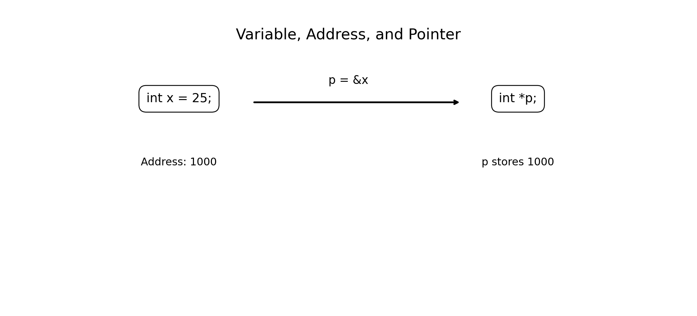
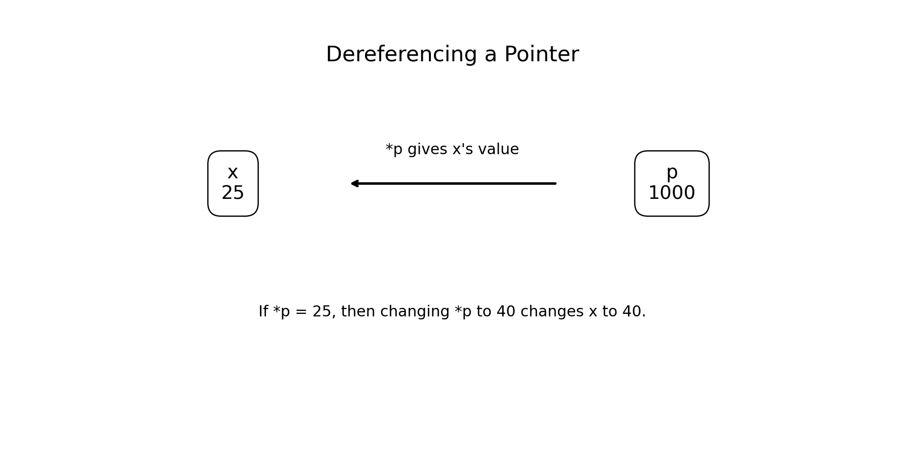
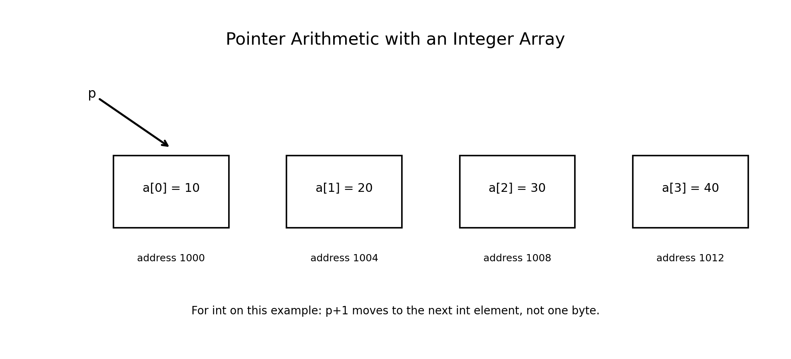
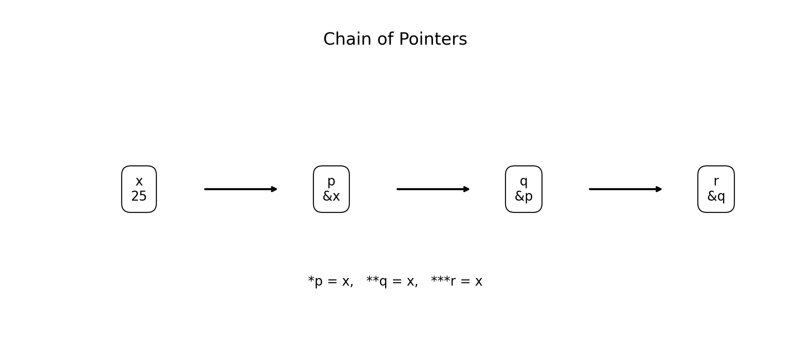

# :classical_building: Problem Solving Using Programming - B.Tech-IT, IIIT Allahabad
## Unit 5: Pointers and Structures
* ### Current Topic: Pointers in C: Addresses, Pointer Assignment, Address Arithmetic, and Chain of Pointers
* **Purpose:** Introduce Pointers and Structures
---

---
## 👥 Instructor Information
* **Edited by Instructor:** [Dr. Mohammed Javed](https://sites.google.com/site/mohammedjaved2016/)
* **Email:** javed@iiita.ac.in
* **Senior Teaching Assistants:** Mr. Subrata Pramanik (pmm2024003@iiita.ac.in)
---
## 🎯 Learning Objectives

After studying this chapter, students will be able to:

- Explain computer memory addresses.
- Understand the relationship between variables and memory addresses.
- Use the address-of operator `&`.
- Declare pointer variables.
- Assign addresses to pointers.
- Dereference pointers using `*`.
- Modify variables through pointers.
- Perform pointer arithmetic.
- Understand pointer arithmetic with arrays.
- Explain pointers to pointers.
- Use a chain of pointers.
- Identify common pointer errors.
- Apply pointers to practical C programming problems.

---

# 1. Introduction to Pointers

A **pointer** is a variable that stores the address of another object.

Consider:

```c
int x = 25;
```

The variable `x` is stored somewhere in computer memory.

Every memory location has an address.

A pointer can store that address.

Conceptually:

```text
x = 25

Memory:
+----------------+
|       25       |
+----------------+
       address
       1000
```

A pointer can store:

```text
1000
```

and therefore point to `x`.



---

# 2. Why Are Pointers Important?

Pointers are one of the most important features of C.

They are used for:

- Passing data to functions by address
- Modifying variables inside functions
- Processing arrays efficiently
- Dynamic memory allocation
- Strings
- Structures
- Linked lists
- Trees and graphs
- Embedded systems
- Operating systems
- Device programming
- Low-level programming

Understanding pointers is essential for advanced C programming.

---

# 3. Address of a Variable

Consider:

```c
int x = 25;
```

The variable has:

1. A value
2. A data type
3. A memory address

For example, conceptually:

```text
Variable: x
Value:    25
Address:  1000
Type:     int
```

The actual address is assigned by the operating system/compiler/runtime environment and should not be assumed to be a particular number.

---

# 4. Address Operator `&`

C provides the **address-of operator**:

```c
&
```

It obtains the address of an object.

Example:

```c
int x = 25;

printf("%p\n", (void *)&x);
```

Here:

```c
&x
```

means:

```text
address of x
```

---

# 5. Printing an Address

The recommended format specifier for an object pointer is:

```c
%p
```

Example:

```c
#include <stdio.h>

int main(void)
{
    int x = 25;

    printf("Value   = %d\n", x);
    printf("Address = %p\n", (void *)&x);

    return 0;
}
```

Possible output:

```text
Value   = 25
Address = 0x7ff...
```

The exact address will vary between executions and systems.

---

# 6. Pointer Declaration

The general form is:

```c
data_type *pointer_name;
```

Examples:

```c
int *p;
float *q;
char *r;
double *s;
```

The type of a pointer indicates the type of object it is intended to point to.

For example:

```c
int *p;
```

declares `p` as a pointer to `int`.

---

# 7. Pointer Assignment

Consider:

```c
int x = 25;
int *p;

p = &x;
```

Now:

```text
p contains the address of x
```

Therefore:

```c
*p
```

accesses the value stored in `x`.

Conceptually:

```text
x = 25
   ↑
   |
   p
```

---

# 8. Dereferencing Operator `*`

When `*` is used with a valid pointer expression, it accesses the object pointed to by that pointer.

Example:

```c
#include <stdio.h>

int main(void)
{
    int x = 25;
    int *p = &x;

    printf("x  = %d\n", x);
    printf("*p = %d\n", *p);

    return 0;
}
```

Output:

```text
x  = 25
*p = 25
```

Thus:

```c
*p
```

means:

```text
value stored in the object pointed to by p
```

---

# 9. Address Operator vs Dereference Operator

The symbols:

```c
&
```

and:

```c
*
```

perform different operations in these contexts.

### Address operator

```c
&x
```

means:

```text
address of x
```

### Dereference operator

```c
*p
```

means:

```text
object/value pointed to by p
```

Example:

```c
int x = 50;
int *p = &x;
```

Then:

```text
p   → address of x
*p  → value of x
```

---

# 10. Modifying a Variable Through a Pointer

A pointer can be used to modify the object it points to.

```c
#include <stdio.h>

int main(void)
{
    int x = 25;
    int *p = &x;

    printf("Before: %d\n", x);

    *p = 100;

    printf("After:  %d\n", x);

    return 0;
}
```

Output:

```text
Before: 25
After:  100
```

The statement:

```c
*p = 100;
```

changes the value of `x`.



---

# 11. Pointer Assignment

Pointer assignment means assigning an address to a pointer.

Example:

```c
int a = 10;
int b = 20;

int *p;

p = &a;
```

Now:

```text
p → a
```

The pointer can later be changed:

```c
p = &b;
```

Now:

```text
p → b
```

The pointer variable itself has not changed type; only the object it points to has changed.

---

# 12. Example — Changing What a Pointer Points To

```c
#include <stdio.h>

int main(void)
{
    int a = 10;
    int b = 20;

    int *p = &a;

    printf("*p = %d\n", *p);

    p = &b;

    printf("*p = %d\n", *p);

    return 0;
}
```

Output:

```text
*p = 10
*p = 20
```

---

# 13. Pointer Initialization

It is good practice to initialize pointers.

Example:

```c
int x = 10;
int *p = &x;
```

If a pointer currently does not point to a valid object, it can be initialized to:

```c
NULL
```

Example:

```c
int *p = NULL;
```

A null pointer does not point to an object.

It must not be dereferenced.

---

# 14. Null Pointer

Example:

```c
int *p = NULL;
```

This is safe as long as we do not dereference it.

Do **not** write:

```c
*p = 10;
```

when:

```c
p == NULL
```

Dereferencing a null pointer causes undefined behavior.

A common defensive pattern is:

```c
if (p != NULL)
{
    printf("%d\n", *p);
}
```

---

# 15. Pointer Types

Pointers have types.

Examples:

```c
int *p;
float *q;
char *r;
double *s;
```

The type affects:

- How dereferencing is interpreted
- Pointer arithmetic
- Compatibility with pointed-to objects

Example:

```c
int x = 10;
int *p = &x;
```

and:

```c
float y = 3.14f;
float *q = &y;
```

---

# 16. Pointer Size

The size of a pointer depends on the target architecture and implementation.

For example:

```c
printf("%zu\n", sizeof(int *));
printf("%zu\n", sizeof(char *));
```

On many modern systems, several different pointer types have the same size, but C does not require all object pointer types to have a particular size.

Do not confuse:

```c
sizeof(pointer)
```

with:

```c
sizeof(*pointer)
```

For example:

```c
int *p;
```

typically:

```text
sizeof(p)   → size of the pointer
sizeof(*p)  → size of an int
```

The exact values depend on the implementation.

---

# 17. Pointer and Array Relationship

Pointers and arrays are closely related in C.

Consider:

```c
int a[4] = {10, 20, 30, 40};
```

The expression:

```c
a
```

in most expressions is converted to a pointer to its first element.

Therefore:

```c
a
```

is closely related to:

```c
&a[0]
```

For example:

```c
int *p = a;
```

makes `p` point to the first element.

---

# 18. Accessing Array Elements Through a Pointer

```c
#include <stdio.h>

int main(void)
{
    int a[4] = {10, 20, 30, 40};
    int *p = a;

    printf("%d\n", *p);
    printf("%d\n", *(p + 1));
    printf("%d\n", *(p + 2));
    printf("%d\n", *(p + 3));

    return 0;
}
```

Output:

```text
10
20
30
40
```

---

# 19. Address Arithmetic

Pointer arithmetic is different from ordinary integer arithmetic.

Suppose:

```c
int a[4] = {10, 20, 30, 40};
int *p = a;
```

Then:

```c
p + 1
```

points to:

```c
a[1]
```

not simply to the next byte.

The compiler accounts for the size of the pointed-to type.



---

# 20. Pointer Arithmetic Operations

For a pointer `p`, common operations include:

```c
p + 1
p - 1
p++
p--
```

If `p` points to an element of an array, these operations move between array elements.

Pointer arithmetic is meaningful only under the rules defined by C, most importantly when the pointer points into an array object or one past its last element.

---

# 21. Example — Pointer Increment

```c
#include <stdio.h>

int main(void)
{
    int a[] = {10, 20, 30};

    int *p = a;

    printf("%d\n", *p);

    p++;

    printf("%d\n", *p);

    p++;

    printf("%d\n", *p);

    return 0;
}
```

Output:

```text
10
20
30
```

---

# 22. Pointer Subtraction

If two pointers point into the same array, their difference gives the number of array elements between them.

Example:

```c
#include <stdio.h>
#include <stddef.h>

int main(void)
{
    int a[] = {10, 20, 30, 40, 50};

    int *p = &a[1];
    int *q = &a[4];

    printf("Difference = %td\n", q - p);

    return 0;
}
```

Output:

```text
Difference = 3
```

because:

```text
a[4] - a[1] → 3 elements
```

The result type of pointer subtraction is `ptrdiff_t`.

---

# 23. Pointer Comparison

Pointers to elements of the same array can be compared.

Example:

```c
if (p < q)
{
    printf("p occurs before q\n");
}
```

Such relational comparisons are meaningful when the pointers refer to elements of the same array object (or one past it).

---

# 24. One-Past-the-End Pointer

For:

```c
int a[5];
```

a pointer can legally point one position past the last element:

```c
int *p = a + 5;
```

But:

```c
*p
```

is not valid because there is no element there.

This is commonly used in loops:

```c
for (int *p = a; p != a + 5; p++)
{
    printf("%d\n", *p);
}
```

---

# 25. Pointer Arithmetic Example

```c
#include <stdio.h>

int main(void)
{
    int a[5] = {10, 20, 30, 40, 50};

    int *p = a;

    for (int i = 0; i < 5; i++)
    {
        printf("%d ", *(p + i));
    }

    printf("\n");

    return 0;
}
```

Output:

```text
10 20 30 40 50
```

This demonstrates the equivalence:

```text
a[i]
```

and:

```text
*(a + i)
```

for ordinary array access.

---

# 26. Address Arithmetic vs Integer Arithmetic

Do not treat a pointer as an ordinary integer.

For example:

```c
p + 1
```

means:

```text
next element of the pointed-to type
```

It does not simply mean:

```text
increase the address by 1 byte
```

If `p` is an `int *`, the implementation advances by enough bytes to reach the next `int` element.

---

# 27. Pointer and Character Arrays

Pointers are commonly used with strings.

Example:

```c
char text[] = "Hello";
char *p = text;
```

Then:

```c
printf("%c\n", *p);
```

outputs:

```text
H
```

After:

```c
p++;
```

`*p` refers to:

```text
e
```

---

# 28. Traversing a String Using a Pointer

```c
#include <stdio.h>

int main(void)
{
    char text[] = "Hello";
    char *p = text;

    while (*p != '\0')
    {
        putchar(*p);
        p++;
    }

    putchar('\n');

    return 0;
}
```

Output:

```text
Hello
```

The pointer moves through the characters until the null character is encountered.

---

# 29. Chain of Pointers

A pointer can point to another pointer.

For example:

```c
int x = 25;

int *p = &x;

int **q = &p;
```

Here:

```text
x  → integer
p  → pointer to x
q  → pointer to p
```

This is called a **pointer to pointer**.



---

# 30. Dereferencing a Pointer to Pointer

Consider:

```c
int x = 25;
int *p = &x;
int **q = &p;
```

Then:

```c
x
```

gives:

```text
25
```

```c
*p
```

also gives:

```text
25
```

and:

```c
**q
```

also gives:

```text
25
```

because:

```text
q → p → x
```

---

# 31. Example — Pointer to Pointer

```c
#include <stdio.h>

int main(void)
{
    int x = 25;

    int *p = &x;
    int **q = &p;

    printf("x    = %d\n", x);
    printf("*p   = %d\n", *p);
    printf("**q  = %d\n", **q);

    return 0;
}
```

Output:

```text
x    = 25
*p   = 25
**q  = 25
```

---

# 32. Three-Level Pointer

Pointers can have more than two levels.

Example:

```c
int x = 10;

int *p = &x;
int **q = &p;
int ***r = &q;
```

Then:

```c
*p
```

accesses `x`.

```c
**q
```

accesses `x`.

```c
***r
```

also accesses `x`.

Conceptually:

```text
r → q → p → x
```

Such multiple levels should be used only when they make the program design clearer.

---

# 33. Modifying a Value Through a Chain

```c
#include <stdio.h>

int main(void)
{
    int x = 10;

    int *p = &x;
    int **q = &p;

    **q = 50;

    printf("x = %d\n", x);

    return 0;
}
```

Output:

```text
x = 50
```

The statement:

```c
**q = 50;
```

ultimately modifies `x`.

---

# 34. Pointers and Functions

Pointers are important for modifying caller variables inside functions.

Example:

```c
#include <stdio.h>

void change(int *p)
{
    *p = 100;
}

int main(void)
{
    int x = 25;

    change(&x);

    printf("x = %d\n", x);

    return 0;
}
```

Output:

```text
x = 100
```

The function receives the address of `x`.

---

# 35. Swapping Two Values Using Pointers

A classic pointer problem is swapping two variables.

```c
#include <stdio.h>

void swap(int *a, int *b)
{
    int temp = *a;

    *a = *b;
    *b = temp;
}

int main(void)
{
    int x = 10;
    int y = 20;

    printf("Before: x = %d, y = %d\n", x, y);

    swap(&x, &y);

    printf("After:  x = %d, y = %d\n", x, y);

    return 0;
}
```

Output:

```text
Before: x = 10, y = 20
After:  x = 20, y = 10
```

---

# 36. Pointer Safety

Pointers provide powerful capabilities, but incorrect use can produce serious bugs.

Important rules:

### Rule 1

Do not dereference an uninitialized pointer.

Dangerous:

```c
int *p;
*p = 10;
```

### Rule 2

Do not dereference `NULL`.

```c
int *p = NULL;
```

This is not a valid target for `*p`.

### Rule 3

Do not access memory beyond an array.

### Rule 4

Do not use a pointer after the object it points to has ceased to exist.

### Rule 5

Ensure pointer types are appropriate for the objects they reference.

---

# 37. Dangling Pointer

A **dangling pointer** is a pointer whose referenced object no longer exists.

For example, returning the address of a local automatic variable from a function is invalid:

```c
int *bad_function(void)
{
    int x = 10;
    return &x;     /* wrong */
}
```

After the function returns, `x` no longer exists.

The returned pointer is therefore invalid to dereference.

---

# 38. Wild Pointer

A pointer that has not been initialized may contain an indeterminate value.

Example:

```c
int *p;
```

Using:

```c
*p
```

before assigning a valid address is unsafe.

Prefer:

```c
int *p = NULL;
```

until a valid target is available.

---

# 39. Pointer Type Compatibility

Consider:

```c
int x = 10;
int *p = &x;
```

This is appropriate.

A pointer should normally have a type compatible with the object it points to.

For example:

```c
double d = 3.14;
double *p = &d;
```

The type matters because dereferencing and pointer arithmetic depend on it.

---

# 40. `void *`

C provides the generic object pointer type:

```c
void *
```

It can hold the address of an object of any object type.

Example:

```c
int x = 10;
void *p = &x;
```

Before dereferencing, convert or assign it to an appropriate pointer type:

```c
int *ip = p;
printf("%d\n", *ip);
```

Output:

```text
10
```

A `void *` does not by itself provide the type information needed to dereference an object.

---

# 41. Pointers and `sizeof`

Consider:

```c
int x = 10;
int *p = &x;
```

Then:

```c
sizeof(p)
```

is the size of the pointer.

While:

```c
sizeof(*p)
```

is the size of the pointed-to `int`.

This distinction is important in memory-related programming.

---

# 42. Complete Example — Array Processing with Pointers

```c
#include <stdio.h>

int sum_array(const int *p, int n)
{
    int sum = 0;

    for (int i = 0; i < n; i++)
    {
        sum += *(p + i);
    }

    return sum;
}

int main(void)
{
    int a[] = {10, 20, 30, 40, 50};

    int result = sum_array(a, 5);

    printf("Sum = %d\n", result);

    return 0;
}
```

Output:

```text
Sum = 150
```

This demonstrates:

- Arrays
- Pointers
- Pointer arithmetic
- Function arguments

---

# 43. Engineering Applications of Pointers

Pointers are especially important in engineering-oriented C programming.

### Embedded Systems

Pointers are used to interact with memory-mapped hardware registers.

### Data Structures

Pointers form the basis of:

- Linked lists
- Trees
- Graphs
- Queues
- Stacks

### Dynamic Memory

Functions such as:

```c
malloc()
calloc()
realloc()
free()
```

use pointers for dynamic memory management.

### Operating Systems

Pointers are heavily used in low-level system programming.

### Device Drivers

Pointers provide access to data structures and hardware-related memory.

---

# 44. Pointer Problem-Solving Pattern

When solving a pointer problem:

```text
Identify the object
       ↓
Determine its address
       ↓
Declare a compatible pointer
       ↓
Assign the address
       ↓
Dereference when needed
       ↓
Perform the required operation
       ↓
Check pointer validity
```

For array problems:

```text
Array
  ↓
Pointer to first element
  ↓
Pointer arithmetic
  ↓
Traverse elements
  ↓
Compute result
```

---

# 45. Common Mistakes

### Mistake 1

Confusing:

```c
p
```

with:

```c
*p
```

`p` is the pointer value/address.

`*p` accesses the pointed-to object.

### Mistake 2

Confusing:

```c
&x
```

with:

```c
x
```

`&x` is the address.

`x` is the value.

### Mistake 3

Dereferencing `NULL`.

### Mistake 4

Using an uninitialized pointer.

### Mistake 5

Moving a pointer outside the valid array range and dereferencing it.

### Mistake 6

Returning the address of a local variable.

---

# 46. Debugging Pointer Programs

When debugging a pointer program, check:

1. Is the pointer initialized?
2. Does it point to a valid object?
3. Is the pointed-to object still alive?
4. Is the pointer type appropriate?
5. Is pointer arithmetic within the valid range?
6. Is the pointer being dereferenced only when valid?
7. Is the function receiving the correct address?
8. Is the destination buffer large enough?

Printing addresses can help during debugging:

```c
printf("p = %p\n", (void *)p);
```

But addresses should be treated as implementation-dependent values, not portable numeric identifiers.

---

# 47. Practice Programs

## Exercise 1 — Address

Write a program that prints the value and address of an integer variable.

## Exercise 2 — Dereferencing

Create a pointer to an integer and print the value using the pointer.

## Exercise 3 — Modification

Modify an integer through a pointer.

## Exercise 4 — Swap

Write a function to swap two integers using pointers.

## Exercise 5 — Array Traversal

Traverse an array using pointer arithmetic.

## Exercise 6 — Array Sum

Write a function that receives an array through a pointer and calculates its sum.

## Exercise 7 — Maximum

Find the maximum element of an array using pointers.

## Exercise 8 — String Traversal

Print a string character by character using a pointer.

## Exercise 9 — Pointer to Pointer

Create an integer, a pointer to it, and a pointer to that pointer. Display the integer using `**`.

## Exercise 10 — Engineering Application

Create a function that receives a pointer to a sensor reading and modifies the reading after applying a calibration offset.

---

# 48. Viva Questions

1. What is a pointer?
2. What is a memory address?
3. What does the `&` operator do?
4. What does the `*` operator do when used for dereferencing?
5. How do you declare an integer pointer?
6. What is pointer assignment?
7. What is a null pointer?
8. Why should an uninitialized pointer not be dereferenced?
9. What is pointer arithmetic?
10. Why does `p + 1` depend on the pointer type?
11. What is the relationship between an array and a pointer to its first element?
12. What is a one-past-the-end pointer?
13. When can two pointers be subtracted?
14. What is a pointer to pointer?
15. What does `**p` mean when `p` is an `int **`?
16. What is a dangling pointer?
17. What is a wild pointer?
18. Why are pointers used in functions?
19. How can pointers be used to swap two variables?
20. Mention three engineering applications of pointers.

---

# 49. Quick Reference

### Address of variable

```c
&x
```

### Pointer declaration

```c
int *p;
```

### Pointer assignment

```c
p = &x;
```

### Dereference

```c
*p
```

### Modify through pointer

```c
*p = 50;
```

### Null pointer

```c
int *p = NULL;
```

### Array pointer

```c
int a[5];
int *p = a;
```

### Pointer increment

```c
p++;
```

### Pointer arithmetic

```c
*(p + i)
```

### Pointer to pointer

```c
int **q = &p;
```

### Two-level dereference

```c
**q
```

### Print pointer

```c
printf("%p", (void *)p);
```

---

# 50. Key Takeaways

- A pointer stores the address of an object.
- The address-of operator `&` obtains an object's address.
- The dereference operator `*` accesses the object pointed to.
- Pointer assignment usually involves assigning an address:

```c
p = &x;
```

- A pointer should be initialized before it is used.
- `NULL` represents a null pointer value.
- A null or invalid pointer must not be dereferenced.
- Pointer arithmetic is especially useful with arrays.
- `p + 1` advances to the next element of the pointed-to type when used within the appropriate array context.
- Two pointers into the same array can be subtracted to obtain an element distance.
- A pointer can point to another pointer:

```c
int **q;
```

- A chain can contain multiple pointer levels.
- Pointers are essential for modifying variables through functions and for implementing many dynamic data structures.
- Pointer programming requires careful attention to memory validity and object lifetime.

The fundamental relationship is:

```text
             &x
              ↓
        +-----------+
        |     x     |
        |    25     |
        +-----------+
              ↑
              |
             *p
              |
        +-----------+
        |     p     |
        |  address  |
        +-----------+
```

And for a chain:

```text
r → q → p → x
```

Therefore:

```text
*p    → x
**q   → x
***r  → x
```

Pointers provide C with direct and efficient access to memory, making them fundamental to **problem solving, systems programming, embedded engineering, data structures, and high-performance applications**.

---

# 51. Suggested Mini Project

## Sensor Data Calibration Using Pointers

Create a C program that stores sensor measurements:

```c
float temperature;
float pressure;
float voltage;
```

Create functions such as:

```c
void calibrate_temperature(float *value);
void calibrate_pressure(float *value);
void calibrate_voltage(float *value);
```

Each function should receive the address of the corresponding measurement and modify it using a calibration factor.

For example:

```c
void calibrate_temperature(float *value)
{
    *value = *value + 2.5f;
}
```

Call:

```c
calibrate_temperature(&temperature);
```

This mini project demonstrates a realistic engineering use of:

- Addresses
- Pointers
- Address operator
- Dereferencing
- Function arguments
- Modification through pointers

---

## GitHub Folder Structure

```text
c-pointers/
├── README.md
├── c_pointers_addresses_and_pointer_operations.md
└── figures/
    ├── 01_address_and_pointer.png
    ├── 02_pointer_dereference.png
    ├── 03_pointer_arithmetic.png
    └── 04_chain_of_pointers.png
```
