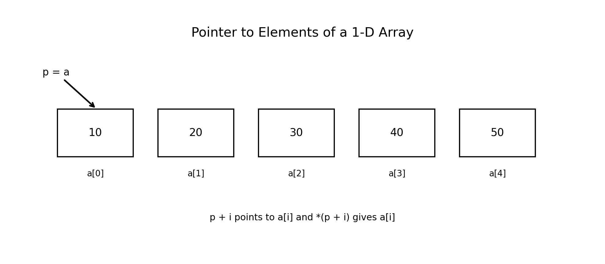
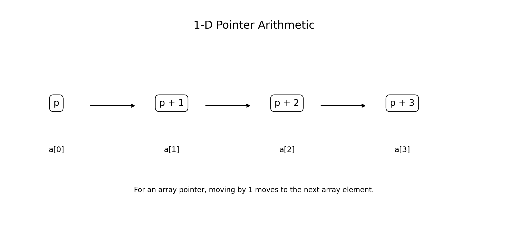
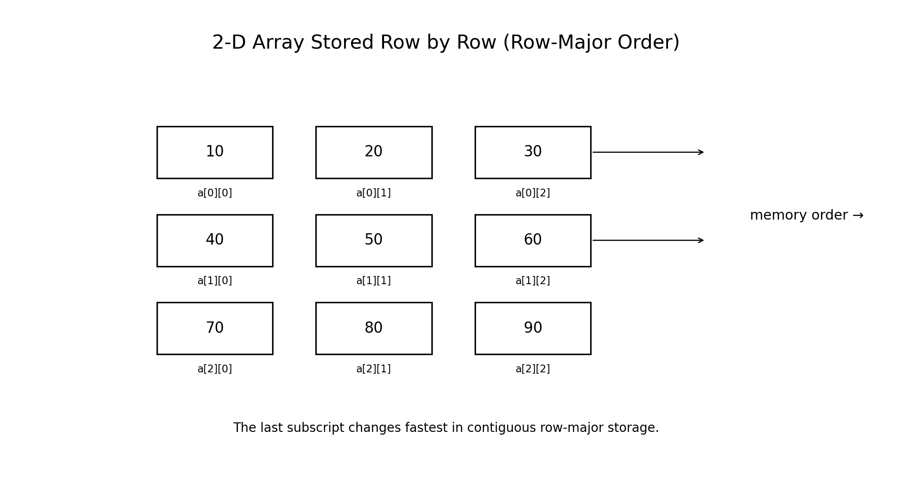
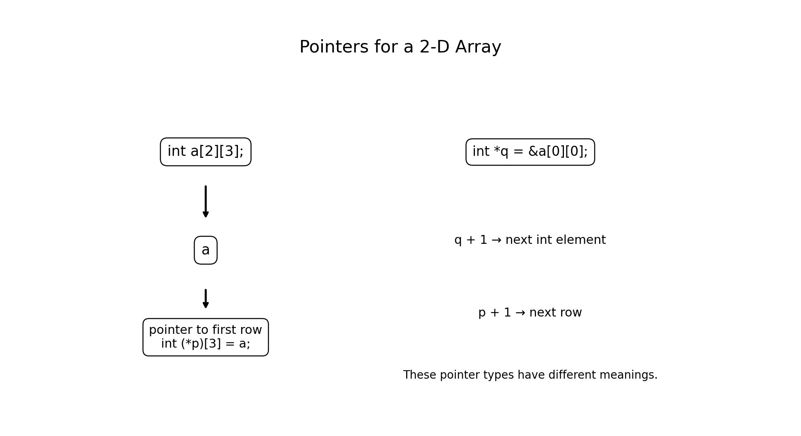
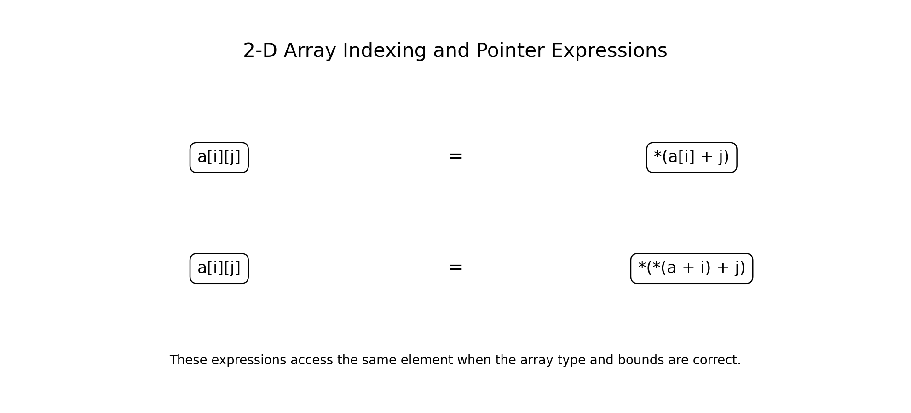

# :classical_building: Problem Solving Using Programming - B.Tech-IT, IIIT Allahabad
## Unit 5: Pointers and Structures
* ### Current Topic: Pointers to Array Elements: 1-D and 2-D Arrays in C
* **Purpose:** Introduce Pointers and Structures
---

---
## 👥 Instructor Information
* **Edited by Instructor:** [Dr. Mohammed Javed](https://sites.google.com/site/mohammedjaved2016/)
* **Email:** javed@iiita.ac.in
* **Senior Teaching Assistants:** Mr. Subrata Pramanik (pmm2024003@iiita.ac.in)
---
## 🎯 Learning Objectives

After studying this chapter, students will be able to:

- Explain the relationship between arrays and pointers.
- Declare pointers to elements of a 1-D array.
- Access 1-D array elements using pointer arithmetic.
- Traverse arrays using pointers.
- Pass 1-D arrays to functions using pointers.
- Explain how 2-D arrays are represented in C.
- Understand row-major storage of 2-D arrays.
- Declare pointers suitable for 2-D arrays.
- Access 2-D elements using pointer expressions.
- Distinguish between a pointer to an element and a pointer to a row.
- Pass 2-D arrays to functions.
- Avoid common pointer and array errors.
- Apply pointer-based array processing to engineering problems.

---

# 1. Introduction

Arrays and pointers are closely related in C.

Consider:

```c
int a[5] = {10, 20, 30, 40, 50};
```

The array contains five `int` elements.

The name:

```c
a
```

in most expressions is converted to a pointer to its first element.

Therefore:

```c
a
```

is closely related to:

```c
&a[0]
```

This relationship makes it possible to access array elements through pointers.

---

# 2. 1-D Array and Its Elements

Consider:

```c
int a[5] = {10, 20, 30, 40, 50};
```

The elements are:

```text
a[0] = 10
a[1] = 20
a[2] = 30
a[3] = 40
a[4] = 50
```

A pointer can point to the first element:

```c
int *p = a;
```



Now:

```c
*p
```

gives:

```text
10
```

---

# 3. Address of Each 1-D Array Element

For:

```c
int a[5];
```

the following expressions represent addresses:

```c
&a[0]
&a[1]
&a[2]
&a[3]
&a[4]
```

If:

```c
int *p = a;
```

then:

```text
p       → &a[0]
p + 1   → &a[1]
p + 2   → &a[2]
p + 3   → &a[3]
p + 4   → &a[4]
```

The actual numerical addresses depend on the execution environment.

---

# 4. Pointer to the First Element

Example:

```c
#include <stdio.h>

int main(void)
{
    int a[5] = {10, 20, 30, 40, 50};

    int *p = a;

    printf("First element = %d\n", *p);

    return 0;
}
```

Output:

```text
First element = 10
```

The assignment:

```c
int *p = a;
```

makes `p` point to `a[0]`.

---

# 5. `&a[0]` and `a`

For a normal array object:

```c
int a[5];
```

these expressions have closely related meanings:

```c
a
```

and:

```c
&a[0]
```

Both can provide a pointer to the first element in appropriate expressions.

For example:

```c
int *p1 = a;
int *p2 = &a[0];
```

Both `p1` and `p2` point to the first element.

---

# 6. Accessing Elements Using Pointer Arithmetic

Suppose:

```c
int a[5] = {10, 20, 30, 40, 50};
int *p = a;
```

Then:

```c
*p
```

is:

```text
10
```

and:

```c
*(p + 1)
```

is:

```text
20
```

Similarly:

```c
*(p + 2) → 30
*(p + 3) → 40
*(p + 4) → 50
```

---

# 7. Array Indexing and Pointer Arithmetic

For an ordinary 1-D array:

```c
a[i]
```

is equivalent to:

```c
*(a + i)
```

Therefore:

```c
a[0] == *(a + 0)
a[1] == *(a + 1)
a[2] == *(a + 2)
```

This is one of the fundamental relationships between arrays and pointers in C.

---

# 8. Example — 1-D Array Traversal

```c
#include <stdio.h>

int main(void)
{
    int a[] = {10, 20, 30, 40, 50};

    int *p = a;

    for (int i = 0; i < 5; i++)
    {
        printf("%d ", *(p + i));
    }

    printf("\n");

    return 0;
}
```

Output:

```text
10 20 30 40 50
```

---

# 9. Incrementing a Pointer

Instead of:

```c
*(p + i)
```

a pointer can be incremented:

```c
p++;
```

Example:

```c
#include <stdio.h>

int main(void)
{
    int a[] = {10, 20, 30};

    int *p = a;

    printf("%d\n", *p);

    p++;
    printf("%d\n", *p);

    p++;
    printf("%d\n", *p);

    return 0;
}
```

Output:

```text
10
20
30
```



---

# 10. Pointer Arithmetic Is Type-Aware

Suppose:

```c
int *p;
```

Then:

```c
p + 1
```

points to the next `int` element when `p` points into an array.

It does **not** mean:

```text
increase the address by exactly 1 byte
```

The C implementation performs pointer arithmetic according to the size of the pointed-to type.

This is why:

```c
int *p
```

and:

```c
char *q
```

can behave differently when incremented.

---

# 11. Traversing a 1-D Array with a Pointer

A pointer can be used directly in a loop:

```c
#include <stdio.h>

int main(void)
{
    int a[] = {5, 10, 15, 20, 25};
    int *p = a;

    for (int i = 0; i < 5; i++)
    {
        printf("%d ", *p);
        p++;
    }

    printf("\n");

    return 0;
}
```

Output:

```text
5 10 15 20 25
```

---

# 12. Pointer-Based Sum of a 1-D Array

```c
#include <stdio.h>

int main(void)
{
    int a[] = {10, 20, 30, 40, 50};
    int *p = a;
    int sum = 0;

    for (int i = 0; i < 5; i++)
    {
        sum += *p;
        p++;
    }

    printf("Sum = %d\n", sum);

    return 0;
}
```

Output:

```text
Sum = 150
```

---

# 13. Pointer-Based Maximum

```c
#include <stdio.h>

int main(void)
{
    int a[] = {25, 10, 45, 15, 30};
    int *p = a;
    int max = *p;

    for (int i = 1; i < 5; i++)
    {
        p++;

        if (*p > max)
        {
            max = *p;
        }
    }

    printf("Maximum = %d\n", max);

    return 0;
}
```

Output:

```text
Maximum = 45
```

---

# 14. Passing a 1-D Array to a Function

A 1-D array can be passed to a function using a pointer parameter.

Example:

```c
#include <stdio.h>

int sum(const int *p, int n)
{
    int total = 0;

    for (int i = 0; i < n; i++)
    {
        total += *(p + i);
    }

    return total;
}

int main(void)
{
    int a[] = {10, 20, 30, 40};

    printf("Sum = %d\n", sum(a, 4));

    return 0;
}
```

Output:

```text
Sum = 100
```

The `const` qualifier means the function does not intend to modify the array elements through `p`.

---

# 15. Important Point About Array Parameters

These function declarations are closely related for a 1-D array parameter:

```c
void display(int a[], int n);
```

and:

```c
void display(int *a, int n);
```

Inside the function parameter list, an array parameter is adjusted to a pointer parameter.

Therefore, the function does not receive a complete copy of the array.

The size must normally be supplied separately.

---

# 16. 2-D Arrays

A two-dimensional array is an array of arrays.

Example:

```c
int a[3][4];
```

This means:

```text
3 rows
4 columns
```

Total elements:

```text
3 × 4 = 12
```

Example:

```c
int a[2][3] =
{
    {10, 20, 30},
    {40, 50, 60}
};
```

---

# 17. 2-D Array Indexing

For:

```c
int a[2][3] =
{
    {10, 20, 30},
    {40, 50, 60}
};
```

the elements are:

```text
a[0][0] = 10
a[0][1] = 20
a[0][2] = 30

a[1][0] = 40
a[1][1] = 50
a[1][2] = 60
```

---

# 18. Row-Major Storage

C stores elements of a multidimensional array in **row-major order**.

For:

```c
int a[3][3] =
{
    {10, 20, 30},
    {40, 50, 60},
    {70, 80, 90}
};
```

the elements are laid out conceptually as:

```text
10 20 30 40 50 60 70 80 90
```



The rows are stored one after another.

---

# 19. The Type of a 2-D Array Element

For:

```c
int a[3][4];
```

each individual element:

```c
a[i][j]
```

has type:

```c
int
```

Each row:

```c
a[i]
```

is an array of 4 `int` values.

In most expressions, `a[i]` is converted to a pointer to its first `int` element.

---

# 20. Pointer to an Element of a 2-D Array

You can create a pointer to an individual element:

```c
int a[2][3] =
{
    {10, 20, 30},
    {40, 50, 60}
};

int *p = &a[0][0];
```

Then:

```c
*p
```

gives:

```text
10
```

and:

```c
*(p + 1)
```

gives:

```text
20
```

when traversing the contiguous elements in this array object in the appropriate way.

---

# 21. Traversing 2-D Array Elements with an `int *`

For an ordinary contiguous 2-D array, one can process all elements using a pointer to its first `int` element.

Example:

```c
#include <stdio.h>

int main(void)
{
    int a[2][3] =
    {
        {10, 20, 30},
        {40, 50, 60}
    };

    int *p = &a[0][0];

    for (int i = 0; i < 6; i++)
    {
        printf("%d ", *(p + i));
    }

    printf("\n");

    return 0;
}
```

Output:

```text
10 20 30 40 50 60
```

The expression traverses the elements in their contiguous row-major storage order.

---

# 22. Pointer to a Row of a 2-D Array

There is another important pointer type.

For:

```c
int a[2][3];
```

a pointer to a row is:

```c
int (*p)[3];
```

This means:

```text
p is a pointer to an array of 3 int
```

Example:

```c
int (*p)[3] = a;
```

Now:

```c
p
```

points to the first row.



---

# 23. Why Does the `3` Matter?

Consider:

```c
int a[2][3];
```

The pointer:

```c
int (*p)[3];
```

must know that each row contains 3 integers.

This allows:

```c
p + 1
```

to move to the next row.

Therefore:

```text
p       → row 0
p + 1   → row 1
```

---

# 24. Accessing 2-D Array Elements Through a Row Pointer

Example:

```c
#include <stdio.h>

int main(void)
{
    int a[2][3] =
    {
        {10, 20, 30},
        {40, 50, 60}
    };

    int (*p)[3] = a;

    printf("%d\n", p[0][0]);
    printf("%d\n", p[0][1]);
    printf("%d\n", p[1][0]);
    printf("%d\n", p[1][2]);

    return 0;
}
```

Output:

```text
10
20
40
60
```

---

# 25. 2-D Pointer Expression

For:

```c
int a[2][3];
```

the following expression accesses an element:

```c
*(*(a + i) + j)
```

This is equivalent to:

```c
a[i][j]
```

provided the indexing is within the valid array bounds.



---

# 26. Understanding `*(*(a + i) + j)`

Break the expression into steps:

```c
a + i
```

moves to row `i`.

Then:

```c
*(a + i)
```

represents row `i`.

Then:

```c
*(a + i) + j
```

moves to column `j`.

Finally:

```c
*(*(a + i) + j)
```

gets the element.

Thus:

```text
row → column → value
```

---

# 27. Example of 2-D Pointer Expression

```c
#include <stdio.h>

int main(void)
{
    int a[2][3] =
    {
        {10, 20, 30},
        {40, 50, 60}
    };

    printf("%d\n", *(*(a + 0) + 1));
    printf("%d\n", *(*(a + 1) + 2));

    return 0;
}
```

Output:

```text
20
60
```

because:

```text
a[0][1] = 20
a[1][2] = 60
```

---

# 28. `a[i][j]` and Pointer Notation

For a 2-D array:

```c
a[i][j]
```

can be expressed as:

```c
*(a[i] + j)
```

and equivalently:

```c
*(*(a + i) + j)
```

These forms illustrate how C's array indexing is closely connected to pointer operations.

---

# 29. Passing a 2-D Array to a Function

Consider:

```c
int a[2][3];
```

A function can receive it using:

```c
void display(int a[][3], int rows)
```

or:

```c
void display(int (*a)[3], int rows)
```

The number of columns must be known to correctly calculate the address of each row.

---

# 30. Example — Display 2-D Array

```c
#include <stdio.h>

void display(int a[][3], int rows)
{
    for (int i = 0; i < rows; i++)
    {
        for (int j = 0; j < 3; j++)
        {
            printf("%d ", a[i][j]);
        }

        printf("\n");
    }
}

int main(void)
{
    int a[2][3] =
    {
        {10, 20, 30},
        {40, 50, 60}
    };

    display(a, 2);

    return 0;
}
```

Output:

```text
10 20 30
40 50 60
```

---

# 31. 2-D Array Function with Pointer-to-Row

The same idea can be written as:

```c
#include <stdio.h>

void display(int (*p)[3], int rows)
{
    for (int i = 0; i < rows; i++)
    {
        for (int j = 0; j < 3; j++)
        {
            printf("%d ", p[i][j]);
        }

        printf("\n");
    }
}

int main(void)
{
    int a[2][3] =
    {
        {10, 20, 30},
        {40, 50, 60}
    };

    display(a, 2);

    return 0;
}
```

Output:

```text
10 20 30
40 50 60
```

---

# 32. Sum of a 2-D Array Using a Pointer

```c
#include <stdio.h>

int sum_matrix(int (*p)[3], int rows)
{
    int sum = 0;

    for (int i = 0; i < rows; i++)
    {
        for (int j = 0; j < 3; j++)
        {
            sum += p[i][j];
        }
    }

    return sum;
}

int main(void)
{
    int a[2][3] =
    {
        {10, 20, 30},
        {40, 50, 60}
    };

    printf("Sum = %d\n", sum_matrix(a, 2));

    return 0;
}
```

Output:

```text
Sum = 210
```

---

# 33. Finding the Maximum in a 2-D Array

```c
#include <stdio.h>

int maximum(int (*p)[3], int rows)
{
    int max = p[0][0];

    for (int i = 0; i < rows; i++)
    {
        for (int j = 0; j < 3; j++)
        {
            if (p[i][j] > max)
            {
                max = p[i][j];
            }
        }
    }

    return max;
}

int main(void)
{
    int a[2][3] =
    {
        {10, 70, 30},
        {40, 50, 60}
    };

    printf("Maximum = %d\n", maximum(a, 2));

    return 0;
}
```

Output:

```text
Maximum = 70
```

---

# 34. Difference Between `int *` and `int (*)[3]`

This is one of the most important concepts in 2-D arrays.

For:

```c
int a[2][3];
```

### Pointer to an element

```c
int *p = &a[0][0];
```

`p` points to an `int`.

### Pointer to a row

```c
int (*q)[3] = a;
```

`q` points to an array containing 3 `int` elements.

Therefore:

```text
int *       → pointer to int
int (*)[3]  → pointer to an array of 3 int
```

These pointer types are not interchangeable.

---

# 35. Visual Comparison

```text
2-D Array:

        column
          0      1      2
       +------+------+------+
row 0  |  10  |  20  |  30  |
       +------+------+------+
row 1  |  40  |  50  |  60  |
       +------+------+------+

int *p = &a[0][0];

p → 10

int (*q)[3] = a;

q → entire row 0
```

Thus:

```c
p + 1
```

moves to the next `int`.

Whereas:

```c
q + 1
```

moves to the next row.

---

# 36. Pointer Arithmetic in 2-D Arrays

For:

```c
int a[3][4];
int (*p)[4] = a;
```

then:

```c
p + 1
```

moves from:

```text
a[0]
```

to:

```text
a[1]
```

because each row contains four `int` elements.

Similarly:

```c
p + 2
```

points to:

```text
a[2]
```

---

# 37. 2-D Array Traversal Using a Pointer to Rows

```c
#include <stdio.h>

int main(void)
{
    int a[3][4] =
    {
        {1, 2, 3, 4},
        {5, 6, 7, 8},
        {9, 10, 11, 12}
    };

    int (*p)[4] = a;

    for (int i = 0; i < 3; i++)
    {
        for (int j = 0; j < 4; j++)
        {
            printf("%d ", p[i][j]);
        }

        printf("\n");
    }

    return 0;
}
```

Output:

```text
1 2 3 4
5 6 7 8
9 10 11 12
```

---

# 38. Passing 2-D Arrays with Variable Dimensions

Modern C also supports variable length arrays in appropriate contexts.

For example:

```c
void display(int rows, int cols, int a[rows][cols])
{
    for (int i = 0; i < rows; i++)
    {
        for (int j = 0; j < cols; j++)
        {
            printf("%d ", a[i][j]);
        }

        printf("\n");
    }
}
```

The parameter dimensions allow the compiler to calculate the correct address of each element.

Whether VLAs are available depends on the C version and compiler implementation.

---

# 39. Pointer-Based Matrix Addition

Matrix operations are common engineering applications.

```c
#include <stdio.h>

void add(
    int a[][3],
    int b[][3],
    int result[][3],
    int rows)
{
    for (int i = 0; i < rows; i++)
    {
        for (int j = 0; j < 3; j++)
        {
            result[i][j] = a[i][j] + b[i][j];
        }
    }
}

int main(void)
{
    int a[2][3] =
    {
        {1, 2, 3},
        {4, 5, 6}
    };

    int b[2][3] =
    {
        {10, 20, 30},
        {40, 50, 60}
    };

    int result[2][3];

    add(a, b, result, 2);

    for (int i = 0; i < 2; i++)
    {
        for (int j = 0; j < 3; j++)
        {
            printf("%d ", result[i][j]);
        }

        printf("\n");
    }

    return 0;
}
```

Output:

```text
11 22 33
44 55 66
```

---

# 40. Common Mistakes with 1-D Arrays

### Mistake 1 — Going beyond the array

Incorrect:

```c
int a[5];
printf("%d", a[5]);
```

Valid indices are:

```text
0 to 4
```

### Mistake 2 — Invalid pointer movement

Do not dereference a pointer outside the valid array range.

### Mistake 3 — Forgetting array size

When a pointer is passed to a function, the pointer does not automatically carry the number of elements.

Usually pass the size separately:

```c
function(a, n);
```

---

# 41. Common Mistakes with 2-D Arrays

### Mistake 1 — Wrong pointer type

For:

```c
int a[2][3];
```

this is appropriate:

```c
int (*p)[3] = a;
```

not simply:

```c
int *p = a;
```

if the intention is to use `p[i][j]` as a row pointer.

### Mistake 2 — Wrong column count

A function parameter such as:

```c
void f(int a[][4])
```

expects rows with four `int` elements.

### Mistake 3 — Going outside bounds

For:

```c
int a[2][3];
```

valid indices are:

```text
row:    0, 1
column: 0, 1, 2
```

---

# 42. Pointers to Array Elements vs Pointer to Array

The terminology can be confusing.

### Pointer to an element

```c
int *p;
```

points to one `int`.

### Pointer to an array

```c
int (*p)[3];
```

points to an array of three `int`.

Parentheses are essential:

```c
int (*p)[3]
```

is different from:

```c
int *p[3]
```

The latter declares an **array of three pointers to int**.

---

# 43. Important Declaration Comparison

| Declaration | Meaning |
|---|---|
| `int *p` | Pointer to `int` |
| `int (*p)[3]` | Pointer to array of 3 `int` |
| `int *p[3]` | Array of 3 pointers to `int` |
| `int a[3][4]` | 2-D array: 3 rows × 4 columns |

Understanding parentheses in pointer declarations is essential.

---

# 44. Engineering Applications

Pointers to array elements are useful in:

### Image Processing

An image can be represented as a 2-D matrix of pixels.

```text
pixel[row][column]
```

### Signal Processing

Samples can be stored in arrays and processed using pointer traversal.

### Scientific Computing

Matrices and numerical datasets are frequently represented using 2-D arrays.

### Embedded Systems

Sensor samples and lookup tables can be stored in arrays and accessed efficiently.

### Robotics

Coordinate and transformation matrices are commonly represented as 2-D arrays.

### Computer Graphics

Pixel and geometric data often involve multidimensional arrays.

---

# 45. Problem-Solving Strategy

For a 1-D pointer problem:

```text
Declare array
     ↓
Point to first element
     ↓
Move pointer
     ↓
Dereference
     ↓
Process element
```

For a 2-D pointer problem:

```text
Declare matrix
     ↓
Identify row and column dimensions
     ↓
Choose pointer type
     ↓
Move to required row
     ↓
Move to required column
     ↓
Dereference
```

---

# 46. Debugging Pointer-to-Array Programs

Check:

1. Is the pointer initialized?
2. Does it point to the correct array?
3. Is the pointer type correct?
4. Are row and column dimensions correct?
5. Are indices within bounds?
6. Is pointer arithmetic being used within the valid array object?
7. Is the function receiving the correct dimensions?
8. Is a pointer-to-row being confused with a pointer-to-element?

For debugging addresses:

```c
printf("%p\n", (void *)p);
```

can be useful.

---

# 47. Practice Programs — 1-D Arrays

### Exercise 1

Print all elements of a 1-D array using pointer arithmetic.

### Exercise 2

Calculate the sum using a pointer.

### Exercise 3

Find the largest element using a pointer.

### Exercise 4

Find the smallest element using a pointer.

### Exercise 5

Count even and odd numbers using pointer traversal.

### Exercise 6

Reverse a 1-D array using pointers.

### Exercise 7

Copy one array to another using pointers.

### Exercise 8

Search for a value using a pointer.

---

# 48. Practice Programs — 2-D Arrays

### Exercise 1

Display a 2-D array using a pointer-to-row.

### Exercise 2

Calculate the sum of all matrix elements.

### Exercise 3

Find the maximum element in a matrix.

### Exercise 4

Calculate row-wise sums.

### Exercise 5

Calculate column-wise sums.

### Exercise 6

Add two matrices.

### Exercise 7

Multiply two matrices.

### Exercise 8

Find the transpose of a matrix.

### Exercise 9

Search for a value in a matrix.

### Exercise 10

Find the largest element in each row.

---

# 49. Viva Questions

1. What is the relationship between an array and a pointer?
2. What does the array name represent in most expressions?
3. What is the difference between `a` and `&a[0]`?
4. What does `*(a + i)` represent?
5. What is pointer arithmetic?
6. Why does `p + 1` depend on the pointer type?
7. How do you traverse a 1-D array using a pointer?
8. How can a 1-D array be passed to a function?
9. What is a 2-D array in C?
10. How are 2-D arrays stored in C?
11. What is row-major order?
12. What does `int (*p)[3]` mean?
13. What is the difference between `int *p` and `int (*p)[3]`?
14. Why must the column size normally be known when passing a traditional 2-D array?
15. What does `a[i][j]` mean?
16. Express `a[i][j]` using pointer notation.
17. What does `*(*(a+i)+j)` represent?
18. What is the difference between `p + 1` for `int *p` and for `int (*p)[3]`?
19. How can pointers be used in matrix processing?
20. Mention two engineering applications of pointer-based arrays.

---

# 50. Quick Reference

## 1-D Array

```c
int a[5] = {10, 20, 30, 40, 50};
```

## Pointer to first element

```c
int *p = a;
```

## First element

```c
*p
```

## Element `i`

```c
*(p + i)
```

## Equivalent indexing

```c
a[i]
```

and:

```c
*(a + i)
```

---

## 2-D Array

```c
int a[2][3];
```

## Pointer to an element

```c
int *p = &a[0][0];
```

## Pointer to a row

```c
int (*p)[3] = a;
```

## Element access

```c
a[i][j]
```

or:

```c
*(a[i] + j)
```

or:

```c
*(*(a + i) + j)
```

---

# 51. Key Takeaways

- C arrays and pointers are closely related.
- A 1-D array name usually converts to a pointer to its first element in expressions.
- For a 1-D array:

```c
a[i]
```

is equivalent to:

```c
*(a + i)
```

- Pointer arithmetic moves according to the pointed-to type.
- A pointer can be used to traverse a 1-D array efficiently.
- A 2-D array is an array of arrays.
- C stores ordinary multidimensional arrays in row-major order.
- For:

```c
int a[2][3];
```

a pointer to a row is:

```c
int (*p)[3]
```

- A pointer to an individual element is:

```c
int *p
```

- These two pointer types have different meanings.
- For a 2-D array:

```c
a[i][j]
```

can be represented as:

```c
*(*(a + i) + j)
```

- When passing a traditional 2-D array to a function, the compiler needs enough information about the row width to calculate addresses.
- Correct pointer type, bounds checking, and valid pointer arithmetic are essential for safe programs.

---

# 52. Suggested Mini Project

## Engineering Sensor Matrix Analyzer

Suppose an engineering laboratory collects measurements from:

```text
3 sensors
×
5 time intervals
```

Represent the data using:

```c
float readings[3][5];
```

Create functions to:

1. Display all measurements.
2. Calculate the average for each sensor.
3. Calculate the average for each time interval.
4. Find the maximum measurement.
5. Find the minimum measurement.
6. Identify the sensor with the highest average.
7. Process the matrix using pointer-to-row notation.

For example:

```c
void analyze(float (*p)[5], int sensors)
{
    /* process the matrix */
}
```

This provides a practical engineering application of:

- 2-D arrays
- Pointer-to-row
- Pointer arithmetic
- Function arguments
- Matrix processing
- Numerical problem solving

---

# 53. Final Concept Map

```text
                    ARRAYS
                       |
             +---------+---------+
             |                   |
           1-D                 2-D
             |                   |
         int a[5]          int a[2][3]
             |                   |
       int *p = a         int (*p)[3] = a
             |                   |
      p + i → a[i]       p + i → next row
             |                   |
      *(p + i)           p[i][j]
                                 |
                         *(*(a+i)+j)
```

Understanding pointers to array elements provides an essential foundation for later topics such as **dynamic memory allocation, strings, structures, multidimensional data, function pointers, linked lists, and other data structures in C**.

---

## GitHub Folder Structure

```text
c-pointers-to-array-elements/
├── README.md
├── c_pointers_to_array_elements.md
└── figures/
    ├── 01_pointer_to_1d_array.png
    ├── 02_1d_pointer_arithmetic.png
    ├── 03_2d_row_major.png
    ├── 04_2d_pointer_types.png
    └── 05_2d_index_pointer_equivalence.png
```
