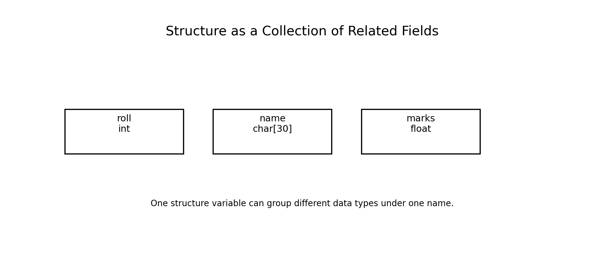
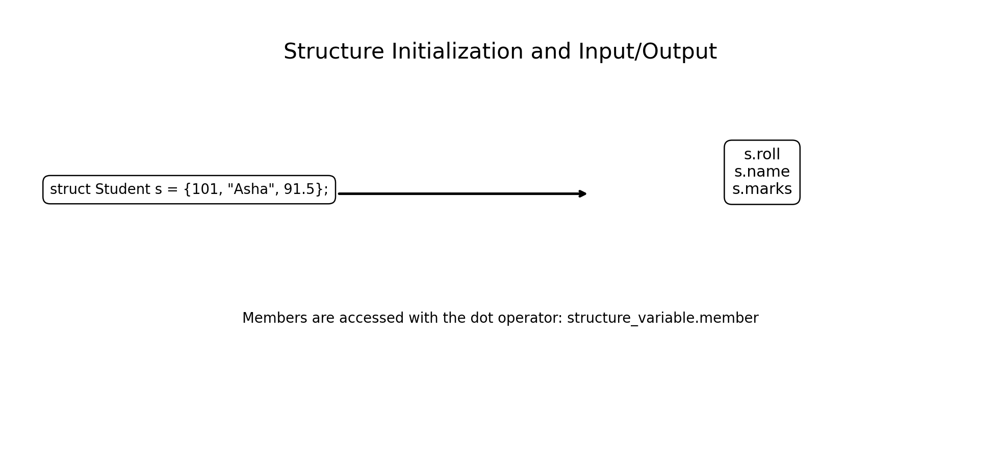
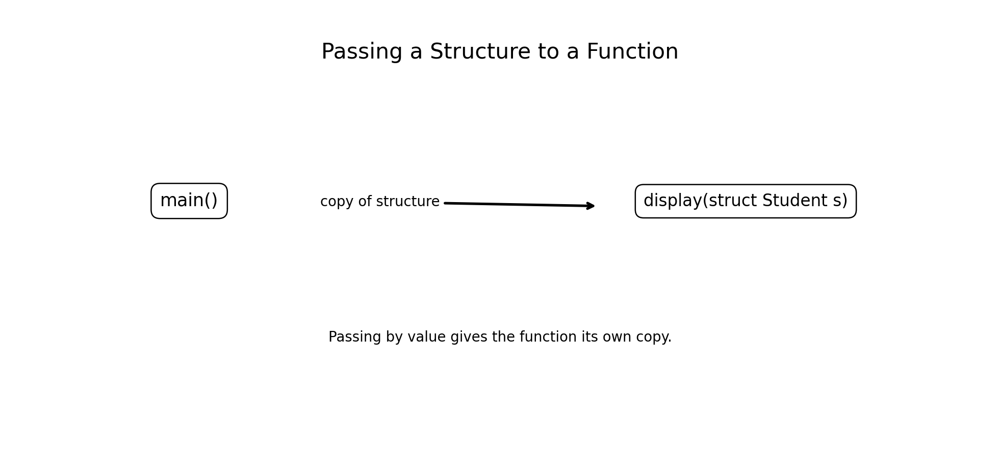
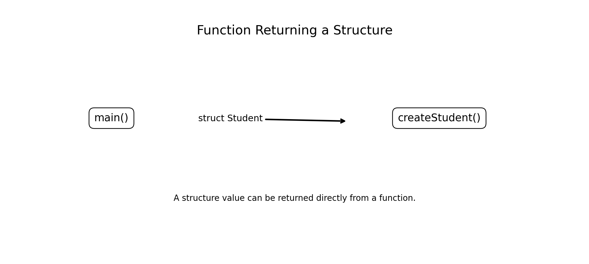
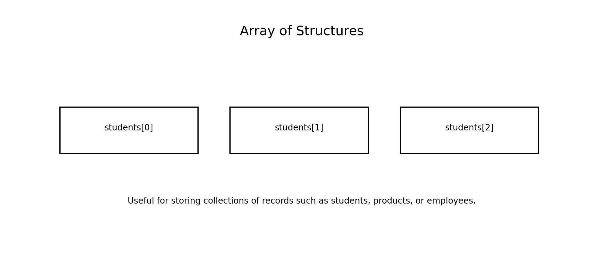

# Structures: Definition and Initialization, Input and Output, Structures as Function Arguments, and Functions Returning Structures

**Course:** Problem Solving Using C  
**Level:** Bachelor of Engineering

---

## Learning Objectives

After completing this chapter, students will be able to:

- Explain the need for structures in C.
- Define and declare a structure.
- Create structure variables.
- Initialize structures in different ways.
- Access individual structure members.
- Read structure data from the keyboard.
- Display structure data.
- Pass structures to functions.
- Understand passing structures by value.
- Modify structures through pointer arguments.
- Write functions that return structures.
- Use arrays of structures.
- Apply structures to simple engineering problems.
- Identify common errors involving structures.

---

# 1. Introduction

Programs often need to represent objects that contain several related pieces of information.

For example, a student record may contain:

```text
Roll Number → int
Name        → char array
Marks       → float
```

Using separate variables:

```c
int roll;
char name[30];
float marks;
```

works for one student, but becomes difficult to manage for many students.

C provides a user-defined data type called a **structure**.

A structure allows different types of data to be grouped together under one name.



---

# 2. What Is a Structure?

A **structure** is a user-defined data type that groups related variables, possibly of different data types, into one logical unit.

Example:

```c
struct Student
{
    int roll;
    char name[30];
    float marks;
};
```

Here:

```text
Student
 ├── roll
 ├── name
 └── marks
```

The three members can have different data types.

---

# 3. Structure Definition

General syntax:

```c
struct structure_name
{
    data_type member1;
    data_type member2;
    data_type member3;
};
```

Example:

```c
struct Student
{
    int roll;
    char name[30];
    float marks;
};
```

Important:

The semicolon after the closing brace is required.

```c
};
```

---

# 4. Declaring Structure Variables

After defining:

```c
struct Student
{
    int roll;
    char name[30];
    float marks;
};
```

we can declare variables:

```c
struct Student s1;
struct Student s2;
```

Multiple variables can also be declared together:

```c
struct Student s1, s2, s3;
```

The structure definition describes the type; the variables are instances of that type.

---

# 5. Accessing Structure Members

The **dot operator (`.`)** is used to access members.

Example:

```c
s1.roll = 101;
s1.marks = 85.5;
```

For the name:

```c
strcpy(s1.name, "Rahul");
```

Member access follows:

```text
structure_variable.member
```

Examples:

```c
s1.roll
s1.name
s1.marks
```

---

# 6. Structure Initialization

A structure can be initialized when it is declared.

```c
struct Student s1 =
{
    101,
    "Asha",
    91.5
};
```

The values are assigned in member order.



---

# 7. Designated Initialization

C also supports designated initializers.

```c
struct Student s1 =
{
    .roll = 101,
    .name = "Asha",
    .marks = 91.5
};
```

This makes the relationship between values and members clearer.

It is especially useful when structures have many members.

---

# 8. Partial Initialization

A structure does not have to initialize every member explicitly.

Example:

```c
struct Student s1 =
{
    .roll = 101
};
```

Members not explicitly initialized receive zero initialization.

Conceptually:

```text
roll  → 101
name  → ""
marks → 0.0
```

For character arrays, the remaining elements are initialized to zero.

---

# 9. Example — Structure Initialization

```c
#include <stdio.h>

struct Student
{
    int roll;
    char name[30];
    float marks;
};

int main(void)
{
    struct Student s =
    {
        101,
        "Asha",
        91.5
    };

    printf("Roll  : %d\n", s.roll);
    printf("Name  : %s\n", s.name);
    printf("Marks : %.2f\n", s.marks);

    return 0;
}
```

Output:

```text
Roll  : 101
Name  : Asha
Marks : 91.50
```

---

# 10. Structure Input

Structure members can be read individually.

For example:

```c
scanf("%d", &s.roll);
```

For a string:

```c
scanf("%29s", s.name);
```

Notice that an ampersand is normally used for scalar members:

```c
&s.roll
```

but not for the character array name:

```c
s.name
```

because the array expression already provides an address suitable for `scanf()`.

For input containing spaces, `fgets()` is generally preferable.

---

# 11. Example — Input and Output

```c
#include <stdio.h>

struct Student
{
    int roll;
    char name[30];
    float marks;
};

int main(void)
{
    struct Student s;

    printf("Enter roll number: ");
    scanf("%d", &s.roll);

    printf("Enter name: ");
    scanf("%29s", s.name);

    printf("Enter marks: ");
    scanf("%f", &s.marks);

    printf("\nStudent Details\n");
    printf("Roll  : %d\n", s.roll);
    printf("Name  : %s\n", s.name);
    printf("Marks : %.2f\n", s.marks);

    return 0;
}
```

Sample output:

```text
Enter roll number: 101
Enter name: Asha
Enter marks: 91.5

Student Details
Roll  : 101
Name  : Asha
Marks : 91.50
```

---

# 12. Reading a Name with Spaces

Suppose the user enters:

```text
Mohammed Javed
```

Using:

```c
scanf("%s", s.name);
```

only reads the first word.

A safer approach for a complete line is:

```c
fgets(s.name, sizeof s.name, stdin);
```

If necessary, the trailing newline can be removed.

Example:

```c
s.name[strcspn(s.name, "\n")] = '\0';
```

This requires:

```c
#include <string.h>
```

---

# 13. Structure Assignment

Structures of the same type can be assigned directly.

Example:

```c
struct Student s1 =
{
    101,
    "Asha",
    91.5
};

struct Student s2;

s2 = s1;
```

After the assignment, `s2` contains copies of the corresponding members.

For arrays inside the structure, structure assignment also copies the array contents as part of the structure value.

---

# 14. Comparing Structures

C does not provide a general relational operator for comparing entire structures.

This is not valid:

```c
if (s1 == s2)
```

Instead, compare relevant members:

```c
if (s1.roll == s2.roll &&
    strcmp(s1.name, s2.name) == 0 &&
    s1.marks == s2.marks)
{
    printf("Same");
}
```

For floating-point values, direct equality may not be appropriate in many numerical applications.

---

# 15. Structures as Function Arguments

A structure can be passed to a function.

Example:

```c
void display(struct Student s)
{
    printf("%d %s %.2f\n",
           s.roll, s.name, s.marks);
}
```

Calling:

```c
display(s1);
```

passes the structure to the function.



---

# 16. Passing a Structure by Value

When a structure is passed normally:

```c
display(s);
```

the function receives a copy of the structure.

Example:

```c
#include <stdio.h>

struct Point
{
    int x;
    int y;
};

void display(struct Point p)
{
    printf("x = %d, y = %d\n", p.x, p.y);
}

int main(void)
{
    struct Point p = {10, 20};

    display(p);

    return 0;
}
```

Output:

```text
x = 10, y = 20
```

---

# 17. Modifying a Structure Through a Function

If a structure is passed by value:

```c
void change(struct Student s)
{
    s.marks = 100;
}
```

the original structure is not changed.

To modify the original structure, pass its address.

```c
void change(struct Student *s)
{
    s->marks = 100;
}
```

The arrow operator `->` is used when accessing a structure member through a pointer.

---

# 18. Dot Operator vs Arrow Operator

For an ordinary structure variable:

```c
s.marks
```

For a pointer to a structure:

```c
p->marks
```

where:

```c
struct Student *p;
```

The following are equivalent:

```c
p->marks
```

and:

```c
(*p).marks
```

The arrow operator is simply a convenient notation.

---

# 19. Example — Modify Structure Through Pointer

```c
#include <stdio.h>

struct Student
{
    int roll;
    char name[30];
    float marks;
};

void update_marks(struct Student *s)
{
    s->marks += 5.0f;
}

int main(void)
{
    struct Student s =
    {
        101,
        "Asha",
        80.0f
    };

    printf("Before = %.2f\n", s.marks);

    update_marks(&s);

    printf("After  = %.2f\n", s.marks);

    return 0;
}
```

Output:

```text
Before = 80.00
After  = 85.00
```

---

# 20. Passing Large Structures

Passing a large structure by value can involve copying many bytes.

For large structures, it is often more efficient to pass a pointer:

```c
void process(const struct Student *s)
{
    printf("%d\n", s->roll);
}
```

Using `const` indicates that the function only needs to read the structure.

This is a common engineering programming practice.

---

# 21. Functions Returning Structures

A function can return a structure just as it can return an `int`, `float`, or other value.

Example:

```c
struct Point create_point(int x, int y)
{
    struct Point p = {x, y};
    return p;
}
```

The function returns a complete structure value.



---

# 22. Example — Function Returning a Structure

```c
#include <stdio.h>

struct Point
{
    int x;
    int y;
};

struct Point create_point(int x, int y)
{
    struct Point p = {x, y};
    return p;
}

int main(void)
{
    struct Point p;

    p = create_point(10, 20);

    printf("x = %d\n", p.x);
    printf("y = %d\n", p.y);

    return 0;
}
```

Output:

```text
x = 10
y = 20
```

---

# 23. Returning a Computed Structure

Structures can be used to return multiple related results from a function.

Example:

```c
struct Result
{
    int sum;
    int product;
};
```

Function:

```c
struct Result calculate(int a, int b)
{
    struct Result r;

    r.sum = a + b;
    r.product = a * b;

    return r;
}
```

This provides a convenient way of returning multiple values.

---

# 24. Complete Example — Multiple Results

```c
#include <stdio.h>

struct Result
{
    int sum;
    int product;
};

struct Result calculate(int a, int b)
{
    struct Result r;

    r.sum = a + b;
    r.product = a * b;

    return r;
}

int main(void)
{
    struct Result r;

    r = calculate(6, 4);

    printf("Sum     = %d\n", r.sum);
    printf("Product = %d\n", r.product);

    return 0;
}
```

Output:

```text
Sum     = 10
Product = 24
```

---

# 25. Returning Structures vs Returning Pointers

Both approaches are useful.

### Return a structure

```c
struct Point make_point(int x, int y);
```

Advantages:

- Simple ownership
- No dangling-pointer problem from local variables
- Natural for small result objects

### Return a pointer

```c
struct Point *find_point(...);
```

Advantages:

- Can identify an existing object
- Avoids copying a large object
- Useful when the caller needs to modify an existing object

The appropriate choice depends on the problem.

---

# 26. Arrays of Structures

An array can contain multiple structure variables.

Example:

```c
struct Student students[3];
```

Conceptually:

```text
students
   |
   +-- students[0]
   +-- students[1]
   +-- students[2]
```



This is useful for storing records.

---

# 27. Example — Array of Structures

```c
#include <stdio.h>

struct Student
{
    int roll;
    char name[30];
    float marks;
};

int main(void)
{
    struct Student students[3] =
    {
        {101, "Asha", 91.5f},
        {102, "Ravi", 84.0f},
        {103, "Neha", 88.5f}
    };

    for (int i = 0; i < 3; i++)
    {
        printf("%d  %-10s %.2f\n",
               students[i].roll,
               students[i].name,
               students[i].marks);
    }

    return 0;
}
```

Output:

```text
101  Asha       91.50
102  Ravi       84.00
103  Neha       88.50
```

---

# 28. Passing an Array of Structures to a Function

Example:

```c
void display_all(const struct Student students[], int n)
{
    for (int i = 0; i < n; i++)
    {
        printf("%d %s %.2f\n",
               students[i].roll,
               students[i].name,
               students[i].marks);
    }
}
```

Call:

```c
display_all(students, 3);
```

The array is passed in a pointer-like manner, so the size should normally be provided separately.

---

# 29. Function Returning a Student Structure

```c
#include <stdio.h>

struct Student
{
    int roll;
    char name[30];
    float marks;
};

struct Student create_student(int roll,
                              const char name[],
                              float marks)
{
    struct Student s;

    s.roll = roll;
    snprintf(s.name, sizeof s.name, "%s", name);
    s.marks = marks;

    return s;
}

int main(void)
{
    struct Student s;

    s = create_student(101, "Asha", 92.5f);

    printf("Roll  : %d\n", s.roll);
    printf("Name  : %s\n", s.name);
    printf("Marks : %.2f\n", s.marks);

    return 0;
}
```

Output:

```text
Roll  : 101
Name  : Asha
Marks : 92.50
```

---

# 30. Nested Structures

A structure can contain another structure.

Example:

```c
struct Date
{
    int day;
    int month;
    int year;
};

struct Student
{
    int roll;
    char name[30];
    struct Date dob;
};
```

Access:

```c
s.dob.day
s.dob.month
s.dob.year
```

Nested structures are useful for modeling complex real-world entities.

---

# 31. Example — Engineering Record

```c
struct Sensor
{
    int id;
    float temperature;
    float pressure;
};
```

A sensor record groups all properties associated with one sensor.

Example:

```c
struct Sensor s =
{
    10,
    27.5f,
    101.3f
};
```

This approach is useful in embedded and industrial applications.

---

# 32. Structures and Problem Solving

Structures help map real-world entities to program objects.

For example:

```text
Real-world student
       ↓
struct Student
       ↓
roll
name
marks
       ↓
C program
```

Similarly:

```text
Engineering component
       ↓
struct Component
       ↓
id
name
weight
cost
       ↓
program
```

Structures therefore support **data modeling**.

---

# 33. Common Errors

### Error 1 — Missing semicolon

Incorrect:

```c
struct Student
{
    int roll;
}
```

Correct:

```c
struct Student
{
    int roll;
};
```

### Error 2 — Wrong member access

Incorrect:

```c
s->roll;
```

when `s` is an ordinary structure variable.

Correct:

```c
s.roll;
```

### Error 3 — Wrong input address

For:

```c
int roll;
```

use:

```c
scanf("%d", &roll);
```

### Error 4 — Forgetting the string limit

Prefer:

```c
scanf("%29s", s.name);
```

for a `char name[30]` member.

---

# 34. More Common Errors

### Error 5 — Using `->` with a structure object

```c
struct Student s;
s->roll;       // wrong
```

Correct:

```c
s.roll;
```

### Error 6 — Using `.` with a structure pointer

```c
struct Student *p;
p.roll;        // wrong
```

Correct:

```c
p->roll;
```

### Error 7 — Returning an incompatible type

If the function is:

```c
struct Student create(void)
```

it must return a compatible `struct Student` value.

---

# 35. Structure Memory Considerations

Structure members are stored in memory, but the compiler may insert **padding** between members to satisfy alignment requirements.

For example:

```c
struct Example
{
    char c;
    int x;
};
```

The structure may occupy more bytes than simply:

```text
1 + 4 = 5 bytes
```

because of alignment and padding.

The exact size can be checked using:

```c
sizeof(struct Example)
```

---

# 36. Example — `sizeof`

```c
#include <stdio.h>

struct Student
{
    int roll;
    char name[30];
    float marks;
};

int main(void)
{
    printf("Size = %zu bytes\n",
           sizeof(struct Student));

    return 0;
}
```

The exact size is implementation-dependent because of data type sizes and possible padding.

---

# 37. Engineering Applications

Structures are widely used in:

### Embedded Systems

```c
struct Sensor
{
    int id;
    float temperature;
};
```

### Networking

Packet and protocol records can be modeled using structures.

### File Processing

Records in files can be represented by structures.

### Database-like Applications

Student, employee, product, and customer records can be represented using structures.

### Computer Graphics

Points, colors, rectangles, and transformations can be represented as structures.

### Scientific Computing

Measurements and experiment records can be grouped into structures.

---

# 38. Problem-Solving Pattern

For a real-world record:

```text
Identify the entity
       ↓
Identify its attributes
       ↓
Choose data types
       ↓
Define structure
       ↓
Create structure variable
       ↓
Initialize / input data
       ↓
Process members
       ↓
Display / return results
```

Example:

```text
Student
  ↓
roll → int
name → char[]
marks → float
  ↓
struct Student
```

---

# 39. Mini Project — Student Record System

Create a program that stores:

```text
Roll number
Name
Marks in three subjects
```

Define:

```c
struct Student
{
    int roll;
    char name[50];
    float marks[3];
};
```

Implement functions:

```c
void input_student(struct Student *s);
void display_student(const struct Student *s);
float average(const struct Student *s);
struct Student create_student(...);
```

Possible features:

- Add student
- Display students
- Calculate average
- Find highest scorer
- Search by roll number
- Display pass/fail status

This project combines:

- Structures
- Arrays
- Functions
- Pointers
- Strings
- Input/output

---

# 40. Practice Programs

## Exercise 1 — Employee Record

Create:

```c
struct Employee
{
    int id;
    char name[50];
    float salary;
};
```

Input and display employee details.

## Exercise 2 — Rectangle

Create:

```c
struct Rectangle
{
    float length;
    float width;
};
```

Write a function returning the area.

## Exercise 3 — Point

Create:

```c
struct Point
{
    float x;
    float y;
};
```

Write a function that returns the distance-related result or another useful computed structure.

## Exercise 4 — Student Average

Create a student structure containing three subject marks and write a function to calculate the average.

## Exercise 5 — Structure Function Argument

Write a function that receives an employee structure and prints the employee's details.

## Exercise 6 — Modify Structure

Write a function that receives a pointer to an employee and increases the salary by 10%.

## Exercise 7 — Returning Structure

Create a function that accepts length and width and returns a `struct Rectangle`.

## Exercise 8 — Array of Structures

Store information for 10 students and display the student with the highest marks.

## Exercise 9 — Nested Structure

Create a student structure containing a nested date-of-birth structure.

## Exercise 10 — Engineering Component

Create a structure containing:

```text
component ID
component name
weight
cost
```

Write functions to input, display, and calculate total cost.

---

# 41. Viva Questions

1. What is a structure in C?
2. Why are structures useful?
3. How is a structure defined?
4. Why is a semicolon required after a structure definition?
5. How is a structure variable declared?
6. What operator accesses a structure member?
7. What is the difference between `.` and `->`?
8. How can a structure be initialized?
9. What is designated initialization?
10. Can one structure be assigned to another structure of the same type?
11. How can structure members be read using `scanf()`?
12. How can a structure be passed to a function?
13. What happens when a structure is passed by value?
14. How can a function modify the original structure?
15. What is a structure pointer?
16. Can a function return a structure?
17. Why might a function return a structure?
18. What is an array of structures?
19. What is a nested structure?
20. What is structure padding?
21. What does `sizeof` return?
22. Give two engineering applications of structures.

---

# 42. Quick Reference

## Define a structure

```c
struct Student
{
    int roll;
    char name[30];
    float marks;
};
```

## Declare

```c
struct Student s;
```

## Initialize

```c
struct Student s =
{
    101,
    "Asha",
    91.5f
};
```

## Access member

```c
s.roll
s.name
s.marks
```

## Pointer to structure

```c
struct Student *p = &s;
```

## Access through pointer

```c
p->roll
```

## Pass by value

```c
void display(struct Student s);
```

## Pass address

```c
void update(struct Student *s);
```

## Return structure

```c
struct Student create_student(void);
```

## Array of structures

```c
struct Student students[10];
```

---

# 43. Key Takeaways

- A structure groups related variables, including variables of different types.
- A structure definition creates a user-defined type.
- Structure variables are declared using the `struct` keyword unless a `typedef` is used.
- The dot operator accesses members of an ordinary structure variable.
- The arrow operator accesses members through a structure pointer.
- Structures can be initialized at declaration time.
- Structure members can be read and displayed individually.
- Structures can be passed to functions by value.
- Passing a pointer to a structure allows a function to modify the original structure.
- A function can return a complete structure value.
- Returning a structure is useful for producing multiple related results.
- Arrays of structures are useful for collections of records.
- Nested structures model more complex objects.
- `sizeof` can be used to determine the size of a structure type or object.
- Structure padding means the exact memory size can depend on the implementation.
- Structures are fundamental to practical C programming and engineering applications.

---

# 44. Final Concept Map

```text
                         STRUCTURES
                              |
          +-------------------+-------------------+
          |                   |                   |
      Definition          Input / Output      Functions
          |                   |                   |
   struct Student       scanf / printf       +-----+------+
          |                                  |            |
       Members                           Arguments     Return
          |                                  |            |
     +----+----+                         value       structure
     |    |    |                            |            |
    int  char float                    pointer       struct value
     |    |    |                            |
     +----+----+                       modify data
          |
     Array of structures
          |
   Multiple records
```

---

# 45. Summary

Structures provide a powerful mechanism for organizing related information in C.

A well-designed structure:

```c
struct Student
{
    int roll;
    char name[30];
    float marks;
};
```

can be used throughout a program:

```text
Define
  ↓
Initialize
  ↓
Input
  ↓
Process
  ↓
Pass to functions
  ↓
Return from functions
  ↓
Store in arrays
  ↓
Display results
```

Mastering structures is an important step toward advanced C programming topics such as **pointers to structures, dynamic memory allocation, linked lists, stacks, queues, file handling, and larger software systems**.
