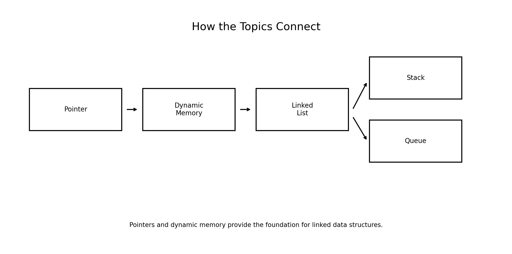
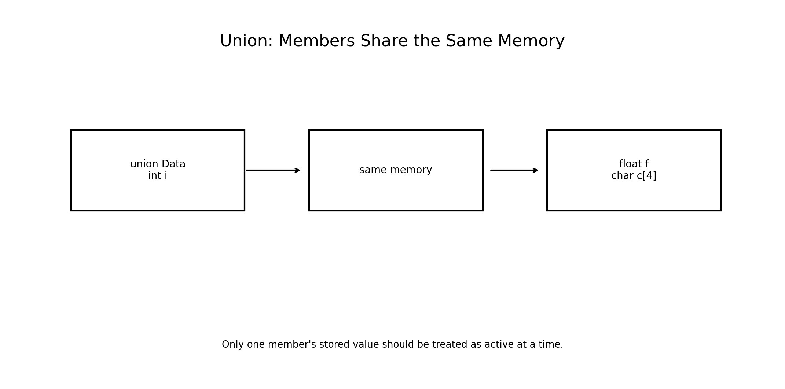
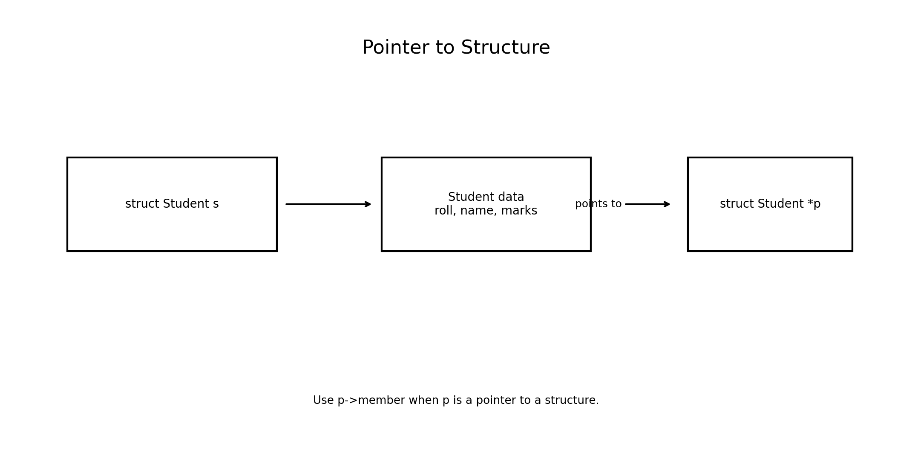
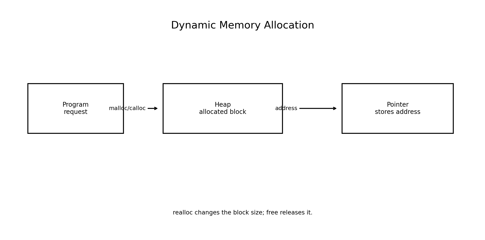
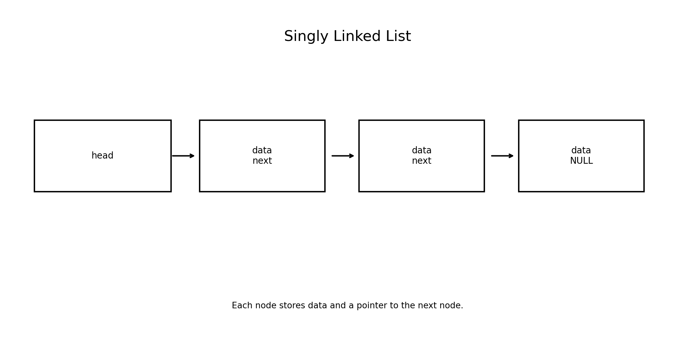
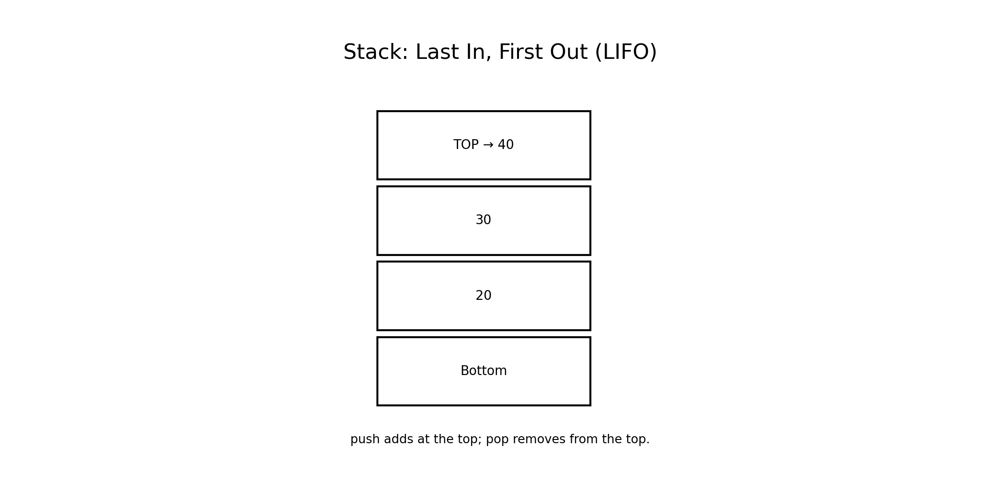
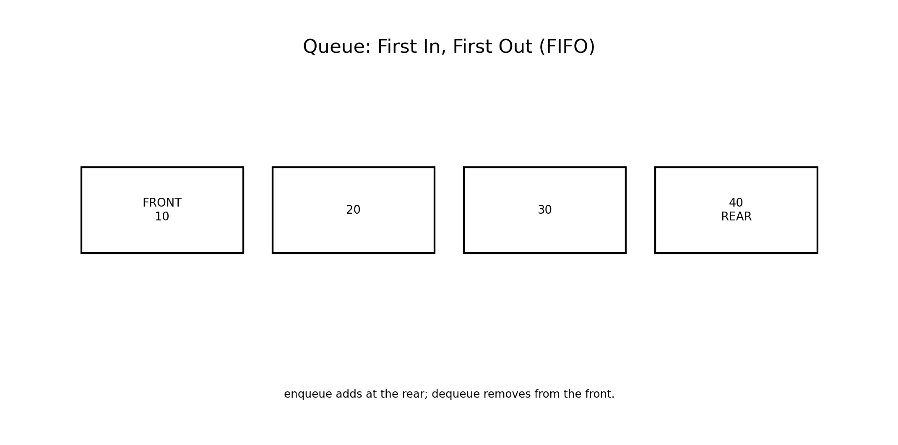

# :classical_building: Problem Solving Using Programming - B.Tech-IT, IIIT Allahabad
## Unit 5: Pointers and Structures
* ### Current Topic: Unions, Pointer to Structure, Dynamic Memory Allocation, Linked List, Stack and Queue
* **Purpose:** Introduce Pointers and Structures
---

---
## 👥 Instructor Information
* **Edited by Instructor:** [Dr. Mohammed Javed](https://sites.google.com/site/mohammedjaved2016/)
* **Email:** javed@iiita.ac.in
* **Senior Teaching Assistants:** Mr. Subrata Pramanik (pmm2024003@iiita.ac.in)
---
## 🎯 Learning Objectives

After completing this chapter, students will be able to:

- Explain the purpose and behavior of a `union`.
- Distinguish a `union` from a `struct`.
- Use pointers to structures.
- Understand the `.` and `->` operators.
- Explain stack and heap memory at an introductory level.
- Dynamically allocate memory using `malloc()`.
- Dynamically allocate initialized memory using `calloc()`.
- Resize allocated memory using `realloc()`.
- Release dynamically allocated memory using `free()`.
- Explain memory leaks, dangling pointers and invalid memory access.
- Build a singly linked list.
- Insert, traverse and delete linked-list nodes.
- Explain the LIFO principle of stacks.
- Implement a stack using an array and a linked list.
- Explain the FIFO principle of queues.
- Implement a queue using an array and a linked list.
- Select appropriate data structures for engineering problems.

---

# 1. Introduction

C provides several mechanisms for organizing and managing data.

Structures allow different data types to be grouped into one record. Unions allow different members to share the same memory. Pointers allow programs to work directly with memory addresses. Dynamic memory allocation allows memory to be obtained while the program is running.

These features form the foundation of important data structures such as:

```text
Pointers
   ↓
Dynamic Memory
   ↓
Linked Lists
   ↓
Stacks and Queues
```



---

# 2. Unions

A **union** is a user-defined data type in which all members share the same memory location.

Syntax:

```c
union Data
{
    int i;
    float f;
    char c;
};
```

Declare a variable:

```c
union Data d;
```

A union can contain different members, but only one member's value should normally be considered active at a time.

---

# 3. Union Memory Model

Consider:

```c
union Data
{
    int i;
    float f;
    char c;
};
```

All members begin at the same memory address.



The size of a union is generally sufficient to hold its largest member, subject to alignment and implementation details.

---

# 4. Example — Union

```c
#include <stdio.h>

union Data
{
    int i;
    float f;
    char c;
};

int main(void)
{
    union Data d;

    d.i = 25;
    printf("Integer: %d\n", d.i);

    d.f = 12.5f;
    printf("Float: %.2f\n", d.f);

    d.c = 'A';
    printf("Character: %c\n", d.c);

    return 0;
}
```

Output:

```text
Integer: 25
Float: 12.50
Character: A
```

Each assignment changes the shared storage.

---

# 5. Structure vs Union

| Feature | Structure | Union |
|---|---|---|
| Memory | Separate storage for members | Shared storage |
| Members usable simultaneously | Yes | Normally one active value |
| Typical size | Combination of members plus padding | Large enough for largest member plus alignment |
| Main purpose | Group related values | Store one of several possible representations |
| Example | Student record | Sensor value of different types |

Structure:

```c
struct Student
{
    int roll;
    float marks;
};
```

Union:

```c
union Value
{
    int i;
    float f;
};
```

---

# 6. Practical Use of Unions

Unions can be useful when a value may have different representations.

Examples include:

- Embedded systems
- Protocol data
- Hardware registers
- Memory-constrained applications
- Tagged data variants

A union is especially useful when the program knows which member is currently valid.

A common safe pattern is to store a **tag** alongside the union.

```c
enum ValueType
{
    TYPE_INT,
    TYPE_FLOAT
};

union Value
{
    int i;
    float f;
};

struct TaggedValue
{
    enum ValueType type;
    union Value value;
};
```

The tag tells the program which union member should be interpreted.

---

# 7. Pointer to Structure

A pointer can store the address of a structure variable.

Example:

```c
struct Student
{
    int roll;
    char name[30];
    float marks;
};

struct Student s = {101, "Asha", 91.5f};

struct Student *p = &s;
```

Here:

```text
p → s
```

The pointer `p` stores the address of `s`.



---

# 8. Accessing Structure Members Through a Pointer

There are two equivalent ways to access a member through a pointer.

Using dereferencing:

```c
(*p).roll
```

Using the arrow operator:

```c
p->roll
```

The second form is clearer and more commonly used.

```c
printf("%d\n", p->roll);
printf("%s\n", p->name);
printf("%.2f\n", p->marks);
```

---

# 9. Example — Pointer to Structure

```c
#include <stdio.h>

struct Student
{
    int roll;
    char name[30];
    float marks;
};

int main(void)
{
    struct Student s = {101, "Asha", 91.5f};
    struct Student *p = &s;

    printf("Roll: %d\n", p->roll);
    printf("Name: %s\n", p->name);
    printf("Marks: %.2f\n", p->marks);

    return 0;
}
```

Output:

```text
Roll: 101
Name: Asha
Marks: 91.50
```

---

# 10. Modifying a Structure Through a Pointer

A pointer to a structure can also modify the original object.

```c
p->marks = 95.0f;
```

Complete example:

```c
#include <stdio.h>

struct Student
{
    int roll;
    char name[30];
    float marks;
};

int main(void)
{
    struct Student s = {101, "Asha", 91.5f};
    struct Student *p = &s;

    p->marks = 95.0f;

    printf("Updated marks: %.2f\n", s.marks);

    return 0;
}
```

Output:

```text
Updated marks: 95.00
```

---

# 11. Pointers to Structures as Function Arguments

Instead of passing an entire structure by value, a pointer can be passed.

```c
void update_marks(struct Student *s)
{
    s->marks += 5.0f;
}
```

Call:

```c
update_marks(&student);
```

This allows the function to modify the original structure.

---

# 12. Example — Structure Pointer Function

```c
#include <stdio.h>

struct Student
{
    int roll;
    char name[30];
    float marks;
};

void add_bonus(struct Student *s)
{
    s->marks += 5.0f;
}

int main(void)
{
    struct Student s = {101, "Asha", 80.0f};

    add_bonus(&s);

    printf("%s %.2f\n", s.name, s.marks);

    return 0;
}
```

Output:

```text
Asha 85.00
```

---

# 13. Dynamic Memory Allocation

Normally, variables are declared with a fixed size.

Example:

```c
int numbers[100];
```

But sometimes the required amount of memory is not known until runtime.

C provides dynamic memory allocation functions:

```text
malloc()
calloc()
realloc()
free()
```

These functions are declared in:

```c
#include <stdlib.h>
```

Dynamic memory is generally obtained from the **heap**.



---

# 14. `malloc()`

`malloc()` allocates a specified number of bytes.

Syntax:

```c
ptr = malloc(number_of_bytes);
```

A common pattern is:

```c
int *p = malloc(n * sizeof *p);
```

Always check whether allocation succeeded.

```c
if (p == NULL)
{
    printf("Memory allocation failed\n");
    return 1;
}
```

---

# 15. Example — `malloc()`

```c
#include <stdio.h>
#include <stdlib.h>

int main(void)
{
    int n = 5;

    int *p = malloc(n * sizeof *p);

    if (p == NULL)
    {
        printf("Memory allocation failed\n");
        return 1;
    }

    for (int i = 0; i < n; i++)
    {
        p[i] = (i + 1) * 10;
    }

    for (int i = 0; i < n; i++)
    {
        printf("%d ", p[i]);
    }

    printf("\n");

    free(p);

    return 0;
}
```

Output:

```text
10 20 30 40 50
```

---

# 16. `calloc()`

`calloc()` allocates memory for multiple elements and initializes the allocated bytes to zero.

Syntax:

```c
ptr = calloc(number_of_elements, size_of_each_element);
```

Example:

```c
int *p = calloc(5, sizeof *p);
```

This allocates space for five integers.

---

# 17. Example — `calloc()`

```c
#include <stdio.h>
#include <stdlib.h>

int main(void)
{
    int n = 5;

    int *p = calloc(n, sizeof *p);

    if (p == NULL)
    {
        printf("Allocation failed\n");
        return 1;
    }

    for (int i = 0; i < n; i++)
    {
        printf("%d ", p[i]);
    }

    printf("\n");

    free(p);

    return 0;
}
```

Typical output:

```text
0 0 0 0 0
```

`calloc()` initializes the allocated bytes to zero. For ordinary integer arrays this results in zero-valued integers.

---

# 18. `malloc()` vs `calloc()`

| Feature | `malloc()` | `calloc()` |
|---|---|---|
| Arguments | Number of bytes | Number of elements + size |
| Initial contents | Indeterminate | All allocated bytes initialized to zero |
| Syntax | `malloc(bytes)` | `calloc(n, size)` |
| Common use | Raw dynamic allocation | Array allocation with zero initialization |

Examples:

```c
malloc(n * sizeof *p);
```

```c
calloc(n, sizeof *p);
```

---

# 19. `realloc()`

`realloc()` changes the size of an existing dynamically allocated block.

Syntax:

```c
ptr = realloc(ptr, new_size);
```

A safer pattern is:

```c
int *temp = realloc(p, new_count * sizeof *p);

if (temp != NULL)
{
    p = temp;
}
```

Using a temporary pointer prevents losing the original allocation if `realloc()` fails.

---

# 20. Example — `realloc()`

```c
#include <stdio.h>
#include <stdlib.h>

int main(void)
{
    int *p = malloc(3 * sizeof *p);

    if (p == NULL)
        return 1;

    for (int i = 0; i < 3; i++)
        p[i] = (i + 1) * 10;

    int *temp = realloc(p, 5 * sizeof *p);

    if (temp == NULL)
    {
        free(p);
        return 1;
    }

    p = temp;

    p[3] = 40;
    p[4] = 50;

    for (int i = 0; i < 5; i++)
        printf("%d ", p[i]);

    printf("\n");

    free(p);

    return 0;
}
```

Output:

```text
10 20 30 40 50
```

---

# 21. `free()`

Memory allocated dynamically should be released when it is no longer required.

```c
free(p);
```

After freeing:

```c
p = NULL;
```

can be useful when the pointer remains in scope.

Example:

```c
free(p);
p = NULL;
```

---

# 22. Why Is `free()` Important?

If dynamically allocated memory is not released, a program can create a **memory leak**.

Example:

```c
int *p = malloc(100 * sizeof *p);

/* use p */

free(p);
```

Forgetting:

```c
free(p);
```

can cause memory to remain allocated unnecessarily.

Long-running programs can suffer serious performance and reliability problems from memory leaks.

---

# 23. Common Dynamic Memory Errors

### 1. Memory leak

```c
p = malloc(100);
p = malloc(200);
```

The first block is lost without being freed.

### 2. Use after free

```c
free(p);
printf("%d", p[0]);
```

Invalid.

### 3. Double free

```c
free(p);
free(p);
```

Invalid.

### 4. Dereferencing `NULL`

```c
int *p = malloc(...);

if (p == NULL)
    ...
```

Always check allocation before using the pointer.

---

# 24. Dynamic Allocation of Structures

Structures can also be dynamically allocated.

```c
struct Student
{
    int roll;
    char name[30];
    float marks;
};

struct Student *p =
    malloc(sizeof *p);
```

Access:

```c
p->roll
p->name
p->marks
```

Release:

```c
free(p);
```

---

# 25. Example — Dynamic Structure

```c
#include <stdio.h>
#include <stdlib.h>

struct Student
{
    int roll;
    char name[30];
    float marks;
};

int main(void)
{
    struct Student *p = malloc(sizeof *p);

    if (p == NULL)
        return 1;

    p->roll = 101;
    p->marks = 91.5f;

    snprintf(p->name, sizeof p->name, "Asha");

    printf("%d %s %.2f\n",
           p->roll, p->name, p->marks);

    free(p);

    return 0;
}
```

Output:

```text
101 Asha 91.50
```

---

# 26. Linked List

An array stores elements in contiguous memory.

A linked list stores elements in separate nodes connected using pointers.

A singly linked-list node can be defined as:

```c
struct Node
{
    int data;
    struct Node *next;
};
```



Each node contains:

```text
data
next pointer
```

The final node points to:

```c
NULL
```

---

# 27. Creating a Linked-List Node

Dynamic allocation is commonly used:

```c
struct Node *new_node =
    malloc(sizeof *new_node);
```

Initialize:

```c
new_node->data = 10;
new_node->next = NULL;
```

---

# 28. Creating a Simple Linked List

```c
#include <stdio.h>
#include <stdlib.h>

struct Node
{
    int data;
    struct Node *next;
};

int main(void)
{
    struct Node *first =
        malloc(sizeof *first);

    struct Node *second =
        malloc(sizeof *second);

    if (first == NULL || second == NULL)
    {
        free(first);
        free(second);
        return 1;
    }

    first->data = 10;
    first->next = second;

    second->data = 20;
    second->next = NULL;

    printf("%d %d\n",
           first->data,
           first->next->data);

    free(second);
    free(first);

    return 0;
}
```

Output:

```text
10 20
```

---

# 29. Traversing a Linked List

Traversal means visiting each node.

```c
struct Node *current = head;

while (current != NULL)
{
    printf("%d ", current->data);
    current = current->next;
}
```

The pointer moves from one node to the next.

---

# 30. Function to Display a Linked List

```c
void display(const struct Node *head)
{
    const struct Node *current = head;

    while (current != NULL)
    {
        printf("%d ", current->data);
        current = current->next;
    }

    printf("\n");
}
```

The `const` qualifier prevents the function from modifying the nodes.

---

# 31. Inserting at the Beginning

To insert a node at the beginning:

```c
new_node->next = head;
head = new_node;
```

Example function:

```c
void push_front(struct Node **head, int value)
{
    struct Node *new_node =
        malloc(sizeof *new_node);

    if (new_node == NULL)
        return;

    new_node->data = value;
    new_node->next = *head;
    *head = new_node;
}
```

Notice the double pointer:

```c
struct Node **head
```

It is required because the function may change the caller's `head` pointer.

---

# 32. Deleting from the Beginning

```c
void delete_front(struct Node **head)
{
    if (*head == NULL)
        return;

    struct Node *temp = *head;
    *head = (*head)->next;

    free(temp);
}
```

The node is disconnected first and then freed.

---

# 33. Freeing an Entire Linked List

A complete linked list should be released node by node.

```c
void free_list(struct Node *head)
{
    while (head != NULL)
    {
        struct Node *temp = head;
        head = head->next;
        free(temp);
    }
}
```

This is an important memory-management pattern.

---

# 34. Stack

A stack is a linear data structure following:

**LIFO — Last In, First Out**

The most recently inserted item is removed first.



Main operations:

```text
push  → insert
pop   → remove
peek  → inspect top
```

Applications:

- Function-call management
- Undo operations
- Expression evaluation
- Parenthesis matching
- Depth-first search

---

# 35. Stack Using an Array

```c
#define MAX 5

struct Stack
{
    int data[MAX];
    int top;
};
```

Initialize:

```c
struct Stack s = { .top = -1 };
```

Empty condition:

```c
s.top == -1
```

Full condition:

```c
s.top == MAX - 1
```

---

# 36. Push Operation

```c
void push(struct Stack *s, int value)
{
    if (s->top == MAX - 1)
    {
        printf("Stack overflow\n");
        return;
    }

    s->data[++s->top] = value;
}
```

The new item becomes the top element.

---

# 37. Pop Operation

```c
int pop(struct Stack *s)
{
    if (s->top == -1)
    {
        printf("Stack underflow\n");
        return -1;
    }

    return s->data[s->top--];
}
```

In production code, returning `-1` may be ambiguous if `-1` is a valid data value. A better design can use a status return and an output parameter.

---

# 38. Stack Example

```c
#include <stdio.h>

#define MAX 5

struct Stack
{
    int data[MAX];
    int top;
};

void push(struct Stack *s, int value)
{
    if (s->top == MAX - 1)
        return;

    s->data[++s->top] = value;
}

int pop(struct Stack *s)
{
    if (s->top == -1)
        return -1;

    return s->data[s->top--];
}

int main(void)
{
    struct Stack s = { .top = -1 };

    push(&s, 10);
    push(&s, 20);
    push(&s, 30);

    printf("Popped: %d\n", pop(&s));
    printf("Popped: %d\n", pop(&s));

    return 0;
}
```

Output:

```text
Popped: 30
Popped: 20
```

This demonstrates LIFO behavior.

---

# 39. Stack Using a Linked List

A stack can also be implemented using linked nodes.

The top of the stack is represented by a pointer:

```c
struct Node *top = NULL;
```

Push:

```text
new node
   ↓
top
```

Pop removes the node at `top`.

This approach can grow dynamically, limited by available memory.

---

# 40. Queue

A queue is a linear data structure following:

**FIFO — First In, First Out**

The first item inserted is the first item removed.



Main operations:

```text
enqueue → insert at rear
dequeue → remove from front
```

Applications:

- Printer scheduling
- CPU scheduling
- Network packet buffering
- Customer-service systems
- Breadth-first search
- Task processing

---

# 41. Queue Using an Array

A simple queue can use:

```c
#define MAX 5

struct Queue
{
    int data[MAX];
    int front;
    int rear;
};
```

Typical initial state:

```c
struct Queue q =
{
    .front = 0,
    .rear = -1
};
```

For practical reusable queues, a **circular queue** is often preferable because it reuses positions freed by dequeues.

---

# 42. Circular Queue

A circular queue uses modulo arithmetic.

Next position:

```c
(rear + 1) % MAX
```

This allows the rear to wrap around to the beginning of the array.

Conceptually:

```text
0 → 1 → 2 → 3 → 4
↑               ↓
└───────────────┘
```

Circular queues avoid the wasted-space problem of a simple linear array queue.

---

# 43. Queue Using Linked List

A linked queue commonly maintains two pointers:

```c
struct Node *front = NULL;
struct Node *rear = NULL;
```

Enqueue:

```text
rear → new node
```

Dequeue:

```text
front → next node
```

When the last node is removed, both pointers should become `NULL`.

---

# 44. Comparison: Stack and Queue

| Property | Stack | Queue |
|---|---|---|
| Rule | LIFO | FIFO |
| Insert | Push at top | Enqueue at rear |
| Remove | Pop from top | Dequeue from front |
| Main pointers | Top | Front and rear |
| Example | Undo | Printer queue |

---

# 45. Linked List vs Array

| Feature | Array | Linked List |
|---|---|---|
| Memory layout | Contiguous | Nodes may be separate |
| Size | Usually fixed after declaration | Can grow/shrink dynamically |
| Random access | Fast, `O(1)` indexing | Sequential traversal |
| Insertion/deletion | Can require shifting | Can be efficient with correct links |
| Extra memory | Low overhead | Pointer overhead per node |

---

# 46. Choosing the Appropriate Structure

Use an **array** when:

- The number of elements is known.
- Fast indexing is important.
- Contiguous storage is useful.

Use a **linked list** when:

- The number of elements changes dynamically.
- Frequent insertion/deletion is required.
- Random indexing is not the primary requirement.

Use a **stack** when:

- LIFO behavior is required.

Use a **queue** when:

- FIFO behavior is required.

Use a **union** when:

- One storage location can represent one of several possible types or formats.

---

# 47. Important Pointer Concepts

### Address operator

```c
&s
```

gives the address of `s`.

### Dereference operator

```c
*p
```

accesses the object pointed to by `p`.

### Structure member operator

```c
s.roll
```

### Structure pointer member operator

```c
p->roll
```

The expression:

```c
p->roll
```

is equivalent to:

```c
(*p).roll
```

---

# 48. Memory-Safety Rules

When using dynamic memory:

1. Include `<stdlib.h>`.
2. Allocate enough memory.
3. Check the result of allocation.
4. Do not access beyond the allocated block.
5. Do not use memory after `free()`.
6. Do not free the same allocation twice.
7. Release memory when no longer required.
8. Use a temporary pointer when appropriate with `realloc()`.
9. Set pointers to `NULL` when useful after freeing.
10. Keep ownership of allocated memory clear.

---

# 49. Mini Project — Dynamic Student Records

Define:

```c
struct Student
{
    int roll;
    char name[30];
    float marks;
};
```

Ask the user for `n`.

Allocate:

```c
struct Student *students =
    malloc(n * sizeof *students);
```

Implement:

```text
1. Input students
2. Display students
3. Search by roll
4. Find highest marks
5. Add more records using realloc()
6. Free memory
```

This project combines:

```text
Structure
   +
Pointer
   +
malloc()
   +
realloc()
   +
free()
   +
Functions
```

---

# 50. Mini Project — Dynamic Linked List

Create a menu-driven linked-list program:

```text
1. Insert at beginning
2. Insert at end
3. Display
4. Search
5. Delete
6. Count nodes
7. Free list
8. Exit
```

Recommended node:

```c
struct Node
{
    int data;
    struct Node *next;
};
```

Every inserted node should be dynamically allocated.

Every deleted node should eventually be passed to:

```c
free()
```

---

# 51. Mini Project — Stack and Queue

Build a menu-driven application.

### Stack

```text
1. Push
2. Pop
3. Peek
4. Display
```

### Queue

```text
1. Enqueue
2. Dequeue
3. Front
4. Display
```

Implement each once using arrays and once using linked lists.

Compare:

- Memory usage
- Maximum capacity
- Overflow behavior
- Implementation complexity

---

# 52. Common Mistakes

### Mistake 1

```c
int *p;
*p = 10;
```

`p` does not point to valid allocated storage.

Correct:

```c
int *p = malloc(sizeof *p);

if (p != NULL)
    *p = 10;
```

---

### Mistake 2

```c
free(p);
*p = 10;
```

This is a use-after-free error.

---

### Mistake 3

```c
int *temp = realloc(p, new_size);

if (temp == NULL)
{
    /* p is still valid */
}
```

Do not immediately overwrite `p` if failure handling matters:

```c
p = realloc(p, new_size);
```

can lose the original pointer when allocation fails.

---

### Mistake 4

Incorrect:

```c
p.roll
```

when `p` is a pointer.

Correct:

```c
p->roll
```

---

# 53. Complexity Overview

For a typical singly linked list:

| Operation | Typical Complexity |
|---|---:|
| Insert at beginning | `O(1)` |
| Delete at beginning | `O(1)` |
| Search | `O(n)` |
| Traverse | `O(n)` |
| Access by position | `O(n)` |

For an array:

| Operation | Typical Complexity |
|---|---:|
| Index access | `O(1)` |
| Search unsorted array | `O(n)` |
| Insert in middle | `O(n)` |
| Delete in middle | `O(n)` |

For a stack:

| Operation | Typical Complexity |
|---|---:|
| Push | `O(1)` |
| Pop | `O(1)` |
| Peek | `O(1)` |

For a well-designed queue:

| Operation | Typical Complexity |
|---|---:|
| Enqueue | `O(1)` |
| Dequeue | `O(1)` |
| Front | `O(1)` |

---

# 54. Engineering Applications

These concepts appear throughout engineering software.

### Unions

- Embedded devices
- Hardware interfaces
- Protocol representations

### Pointers to structures

- Device drivers
- Data structures
- Function-based record processing

### Dynamic memory

- Variable-size datasets
- Simulation
- Image and signal processing
- Runtime data structures

### Linked lists

- Dynamic collections
- Scheduling systems
- Graph representations

### Stacks

- Compiler parsing
- Function calls
- Undo/redo
- Expression evaluation

### Queues

- Networking
- Operating systems
- Scheduling
- Buffer management

---

# 55. Concept Map

```text
                    C MEMORY & DATA STRUCTURES
                              |
          +-------------------+-------------------+
          |                   |                   |
        Union             Pointers          Dynamic Memory
          |                   |                   |
     Shared memory      struct pointer       malloc()
                            |                 calloc()
                         -> member            realloc()
                                              free()
                                                  |
                                                  ↓
                                            Linked List
                                                  |
                              +-------------------+----------------+
                              |                                    |
                            Stack                                Queue
                            LIFO                                 FIFO
                         push/pop                             enqueue/dequeue
```


---

# 56. Practice Exercises

1. Write a program demonstrating the difference between a structure and a union.
2. Write a program using a pointer to a structure.
3. Write a function that modifies a structure through a pointer.
4. Dynamically allocate an integer array using `malloc()`.
5. Dynamically allocate an integer array using `calloc()`.
6. Resize an array using `realloc()`.
7. Write a program that safely releases dynamically allocated memory.
8. Create a singly linked list containing five integers.
9. Write functions for insertion and deletion in a linked list.
10. Implement a stack using an array.
11. Implement a stack using a linked list.
12. Implement a circular queue.
13. Implement a queue using a linked list.
14. Create a dynamic student-record system.
15. Create a menu-driven linked-list application.
16. Compare array-based and linked-list implementations of a stack.
17. Create a queue for simulated engineering tasks.
18. Implement a linked list of structures instead of integers.

---

# 57. Viva Questions

1. What is a union?
2. How is a union different from a structure?
3. Why do union members share memory?
4. What is a pointer to a structure?
5. What is the difference between `.` and `->`?
6. What is dynamic memory allocation?
7. Which header declares `malloc()`?
8. What does `malloc()` return on failure?
9. What is the difference between `malloc()` and `calloc()`?
10. What is the purpose of `realloc()`?
11. Why should a temporary pointer sometimes be used with `realloc()`?
12. Why is `free()` necessary?
13. What is a memory leak?
14. What is a dangling pointer?
15. What is a use-after-free error?
16. What is a linked list?
17. What is the role of the `next` pointer?
18. What does `NULL` represent at the end of a linked list?
19. What is a stack?
20. What does LIFO mean?
21. What is a queue?
22. What does FIFO mean?
23. What is stack overflow?
24. What is queue overflow?
25. Why are double pointers used when modifying a linked-list head?
26. Give two applications of stacks.
27. Give two applications of queues.
28. Why can linked lists grow dynamically?
29. What is the advantage of a circular queue?
30. What is the relationship between dynamic memory and linked lists?

---

# 58. Quick Reference

### Union

```c
union Data
{
    int i;
    float f;
};
```

### Pointer to structure

```c
struct Student *p;
p->marks = 95.0f;
```

### Allocate

```c
int *p = malloc(n * sizeof *p);
```

### Allocate and zero-initialize

```c
int *p = calloc(n, sizeof *p);
```

### Resize

```c
int *temp = realloc(p, new_n * sizeof *p);
```

### Release

```c
free(p);
p = NULL;
```

### Linked-list node

```c
struct Node
{
    int data;
    struct Node *next;
};
```

### Stack

```text
push → TOP
pop  ← TOP
```

### Queue

```text
enqueue → REAR
dequeue ← FRONT
```

---

# 59. Summary

This chapter introduces several C features that bridge basic programming and data structures.

A **union** allows several members to share one memory area.

A **pointer to a structure** allows efficient access and modification of structure objects.

**Dynamic memory allocation** allows programs to request memory during execution using:

```text
malloc()
calloc()
realloc()
free()
```

A **linked list** uses dynamically allocated nodes connected by pointers.

A **stack** follows:

```text
LIFO
```

while a **queue** follows:

```text
FIFO
```

Together, these concepts form an important foundation for advanced programming, algorithms, operating systems, embedded systems, networking, and engineering applications.

---

# 60. Final Problem-Solving Workflow

```text
Understand the problem
        ↓
Identify the data
        ↓
Choose structure / union
        ↓
Decide memory strategy
        ↓
Use pointers carefully
        ↓
Allocate dynamic memory if required
        ↓
Build linked data structure
        ↓
Choose stack or queue behavior
        ↓
Test boundary cases
        ↓
Release allocated memory
```

The key principle is:

> **Choose a data representation that matches the problem, manage memory carefully, and always define clear ownership of dynamically allocated memory.**
